<h1 style="text-align: center;"> Informe del Trabajo Final </h1>
<h3 style="text-align: center;"> Universidad Peruana de Ciencias Aplicadas </h3>

<h5 style="text-align: center"> Área: Ingeniería de Software </h5>

<h5 style="text-align: center"> Curso: Diseño de Experimentos de Ingeniería de Software </h5>
<h5 style="text-align: center"> Sección: 4442 </h5>

<h5 style="text-align: center"> Docente: Lennin Percy Cenas Vasquez </h5>

<h5 style="text-align: center"> Startup: Aceitunas </h5>

<h5 style="text-align: center"> Producto: XXX </h5>

## Team members:

|                Nombre                 |   Código   |
| :-----------------------------------: | :--------: |
| Bastidas Bastidas, Diego Martin       | U20221A301 |
|           |  |
|   Silva Tirado, Sebastian Valentino   |  |
|  Ticona Panduro, Estrella del Pilar   | U202210659 |
|          |  |

<h5 style="text-align: center"> Ciclo 2025-01 </h5>

# Registro de Versiones del Informe

Esta sección tiene como propósito presentar un resumen de los cambios importantes efectuados al informe a lo largo del desarrollo del proyecto. Comienza en una página independiente e incorpora una tabla con la siguiente estructura:

| Versión |   Fecha    |                 Autor                 | Descripción de modificación                                                                                                                                                          |
| :-----: | :--------: | :-----------------------------------: | ------------------------------------------------------------------------------------------------------------------------------------------------------------------------------------ |
|   TB1   | 04/04/2025 | Bastidas Bastidas, Diego Martin |  |
|   TB1   | 04/04/2025 |  |  |
|   TB1   | 04/04/2025 |  |  |
|   TB1   | 04/04/2025 |   Silva Tirado, Sebastian Valentino   |  |
|   TB1   | 04/04/2025 | Ticona Panduro, Estrella del Pilar    |  |

## Project Report Collaboration Insights

URL del repositorio para el reporte del proyecto: https://github.com/UPC-PRE-1ASI0732-2501-4442-G1-Aceituna

  

**TB1**

Con el fin de elaborar el informe correspondiente a la entrega TB1, se asignó la implementación de las distintas secciones a cada miembro del equipo de la siguiente manera:

| Integrante                            | Tareas Asignadas                                                                                                                           |
| ------------------------------------- | ------------------------------------------------------------------------------------------------------------------------------------------ |
| Bastidas Bastidas, Diego Martin | |
| | |
| | |
| Silva Tirado, Sebastian Valentino |  |
| Ticona Panduro, Estrella del Pilar| |

## Contenido

1. [**Capítulo I: Introducción.**](#1.)  
   1.1. [Startup Profile.](#1.1.)  
   1.1.1. [Descripción del startup.](#1.1.1.) 
   1.1.2.[Perfiles de los integrantes del equipo.](#1.1.2.) 
   1.2. [Solution Profile.](#1.2.) 
   1.2.1. [Antecedentes y Problemática.](#1.2.1.) 
   1.2.2. [Lean UX Process.](#1.2.2.) 
   1.2.2.1. [Lean UX Problem Statements.](#1.2.2.1.) 
   1.2.2.2. [Lean UX Assumptions.](#1.2.2.2.) 
   1.2.2.3. [Lean UX Hypothesis Statements.](#1.2.2.3.) 
   1.2.2.4. [Lean UX Canvas.](#1.2.2.4.) 
   1.3. [Segmentos objetivo.](#1.3.) 
2. [**Capítulo II: Requirements Elicitation & Analysis.**](#2.) 
   2.1. [Competidores.](#2.1.) 
   2.1.1. [Análisis competitivo.](#2.1.1.) 
   2.1.2. [Estrategias y tácticas frente a competidores.](#2.1.2.) 
   2.2. [Entrevistas.](#2.2.) 
   2.2.1. [Diseño de entrevistas.](#2.2.1.) 
   2.2.2. [Registro de entrevistas.](#2.2.2.) 
   2.2.3. [Análisis de entrevistas.](#2.2.3.) 
   2.3. [Needfinding.](#2.3.) 
   2.3.1. [User Personas.](#2.3.1.) 
   2.3.2. [User Task Matrix.](#2.3.2.) 
   2.3.3. [User Journey Mapping.](#2.3.3.) 
   2.3.4. [Empathy Mapping.](#2.3.4.) 
   2.3.5. [As-is Scenario Mapping.](#2.3.5.) 
   2.4. [Ubiquitous Language](#2.4.) 
3. [**Capítulo III: Requirements Specification.**](#3.) 
   3.1. [To-Be Scenario Mapping.](#3.1.) 
   3.2. [User Stories.](#3.2.) 
   3.3. [Product Backlog.](#3.3.) 
   3.4. [Impact Mapping.](#3.4.) 
4. [**Capítulo IV: Product Design.**](#4.) 
   4.1. [Style Guidelines.](#4.1.) 
   4.1.1. [General Style Guidelines.](#4.1.1.) 
   4.1.2. [Web Style Guidelines.](#4.1.2.) 
   4.1.3. [Mobile Style Guidelines.](#4.1.3.) 
   4.1.3.1. [iOS Mobile Style Guidelines.](#4.1.3.1.) 
   4.1.3.2. [Android Mobile Style Guidelines](#4.1.3.2.) 
   4.2. [Information Architecture.](#4.2.) 
   4.2.1. [Organization Systems.](#4.2.1.) 
   4.2.2. [Labeling Systems.](#4.2.2.) 
   4.2.3. [SEO Tags and Meta Tags](#4.2.3.) 
   4.2.4. [Searching Systems.](#4.2.4.) 
   4.2.5. [Navigation Systems.](#4.2.5.) 
   4.3. [Landing Page UI Design.](#4.3.) 
   4.3.1. [Landing Page Wireframe.](#4.3.1.) 
   4.3.2. [Landing Page Mock-up.](#4.3.2.) 
   4.4. [Mobile Applications UX/UI Design.](#4.4.) 
   4.4.1. [Mobile Applications Wireframes.](#4.4.1.) 
   4.4.2. [Mobile Applications Wireflow Diagrams.](#4.4.2.) 
   4.4.3. [Mobile Applications Mock-ups.](#4.4.3.) 
   4.4.4. [Mobile Applications User Flow Diagrams.](#4.4.4.) 
   4.5. [Mobile Applications Prototyping.](#4.5.) 
   4.5.1. [Android Mobile Applications Prototyping.](#4.5.1.) 
   4.5.2. [iOS Mobile Applications Prototyping.](#4.5.2.) 
   4.6. [Web Applications UX/UI Design.](#4.6.) 
   4.6.1. [Web Applications Wireframes.](#4.6.1.) 
   4.6.2. [Web Applications Wireflow Diagrams.](#4.6.2.) 
   4.6.3. [Web Applications Mock-ups.](#4.6.3.) 
   4.6.4. [Web Applications User Flow Diagrams.](#4.6.4.) 
   4.7. [Web Applications Prototyping.](#4.7.) 
   4.8. [Domain-Driven Software Architecture.](#4.8.) 
   4.8.1. [Software Architecture Context Diagram.](#4.8.1.) 
   4.8.2. [Software Architecture Container Diagrams.](#4.8.2.) 
   4.8.3. [Software Architecture Components Diagrams.](#4.8.3.) 
   4.9. [Software Object-Oriented Design.](#4.9.) 
   4.9.1. [Class Diagrams.](#4.9.1.) 
   4.9.2. [Class Dictionary.](#4.9.2.) 
   4.10. [Database Design.](#4.10.) 
   4.10.1. [Relational/Non-Relational Database Diagram.](#4.10.1.) 
5. [**Capítulo V: Product Implementation, Validation & Deployment.**](#5.) 
   5.1. [Software Configuration Management.](#5.1.) 
   5.1.1. [Software Development Environment Configuration.](#5.1.1.) 
   5.1.2. [Source Code Management.](#5.1.2.) 
   5.1.3. [Source Code Style Guide & Conventions.](#5.1.3.) 
   5.1.4. [Software Deployment Configuration.](#5.1.4.) 
   5.2. [Product Implementation & Deployment.](#5.2.) 
   5.2.1. [Sprint Backlogs.](#5.2.1.) 
   5.2.2. [Implemented Landing Page Evidence](#5.2.2.) 
   5.2.3. [Implemented Frontend-Web Application Evidence](#5.2.3.) 
   5.2.4. [Implemented Native-Mobile Application Evidence](#5.2.4.) 
   5.2.5. [Implemented RESTful API and/or Serverless Backend Evidence](#5.2.5.) 
   5.2.6. [RESTful API documentation](#5.2.6.) 
   5.2.7. [Team Collaboration Insights](#5.2.7.) 
   5.3. [Video About-the-Product.](#5.3.) 

## STUDENT OUTCOME
La capacidad de reconocer responsabilidades éticas y
profesionales en situaciones de ingeniería y hacer juicios informados, que deben
considerar el impacto de las soluciones de ingeniería en contextos globales, económicos,
ambientales y sociales.
<b>ABET – EAC - Student Outcome 4</b>

<table style="border-collapse:collapse;border-spacing:0" class="tg"><thead><tr><th style="border-color:black;border-style:solid;border-width:1px;font-family:Arial, sans-serif;font-size:14px;font-weight:normal;overflow:hidden;padding:10px 5px;text-align:left;vertical-align:top;word-break:normal">Criterio específico</th><th style="border-color:black;border-style:solid;border-width:1px;font-family:Arial, sans-serif;font-size:14px;font-weight:normal;overflow:hidden;padding:10px 5px;text-align:left;vertical-align:top;word-break:normal">Acciones realizadas</th><th style="border-color:black;border-style:solid;border-width:1px;font-family:Arial, sans-serif;font-size:14px;font-weight:normal;overflow:hidden;padding:10px 5px;text-align:left;vertical-align:top;word-break:normal">Conclusiones</th></tr></thead>
<tbody>
<tr><td style="border-color:black;border-style:solid;border-width:1px;font-family:Arial, sans-serif;font-size:14px;overflow:hidden;padding:10px 5px;text-align:left;vertical-align:top;word-break:normal">4.c.1 Reconoce responsabilidad ética y profesional en situaciones de ingeniería de software</td><td style="border-color:black;border-style:solid;border-width:1px;font-family:Arial, sans-serif;font-size:14px;overflow:hidden;padding:10px 5px;text-align:left;vertical-align:top;word-break:normal">Silva Tirado, Sebastian Valentino  TB1: En el primer entregable me encargué de recopilar los antecedentes y problemáticas enfocados a nuestro proyecto y así sustentarlo, entrevistas y lo que depende de ello y la unidad cinco.</td>
<td style="border-color:black;border-style:solid;border-width:1px;font-family:Arial, sans-serif;font-size:14px;overflow:hidden;padding:10px 5px;text-align:left;vertical-align:top;word-break:normal">Silva Tirado, Sebastian Valentino  TB1: En el primer entregable me encargué de recopilar los antecedentes y problemáticas enfocados a nuestro proyecto y así sustentarlo, entrevistas y lo que depende de ello y la unidad cinco.</td></tr>
<tr><td style="border-color:black;border-style:solid;border-width:1px;font-family:Arial, sans-serif;font-size:14px;overflow:hidden;padding:10px 5px;text-align:left;vertical-align:top;word-break:normal">4.c.2 Emite juicios informados considerando el impacto de las soluciones de ingeniería de software en contextos globales, económicos, ambientales y sociales</td><td style="border-color:black;border-style:solid;border-width:1px;font-family:Arial, sans-serif;font-size:14px;overflow:hidden;padding:10px 5px;text-align:left;vertical-align:top;word-break:normal">Silva Tirado, Sebastian Valentino  TB1: En el primer entregable me encargué de recopilar los antecedentes y problemáticas enfocados a nuestro proyecto y así sustentarlo, entrevistas y lo que depende de ello y la unidad cinco.</td>
<td style="border-color:black;border-style:solid;border-width:1px;font-family:Arial, sans-serif;font-size:14px;overflow:hidden;padding:10px 5px;text-align:left;vertical-align:top;word-break:normal">Silva Tirado, Sebastian Valentino  TB1: En el primer entregable me encargué de recopilar los antecedentes y problemáticas enfocados a nuestro proyecto y así sustentarlo, entrevistas y lo que depende de ello y la unidad cinco.</td></tr>
</tbody></table>

## Part I: As-Is Software Project

<h2>Capítulo I: Introducción</h2>

<h3>1.1 Startup Profile.</h3>

<h4>1.1.1. Descripción del startup.</h4>

<h4>1.1.2. Perfiles de los integrantes del equipo.</h4>

| Descripción de los Miembros del Equipo                                                                                                                                                                                                                                                                                                                                                                                                                        |     Perfiles de los Miembros del Equipo      | 
|:--------------------------------------------------------------------------------------------------------------------------------------------------------------------------------------------------------------------------------------------------------------------------------------------------------------------------------------------------------------------------------------------------------------------------------------------------------------|:--------------------------------------------:|
| Mi nombre es Diego Bastidas, soy estudiante del 7to ciclo de la carrera de Ingeniería de Software. Decidí estudiar esta carrera porque desde pequeño me llamaba la atención el funcionamiento de una computadora y los procesos que conlleva. Me gusta practicar deportes de contacto, salir a pasear y sobre todo me encanta ser Groomer canino y trabajar con mascotas. |   | 
|  |   | 
|  |   | 
|  |   | 
|  |   |

<h3>1.2 Solution Profile.</h3>

<h4>1.2.1. Antecedentes y Problemática.</h4>

<h4>1.2.2. Lean UX Process.</h4>

<h5>1.2.2.1. Lean UX Problem Statements.</h5>

<h5>1.2.2.2. Lean UX Assumptions.</h5>

#### Business Assumptions

#### Necesidades de los Clientes

**Creemos que nuestros clientes buscan** una propuesta que integre transporte sostenible con oportunidades de ingreso flexibles. Por un lado, los estudiantes universitarios requieren formas de ganar dinero extra sin afectar sus horarios académicos; por otro, los usuarios del servicio buscan opciones de movilidad ecológicas y económicas.

#### Solución Propuesta

**Nuestra aplicación web está** pensada para vincular a estudiantes universitarios que tienen vehículos ligeros (como bicicletas, scooters o skateboards) con personas que desean alquilarlos o comprarlos. Esta iniciativa permitirá a los universitarios generar ingresos a partir de vehículos que no usan frecuentemente, mientras brinda a los usuarios finales opciones de movilidad más sostenibles y accesibles.

#### Valor Principal

- Para los estudiantes universitarios: Una app que les ofrece la posibilidad de alquilar o vender sus vehículos ligeros, obteniendo ingresos extra de forma flexible y compatible con su rutina académica.
- Para los usuarios: Una forma de acceder a medios de transporte ecológicos que mejoran la movilidad urbana, disminuyen la huella de carbono y contribuyen a un sistema de transporte más sostenible.

#### Beneficios Adicionales

- **Compromiso con el medio ambiente**: La app ayuda a disminuir la contaminación en las ciudades al fomentar el uso de medios de transporte sostenibles.  
- **Ingresos adaptables**: Los estudiantes pueden generar dinero extra de forma flexible, ajustándose a sus tiempos y necesidades individuales.  
- **Acceso rápido y sencillo**: Los usuarios podrán encontrar y utilizar opciones de transporte ecológico de manera fácil y eficiente.  
- **Diseño intuitivo y funcional**: La plataforma estará enfocada en la practicidad, optimizando el tiempo de los usuarios y haciendo más ágil el proceso de alquiler o venta de vehículos.

#### Adquisición de Clientes

La difusión de la aplicación se llevará a cabo mediante redes sociales, estrategias de marketing enfocadas en el entorno universitario y la participación en eventos vinculados a la sostenibilidad y la movilidad urbana.

#### Modelo de Ingresos

- **Planes de suscripción para universitarios**: Opciones mensuales que permiten a los estudiantes publicar y resaltar sus vehículos ligeros dentro de la plataforma.  
- **Ingresos por comisión**: La aplicación obtiene una parte de cada transacción realizada, ya sea por concepto de alquiler o venta.

#### Competencia

Competiremos con plataformas existentes de alquiler y venta de vehículos como City Bike Lima, Bee Perú y otras opciones de movilidad urbana. Nuestra propuesta se diferenciará por ofrecer una combinación única de enfoque sostenible, ingresos flexibles para estudiantes y una interfaz amigable pensada especialmente para el público universitario. La aplicación se destacará por su simplicidad y practicidad, optimizando el tiempo y la experiencia de los usuarios.

#### Riesgos Principales

- **Captación de usuarios**: El reto principal será atraer y mantener una comunidad activa de usuarios dispuestos a alquilar o vender sus vehículos.  
- **Experiencia del usuario**: Es fundamental garantizar que la app sea funcional, segura y fácil de usar, cumpliendo con las expectativas y necesidades de los usuarios.

#### Estrategias para Mitigar Riesgos
- **Fomento de una comunidad participativa**: Incentivar la interacción y retroalimentación constante de los usuarios para optimizar y evolucionar la plataforma.  
- **Seguridad y confianza garantizadas**: Establecer mecanismos de protección, incluyendo seguros temporales, que resguarden tanto a los estudiantes como a quienes alquilan o compran los vehículos.

#### User assumptions

#### ¿Quién es el usuario?

- **Estudiantes universitarios**: Se espera que estos usuarios tengan vehículos como bicicletas, scooters o patinetas que no utilizan con frecuencia y estén interesados en obtener ingresos extra alquilándolos o vendiéndolos a través de la app.  
- **Usuarios**: Este grupo abarca a residentes de Lima, incluyendo turistas, trabajadores y otros usuarios, que buscan alternativas de transporte ecológicas, económicas y accesibles, como bicicletas, scooters y motos eléctricas.

#### ¿Dónde encaja nuestro producto en sus trabajos o vidas?

- **Estudiantes universitarios**: La app les permite generar ingresos a partir de vehículos que no están usando, lo que les ayuda a cubrir gastos y aliviar la carga financiera, todo sin afectar su tiempo dedicado al estudio.  
- **Usuarios**: La aplicación les proporciona una opción de transporte más económica y ecológica, mejorando su movilidad diaria y contribuyendo a reducir su huella ambiental en la ciudad.

#### ¿Qué problema resuelve nuestro producto?

- **Para los universitarios**: Soluciona la necesidad de generar ingresos adicionales de manera flexible, sin interferir con sus estudios, al ofrecer una forma fácil de alquilar o vender los vehículos que no utilizan.  
- **Para los usuarios**: Brinda una alternativa de transporte más ecológica y asequible, respondiendo a la falta de opciones accesibles y ayudando a reducir la contaminación y la congestión en la ciudad.

#### ¿Cuándo y cómo es usado nuestro producto?

- **Universitarios**: Utilizan la aplicación cuando tienen un vehículo disponible para alquilar o vender. Pueden acceder en cualquier momento para gestionar sus anuncios y revisar las solicitudes de alquiler o compra.  
- **Usuarios**: Usan la aplicación para alquilar o comprar vehículos cuando requieren una opción de transporte, especialmente en momentos de alta demanda o cuando buscan alternativas más ecológicas y económicas.

#### ¿Qué características son importantes?

- **Valoraciones y reseñas**: Permite a los usuarios calificar la calidad de los vehículos y los servicios de alquiler o compra.  
- **Búsqueda avanzada con filtros**: Facilita la localización de vehículos según tipo, ubicación y otros criterios específicos.  
- **Historial de alquiler o venta de vehículos**: Guarda un registro de todas las transacciones, ayudando a los usuarios a gestionar sus vehículos de manera más eficiente.  
- **Foro de ayuda**: Ofrece soporte y resuelve dudas de los usuarios, mejorando la experiencia general.  
- **Mapa interactivo de puntos de recepción**: Permite a los usuarios ubicar fácilmente los vehículos disponibles en diferentes puntos de la ciudad.  
- **Gamificación**: Incorpora elementos como logros o insignias para fomentar la participación activa y el uso constante de la aplicación.

#### Feature Assumptions

- **Sistema de calificación con estrellas**: Implementar una función para que los usuarios puedan dejar reseñas y calificar su experiencia de alquiler o compra de vehículos mediante un sistema de estrellas.  
- **Búsqueda avanzada con filtros**: Desarrollar una opción de búsqueda avanzada que permita a los usuarios filtrar los vehículos según características como tipo de vehículo, precio y otros criterios.  
- **Panel de usuario para historial de transacciones**: Crear un área personalizada donde los adquirientes puedan ver un registro detallado de todas las transacciones, incluyendo alquileres y compras de vehículos.  
- **Foro de asistencia integrado**: Incorporar un foro de ayuda en la app que facilite la comunicación entre los usuarios y los universitarios, con opciones para contactar a través de WhatsApp.  
- **Mapa interactivo**: Añadir un mapa interactivo que permita a los usuarios localizar fácilmente los vehículos disponibles en su área.  
- **Validación del vehículo**: Implementar un proceso de verificación que asegure que los vehículos publicados en la aplicación cumplen con ciertos estándares de calidad y seguridad, garantizando así la confianza de los usuarios en los vehículos alquilados o comprados.
- **Gamificación**: Incorporar características de gamificación, como logros y badges, para motivar a los usuarios a realizar acciones específicas dentro de la aplicación.

#### Business Outcomes

- **Confirmación de funcionamiento adecuado**: Asegurar que los usuarios verifiquen que la aplicación funciona correctamente, sin interrupciones, proporcionando una experiencia de uso fluida y satisfactoria.  
- **Satisfacción del 70% de los usuarios**: Lograr que al menos el 70% de los usuarios estén contentos con el servicio durante el primer trimestre tras el lanzamiento, asegurando una alta tasa de retención y una fuerte recomendación del producto.  
- **Reducción de la contaminación en un 40%**: Conseguir una disminución del 40% en las emisiones de contaminación generadas por los usuarios de la aplicación, contribuyendo significativamente a la lucha contra el cambio climático mediante soluciones de transporte ecológico.

#### Users

Los usuarios principales de la aplicación son los estudiantes universitarios que tienen vehículos ligeros como bicicletas, scooters o patinetas y desean obtener ingresos extra alquilándolos o vendiéndolos. Además, se encuentran los usuarios que buscan opciones de transporte más económicas y ecológicas, quienes adquieren o alquilan estos vehículos a través de la plataforma, beneficiándose de la conveniencia y sostenibilidad que ofrece el servicio.

#### User Outcomes & Benefits

- **Para los Universitarios:**
  - **Generación de Ingresos Flexibles:** Ofrecen una forma de obtener ingresos adicionales alquilando o vendiendo vehículos que no están usando.
  - **Apoyo a la Sostenibilidad:** Contribuyen a una comunidad más ecológica y responsable mediante el uso compartido de vehículos.

- **Para los Adquirientes:**
  - **Reducción de la Huella de Carbono:** Eligen opciones de transporte ecológicas, reduciendo su impacto ambiental.
  - **Acceso Fácil al Transporte:** Mejoran su movilidad al tener acceso rápido a medios de transporte cuando más los necesitan.

<h5>1.2.2.3. Lean UX Hypothesis Statements.</h5>

<h5>1.2.2.4. Lean UX Canvas.</h5>

El Lean UX Canvas es un recurso utilizado en el diseño centrado en el usuario (UX) y en metodologías Lean, cuyo objetivo es fomentar un desarrollo de productos más ágil y efectivo. Esta herramienta proporciona una estructura clara que promueve la colaboración entre equipos de distintas disciplinas. A continuación, se muestra el Lean UX Canvas elaborado por el equipo a través de Canva.

Enlace para acceder al Lean UX Canvas: https://www.canva.com/design/DAGOEXan6rE/pJTlXgHJBmfhVfeAe3pFgA/edit?utm_content=DAGOEXan6rE&utm_campaign=designshare&utm_medium=link2&utm_source=sharebutton

<h3>1.3 Segmentos objetivo.</h3>

<h2>Capítulo II: Requirements Elicitation & Analysis.</h2>

<h3>2.1 Competidores.</h3>

<h4>2.1.1. Análisis competitivo.</h4>

<h4>2.1.2. Estrategias y tácticas frente a competidores.</h4>

A partir del análisis competitivo realizado, se han identificado las fortalezas, oportunidades, debilidades y amenazas de los competidores. Esta información es crucial para desarrollar estrategias y tácticas que permitan superar a la competencia cuando el servicio se introduzca en el mercado de forma rentable. A continuación, se detallan las estrategias y tácticas planificadas para alcanzar este objetivo.

**Afrontando las fortalezas de nuestros competidores:**

- Introducir nuevas características tecnológicas para diferenciarse en el mercado.  
- Proporcionar un servicio de soporte personalizado y proactivo disponible las 24 horas del día, los 7 días de la semana.

**Comprendemos que nuestras fortalezas son:**

- Creación de nuevas funcionalidades tecnológicas.  
- Distinción en mercados desatendidos.

Podemos implementar las siguientes estrategias y tácticas:

**Estrategias**

- Nos centraremos en los estudiantes universitarios, brindando opciones de alquiler o compra a largo plazo para quienes requieran vehículos pequeños para su transporte diario.

**Tácticas**

- Realizaremos eventos de lanzamiento en universidades o áreas estratégicas.

**Afrontando las oportunidades de nuestros competidores:**

- Incorporaremos rápidamente nuevas funcionalidades y mejoras.
- Proporcionaremos un foro de contacto de alta calidad.

**Comprendemos que nuestras debilidades son:**

- Carecemos de la misma presencia en el mercado que los competidores consolidados, lo que podría dificultar la atracción de usuarios.  
- Contamos con recursos limitados, lo que restringe nuestra capacidad para invertir en marketing y tecnología.

**Estrategias**

- Promoveremos EcoMovil como una opción ecológica y sostenible. Pondremos en marcha programas de reforestación o compensación de carbono por cada alquiler o compra, y destacaremos el uso de vehículos eléctricos y de bajo impacto ambiental.

**Tácticas**

- Identificaremos zonas de alto flujo estudiantil donde la competencia es reducida. Estableceremos operaciones en estos lugares antes que nuestros competidores, logrando captar una parte significativa del mercado local.

**Afrontando las oportunidades de nuestros competidores:**

- Destacaremos nuestro compromiso con la sostenibilidad.  
- Nos centraremos en zonas con baja competencia y alta demanda.

**Comprendemos que nuestras debilidades son:**

- Reconocimiento de marca reducido.  
- Presupuesto limitado.  
- Presencia inicial restringida.

**Estrategias**

- Proporcionaremos tarifas con un mes gratuito para los universitarios, lo que nos ayudará a crear una base de usuarios sólida y constante.

**Tácticas**

- Brindaremos un foro de contacto, especialmente durante las horas de mayor actividad, como las mañanas antes de clases. Esto nos diferenciará de los competidores que ofrecen soporte limitado.

**Afrontando las oportunidades de nuestros competidores:**

- Incorporaremos filtros que permitan destacar la reputación y confiabilidad del cliente.

**Comprendemos que nuestras debilidades son:**

- Visibilidad de marca aún limitada.  
- Recursos más restringidos para marketing y operaciones.  
- Cobertura geográfica en proceso de crecimiento.

<h3>2.2 Entrevistas.</h3>

<h4>2.2.1. Diseño de entrevistas.</h4>

<h4>2.2.2. Registro de entrevistas.</h4>

<h4>2.2.3. Análisis de entrevistas.</h4>

<h3>2.3 Needfinding.</h3>

<h4>2.3.1. User Personas.</h4>

<h4>2.3.2. User Task Matrix.</h4>

A continuación, se muestra el Task Matrix, una tabla que detalla las actividades llevadas a cabo por los User Personas, junto con su nivel de importancia y frecuencia. Seguidamente, se presenta un resumen basado en los datos recopilados.

<table style="border-collapse:collapse;border-spacing:0" class="tg"><thead><tr><th style="border-color:black;border-style:solid;border-width:1px;font-family:Arial, sans-serif;font-size:14px;font-weight:normal;overflow:hidden;padding:10px 5px;text-align:left;vertical-align:top;word-break:normal"></th><th style="border-color:black;border-style:solid;border-width:1px;font-family:Arial, sans-serif;font-size:14px;font-weight:normal;overflow:hidden;padding:10px 5px;text-align:left;vertical-align:top;word-break:normal" colspan="2">             Universitarios         </th><th style="border-color:black;border-style:solid;border-width:1px;font-family:Arial, sans-serif;font-size:14px;font-weight:normal;overflow:hidden;padding:10px 5px;text-align:left;vertical-align:top;word-break:normal" colspan="2">             Adquirientes         </th></tr></thead>
<tbody>
<tr><td style="border-color:black;border-style:solid;border-width:1px;font-family:Arial, sans-serif;font-size:14px;overflow:hidden;padding:10px 5px;text-align:left;vertical-align:top;word-break:normal">             Task         </td><td style="border-color:black;border-style:solid;border-width:1px;font-family:Arial, sans-serif;font-size:14px;overflow:hidden;padding:10px 5px;text-align:left;vertical-align:top;word-break:normal">             Frequency         </td><td style="border-color:black;border-style:solid;border-width:1px;font-family:Arial, sans-serif;font-size:14px;overflow:hidden;padding:10px 5px;text-align:left;vertical-align:top;word-break:normal">             Importance         </td><td style="border-color:black;border-style:solid;border-width:1px;font-family:Arial, sans-serif;font-size:14px;overflow:hidden;padding:10px 5px;text-align:left;vertical-align:top;word-break:normal">         Frequency         </td>
<td style="border-color:black;border-style:solid;border-width:1px;font-family:Arial, sans-serif;font-size:14px;overflow:hidden;padding:10px 5px;text-align:left;vertical-align:top;word-break:normal">         Importance         </td></tr>
<tr><td style="border-color:black;border-style:solid;border-width:1px;font-family:Arial, sans-serif;font-size:14px;overflow:hidden;padding:10px 5px;text-align:left;vertical-align:top;word-break:normal">             Montar bicicleta         </td><td style="border-color:black;border-style:solid;border-width:1px;font-family:Arial, sans-serif;font-size:14px;overflow:hidden;padding:10px 5px;text-align:left;vertical-align:top;word-break:normal">         Rarely         </td><td style="border-color:black;border-style:solid;border-width:1px;font-family:Arial, sans-serif;font-size:14px;overflow:hidden;padding:10px 5px;text-align:left;vertical-align:top;word-break:normal">             High         </td><td style="border-color:black;border-style:solid;border-width:1px;font-family:Arial, sans-serif;font-size:14px;overflow:hidden;padding:10px 5px;text-align:left;vertical-align:top;word-break:normal">         Sometimes         </td>
<td style="border-color:black;border-style:solid;border-width:1px;font-family:Arial, sans-serif;font-size:14px;overflow:hidden;padding:10px 5px;text-align:left;vertical-align:top;word-break:normal">         Medium         </td></tr>
<tr><td style="border-color:black;border-style:solid;border-width:1px;font-family:Arial, sans-serif;font-size:14px;overflow:hidden;padding:10px 5px;text-align:left;vertical-align:top;word-break:normal">             Generar ingresos         </td><td style="border-color:black;border-style:solid;border-width:1px;font-family:Arial, sans-serif;font-size:14px;overflow:hidden;padding:10px 5px;text-align:left;vertical-align:top;word-break:normal">             Rarely         </td><td style="border-color:black;border-style:solid;border-width:1px;font-family:Arial, sans-serif;font-size:14px;overflow:hidden;padding:10px 5px;text-align:left;vertical-align:top;word-break:normal">             High         </td><td style="border-color:black;border-style:solid;border-width:1px;font-family:Arial, sans-serif;font-size:14px;overflow:hidden;padding:10px 5px;text-align:left;vertical-align:top;word-break:normal">         Always         </td>
<td style="border-color:black;border-style:solid;border-width:1px;font-family:Arial, sans-serif;font-size:14px;overflow:hidden;padding:10px 5px;text-align:left;vertical-align:top;word-break:normal">         High         </td></tr>
<tr><td style="border-color:black;border-style:solid;border-width:1px;font-family:Arial, sans-serif;font-size:14px;overflow:hidden;padding:10px 5px;text-align:left;vertical-align:top;word-break:normal">             Viajar         </td><td style="border-color:black;border-style:solid;border-width:1px;font-family:Arial, sans-serif;font-size:14px;overflow:hidden;padding:10px 5px;text-align:left;vertical-align:top;word-break:normal">             Rarely         </td><td style="border-color:black;border-style:solid;border-width:1px;font-family:Arial, sans-serif;font-size:14px;overflow:hidden;padding:10px 5px;text-align:left;vertical-align:top;word-break:normal">             Low         </td><td style="border-color:black;border-style:solid;border-width:1px;font-family:Arial, sans-serif;font-size:14px;overflow:hidden;padding:10px 5px;text-align:left;vertical-align:top;word-break:normal">         Rarely         </td>
<td style="border-color:black;border-style:solid;border-width:1px;font-family:Arial, sans-serif;font-size:14px;overflow:hidden;padding:10px 5px;text-align:left;vertical-align:top;word-break:normal">         Medium         </td></tr>
<tr><td style="border-color:black;border-style:solid;border-width:1px;font-family:Arial, sans-serif;font-size:14px;overflow:hidden;padding:10px 5px;text-align:left;vertical-align:top;word-break:normal">             Comprar y rentar vehículos         </td><td style="border-color:black;border-style:solid;border-width:1px;font-family:Arial, sans-serif;font-size:14px;overflow:hidden;padding:10px 5px;text-align:left;vertical-align:top;word-break:normal">             Never         </td><td style="border-color:black;border-style:solid;border-width:1px;font-family:Arial, sans-serif;font-size:14px;overflow:hidden;padding:10px 5px;text-align:left;vertical-align:top;word-break:normal">         Low         </td><td style="border-color:black;border-style:solid;border-width:1px;font-family:Arial, sans-serif;font-size:14px;overflow:hidden;padding:10px 5px;text-align:left;vertical-align:top;word-break:normal">             Rarely         </td>
<td style="border-color:black;border-style:solid;border-width:1px;font-family:Arial, sans-serif;font-size:14px;overflow:hidden;padding:10px 5px;text-align:left;vertical-align:top;word-break:normal">         Medium         </td></tr>
<tr><td style="border-color:black;border-style:solid;border-width:1px;font-family:Arial, sans-serif;font-size:14px;overflow:hidden;padding:10px 5px;text-align:left;vertical-align:top;word-break:normal">             Explorar nuevos lugares         </td><td style="border-color:black;border-style:solid;border-width:1px;font-family:Arial, sans-serif;font-size:14px;overflow:hidden;padding:10px 5px;text-align:left;vertical-align:top;word-break:normal">             Rarely         </td><td style="border-color:black;border-style:solid;border-width:1px;font-family:Arial, sans-serif;font-size:14px;overflow:hidden;padding:10px 5px;text-align:left;vertical-align:top;word-break:normal">             Low         </td><td style="border-color:black;border-style:solid;border-width:1px;font-family:Arial, sans-serif;font-size:14px;overflow:hidden;padding:10px 5px;text-align:left;vertical-align:top;word-break:normal">             Sometimes         </td>
<td style="border-color:black;border-style:solid;border-width:1px;font-family:Arial, sans-serif;font-size:14px;overflow:hidden;padding:10px 5px;text-align:left;vertical-align:top;word-break:normal">         Medium         </td></tr>
<tr><td style="border-color:black;border-style:solid;border-width:1px;font-family:Arial, sans-serif;font-size:14px;overflow:hidden;padding:10px 5px;text-align:left;vertical-align:top;word-break:normal">             Conocer gente         </td><td style="border-color:black;border-style:solid;border-width:1px;font-family:Arial, sans-serif;font-size:14px;overflow:hidden;padding:10px 5px;text-align:left;vertical-align:top;word-break:normal">             Sometimes         </td><td style="border-color:black;border-style:solid;border-width:1px;font-family:Arial, sans-serif;font-size:14px;overflow:hidden;padding:10px 5px;text-align:left;vertical-align:top;word-break:normal">             Medium         </td><td style="border-color:black;border-style:solid;border-width:1px;font-family:Arial, sans-serif;font-size:14px;overflow:hidden;padding:10px 5px;text-align:left;vertical-align:top;word-break:normal">             Sometimes         </td>
<td style="border-color:black;border-style:solid;border-width:1px;font-family:Arial, sans-serif;font-size:14px;overflow:hidden;padding:10px 5px;text-align:left;vertical-align:top;word-break:normal">         High         </td></tr>
<tr><td style="border-color:black;border-style:solid;border-width:1px;font-family:Arial, sans-serif;font-size:14px;overflow:hidden;padding:10px 5px;text-align:left;vertical-align:top;word-break:normal">             Gestionamiento de huella de carbono         </td><td style="border-color:black;border-style:solid;border-width:1px;font-family:Arial, sans-serif;font-size:14px;overflow:hidden;padding:10px 5px;text-align:left;vertical-align:top;word-break:normal">             Never         </td><td style="border-color:black;border-style:solid;border-width:1px;font-family:Arial, sans-serif;font-size:14px;overflow:hidden;padding:10px 5px;text-align:left;vertical-align:top;word-break:normal">             Low         </td><td style="border-color:black;border-style:solid;border-width:1px;font-family:Arial, sans-serif;font-size:14px;overflow:hidden;padding:10px 5px;text-align:left;vertical-align:top;word-break:normal">             Always         </td>
<td style="border-color:black;border-style:solid;border-width:1px;font-family:Arial, sans-serif;font-size:14px;overflow:hidden;padding:10px 5px;text-align:left;vertical-align:top;word-break:normal">         High         </td></tr>
<tr><td style="border-color:black;border-style:solid;border-width:1px;font-family:Arial, sans-serif;font-size:14px;overflow:hidden;padding:10px 5px;text-align:left;vertical-align:top;word-break:normal">             Informarse a través del foro de contacto         </td><td style="border-color:black;border-style:solid;border-width:1px;font-family:Arial, sans-serif;font-size:14px;overflow:hidden;padding:10px 5px;text-align:left;vertical-align:top;word-break:normal">             Sometimes         </td><td style="border-color:black;border-style:solid;border-width:1px;font-family:Arial, sans-serif;font-size:14px;overflow:hidden;padding:10px 5px;text-align:left;vertical-align:top;word-break:normal">             Medium         </td><td style="border-color:black;border-style:solid;border-width:1px;font-family:Arial, sans-serif;font-size:14px;overflow:hidden;padding:10px 5px;text-align:left;vertical-align:top;word-break:normal">             Sometimes         </td>
<td style="border-color:black;border-style:solid;border-width:1px;font-family:Arial, sans-serif;font-size:14px;overflow:hidden;padding:10px 5px;text-align:left;vertical-align:top;word-break:normal">         High         </td></tr>
<tr><td style="border-color:black;border-style:solid;border-width:1px;font-family:Arial, sans-serif;font-size:14px;overflow:hidden;padding:10px 5px;text-align:left;vertical-align:top;word-break:normal">             Buscar descuentos         </td><td style="border-color:black;border-style:solid;border-width:1px;font-family:Arial, sans-serif;font-size:14px;overflow:hidden;padding:10px 5px;text-align:left;vertical-align:top;word-break:normal">             Sometimes         </td><td style="border-color:black;border-style:solid;border-width:1px;font-family:Arial, sans-serif;font-size:14px;overflow:hidden;padding:10px 5px;text-align:left;vertical-align:top;word-break:normal">             Medium         </td><td style="border-color:black;border-style:solid;border-width:1px;font-family:Arial, sans-serif;font-size:14px;overflow:hidden;padding:10px 5px;text-align:left;vertical-align:top;word-break:normal">             Sometimes         </td>
<td style="border-color:black;border-style:solid;border-width:1px;font-family:Arial, sans-serif;font-size:14px;overflow:hidden;padding:10px 5px;text-align:left;vertical-align:top;word-break:normal">         High         </td></tr>
<tr><td style="border-color:black;border-style:solid;border-width:1px;font-family:Arial, sans-serif;font-size:14px;overflow:hidden;padding:10px 5px;text-align:left;vertical-align:top;word-break:normal">             Compartir su experiencia por redes sociales         </td><td style="border-color:black;border-style:solid;border-width:1px;font-family:Arial, sans-serif;font-size:14px;overflow:hidden;padding:10px 5px;text-align:left;vertical-align:top;word-break:normal">             Sometimes         </td><td style="border-color:black;border-style:solid;border-width:1px;font-family:Arial, sans-serif;font-size:14px;overflow:hidden;padding:10px 5px;text-align:left;vertical-align:top;word-break:normal">             Low         </td><td style="border-color:black;border-style:solid;border-width:1px;font-family:Arial, sans-serif;font-size:14px;overflow:hidden;padding:10px 5px;text-align:left;vertical-align:top;word-break:normal">             Always         </td>
<td style="border-color:black;border-style:solid;border-width:1px;font-family:Arial, sans-serif;font-size:14px;overflow:hidden;padding:10px 5px;text-align:left;vertical-align:top;word-break:normal">         High         </td></tr>
<tr><td style="border-color:black;border-style:solid;border-width:1px;font-family:Arial, sans-serif;font-size:14px;overflow:hidden;padding:10px 5px;text-align:left;vertical-align:top;word-break:normal">             Contactar a través de WhatsApp         </td><td style="border-color:black;border-style:solid;border-width:1px;font-family:Arial, sans-serif;font-size:14px;overflow:hidden;padding:10px 5px;text-align:left;vertical-align:top;word-break:normal">             Sometimes         </td><td style="border-color:black;border-style:solid;border-width:1px;font-family:Arial, sans-serif;font-size:14px;overflow:hidden;padding:10px 5px;text-align:left;vertical-align:top;word-break:normal">             High         </td><td style="border-color:black;border-style:solid;border-width:1px;font-family:Arial, sans-serif;font-size:14px;overflow:hidden;padding:10px 5px;text-align:left;vertical-align:top;word-break:normal">             Rarely         </td>
<td style="border-color:black;border-style:solid;border-width:1px;font-family:Arial, sans-serif;font-size:14px;overflow:hidden;padding:10px 5px;text-align:left;vertical-align:top;word-break:normal">         Medium         </td></tr>
<tr><td style="border-color:black;border-style:solid;border-width:1px;font-family:Arial, sans-serif;font-size:14px;overflow:hidden;padding:10px 5px;text-align:left;vertical-align:top;word-break:normal">             Renovar la suscripción         </td><td style="border-color:black;border-style:solid;border-width:1px;font-family:Arial, sans-serif;font-size:14px;overflow:hidden;padding:10px 5px;text-align:left;vertical-align:top;word-break:normal">             Sometimes         </td><td style="border-color:black;border-style:solid;border-width:1px;font-family:Arial, sans-serif;font-size:14px;overflow:hidden;padding:10px 5px;text-align:left;vertical-align:top;word-break:normal">             Medium         </td><td style="border-color:black;border-style:solid;border-width:1px;font-family:Arial, sans-serif;font-size:14px;overflow:hidden;padding:10px 5px;text-align:left;vertical-align:top;word-break:normal">             Sometimes         </td>
<td style="border-color:black;border-style:solid;border-width:1px;font-family:Arial, sans-serif;font-size:14px;overflow:hidden;padding:10px 5px;text-align:left;vertical-align:top;word-break:normal">         Medium         </td></tr>
</tbody></table>

En este caso, se identifica que para Camila, las actividades vinculadas a la gestión de la huella de carbono tienen alta prioridad e importancia, lo cual evidencia su compromiso con el cuidado del medio ambiente. Además, muestra interés por descubrir nuevos lugares y compartir sus vivencias con amigos y en redes sociales.

En contraste, Alex Hidalgo prioriza la generación de ingresos, impulsado por su deseo de adquirir artículos personales y brindar apoyo económico a su familia. Su atención se centra especialmente en cumplir con sus deberes académicos.

A pesar de sus distintas motivaciones, ambos coinciden en valorar la seguridad como un aspecto esencial ante posibles riesgos.

<h4>2.3.3. User Journey Mapping.</h4>

<h4>2.3.4. Empathy Mapping.</h4>

<h4>2.3.5. As-is Scenario Mapping.</h4>

- Segmento Universitarios:

- Segmento Adquirientes:

<h3>2.4 Ubiquitous Language</h3>

- **Vehicle (Vehículo)**: Entidad central en la plataforma que representa cualquier medio de transporte ecológico disponible para alquiler o compra, como bicicletas, scooters, skateboards, o motos eléctricas.
- **University Student (Universitario)**: Persona que posee un vehículo y lo publica en la plataforma con el objetivo de generar ingresos al rentarlo o venderlo.
- **Acquirer (Adquiriente)**: Usuario que busca alquilar o comprar un vehículo para su transporte personal o recreativo, ya sea a corto o largo plazo.
- **Renting (Alquiler)**: Proceso mediante el cual un Universitario otorga el uso temporal de su vehículo a un Adquiriente a cambio de un pago.
- **Vehicle Listing (Publicación de Vehículo)**: Acción realizada por el Universitario para colocar su vehículo en la plataforma, especificando detalles relevantes como precio, disponibilidad y condiciones de uso.
- **Vehicle Sale (Venta de Vehículo)**: Proceso en el cual un Universitario ofrece un vehículo para su venta definitiva a un Adquiriente.
- **Transaction (Transacción)**: Proceso financiero que ocurre al completar una acción de alquiler o venta, involucrando el pago y la entrega del vehículo.
- **Transaction History (Historial de Transacciones)**: Registro de todas las acciones de alquiler o venta realizadas por un Universitario o Adquiriente en la plataforma.
- **WhatsApp Coordination (Coordinación por WhatsApp)**: Comunicación directa entre un Universitario y un Adquiriente para acordar detalles logísticos como la entrega o recolección del vehículo.
- **Forum (Foro)**: Espacio colaborativo donde los usuarios pueden publicar preguntas, compartir experiencias y resolver dudas relacionadas con vehículos, alquileres, ventas o la plataforma en general.
- **Review and Rating (Calificación y Reseña)**: Sistema donde los Adquirientes pueden calificar su experiencia con un vehículo o Universitario, aportando información relevante para otros usuarios.
- **Temporary Insurance (Seguro Temporal)**: Servicio adicional opcional que brinda cobertura contra accidentes o daños durante el alquiler de un vehículo.
- **Subscription Plan (Plan de Suscripción)**: Niveles de membresía que los Universitarios pueden adquirir para acceder a funcionalidades y beneficios específicos de la plataforma.
- **Flexible Income (Ingreso Flexible)**: Beneficio monetario obtenido por los Universitarios mediante la renta o venta de sus vehículos.
- **Marketplace (Mercado)**: Espacio de la plataforma donde los usuarios pueden buscar, alquilar o comprar vehículos disponibles.
- **Pick-up/Drop-off Point (Punto de Entrega y Recolección)**: Ubicación designada donde los Adquirientes pueden recoger o entregar los vehículos alquilados o comprados.
- **Gamification (Gamificación)**: Estrategia que implementa retos, logros y recompensas para motivar a los usuarios a interactuar más activamente en la plataforma.
- **Cachimbo Plan (Plan Cachimbo)**: Plan básico de suscripción para Universitarios, con un límite de publicaciones y soporte limitado.
- **University Plan (Plan Universitario)**: Plan intermedio de suscripción que ofrece más publicaciones mensuales y soporte prioritario.
- **Graduate Plan (Plan Graduado)**: Plan de suscripción avanzado que brinda a los Universitarios publicaciones ilimitadas y soporte completo.
- **Plan Payment (Pago de Plan)**: Evento en el cual un Universitario realiza una transacción para adquirir o renovar un Plan de Suscripción en la plataforma.
- **Reminder Notification (Notificación de Recordatorio)**: Mensaje automático que se envía a los Universitarios y Adquirientes para recordar eventos importantes como la renovación de un plan, la recolección de un vehículo o la finalización de un período de alquiler.
- **Vehicle Verification (Validación de Vehículo)**: Proceso por el cual la plataforma verifica los detalles y la condición de los vehículos publicados por los Universitarios para garantizar la calidad y seguridad del servicio.
- **Achievement (Logro)**: Recompensas o insignias virtuales que los usuarios pueden obtener al cumplir ciertos objetivos, como alcanzar un número específico de alquileres o recibir calificaciones positivas.

<h2>Capítulo III: Requirements Specification.</h2>

<h3>3.1 To-Be Scenario Mapping.</h3>

<h3>3.2 User Stories.</h3>

<table>
    <tr>
        <th>User Story ID</th>
        <th>Título</th>
        <th>Descripción</th>
        <th>Criterios de Aceptación</th>
        <th>Relacionado con (Epic ID)</th>
    </tr>
    <tr>
        <td>US01</td>
        <td>Barra de navegación en la Landing Page</td>
        <td><b>Como</b> estudiante o comprador <b>quiero</b> ver una página de inicio <b>para</b> explorar las características de la plataforma.</td>
        <td><b>Dado que</b> el usuario accede al sitio web principal, <b>cuando</b> aparece el menú superior, <b>entonces</b> debe mostrar todas las opciones disponibles. <b>Dado que</b> el usuario está en la página, <b>cuando</b> selecciona un enlace del menú, <b>entonces</b> debe llevarlo a la sección correspondiente.</td>
        <td>1</td>
    </tr>
    <tr>
        <td>US02</td>
        <td>Sección Hero en la Landing Page</td>
        <td><b>Como</b> visitante <b>quiero</b> una presentación visual impactante <b>para</b> comprender rápidamente el propósito del servicio.</td>
        <td><b>Dado que</b> se carga la página principal, <b>cuando</b> el usuario llega al sitio, <b>entonces</b> la zona destacada debe mostrar contenido llamativo que explique el valor del producto.</td>
        <td>1</td>
    </tr>
    <tr>
        <td>US03</td>
        <td>Sección Footer en la Landing Page</td>
        <td><b>Como</b> cliente potencial <b>quiero</b> encontrar datos legales y de contacto <b>para</b> resolver dudas o consultas.</td>
        <td><b>Dado que</b> el usuario navega hasta el final de la página, <b>cuando</b> visualiza el pie, <b>entonces</b> debe incluir enlaces a políticas y formas de comunicación.</td>
        <td>1</td>
    </tr>
    <tr>
        <td>US04</td>
        <td>Sección de Beneficios en la Landing Page</td>
        <td><b>Como</b> interesado <b>quiero</b> entender las ventajas del sistema <b>para</b> evaluar si satisface mis requerimientos.</td>
        <td><b>Dado que</b> el usuario explora la plataforma, <b>cuando</b> llega al área explicativa, <b>entonces</b> debe describir claramente cómo funciona y qué beneficios ofrece.</td>
        <td>1</td>
    </tr>
    <tr>
        <td>US05</td>
        <td>Sección de Contacto en la Landing Page</td>
        <td><b>Como</b> posible usuario <b>quiero</b> canales de comunicación accesibles <b>para</b> iniciar mi experiencia con el servicio.</td>
        <td><b>Dado que</b> el usuario necesita asistencia, <b>cuando</b> visita la zona de contacto, <b>entonces</b> debe ofrecer métodos claros para establecer comunicación.</td>
        <td>1</td>
    </tr>
    <tr>
        <td>US06</td>
        <td>Landing Page Responsive con diferentes dispositivos</td>
        <td><b>Como</b> usuario móvil <b>quiero</b> una adaptación automática del diseño <b>para</b> navegar cómodamente desde cualquier dispositivo.</td>
        <td><b>Dado que</b> se accede desde distintos tamaños de pantalla, <b>cuando</b> se carga la interfaz, <b>entonces</b> debe reorganizarse correctamente sin afectar la usabilidad.</td>
        <td>1</td>
    </tr>
    <tr>
        <td>US07</td>
        <td>Sección de planes en la Landing Page</td>
        <td><b>Como</b> cliente interesado <b>quiero</b> comparar opciones de suscripción <b>para</b> seleccionar la que mejor se ajuste a mis necesidades.</td>
        <td><b>Dado que</b> el usuario revisa las membresías disponibles, <b>cuando</b> examina características y precios, <b>entonces</b> debe poder elegir y comenzar el proceso de adhesión.</td>
        <td>1</td>
    </tr>
    <tr>
        <td>US08</td>
        <td>Sección de acerca de en la Landing Page</td>
        <td><b>Como</b> usuario curioso <b>quiero</b> conocer los antecedentes del proyecto <b>para</b> entender su filosofía y valores.</td>
        <td><b>Dado que</b> se busca información institucional, <b>cuando</b> se visita la sección sobre nosotros, <b>entonces</b> debe presentar la historia y objetivos de manera clara y motivadora.</td>
        <td>1</td>
    </tr>
    <tr>
        <td>US09</td>
        <td>Sección de unirse en la Landing Page</td>
        <td><b>Como</b> nuevo miembro <b>quiero</b> un formulario de registro sencillo <b>para</b> comenzar a utilizar los servicios.</td>
        <td><b>Dado que</b> el usuario decide registrarse, <b>cuando</b> completa sus datos básicos, <b>entonces</b> debe recibir confirmación y acceso inicial al sistema.</td>
        <td>1</td>
    </tr>
    <tr>
        <td>US10</td>
        <td>Sección de inscribirse en la Landing Page</td>
        <td><b>Como</b> usuario no registrado <b>quiero</b> una opción de ingreso directo <b>para</b> acceder rápidamente a la plataforma.</td>
        <td><b>Dado que</b> existe una cuenta previa, <b>cuando</b> se introducen credenciales válidas, <b>entonces</b> debe permitirse el acceso al área privada.</td>
        <td>1</td>
    </tr>
    <tr>
        <td>US11</td>
        <td>Sección de universitario en la Landing Page</td>
        <td><b>Como</b> estudiante universitario <b>quiero</b> contenidos específicos para mi perfil <b>para</b> aprovechar beneficios académicos.</td>
        <td><b>Dado que</b> el usuario pertenece al ámbito educativo, <b>cuando</b> accede a su zona especial, <b>entonces</b> debe encontrar ofertas y condiciones adaptadas.</td>
        <td>1</td>
    </tr>
    <tr>
        <td>US12</td>
        <td>Sección de "conozca más sobre nosotros" en la Landing Page</td>
        <td><b>Como</b> usuario detallista <b>quiero</b> información ampliada sobre la empresa <b>para</b> tomar decisiones informadas.</td>
        <td><b>Dado que</b> se requiere mayor profundidad informativa, <b>cuando</b> se explora esta sección, <b>entonces</b> debe ofrecer datos completos sobre la organización.</td>
        <td>1</td>
    </tr>
    <tr>
        <td>US13</td>
        <td>Botón de empieza tu viaje en la Landing Page</td>
        <td><b>Como</b> usuario motivado <b>quiero</b> un llamado a la acción claro <b>para</b> iniciar mi experiencia sin demora.</td>
        <td><b>Dado que</b> el usuario está listo para comenzar, <b>cuando</b> encuentra el botón destacado, <b>entonces</b> debe guiarlo directamente al proceso de registro o ingreso.</td>
        <td>1</td>
    </tr>
    <tr>
        <td>US14</td>
        <td>Sección de todos los derechos reservados en la Landing Page</td>
        <td><b>Como</b> usuario legalmente consciente <b>quiero</b> ver los derechos de propiedad <b>para</b> sentirme seguro usando el servicio.</td>
        <td><b>Dado que</b> se requiere transparencia legal, <b>cuando</b> se revisa el pie de página, <b>entonces</b> debe mostrar claramente los derechos reservados y términos legales.</td>
        <td>1</td>
    </tr>
    <tr>
        <td>US15</td>
        <td>Sección de adquiriente en la Landing Page</td>
        <td><b>Como</b> comprador frecuente <b>quiero</b> ver información relevante para mi perfil <b>para</b> optimizar mis transacciones.</td>
        <td><b>Dado que</b> el usuario tiene intención de compra, <b>cuando</b> accede a su sección específica, <b>entonces</b> debe encontrar herramientas y ofertas para compradores.</td>
        <td>1</td>
    </tr>
    <tr>
        <td>US16</td>
        <td>Crear una cuenta en EcoMovil</td>
        <td><b>Como</b> nuevo usuario <b>quiero</b> registrarme fácilmente <b>para</b> acceder a todas las funcionalidades.</td>
        <td><b>Dado que</b> se completa el formulario correctamente, <b>cuando</b> se envía la información, <b>entonces</b> debe crearse la cuenta y redirigir al dashboard principal.</td>
        <td>2</td>
    </tr>
    <tr>
        <td>US17</td>
        <td>Inicio de sesión en EcoMovil</td>
        <td><b>Como</b> usuario registrado <b>quiero</b> acceder a mi cuenta <b>para</b> gestionar mis actividades.</td>
        <td><b>Dado que</b> se ingresan credenciales válidas, <b>cuando</b> se solicita autenticación, <b>entonces</b> debe verificarse la identidad y permitir el ingreso al sistema.</td>
        <td>2</td>
    </tr>
    <tr>
        <td>US18</td>
        <td>Botón "Elija un plan"</td>
        <td><b>Como</b> usuario decidido <b>quiero</b> seleccionar un paquete de servicios <b>para</b> acceder a vehículos.</td>
        <td><b>Dado que</b> se muestran las opciones disponibles, <b>cuando</b> se elige un plan, <b>entonces</b> debe dirigir al proceso de pago correspondiente.</td>
        <td>3</td>
    </tr>
    <tr>
        <td>US19</td>
        <td>Mensaje de "Pago exitoso"</td>
        <td><b>Como</b> usuario que completa una transacción <b>quiero</b> confirmación inmediata <b>para</b> tener seguridad del proceso.</td>
        <td><b>Dado que</b> el pago se procesa correctamente, <b>cuando</b> finaliza la transacción, <b>entonces</b> debe mostrarse un mensaje claro de confirmación.</td>
        <td>3</td>
    </tr>
    <tr>
        <td>US20</td>
        <td>Botón de agregar vehículos en el menú</td>
        <td><b>Como</b> proveedor <b>quiero</b> incluir nuevos vehículos <b>para</b> ofrecerlos en alquiler o venta.</td>
        <td><b>Dado que</b> se accede al formulario de registro, <b>cuando</b> se completan los datos requeridos, <b>entonces</b> debe agregarse el vehículo al inventario disponible.</td>
        <td>4</td>
    </tr>
    <tr>
        <td>US21</td>
        <td>Visualizar mi Perfil</td>
        <td><b>Como</b> usuario registrado <b>quiero</b> ver mi información personal <b>para</b> verificar o actualizar mis datos.</td>
        <td><b>Dado que</b> se accede al área personal, <b>cuando</b> se visualiza el perfil, <b>entonces</b> debe mostrar toda la información registrada de manera organizada.</td>
        <td>5</td>
    </tr>
    <tr>
        <td>US22</td>
        <td>Historial de Vehículos</td>
        <td><b>Como</b> usuario activo <b>quiero</b> revisar mis transacciones pasadas <b>para</b> llevar un control de mis operaciones.</td>
        <td><b>Dado que</b> existen transacciones previas, <b>cuando</b> se consulta el historial, <b>entonces</b> debe listarse cronológicamente todas las actividades realizadas.</td>
        <td>4</td>
    </tr>
    <tr>
        <td>US23</td>
        <td>Foro de Contacto</td>
        <td><b>Como</b> usuario sociable <b>quiero</b> interactuar con otros miembros <b>para</b> resolver dudas o hacer contactos.</td>
        <td><b>Dado que</b> existe el espacio de discusión, <b>cuando</b> se accede al foro, <b>entonces</b> debe mostrar los hilos de conversación y opciones para participar.</td>
        <td>6</td>
    </tr>
    <tr>
        <td>US24</td>
        <td>Configuración Personalizada de Tailwind CSS para Identidad de Marca</td>
        <td><b>Como</b> desarrollador <b>quiero</b> personalizar el diseño visual <b>para</b> mantener coherencia con la imagen corporativa.</td>
        <td><b>Dado que</b> se modifican los archivos de configuración, <b>cuando</b> se implementan los cambios, <b>entonces</b> debe reflejarse la paleta de colores y tipografía corporativa.</td>
        <td>7</td>
    </tr>
    <tr>
        <td>US25</td>
        <td>Implementación de API para Búsqueda Geolocalizada de Vehículos</td>
        <td><b>Como</b> técnico <b>quiero</b> desarrollar un servicio de ubicación <b>para</b> ofrecer resultados precisos por proximidad.</td>
        <td><b>Dado que</b> se solicita búsqueda por ubicación, <b>cuando</b> se envía la posición actual, <b>entonces</b> debe devolver vehículos disponibles ordenados por distancia.</td>
        <td>7</td>
    </tr>
    <tr>
        <td>US26</td>
        <td>Buscar vehículos</td>
        <td><b>Como</b> usuario práctico <b>quiero</b> filtrar opciones de vehículos <b>para</b> encontrar lo que necesito rápidamente.</td>
        <td><b>Dado que</b> existen múltiples opciones, <b>cuando</b> se aplican filtros específicos, <b>entonces</b> debe mostrar sólo los vehículos que cumplan los criterios.</td>
        <td>4</td>
    </tr>
    <tr>
        <td>US27</td>
        <td>Crear discusión</td>
        <td><b>Como</b> usuario participativo <b>quiero</b> iniciar nuevos temas <b>para</b> compartir información o preguntas.</td>
        <td><b>Dado que</b> se redacta un nuevo hilo, <b>cuando</b> se publica correctamente, <b>entonces</b> debe aparecer visible para otros usuarios del foro.</td>
        <td>6</td>
    </tr>
    <tr>
        <td>US28</td>
        <td>Actualizar perfil</td>
        <td><b>Como</b> usuario cuidadoso <b>quiero</b> modificar mis datos personales <b>para</b> mantener mi información actualizada.</td>
        <td><b>Dado que</b> se editan campos del perfil, <b>cuando</b> se guardan los cambios, <b>entonces</b> debe almacenarse la nueva información y mostrar confirmación.</td>
        <td>5</td>
    </tr>
    <tr>
        <td>US29</td>
        <td>Notificación de pago</td>
        <td><b>Como</b> usuario que realiza pagos <b>quiero</b> recibir confirmación <b>para</b> tener certeza de la transacción.</td>
        <td><b>Dado que</b> se completa un pago, <b>cuando</b> es exitoso, <b>entonces</b> debe enviarse notificación por la plataforma y correo electrónico.</td>
        <td>3</td>
    </tr>
    <tr>
        <td>US30</td>
        <td>Implementar una sección de video para "About the Product"</td>
        <td><b>Como</b> usuario visual <b>quiero</b> contenido multimedia explicativo <b>para</b> entender mejor el producto.</td>
        <td><b>Dado que</b> se carga la página descriptiva, <b>cuando</b> se reproduce el video, <b>entonces</b> debe mostrarse correctamente con controles funcionales.</td>
        <td>4</td>
    </tr>
    <tr>
        <td>US31</td>
        <td>Implementar una sección de video para "About the Team"</td>
        <td><b>Como</b> usuario interesado <b>quiero</b> conocer al equipo creador <b>para</b> generar confianza en el servicio.</td>
        <td><b>Dado que</b> se accede a la sección del equipo, <b>cuando</b> se visualiza el material, <b>entonces</b> debe presentar información relevante en formato audiovisual.</td>
        <td>4</td>
    </tr>
    <tr>
        <td>US32</td>
        <td>Implementar la internacionalización de la Aplicación</td>
        <td><b>Como</b> usuario multilingüe <b>quiero</b> cambiar el idioma de la interfaz <b>para</b> usarla en mi lengua preferida.</td>
        <td><b>Dado que</b> se selecciona un idioma alternativo, <b>cuando</b> se aplica el cambio, <b>entonces</b> debe traducirse toda la interfaz consistentemente.</td>
        <td>4</td>
    </tr>
</table>

<h3>3.3 Product Backlog.</h3>

<h3>3.4 Impact Mapping.</h3>

En esta sección se expone el Impact Mapping correspondiente al proyecto EcoMovil, cuyo propósito es diseñar e implementar un mapa interactivo que facilite la ubicación de vehículos. Esta herramienta resulta clave para mejorar la experiencia de los usuarios y apoyar el cumplimiento de los objetivos comerciales.

El Impact Mapping proporciona una perspectiva estructurada que muestra cómo se relacionan los objetivos del negocio, las necesidades de los usuarios y las funcionalidades planificadas. Esta alineación garantiza que cada componente del desarrollo contribuya directamente al logro de las metas de EcoMovil, beneficiando tanto a los universitarios como a los adquirientes.

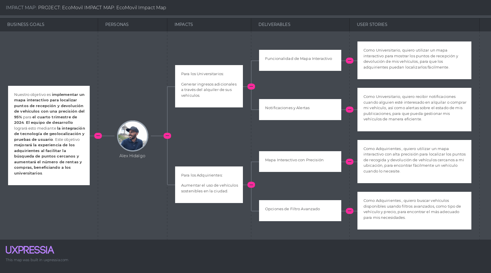

<h2>Capítulo IV: Product Design.</h2>

<h3>4.1 Style Guidelines.</h3>

<h4>4.1.1. General Style Guidelines.</h4>

<h4>4.1.2. Web Style Guidelines.</h4>

La aplicación web "EcoMovil" se centra en la eficiencia, la educación y el compromiso ecológico en cada uno de sus procesos. Su estructura está dividida en secciones principales —Inicio, Sobre nosotros, Registro, Vehículos, Beneficios y Contacto— que ocupan un lugar destacado en la interfaz, permitiendo una navegación intuitiva y una experiencia de usuario clara y uniforme.

- **Imágenes:** 
En el diseño web de "EcoMovil", se emplearán imágenes descriptivas de forma estratégica. La página de inicio mostrará fotografías de vehículos menores y de la empresa, con el logotipo ubicado en la esquina superior izquierda para facilitar su reconocimiento. Cada sección principal incluirá imágenes representativas de los vehículos menores, reforzando el enfoque ecológico de la plataforma. Para mejorar la experiencia en dispositivos de escritorio, se prescindirá de imágenes de fondo, utilizando en su lugar imágenes laterales que orienten al usuario de forma funcional a lo largo de la interfaz.

- **Botones:** 
Los botones de la aplicación web "EcoMovil" están diseñados conforme a las pautas generales de estilo. Por lo general, se ubican en la parte inferior de la sección principal de la pantalla, permitiendo que las acciones del usuario se reflejen en la parte superior. Para operaciones que inicien nuevos procesos o afecten el funcionamiento global de la plataforma, se incorporan botones de confirmación. Todos los botones cuentan con un diseño visualmente destacado y con alto contraste frente al resto de la interfaz, garantizando su fácil identificación. Además, se aplica la teoría del color para indicar el propósito de cada botón, utilizando colores específicos para acciones como finalizar o eliminar procesos.

- **Pantallas Emergentes:** 
Las ventanas emergentes en "EcoMovil" están pensadas para validar acciones importantes que afectan directamente el funcionamiento del negocio. Estas ventanas destacan la relevancia de atender la situación presentada antes de seguir utilizando la aplicación, reforzando la toma de decisiones conscientes en momentos clave del proceso.

**Mobile Style Guidelines**

La vista móvil de la aplicación EcoMovil mantiene el mismo enfoque que la versión de escritorio, priorizando la sostenibilidad y la eficiencia en todos los procesos. Las distintas etapas y formularios están organizados en secciones que aprovechan al máximo el espacio disponible en pantalla, garantizando una experiencia fluida y centrada en el usuario.

- **Imágenes:** 
En el diseño móvil de "EcoMovil", las imágenes descriptivas se integrarán estratégicamente. En la pantalla de inicio se mostrarán imágenes de vehículos menores y de la empresa, mientras que el logotipo estará situado en la parte superior izquierda para una identificación rápida. Para mejorar la experiencia del usuario, se prescindirá de imágenes de fondo, optando por elementos visuales laterales que sirvan como guía funcional a lo largo de la interfaz.

- **Botones:** 
Los botones en la versión móvil de la aplicación "EcoMovil" siguen las directrices establecidas en las General Style Guidelines. Normalmente se ubican en la parte inferior de la pantalla principal, permitiendo ejecutar acciones que se reflejan en la parte superior de la interfaz. Para operaciones que inician nuevos procesos o afectan el funcionamiento general, se incluyen botones de confirmación. Cada botón está diseñado con un estilo visualmente distintivo y con alto contraste respecto al resto del diseño, asegurando su visibilidad. Asimismo, se utiliza la teoría del color para identificar el propósito de cada acción, asignando colores específicos a funciones como eliminar o finalizar procesos.

<h4>4.1.3. Mobile Style Guidelines.</h4>

<h5>4.1.3.1. iOS Mobile Style Guidelines.</h5>

<h5>4.1.3.2. Android Mobile Style Guidelines.</h5>

<h3>4.2 Information Architecture.</h3>

<h4>4.2.1. Organization Systems.</h4>

<h4>4.2.2. Labeling Systems.</h4>

<h4>4.2.3. SEO Tags and Meta Tags.</h4>

Las metaetiquetas ofrecen información codificada que define los metadatos de una página web. Aunque no son visibles para el usuario final, los navegadores y rastreadores web las interpretan para facilitar el análisis de los archivos HTML y simplificar la gestión del contenido. Asimismo, desempeñan un papel clave en la optimización del posicionamiento de la página en los motores de búsqueda.

Las metas etiquetas que utilizaremos son:

### Landing Page

| **Attribute** | **Value** |
|---------------|-----------|
| Charset       | UTF-8     |
| Viewport      | width=device-width, initial-scale=1.0 |
| CSS Link      | . /src/css/styles.css |
| Title         | EcoMovil - Urban Mobility Solution Landing Page |
| Description   | Explore our Landing page to redirect you to rent or buy eco-friendly vehicles like bicycles, scooters, and more. Start your journey towards a green city today. |
| Keywords      | urban mobility, eco-friendly vehicles, bike rental, scooter rental, sustainable transportation |
| Author        | EcoMovil Team |

### Aplicación

| **Attribute** | **Value** |
|---------------|-----------|
| Charset       | UTF-8     |
| Viewport      | width=device-width, initial-scale=1.0 |
| CSS Link      | ./src/css/styles.css |
| Title         | EcoMovil - Your Eco-Friendly Vehicle Rental Platform with interesting features to rent or buy eco-friendly vehicles |
| Description   | EcoMobility provides a user-friendly platform for renting or buying bicycles, scooters, and other eco-friendly vehicles. Explore, book, and manage your rentals with ease. |
| Keywords      | vehicle rental, bike rental, scooter rental, eco-friendly vehicles, urban mobility, sustainable travel, temporary insurance, badges, flexible income options |
| Author        | EcoMovil Team |

<h4>4.2.4. Searching Systems.</h4>

En EcoMovil, el sistema de búsqueda está diseñado para ayudar a los usuarios a localizar de forma ágil los vehículos que desean rentar o adquirir, según sus preferencias. Entre sus funciones destacadas se encuentran la búsqueda por palabras clave para identificar vehículos concretos, el uso de filtros avanzados que permiten ajustar los resultados según distintos parámetros, y un historial de búsquedas recientes que facilita el acceso a consultas previas.

<h4>4.2.5. Navigation Systems.</h4>

<h3>4.3 Landing Page UI Design.</h3>

<h4>4.3.1. Landing Page Wireframe.</h4>

<h4>4.3.2. Landing Page Mock-up.</h4>

El mock-up de la landing page de EcoMovil representa la primera impresión que los usuarios tendrán al ingresar a la plataforma. Su diseño está orientado a captar la atención, comunicar de forma clara el propósito del servicio y motivar la interacción desde el primer momento.

<h5>4.3.2.1. Landing Page Mock-up for Web.</h5>

El wireframe diseñado para la versión de escritorio de la landing page fue fundamental para organizar la estructura visual de los elementos. A partir de esta guía, se desarrolló el mock-up correspondiente, respetando los contenidos ya descritos. En la imagen se puede apreciar la aplicación de la paleta de colores principal y secundaria, así como la tipografía seleccionada previamente.

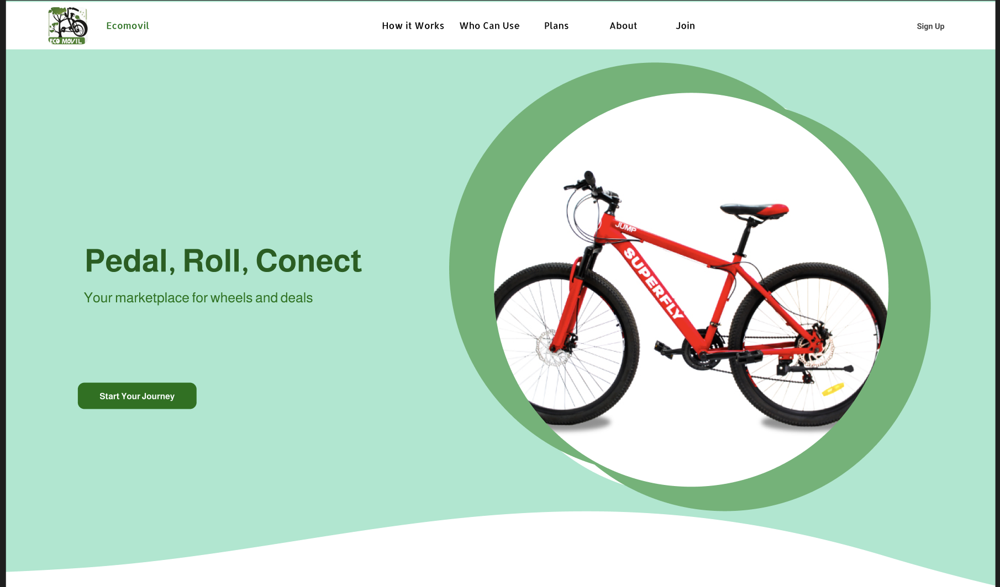

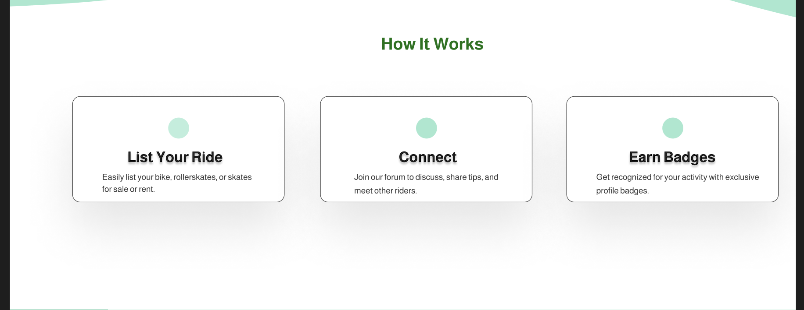

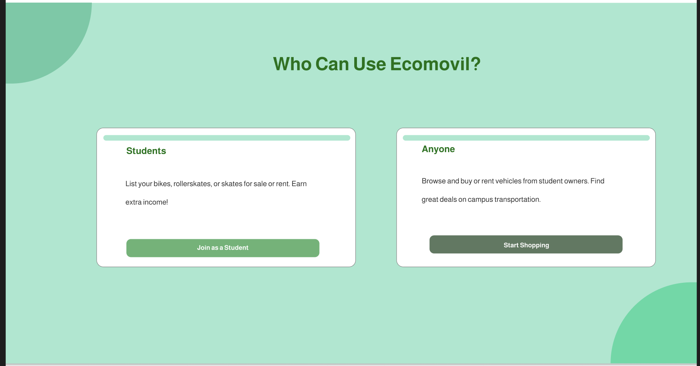

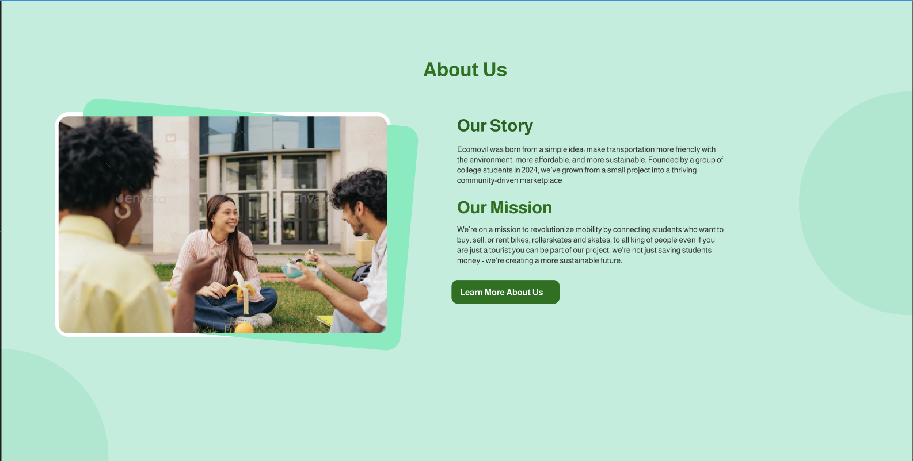

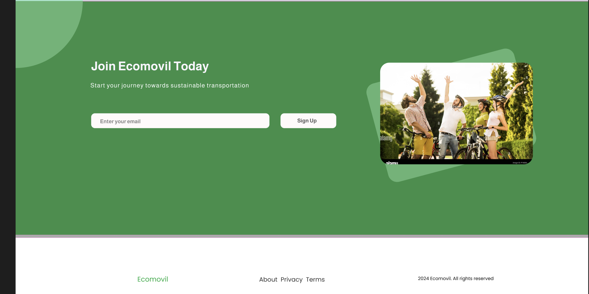

<h5>4.3.2.2. Landing Page for Mobile.</h5>

Por otro lado, el mock-up en su versión móvil conserva todos los elementos mencionados. Se resalta que la elección tipográfica y el contraste adecuado entre el texto y el fondo permiten una lectura clara y cómoda en ambas versiones, tanto móvil como de escritorio.

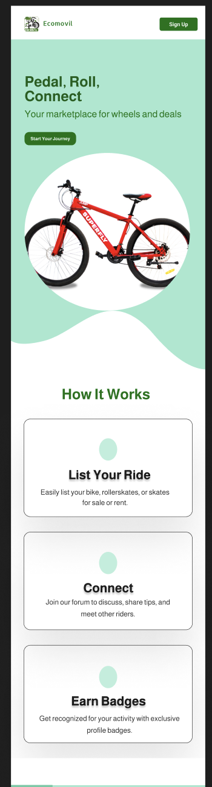

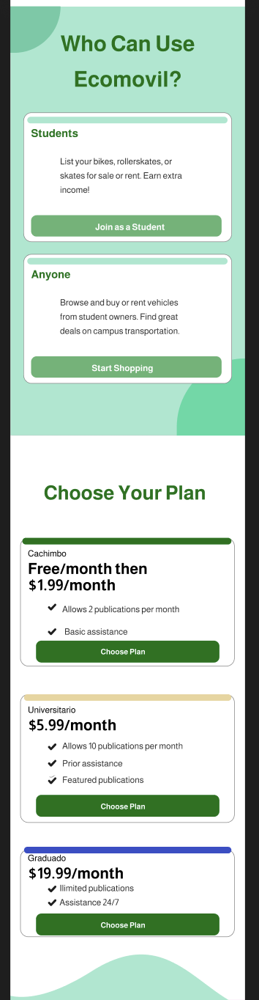

<h3>4.4 Mobile Applications UX/UI Design.</h3>

<h4>4.4.1. Mobile Applications Wireframes.</h4>

<h4>4.4.2. Mobile Applications Wireflow Diagrams.</h4>

<h4>4.4.3. Mobile Applications Mock-ups.</h4>

<h4>4.4.4. Mobile Applications User Flow Diagrams.</h4>

<h3>4.5 Mobile Applications Prototyping.</h3>

<h4>4.5.1. Android Mobile Applications Prototyping.</h4>

<h4>4.5.2. iOS Mobile Applications Prototyping.</h4>

<h3>4.6 Web Applications UX/UI Design.</h3>

<h4>4.6.1. Web Applications Wireframes.</h4>

<h4>4.6.2. Web Applications Wireflow Diagrams.</h4>

**User Goal: Iniciar sesión y Registrarse**

**Perfil del Usuario: Universitario**

**Descripción del Flujo:**

El universitario accede a la aplicación publicada y se encuentra con una pantalla principal que muestra un formulario de acceso. Para este tipo de usuario, se solicitarán los siguientes datos: RUC, nombre completo, correo electrónico y contraseña.

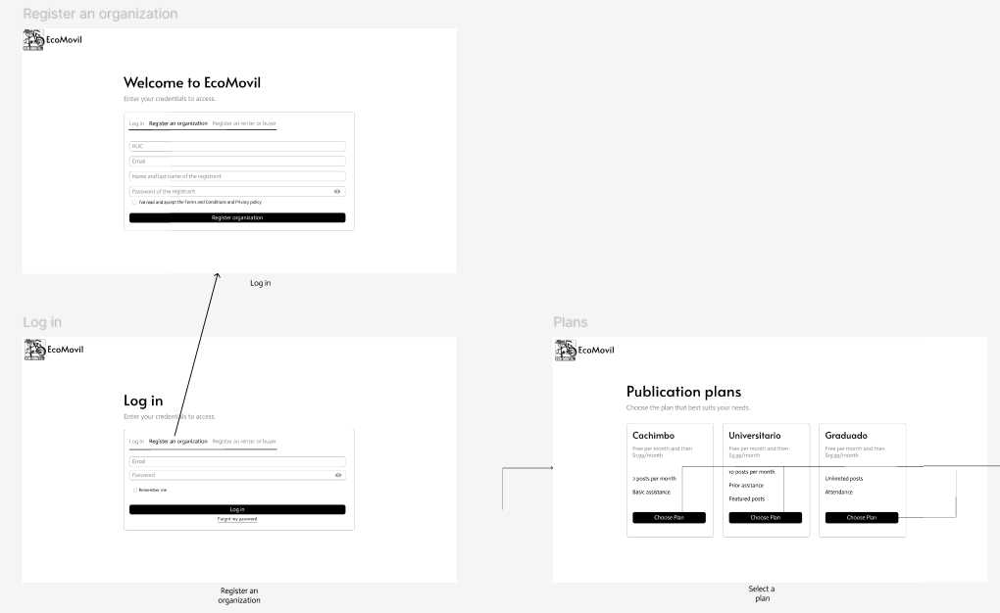

**User Goal: Pagos de los Planes**

El usuario universitario podrá escoger entre tres opciones de planes disponibles. Al hacer clic en "Elegir Plan", será llevado al flujo de pago, donde deberá completar los datos de su tarjeta bancaria y confirmar la veracidad de la información ingresada. Tras la confirmación, el sistema mostrará una notificación de pago exitoso. Finalmente, al seleccionar “Comenzar”, el usuario accederá directamente al panel con el menú de vehículos.

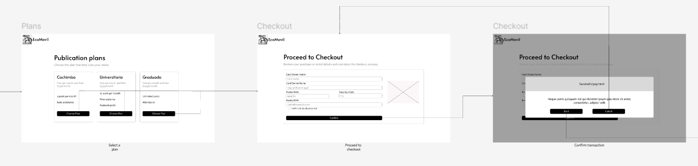

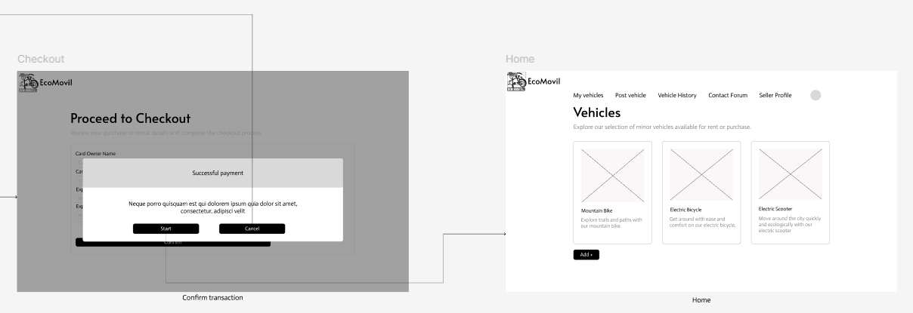

**User Goal: Navegar por el dashboard**

Luego de iniciar sesión, el universitario será redirigido al panel principal, donde se desplegarán distintas secciones. La primera es "Detalles del Vehículo", que permite consultar la información de cada vehículo registrado. En la sección de "Perfil", podrá modificar su información personal y su fotografía. En "Historial de Vehículos", tendrá acceso a los vehículos que ha publicado. Finalmente, en el "Foro de Contacto", podrá crear publicaciones para ofrecer vehículos en venta o alquiler, facilitando la comunicación directa por WhatsApp con los interesados.

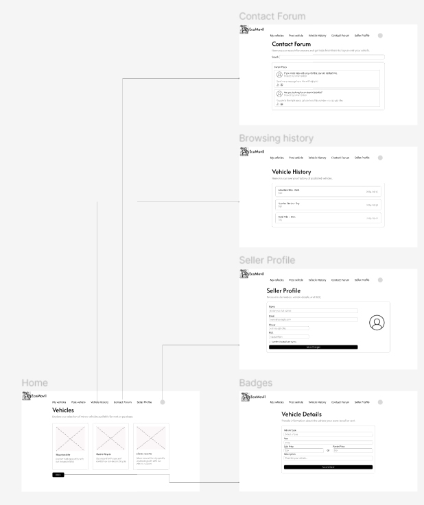

**User Goal: Iniciar sesión y Registrarse**

**Perfil del Usuario: Adquiriente**

**Descripción del Flujo:**

Al ingresar a la plataforma, el adquiriente será recibido por la pantalla inicial, donde se le solicitarán los datos para el inicio de sesión. En este caso, deberá ingresar su nombre, correo electrónico y contraseña.

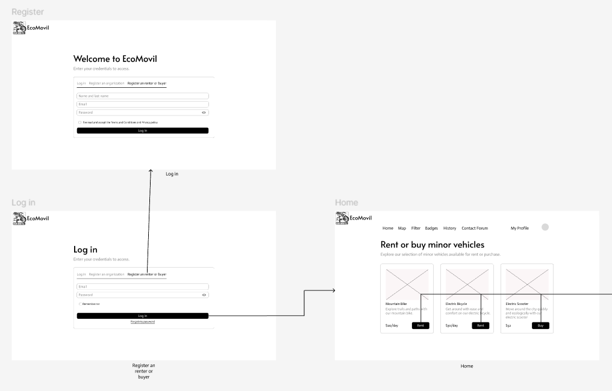

**User Goal: Visualizar los Vehículos**

Desde la pantalla de inicio, el adquiriente podrá explorar los vehículos disponibles junto con sus respectivas descripciones. Al seleccionar “Alquilar” o “Comprar”, será llevado a una vista con los detalles del vehículo, incluyendo tipo, costo, características y distintivos. Si hace clic en “Guardar”, el vehículo será añadido a su historial personal de vehículos guardados.

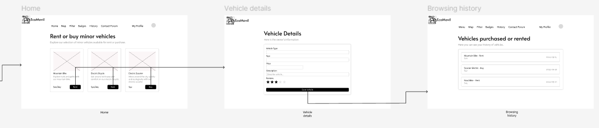

**User Goal: Navegar por el dashboard**

Una vez que el adquiriente haya iniciado sesión, accederá a su panel de control, donde encontrará varias funcionalidades. La primera es el "Mapa Interactivo", que muestra la ubicación de cada vehículo disponible. Luego está el "Filtro", que permite realizar búsquedas específicas por tipo o precio del vehículo. También encontrará el "Foro de Contacto", donde podrá comunicarse con los universitarios que ofrecen vehículos. Por último, en "Mi Perfil", tendrá la opción de revisar y actualizar su información personal.

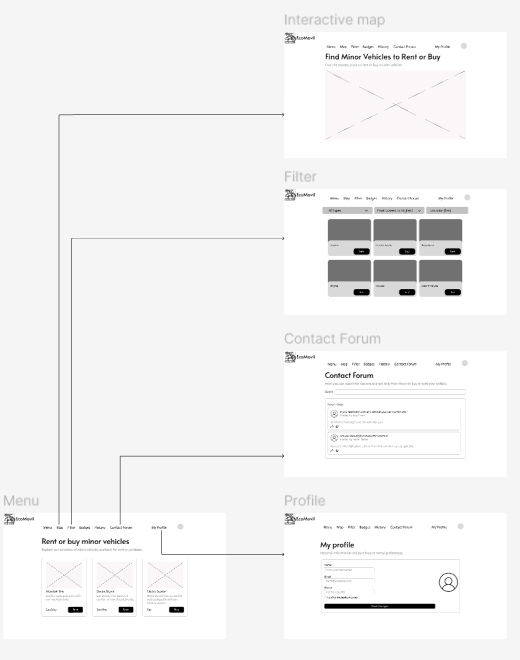

<h4>4.6.3. Web Applications Mock-ups.</h4>

<h4>4.6.4. Web Applications User Flow Diagrams.</h4>

<h3>4.7 Web Applications Prototyping.</h3>

<h3>4.8 Domain-Driven Software Architecture.</h3>

<h4>4.8.1. Software Architecture Context Diagram.</h4>

<h4>4.8.2. Software Architecture Container Diagrams.</h4>

El diagrama de contenedores ofrece una perspectiva general a nivel macro sobre cómo interactúan las aplicaciones y las fuentes de datos dentro del funcionamiento del sistema EcoMovil.

<h4>4.8.3. Software Architecture Components Diagrams.</h4>

<h3>4.9 Software Object-Oriented Design.</h3>

<h4>4.9.1. Class Diagrams.</h4>

<h4>4.9.2. Class Dictionary.</h4>

<h3>4.10 Database Design.</h3>

<h4>4.10.1. Relational/Non-Relational Database Diagram.</h4>

<h2>Capítulo V: Product Implementation, Validation & Deployment.</h2>

<h3>5.1 Software Configuration Management.</h3>

<h4>5.1.1. Software Development Environment Configuration.</h4>

<h4>5.1.2. Source Code Management.</h4>

El proyecto adoptará el modelo **GitFlow** como estándar para el control de versiones, con **GitHub** como plataforma central. Esta metodología asegurará una organización clara y sistemática de las ramas, lo que favorecerá un desarrollo colaborativo eficiente. A continuación, se detalla cómo se aplicará GitFlow en el flujo de trabajo, junto con los enlaces a los repositorios relevantes en GitHub:

**GitFlow Workflow:**
- Ramas principales: `main` para producción y desarrollo.
- Ramas de características (features) para el desarrollo de nuevas funcionalidades.

**Repositorios de GitHub:**
- Enlace a la organización en GitHub: https://github.com/orgs/UPC-PRE-1ASI0732-2501-4442-G1-Aceituna/repositories
- Enlace al repositorio de la **Landing Page**: 
   

**Estructura de Ramas (Branches) en GitFlow:**

1. **Rama Master (Principal):** Es la rama principal del proyecto, donde se mantendrán versiones estables y finales de la aplicación. Solo se permitirán cambios que hayan sido previamente probados y verificados en otras ramas.

2. **Ramas de Funcionalidad (Feature branches):** Cada nueva característica del proyecto se desarrollará en su propia rama. Una vez completada y probada, se fusionará en la rama principal. Las ramas seguirán un patrón de los nombres o apellidos de cada integrante por ejemplo, `Nombre-integrante-1`.

3. **Ramas de Lanzamiento (Release branches):** Estas ramas se crearán cuando una versión esté lista para ser lanzada. Se utilizará el **versionamiento semántico** para asignar un número de versión a cada release.

<h4>5.1.3. Source Code Style Guide & Conventions.</h4>

<h4>5.1.4. Software Deployment Configuration.</h4>

**Despliegue de la Landing Page**

Para publicar la landing page, es necesario cumplir con ciertos pasos previos: contar con una cuenta personal en GitHub, una organización (si aplica) y un repositorio donde se almacenarán los archivos del proyecto. Una vez listo, se puede proceder con el despliegue siguiendo estos pasos:

1. Crear una carpeta llamada "docs" que contendrá todos los archivos de la landing page.
2. Asegurarse de que los archivos estén correctamente nombrados: "index.html" para la página principal, "style.css" para los estilos, y una carpeta "img" para las imágenes.
3. Subir estos archivos al repositorio mediante un commit.
4. Ir a la sección Settings > Pages del repositorio y seleccionar la rama que se utilizará, generalmente "main" o "master".
5. Establecer la carpeta "docs" como la fuente para publicar la página.
6. Esperar a que GitHub realice las verificaciones necesarias. Una vez completadas, se generará un enlace que permitirá acceder a la landing page publicada.

Este procedimiento permite desplegar de forma automática la landing page utilizando GitHub Pages.

Cuando los archivos se han publicado en la rama correspondiente, accedemos a "Settings" y, en la sección "Pages", seleccionamos la rama "gh-pages" y la opción / (root). Después de guardar los cambios y esperar un momento, podremos ver la página publicada.

Así es cómo se verá la página final.

Enlace del Landing Page EcoMovil: https://open-source-sw56-group-2-ecomovil.github.io/Landing-Page-EcoMovil/

<h3>5.2 Product Implementation & Deployment.</h3>

<h4>5.2.1. Sprint Backlogs.</h4>

<h4>5.2.2. Implemented Landing Page Evidence.</h4>

<h4>5.2.3. Implemented Frontend-Web Application Evidence.</h4>

<h4>5.2.4. Implemented Native-Mobile Application Evidence.</h4>

<h4>5.2.5. Implemented RESTful API and/or Serverless Backend Evidence.</h4>

<h4>5.2.6. RESTful API documentation.</h4>

<h4>5.2.7. Team Collaboration Insights.</h4>

<h3>5.3 Video About-the-Product.</h3>

