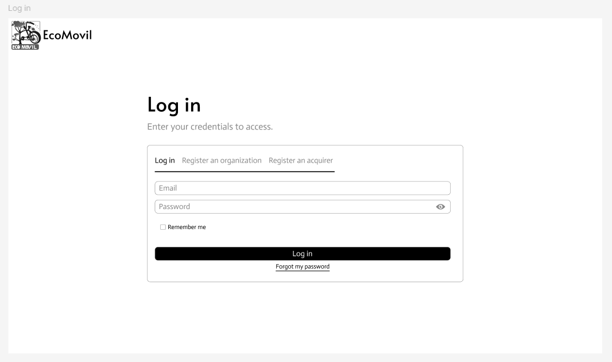
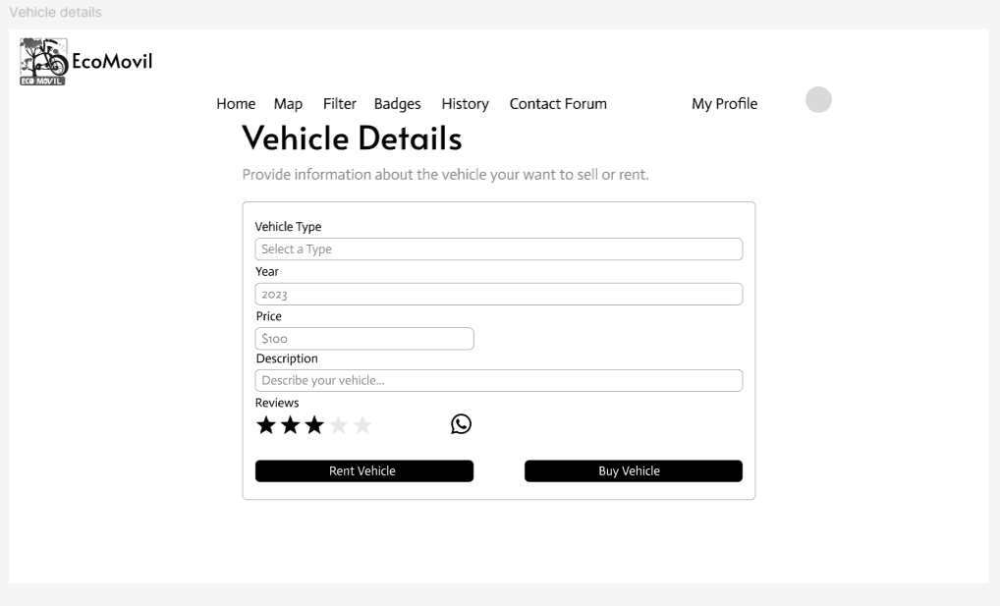

<h1 style="text-align: center;"> Informe del Trabajo Final </h1>
<h3 style="text-align: center;"> Universidad Peruana de Ciencias Aplicadas </h3>

<h5 style="text-align: center"> Área: Ingeniería de Software </h5>

<h5 style="text-align: center"> Curso: Diseño de Experimentos de Ingeniería de Software </h5>
<h5 style="text-align: center"> Sección: 4442 </h5>

<h5 style="text-align: center"> Docente: Lennin Percy Cenas Vasquez </h5>

<h5 style="text-align: center"> Startup: Aceitunas </h5>

<h5 style="text-align: center"> Producto: XXX </h5>

## Team members:

|                Nombre                 |   Código   |
| :-----------------------------------: | :--------: |
|  |  |
|           |  |
|   Silva Tirado, Sebastián Valentino   |  |
|  Ticona Panduro, Estrella del Pilar   | U202210659 |
|          |  |

<h5 style="text-align: center"> Ciclo 2025-01 </h5>

# Registro de Versiones del Informe

Esta sección tiene como propósito presentar un resumen de los cambios importantes efectuados al informe a lo largo del desarrollo del proyecto. Comienza en una página independiente e incorpora una tabla con la siguiente estructura:

| Versión |   Fecha    |                 Autor                 | Descripción de modificación                                                                                                                                                          |
| :-----: | :--------: | :-----------------------------------: | ------------------------------------------------------------------------------------------------------------------------------------------------------------------------------------ |
|   TB1   | 04/04/2025 |  |  |
|   TB1   | 04/04/2025 |  |  |
|   TB1   | 04/04/2025 |  |  |
|   TB1   | 04/04/2025 |   Silva Tirado, Sebastian Valentino   |  |
|   TB1   | 04/04/2025 | Ticona Panduro, Estrella del Pilar    |  |

## Project Report Collaboration Insights

URL del repositorio para el reporte del proyecto: https://github.com/UPC-PRE-1ASI0732-2501-4442-G1-Aceituna

  

**TB1**

Con el fin de elaborar el informe correspondiente a la entrega TB1, se asignó la implementación de las distintas secciones a cada miembro del equipo de la siguiente manera:

| Integrante                            | Tareas Asignadas                                                                                                                           |
| ------------------------------------- | ------------------------------------------------------------------------------------------------------------------------------------------ |
| | |
| | |
| | |
| Silva Tirado, Sebastian Valentino |  |
| Ticona Panduro, Estrella del Pilar| |

## Contenido

1. [**Capítulo I: Introducción.**](#1.)  
   1.1. [Startup Profile.](#1.1.)  
   1.1.1. [Descripción del startup.](#1.1.1.) 
   1.1.2.[Perfiles de los integrantes del equipo.](#1.1.2.) 
   1.2. [Solution Profile.](#1.2.) 
   1.2.1. [Antecedentes y Problemática.](#1.2.1.) 
   1.2.2. [Lean UX Process.](#1.2.2.) 
   1.2.2.1. [Lean UX Problem Statements.](#1.2.2.1.) 
   1.2.2.2. [Lean UX Assumptions.](#1.2.2.2.) 
   1.2.2.3. [Lean UX Hypothesis Statements.](#1.2.2.3.) 
   1.2.2.4. [Lean UX Canvas.](#1.2.2.4.) 
   1.3. [Segmentos objetivo.](#1.3.) 
2. [**Capítulo II: Requirements Elicitation & Analysis.**](#2.) 
   2.1. [Competidores.](#2.1.) 
   2.1.1. [Análisis competitivo.](#2.1.1.) 
   2.1.2. [Estrategias y tácticas frente a competidores.](#2.1.2.) 
   2.2. [Entrevistas.](#2.2.) 
   2.2.1. [Diseño de entrevistas.](#2.2.1.) 
   2.2.2. [Registro de entrevistas.](#2.2.2.) 
   2.2.3. [Análisis de entrevistas.](#2.2.3.) 
   2.3. [Needfinding.](#2.3.) 
   2.3.1. [User Personas.](#2.3.1.) 
   2.3.2. [User Task Matrix.](#2.3.2.) 
   2.3.3. [User Journey Mapping.](#2.3.3.) 
   2.3.4. [Empathy Mapping.](#2.3.4.) 
   2.3.5. [As-is Scenario Mapping.](#2.3.5.) 
   2.4. [Ubiquitous Language](#2.4.) 
3. [**Capítulo III: Requirements Specification.**](#3.) 
   3.1. [To-Be Scenario Mapping.](#3.1.) 
   3.2. [User Stories.](#3.2.) 
   3.3. [Product Backlog.](#3.3.) 
   3.4. [Impact Mapping.](#3.4.) 
4. [**Capítulo IV: Product Design.**](#4.) 
   4.1. [Style Guidelines.](#4.1.) 
   4.1.1. [General Style Guidelines.](#4.1.1.) 
   4.1.2. [Web Style Guidelines.](#4.1.2.) 
   4.1.3. [Mobile Style Guidelines.](#4.1.3.) 
   4.1.3.1. [iOS Mobile Style Guidelines.](#4.1.3.1.) 
   4.1.3.2. [Android Mobile Style Guidelines](#4.1.3.2.) 
   4.2. [Information Architecture.](#4.2.) 
   4.2.1. [Organization Systems.](#4.2.1.) 
   4.2.2. [Labeling Systems.](#4.2.2.) 
   4.2.3. [SEO Tags and Meta Tags](#4.2.3.) 
   4.2.4. [Searching Systems.](#4.2.4.) 
   4.2.5. [Navigation Systems.](#4.2.5.) 
   4.3. [Landing Page UI Design.](#4.3.) 
   4.3.1. [Landing Page Wireframe.](#4.3.1.) 
   4.3.2. [Landing Page Mock-up.](#4.3.2.) 
   4.4. [Web Applications UX/UI Design.](#4.4.) 
   4.4.1. [Web Applications Wireframes.](#4.4.1.) 
   4.4.2. [Web Applications Wireflow Diagrams.](#4.4.2.) 
   4.4.3. [Web Applications Mock-ups.](#4.4.3.) 
   4.4.4. [Web Applications User Flow Diagrams.](#4.4.4.) 
   4.5. [Web Applications Prototyping.](#4.5.) 
   4.5.1. [Android Mobile Applications Prototyping.](#4.5.1.) 
   4.5.2. [iOS Mobile Applications Prototyping.](#4.5.2.) 
   4.6. [Web Applications UX/UI Design.](#4.6.) 
   4.6.1. [Web Applications Wireframes.](#4.6.1.) 
   4.6.2. [Web Applications Wireflow Diagrams.](#4.6.2.) 
   4.6.3. [Web Applications Mock-ups.](#4.6.3.) 
   4.6.4. [Web Applications User Flow Diagrams.](#4.6.4.) 
   4.7. [Web Applications Prototyping.](#4.7.) 
   4.8. [Domain-Driven Software Architecture.](#4.8.) 
   4.8.1. [Software Architecture Context Diagram.](#4.8.1.) 
   4.8.2. [Software Architecture Container Diagrams.](#4.8.2.) 
   4.8.3. [Software Architecture Components Diagrams.](#4.8.3.) 
   4.9. [Software Object-Oriented Design.](#4.9.) 
   4.9.1. [Class Diagrams.](#4.9.1.) 
   4.9.2. [Class Dictionary.](#4.9.2.) 
   4.10. [Database Design.](#4.10.) 
   4.10.1. [Relational/Non-Relational Database Diagram.](#4.10.1.) 
5. [**Capítulo V: Product Implementation, Validation & Deployment.**](#5.) 
   5.1. [Software Configuration Management.](#5.1.) 
   5.1.1. [Software Development Environment Configuration.](#5.1.1.) 
   5.1.2. [Source Code Management.](#5.1.2.) 
   5.1.3. [Source Code Style Guide & Conventions.](#5.1.3.) 
   5.1.4. [Software Deployment Configuration.](#5.1.4.) 
   5.2. [Product Implementation & Deployment.](#5.2.) 
   5.2.1. [Sprint Backlogs.](#5.2.1.) 
   5.2.2. [Implemented Landing Page Evidence](#5.2.2.) 
   5.2.3. [Implemented Frontend-Web Application Evidence](#5.2.3.) 
   5.2.4. [Implemented Native-Mobile Application Evidence](#5.2.4.) 
   5.2.5. [Implemented RESTful API and/or Serverless Backend Evidence](#5.2.5.) 
   5.2.6. [RESTful API documentation](#5.2.6.) 
   5.2.7. [Team Collaboration Insights](#5.2.7.) 
   5.3. [Video About-the-Product.](#5.3.) 

## STUDENT OUTCOME
La capacidad de reconocer responsabilidades éticas y
profesionales en situaciones de ingeniería y hacer juicios informados, que deben
considerar el impacto de las soluciones de ingeniería en contextos globales, económicos,
ambientales y sociales.
<b>ABET – EAC - Student Outcome 4</b>

<table style="border-collapse:collapse;border-spacing:0" class="tg"><thead><tr><th style="border-color:black;border-style:solid;border-width:1px;font-family:Arial, sans-serif;font-size:14px;font-weight:normal;overflow:hidden;padding:10px 5px;text-align:left;vertical-align:top;word-break:normal">Criterio específico</th><th style="border-color:black;border-style:solid;border-width:1px;font-family:Arial, sans-serif;font-size:14px;font-weight:normal;overflow:hidden;padding:10px 5px;text-align:left;vertical-align:top;word-break:normal">Acciones realizadas</th><th style="border-color:black;border-style:solid;border-width:1px;font-family:Arial, sans-serif;font-size:14px;font-weight:normal;overflow:hidden;padding:10px 5px;text-align:left;vertical-align:top;word-break:normal">Conclusiones</th></tr></thead>
<tbody>
<tr><td style="border-color:black;border-style:solid;border-width:1px;font-family:Arial, sans-serif;font-size:14px;overflow:hidden;padding:10px 5px;text-align:left;vertical-align:top;word-break:normal">4.c.1 Reconoce responsabilidad ética y profesional en situaciones de ingeniería de software</td><td style="border-color:black;border-style:solid;border-width:1px;font-family:Arial, sans-serif;font-size:14px;overflow:hidden;padding:10px 5px;text-align:left;vertical-align:top;word-break:normal">Silva Tirado, Sebastian Valentino  TB1: En el primer entregable me encargué de recopilar los antecedentes y problemáticas enfocados a nuestro proyecto y así sustentarlo, entrevistas y lo que depende de ello y la unidad cinco.</td>
<td style="border-color:black;border-style:solid;border-width:1px;font-family:Arial, sans-serif;font-size:14px;overflow:hidden;padding:10px 5px;text-align:left;vertical-align:top;word-break:normal">Silva Tirado, Sebastian Valentino  TB1: En el primer entregable me encargué de recopilar los antecedentes y problemáticas enfocados a nuestro proyecto y así sustentarlo, entrevistas y lo que depende de ello y la unidad cinco.</td></tr>
<tr><td style="border-color:black;border-style:solid;border-width:1px;font-family:Arial, sans-serif;font-size:14px;overflow:hidden;padding:10px 5px;text-align:left;vertical-align:top;word-break:normal">4.c.2 Emite juicios informados considerando el impacto de las soluciones de ingeniería de software en contextos globales, económicos, ambientales y sociales</td><td style="border-color:black;border-style:solid;border-width:1px;font-family:Arial, sans-serif;font-size:14px;overflow:hidden;padding:10px 5px;text-align:left;vertical-align:top;word-break:normal">Silva Tirado, Sebastian Valentino  TB1: En el primer entregable me encargué de recopilar los antecedentes y problemáticas enfocados a nuestro proyecto y así sustentarlo, entrevistas y lo que depende de ello y la unidad cinco.</td>
<td style="border-color:black;border-style:solid;border-width:1px;font-family:Arial, sans-serif;font-size:14px;overflow:hidden;padding:10px 5px;text-align:left;vertical-align:top;word-break:normal">Silva Tirado, Sebastian Valentino  TB1: En el primer entregable me encargué de recopilar los antecedentes y problemáticas enfocados a nuestro proyecto y así sustentarlo, entrevistas y lo que depende de ello y la unidad cinco.</td></tr>
</tbody></table>

## Part I: As-Is Software Project

<h2>Capítulo I: Introducción</h2>

<h3>1.1 Startup Profile.</h3>

<h4>1.1.1. Descripción del startup.</h4>

<h4>1.1.2. Perfiles de los integrantes del equipo.</h4>

<h3>1.2 Solution Profile.</h3>

<h4>1.2.1. Antecedentes y Problemática.</h4>

<h4>1.2.2. Lean UX Process.</h4>

<h5>1.2.2.1. Lean UX Problem Statements.</h5>

<h5>1.2.2.2. Lean UX Assumptions.</h5>

<h5>1.2.2.3. Lean UX Hypothesis Statements.</h5>

<h5>1.2.2.4. Lean UX Canvas.</h5>

<h3>1.3 Segmentos objetivo.</h3>

Según el Ministerio de Transportes y Comunicaciones, el sistema de transporte en Lima Metropolitana enfrenta serios problemas de informalidad, ineficiencia y una alta tasa de accidentes, lo que lo convierte en un medio inseguro y uno de los principales generadores de contaminación ambiental (MTC, 2013; Solís Fonseca, Salazar Bravo, Romero Carrión & Solís Salazar, 2013). Esta situación ha impulsado la búsqueda de alternativas de movilidad más ágiles, sostenibles y accesibles, como bicicletas, scooters y motos eléctricas.

En este contexto, nuestro público objetivo está conformado por jóvenes universitarios de Lima Metropolitana, de entre 18 y 28 años, pertenecientes a niveles socioeconómicos medios, que buscan soluciones de transporte seguras, ecológicas y eficientes. Motivados por una creciente conciencia ambiental y la necesidad de reducir su huella de carbono, estos jóvenes encuentran en nuestra aplicación una herramienta práctica que responde a sus necesidades de movilidad diaria.

Adicionalmente, frente al aumento en la tasa de deserción universitaria, que pasó de 19.3 % en 2019 a 23.2 % en 2021, muchos estudiantes requieren fuentes de ingresos complementarias para continuar sus estudios en instituciones privadas (USIL, s/f). Por ello, nuestra aplicación no solo ofrece una alternativa de transporte sostenible, sino que también abre una vía para generar ingresos de forma flexible mediante el alquiler y la venta de vehículos ecológicos, contribuyendo así a su bienestar económico sin interferir con su desempeño académico.

<h2>Capítulo II: Requirements Elicitation & Analysis.</h2>

<h3>2.1 Competidores.</h3>

<h4>2.1.1. Análisis competitivo.</h4>

<h4>2.1.2. Estrategias y tácticas frente a competidores.</h4>

<h3>2.2 Entrevistas.</h3>

<h4>2.2.1. Diseño de entrevistas.</h4>

<h4>2.2.2. Registro de entrevistas.</h4>

<h4>2.2.3. Análisis de entrevistas.</h4>

<h3>2.3 Needfinding.</h3>

### Segmento Universitarios:
 

### Segmento Adquirientes:

<h4>2.3.1. User Personas.</h4>

<h4>2.3.2. User Task Matrix.</h4>

<h4>2.3.3. User Journey Mapping.</h4>

<h4>2.3.4. Empathy Mapping.</h4>

<h4>2.3.5. As-is Scenario Mapping.</h4>

<h3>2.4 Ubiquitous Language</h3>

<h2>Capítulo III: Requirements Specification.</h2>

<h3>3.1 To-Be Scenario Mapping.</h3>

<h3>3.2 User Stories.</h3>

<h3>3.3 Product Backlog.</h3>

<h3>3.4 Impact Mapping.</h3>

<h2>Capítulo IV: Product Design.</h2>

<h3>4.1 Style Guidelines.</h3>

<h4>4.1.1. General Style Guidelines.</h4>

<h4>4.1.2. Web Style Guidelines.</h4>

<h4>4.1.3. Mobile Style Guidelines.</h4>

<h5>4.1.3.1. iOS Mobile Style Guidelines.</h5>

<h5>4.1.3.2. Android Mobile Style Guidelines.</h5>

<h3>4.2 Information Architecture.</h3>

<h4>4.2.1. Organization Systems.</h4>

<h4>4.2.2. Labeling Systems.</h4>

<h4>4.2.3. SEO Tags and Meta Tags.</h4>

<h4>4.2.4. Searching Systems.</h4>

<h4>4.2.5. Navigation Systems.</h4>

El sistema de navegación es un componente clave para garantizar que los usuarios puedan desplazarse de manera intuitiva por la aplicación, contribuyendo a una experiencia de usuario fluida y satisfactoria. La aplicación web contará con una barra de navegación principal que ofrecerá acceso directo a las secciones más relevantes, facilitando el acceso a la información y funcionalidades disponibles. Además, incluirá un footer que brindará enlaces complementarios a secciones como “Sobre Nosotros”, donde los usuarios podrán conocer nuestra visión, misión y al equipo que impulsa el desarrollo de la plataforma. 

<h3>4.3 Landing Page UI Design.</h3>

<h4>4.3.1. Landing Page Wireframe.</h4>

<h4>4.3.2. Landing Page Mock-up.</h4>

<h3>4.4 Web Applications UX/UI Design.</h3>

**Web Application para Dekstop Web Browser**

**Segmento Universitario**

**Crear Cuenta**

La siguiente imagen presenta la sección de "registro de empresa", donde los universitarios podrán proporcionar la información requerida para crear una cuenta en la aplicación y empezar a disfrutar de los beneficios que ofrece EcoMovil.

**Inicio de sesión**

La siguiente imagen muestra el wireframe de la sección de "inicio de sesión" vista desde una aplicación web en escritorio. En esta sección, los usuarios deberán ingresar sus credenciales para acceder a la aplicación, siempre y cuando ya hayan creado una cuenta previamente.

**Elegir Planes**

La siguiente imagen muestra la sección de "Selección de pago", donde se presentan las diferentes categorías de planes disponibles en la aplicación. Cada uno de los tres planes ha sido diseñado cuidadosamente para atender las necesidades particulares de las empresas.

**Pago**

La siguiente imagen corresponde a la sección de "Pasarela de pagos", donde los universitarios son redirigidos a un formulario para seleccionar y registrar su método de pago. En esta sección también se muestra el monto del plan elegido. Tras completar el proceso de pago con éxito, el usuario recibe una notificación con la confirmación de su suscripción y la fecha de registro.

**Proceder el Pago**

En la siguiente imagen se puede ver el mensaje de pago exitoso, donde el universitario confirma que ha realizado el pago de manera satisfactoria y que ahora puede utilizar la aplicación sin inconvenientes.

**Home**

En esta sección, se puede ver el home con varias secciones que se explorarán más adelante. En particular, nos enfocamos en la parte de "Mis vehículos", donde podrás observar a otros universitarios siguiendo la iniciativa y subiendo sus propios vehículos.

**Detalles del Vehículo**

En esta sección, podrás ver los detalles de cada vehículo mostrado en la sección del home.

**Mis vehículos**

En esta parte, el universitario podrá subir sus vehículos añadiendo una imagen representativa y detalles del vehículo. Finalmente, deberá hacer clic en el botón "Agregar" para completar el proceso.

**Mi Perfil**

En esta sección, podrás ver tu perfil y agregar más datos, como tu RUC, correo electrónico y otros detalles, además de tu foto representativa. Finalmente, deberás hacer clic en el botón "Save changes" para guardar los cambios.

**Historial del Vehículo**

En esta sección, puedes ver el historial de los vehículos publicados y los detalles correspondientes.

**Foro de Contacto**

En esta sección, podrás publicar tu número de contacto y el vehículo que estás dispuesto a vender o alquilar, permitiendo que otros usuarios se contacten contigo o le den "like" a tu publicación.

**Segmento Adquiriente**

**Crear cuenta**

En esta sección, el adquiriente podrá registrarse proporcionando datos específicos como su nombre, correo electrónico y contraseña. Además, deberá marcar la casilla "Acepto los términos y condiciones."

**Iniciar Sesión**

En esta sección, el adquiriente podrá iniciar sesión ingresando su correo electrónico y contraseña.

**Home**

En esta sección, el adquiriente podrá visualizar el "Home", donde tendrá acceso a diversos vehículos menores con información como nombre, descripción y precio. También encontrará botones para "Rentar" o "Comprar" cada vehículo.

**Mi perfil**

En esta sección, podrás visualizar el perfil del adquiriente, incluyendo detalles como el nombre, correo y teléfono. También habrá un botón para confirmar si los detalles son correctos y, finalmente, un botón de "Guardar".

**Mapa Interactivo**

En esta sección, el adquiriente podrá visualizar un mapa interactivo.

**Filtro**

En esta sección, podrás visualizar los filtros con vehículos y sus imágenes descriptivas, así como los botones de "Comprar" o "Rentar".

**Detalles del Vehículo**

Al hacer clic en un vehículo, el adquiriente podrá ver las descripciones del mismo, incluidos sus "Badges", tipo de vehículo, año, precio y una descripción detallada. Además, tendrá la opción de comunicarse por WhatsApp con el propietario del vehículo y podrá seleccionar entre los botones "Rentar Vehículo" o "Comprar Vehículo".

**Historial**

En esta sección, el adquiriente podrá visualizar el historial de los vehículos.

**Foro de Contacto**

En esta sección, el adquiriente podrá visualizar los mensajes de los diferentes universitarios que incluyeron su número de teléfono, con la opción de conectarse directamente a través de WhatsApp.

**Web Application para Mobile Web Browser**

**Segmento Universitario**

**Logo**

Aquí, el universitario podrá ver el logo de EcoMovil con un mensaje de "Cargando" en la parte inferior.

**Registro**

Los universitarios podrán registrarse en EcoMovil ingresando su RUC, correo electrónico, nombre completo y contraseña. También deberán aceptar los términos y condiciones antes de hacer clic en el botón de "Registrarse".

**Iniciar sesión**

Los universitarios podrán iniciar sesión ingresando su correo electrónico y contraseña. También habrá una opción de "Recuérdame" para facilitar el acceso en caso de que olviden el usuario o la contraseña. Finalmente, deberán hacer clic en el botón de "Iniciar sesión".

**Planes**

Aquí, el usuario podrá seleccionar uno de los tres planes disponibles para comenzar a usar la aplicación y ofrecer sus vehículos al público objetivo. Deberá hacer clic en el botón de "Escoger Plan".

**Proceder al pago**

En esta sección, el usuario podrá acceder al plan realizando el pago con su tarjeta e ingresando los datos correspondientes. Después de hacer clic en el botón de "Confirmar", recibirá un mensaje de pago exitoso.

**Vehículos**

Aquí, el universitario podrá visualizar las publicaciones de otros universitarios y sus vehículos para inspirarse. Luego, podrá acceder a la sección "Mi Vehículo" para agregar uno o dos vehículos, dependiendo de su plan, haciendo clic en el botón "Agregar".

**Historial**

Aquí, podremos ver el historial de los vehículos publicados por el universitario.

**Foro de Contacto**

El universitario podrá subir un mensaje en el post indicando que está vendiendo o rentando un vehículo, incluyendo su número de celular para que el arrendatario pueda comunicarse con él a través de WhatsApp.

**Mi Perfil**

En esta sección, podrás ver tu perfil, incluyendo tu foto, nombre completo, correo electrónico, número de teléfono y RUC. Finalmente, podrás guardar tus datos.

**Segmento Adquiriente**

**Logo**

Aquí, el adquiriente podrá ver el logo de EcoMovil con un mensaje de "Cargando" en la parte inferior.

**Registro**

Los adquirientes podrán registrarse en EcoMovil ingresando su correo electrónico, nombre completo y contraseña. También deberán aceptar los términos y condiciones antes de hacer clic en el botón de "Registrarse".

**Iniciar sesión**

Los adquirientes podrán iniciar sesión ingresando su correo electrónico y contraseña. También habrá una opción de "Recuérdame" para facilitar el acceso en caso de que olviden el usuario o la contraseña. Finalmente, deberán hacer clic en el botón de "Iniciar sesión".

**Alquilar o comprar vehículos menores**

Aquí podrás explorar diferentes vehículos y utilizar el botón "Rentar" o "Comprar" según tu interés.

**Mi Perfil**

El adquiriente podrá ver su perfil, agregar o corregir su foto, nombre, correo electrónico y teléfono. También deberá confirmar que los detalles son correctos y, finalmente, hacer clic en el botón "Guardar".

**Vehículo y Filtros**

Aquí podrás ver el mapa interactivo y el filtro, que incluye secciones para tipos de vehículos y precios.

**Detalles del Vehículo**

Aquí podrás visualizar los detalles del vehículo que seleccionaste, incluyendo sus descripciones, y tendrás los botones de "Alquilar" o "Comprar".

**Historial de Vehículo y Foro de Contacto**

El adquiriente tendrá la opción de ver los vehículos en su historial y acceder al foro de contacto, donde podrá visualizar los posts de los universitarios que incluyen su número de WhatsApp, facilitando el contacto directo si desean el vehículo.

<h4>4.4.1. Web Applications Wireframes.</h4>

<h4>4.4.2. Web Applications Wireflow Diagrams.</h4>

<h4>4.4.3. Web Applications Mock-ups.</h4>

**Web Application para Desktop Web Browser**

**Segmento Universitario**

**Crear Cuenta**

La siguiente imagen presenta la sección de "registro de empresa", donde los universitarios podrán proporcionar la información requerida para crear una cuenta en la aplicación y empezar a disfrutar de los beneficios que ofrece EcoMovil.

**Inicio de sesión**

La siguiente imagen muestra el wireframe de la sección de "inicio de sesión" vista desde una aplicación web en escritorio. En esta sección, los usuarios deberán ingresar sus credenciales para acceder a la aplicación, siempre y cuando ya hayan creado una cuenta previamente.

**Elegir Planes**

La siguiente imagen muestra la sección de "Selección de pago", donde se presentan las diferentes categorías de planes disponibles en la aplicación. Cada uno de los tres planes ha sido diseñado cuidadosamente para atender las necesidades particulares de las empresas.

**Pago**

La siguiente imagen corresponde a la sección de "Pasarela de pagos", donde los universitarios son redirigidos a un formulario para seleccionar y registrar su método de pago. En esta sección también se muestra el monto del plan elegido. Tras completar el proceso de pago con éxito, el usuario recibe una notificación con la confirmación de su suscripción y la fecha de registro.

**Proceder el Pago**

En la siguiente imagen se puede ver el mensaje de pago exitoso, donde el universitario confirma que ha realizado el pago de manera satisfactoria y que ahora puede utilizar la aplicación sin inconvenientes.

**Home**

En esta sección, se puede ver el home con varias secciones que se explorarán más adelante. En particular, nos enfocamos en la parte de "Mis vehículos", donde podrás observar a otros universitarios siguiendo la iniciativa y subiendo sus propios vehículos.

**Detalles del Vehículo**

En esta sección, podrás ver los detalles de cada vehículo mostrado en la sección del home.

**Mis vehículos**

En esta parte, el universitario podrá subir sus vehículos añadiendo una imagen representativa y detalles del vehículo. Finalmente, deberá hacer clic en el botón "Agregar" para completar el proceso.

**Mi Perfil**

En esta sección, podrás ver tu perfil y agregar más datos, como tu RUC, correo electrónico y otros detalles, además de tu foto representativa. Finalmente, deberás hacer clic en el botón "Save changes" para guardar los cambios.

**Historial del Vehículo**

En esta sección, puedes ver el historial de los vehículos publicados y los detalles correspondientes.

**Foro de Contacto**

En esta sección, podrás publicar tu número de contacto y el vehículo que estás dispuesto a vender o alquilar, permitiendo que otros usuarios se contacten contigo o le den "like" a tu publicación.

**Segmento Adquiriente**

**Crear cuenta**

En esta sección, el adquiriente podrá registrarse proporcionando datos específicos como su nombre, correo electrónico y contraseña. Además, deberá marcar la casilla "Acepto los términos y condiciones."

**Iniciar Sesión**

En esta sección, el adquiriente podrá iniciar sesión ingresando su correo electrónico y contraseña.

**Home**

En esta sección, el adquiriente podrá visualizar el "Home", donde tendrá acceso a diversos vehículos menores con información como nombre, descripción y precio. También encontrará botones para "Rentar" o "Comprar" cada vehículo.

**Mi perfil**

En esta sección, podrás visualizar el perfil del adquiriente, incluyendo detalles como el nombre, correo y teléfono. También habrá un botón para confirmar si los detalles son correctos y, finalmente, un botón de "Guardar".

**Mapa Interactivo**

En esta sección, el adquiriente podrá visualizar un mapa interactivo.

**Filtro**

En esta sección, podrás visualizar los filtros con vehículos y sus imágenes descriptivas, así como los botones de "Comprar" o "Rentar".

**Detalles del Vehículo**

Al hacer clic en un vehículo, el adquiriente podrá ver las descripciones del mismo, incluidos sus "Badges", tipo de vehículo, año, precio y una descripción detallada. Además, tendrá la opción de comunicarse por WhatsApp con el propietario del vehículo y podrá seleccionar entre los botones "Rentar Vehículo" o "Comprar Vehículo".

**Historial**

En esta sección, el adquiriente podrá visualizar el historial de los vehículos.

**Foro de Contacto**

En esta sección, el adquiriente podrá visualizar los mensajes de los diferentes universitarios que incluyeron su número de teléfono, con la opción de conectarse directamente a través de WhatsApp.

**Web Application para Mobile Web Browser**

**Segmento Universitario**

**Logo**

Aquí, el universitario podrá ver el logo de EcoMovil con un mensaje de "Cargando" en la parte inferior.

**Registro**

Los universitarios podrán registrarse en EcoMovil ingresando su RUC, correo electrónico, nombre completo y contraseña. También deberán aceptar los términos y condiciones antes de hacer clic en el botón de "Registrarse".

**Iniciar sesión**

Los universitarios podrán iniciar sesión ingresando su correo electrónico y contraseña. También habrá una opción de "Recuérdame" para facilitar el acceso en caso de que olviden el usuario o la contraseña. Finalmente, deberán hacer clic en el botón de "Iniciar sesión".

**Planes**

Aquí, el usuario podrá seleccionar uno de los tres planes disponibles para comenzar a usar la aplicación y ofrecer sus vehículos al público objetivo. Deberá hacer clic en el botón de "Escoger Plan".

**Proceder al pago**

En esta sección, el usuario podrá acceder al plan realizando el pago con su tarjeta e ingresando los datos correspondientes. Después de hacer clic en el botón de "Confirmar", recibirá un mensaje de pago exitoso.

**Vehículos**

Aquí, el universitario podrá visualizar las publicaciones de otros universitarios y sus vehículos para inspirarse. Luego, podrá acceder a la sección "Mi Vehículo" para agregar uno o dos vehículos, dependiendo de su plan, haciendo clic en el botón "Agregar".

**Historial**

Aquí, podremos ver el historial de los vehículos publicados por el universitario.

**Foro de Contacto**

El universitario podrá subir un mensaje en el post indicando que está vendiendo o rentando un vehículo, incluyendo su número de celular para que el arrendatario pueda comunicarse con él a través de WhatsApp.

**Mi Perfil**

En esta sección, podrás ver tu perfil, incluyendo tu foto, nombre completo, correo electrónico, número de teléfono y RUC. Finalmente, podrás guardar tus datos.

**Segmento Adquiriente**

**Logo**

Aquí, el adquiriente podrá ver el logo de EcoMovil con un mensaje de "Cargando" en la parte inferior.

**Registro**

Los adquirientes podrán registrarse en EcoMovil ingresando su correo electrónico, nombre completo y contraseña. También deberán aceptar los términos y condiciones antes de hacer clic en el botón de "Registrarse".

**Iniciar sesión**

Los adquirientes podrán iniciar sesión ingresando su correo electrónico y contraseña. También habrá una opción de "Recuérdame" para facilitar el acceso en caso de que olviden el usuario o la contraseña. Finalmente, deberán hacer clic en el botón de "Iniciar sesión".

**Alquilar o comprar vehículos menores**

Aquí podrás explorar diferentes vehículos y utilizar el botón "Rentar" o "Comprar" según tu interés.

**Mi Perfil**

El adquiriente podrá ver su perfil, agregar o corregir su foto, nombre, correo electrónico y teléfono. También deberá confirmar que los detalles son correctos y, finalmente, hacer clic en el botón "Guardar".

**Vehículo y Filtros**

Aquí podrás ver el mapa interactivo y el filtro, que incluye secciones para tipos de vehículos y precios.

**Detalles del Vehículo**

Aquí podrás visualizar los detalles del vehículo que seleccionaste, incluyendo sus descripciones, y tendrás los botones de "Alquilar" o "Comprar".

**Historial de Vehículo y Foro de Contacto**

El adquiriente tendrá la opción de ver los vehículos en su historial y acceder al foro de contacto, donde podrá visualizar los posts de los universitarios que incluyen su número de WhatsApp, facilitando el contacto directo si desean el vehículo.

<h4>4.4.4. Web Applications User Flow Diagrams.</h4>

**User Goal: Iniciar sesión y Registrarse**

**Perfil del Usuario: Universitario**

**Descripción del Flujo:**

Primero, el usuario ingresará a la aplicación desplegada. En la pantalla inicial, se le presentará un formulario para ingresar sus datos de inicio de sesión. Para los universitarios, el formulario requerirá el RUC, nombre, correo electrónico y contraseña.

**User Goal: Pagos de los Planes**

El universitario podrá elegir entre 3 planes y seleccionar uno haciendo clic en el botón "Elegir Plan". Al hacerlo, será redirigido al proceso de pago, donde deberá ingresar los datos de su tarjeta y confirmar que la información es correcta. Una vez confirmado, el sistema mostrará un mensaje de pago exitoso. Al hacer clic en el botón "Comenzar", el usuario accederá al menú de vehículos.

**User Goal: Navegar por el dashboard**

Descripción del Flujo: Una vez que el universitario haya iniciado sesión, será dirigido al panel de control, donde podrá ver varias opciones. La primera opción es "Detalles del Vehículo", donde podrá consultar la información de cada vehículo. Luego, encontrará la sección de "Perfil", donde podrá actualizar sus datos y foto. También habrá una sección llamada "Historial de Vehículos", donde podrá revisar los vehículos que ha subido. Finalmente, estará disponible el "Foro de Contacto", donde podrá publicar un anuncio para vender o alquilar, permitiendo que los interesados se comuniquen directamente por WhatsApp.

**User Goal: Iniciar sesión y Registrarse**

**Perfil del Usuario: Adquiriente**

**Descripción del Flujo:**

Primero, el usuario ingresará a la aplicación desplegada. En la pantalla inicial, se le presentará un formulario para ingresar sus datos de inicio de sesión. Para los adquirientes, el formulario requerirá el nombre, correo electrónico y contraseña.

**User Goal: Visualizar los Vehículos**

El adquiriente, al estar en la página de inicio, podrá ver los vehículos disponibles junto con sus descripciones. Al hacer clic en el botón "Alquilar" o "Comprar", será redirigido a la página de detalles del vehículo, donde podrá consultar el tipo, precio, descripción y distintivos del vehículo. Luego, al presionar el botón "Guardar", el vehículo se añadirá a su historial de vehículos guardados.

**User Goal: Navegar por el dashboard**

Descripción del Flujo: Una vez que el adquiriente haya iniciado sesión, será dirigido al panel de control, donde encontrará varias opciones. La primera opción es "Mapa Interactivo", que le permitirá ver la ubicación de cada vehículo. Luego, encontrará la sección de "Filtro", donde podrá buscar y visualizar vehículos según su tipo y precio. También tendrá acceso a la sección de "Foro de Contacto", donde podrá ponerse en contacto con el universitario para adquirir el vehículo. Finalmente, estará disponible la opción "Mi Perfil", donde podrá revisar y actualizar sus datos personales.

<h3>4.5 Web Applications Prototyping.</h3>

<h4>4.5.1. Android Mobile Applications Prototyping.</h4>

<h4>4.5.2. iOS Mobile Applications Prototyping.</h4>

<h3>4.6 Web Applications UX/UI Design.</h3>

<h4>4.6.1. Web Applications Wireframes.</h4>

<h4>4.6.2. Web Applications Wireflow Diagrams.</h4>

<h4>4.6.3. Web Applications Mock-ups.</h4>

<h4>4.6.4. Web Applications User Flow Diagrams.</h4>

<h3>4.7 Web Applications Prototyping.</h3>

<h3>4.8 Domain-Driven Software Architecture.</h3>

<h4>4.8.1. Software Architecture Context Diagram.</h4>

<h4>4.8.2. Software Architecture Container Diagrams.</h4>

<h4>4.8.3. Software Architecture Components Diagrams.</h4>

Los diagramas de componentes representan las relaciones entre los principales módulos del sistema de software, detallando cómo se implementan en el programa. Esta representación permite comprender la estructura interna de la aplicación y cómo interactúan sus partes.

A continuación, se presentan los distintos conjuntos de componentes agrupados por funcionalidad:

**Requisitos no funcionales**

En esta sección inicial, se describen los requisitos no funcionales de la aplicación, como el rendimiento, la seguridad, la escalabilidad y la mantenibilidad.

**Perfil de usuario**

Este diagrama ilustra los componentes encargados de gestionar la información del perfil de usuario, incluyendo la visualización, edición y almacenamiento de los datos personales.

**Gestión de vehículos**

Aquí se detallan los componentes responsables del manejo de la información de los vehículos, permitiendo su registro, actualización y asociación con los usuarios correspondientes.

**Autenticación de usuarios**

Este diagrama muestra los componentes dedicados a la autenticación, incluyendo el inicio de sesión, la validación de credenciales y la gestión de tokens de seguridad.

<h3>4.9 Software Object-Oriented Design.</h3>

<h4>4.9.1. Class Diagrams.</h4>

Profile Bounded Context

Plan Bounded Context

Post Bounded Context

Vehicle Bounded Context

Reservation Bounded Context

<h4>4.9.2. Class Dictionary.</h4>

table border="0" width="50%">
  <tr>
    <td colspan="2" valign="top">Observer</td>
  </tr>
  <tr>
    <td colspan="1" valign="top" width="40%">Attribute</td>
    <td colspan="2" valign="top">Description</td>
  </tr>
  <tr>
    <td colspan="1" valign="top">id</td>
    <td colspan="2" valign="top">Unique identifier of the observer</td>
  </tr>
  <tr>
    <td colspan="1" valign="top">observerId</td>
    <td colspan="2" valign="top">Additional identifier for the subscriber</td>
  </tr>
  <tr>
    <td colspan="1" valign="top" width="40%">Method</td>
    <td colspan="2" valign="top">Description</td>
  </tr>
  <tr>
    <td colspan="1" valign="top">update()</td>
    <td colspan="2" valign="top">Method called when there is an update in the observed subject.</td>
  </tr>
</table>

<table border="0" width="50%">
  <tr>
    <td colspan="2" valign="top">AcquirersObserver</td>
  </tr>
  <tr>
    <td colspan="1" valign="top" width="40%">Method</td>
    <td colspan="2" valign="top">Description</td>
  </tr>
  <tr>
    <td colspan="1" valign="top">update()</td>
    <td colspan="2" valign="top">Implementation of the update method specific to handling updates related to rentals or purchases.</td>
  </tr>
</table>

<table border="0" width="50%">
  <tr>
    <td colspan="2" valign="top">Rental or Buy</td>
  </tr>
  <tr>
    <td colspan="1" valign="top" width="40%">Attribute</td>
    <td colspan="2" valign="top">Description</td>
  </tr>
  <tr>
    <td colspan="1" valign="top">Id</td>
    <td colspan="2" valign="top">Unique identifier of the rental or purchase</td>
  </tr>
  <tr>
    <td colspan="1" valign="top">startDate</td>
    <td colspan="2" valign="top">Start date of the rental or purchase</td>
  </tr>
  <tr>
    <td colspan="1" valign="top">endDate</td>
    <td colspan="2" valign="top">End date of the rental</td>
  </tr>
  <tr>
    <td colspan="1" valign="top">status</td>
    <td colspan="2" valign="top">Status of the rental or purchase (active, completed, pending)</td>
  </tr>
  <tr>
    <td colspan="1" valign="top">totalCost</td>
    <td colspan="2" valign="top">Total cost of the rental or purchase</td>
  </tr>
  <tr>
    <td colspan="1" valign="top" width="40%">Method</td>
    <td colspan="2" valign="top">Description</td>
  </tr>
  <tr>
    <td colspan="1" valign="top">startRental()</td>
    <td colspan="2" valign="top">Method to create a new rental or purchase.</td>
  </tr>
  <tr>
    <td colspan="1" valign="top">endRental()</td>
    <td colspan="2" valign="top">Method to end a rental or purchase.</td>
  </tr>
  <tr>
    <td colspan="1" valign="top">cancelRent()</td>
    <td colspan="2" valign="top">Method to cancel a rental or purchase.</td>
  </tr>
  <tr>
    <td colspan="1" valign="top">calculateCost()</td>
    <td colspan="2" valign="top">Method to calculate the final cost.</td>
  </tr>
</table>

<table border="0" width="50%">
  <tr>
    <td colspan="2" valign="top">Vehicle</td>
  </tr>
  <tr>
    <td colspan="1" valign="top" width="40%">Attribute</td>
    <td colspan="2" valign="top">Description</td>
  </tr>
  <tr>
    <td colspan="1" valign="top">Id</td>
    <td colspan="2" valign="top">Unique identifier of the vehicle</td>
  </tr>
  <tr>
    <td colspan="1" valign="top">status</td>
    <td colspan="2" valign="top">Availability of the vehicle</td>
  </tr>
  <tr>
    <td colspan="1" valign="top">priceperHour</td>
    <td colspan="2" valign="top">Price of the vehicle</td>
  </tr>
  <tr>
    <td colspan="1" valign="top" width="40%">Method</td>
    <td colspan="2" valign="top">Description</td>
  </tr>
  <tr>
    <td colspan="1" valign="top">isitAvailability()</td>
    <td colspan="2" valign="top">Method to check the availability of the vehicle.</td>
  </tr>
  <tr>
    <td colspan="1" valign="top">changeStatus(status:String)</td>
    <td colspan="2" valign="top">Method to change the status of the vehicle</td>
  </tr>
  <tr>
    <td colspan="1" valign="top">updatePrice()</td>
    <td colspan="2" valign="top">Method to update the price of the vehicle</td>
  </tr>
</table>

<table border="0" width="50%">
  <tr>
    <td colspan="2" valign="top">UniversityStudent</td>
  </tr>
  <tr>
    <td colspan="1" valign="top" width="40%">Attribute</td>
    <td colspan="2" valign="top">Description</td>
  </tr>
  <tr>
    <td colspan="1" valign="top">Id</td>
    <td colspan="2" valign="top">Unique identifier of the university student</td>
  </tr>
  <tr>
    <td colspan="1" valign="top">name</td>
    <td colspan="2" valign="top">Name of the university student</td>
  </tr>
  <tr>
    <td colspan="1" valign="top">email</td>
    <td colspan="2" valign="top">Email contact information of the university student</td>
  </tr>
  <tr>
    <td colspan="1" valign="top" width="40%">Method</td>
    <td colspan="2" valign="top">Description</td>
  </tr>
  <tr>
    <td colspan="1" valign="top">updateOwnerInfo()</td>
    <td colspan="2" valign="top">Method to update the student's information.</td>
  </tr>
</table>

<h3>4.10 Database Design.</h3>

<h4>4.10.1. Relational/Non-Relational Database Diagram.</h4>

<h2>Capítulo V: Product Implementation, Validation & Deployment.</h2>

<h3>5.1 Software Configuration Management.</h3>

<h4>5.1.1. Software Development Environment Configuration.</h4>

<h4>5.1.2. Source Code Management.</h4>

<h4>5.1.3. Source Code Style Guide & Conventions.</h4>

<h4>5.1.4. Software Deployment Configuration.</h4>

<h3>5.2 Product Implementation & Deployment.</h3>

<h4>5.2.1. Sprint Backlogs.</h4>

<h4>5.2.2. Implemented Landing Page Evidence.</h4>

<h4>5.2.3. Implemented Frontend-Web Application Evidence.</h4>

<h4>5.2.4. Implemented Native-Mobile Application Evidence.</h4>

<h4>5.2.5. Implemented RESTful API and/or Serverless Backend Evidence.</h4>

<h4>5.2.6. RESTful API documentation.</h4>

<h4>5.2.7. Team Collaboration Insights.</h4>

<h3>5.3 Video About-the-Product.</h3>

