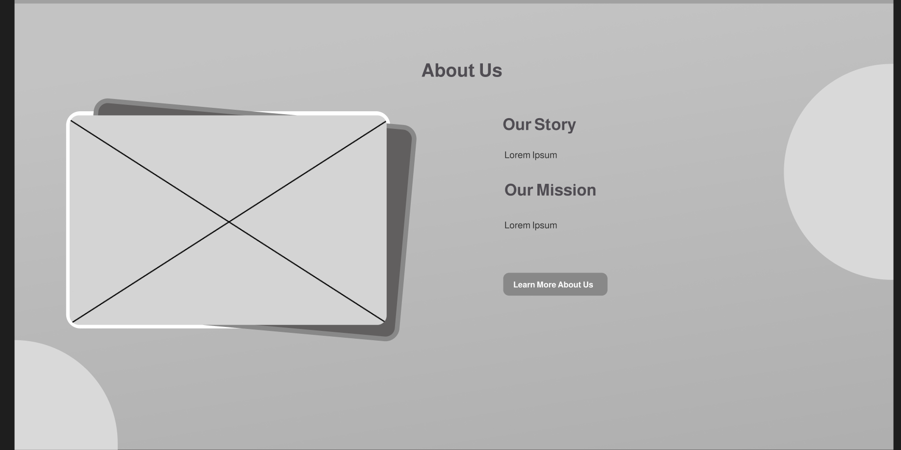

<h1 style="text-align: center;"> Informe del Trabajo Final </h1>
<h3 style="text-align: center;"> Universidad Peruana de Ciencias Aplicadas </h3>

<h5 style="text-align: center"> Área: Ingeniería de Software </h5>

<h5 style="text-align: center"> Curso: Diseño de Experimentos de Ingeniería de Software </h5>
<h5 style="text-align: center"> Sección: 4442 </h5>

<h5 style="text-align: center"> Docente: Lennin Percy Cenas Vasquez </h5>

<h5 style="text-align: center"> Startup: Aceitunas </h5>

<h5 style="text-align: center"> Producto: XXX </h5>

## Team members:

|                Nombre                 |   Código   |
| :-----------------------------------: | :--------: |
| Bastidas Bastidas, Diego Martin       | U20221A301 |
| Acuña Tomas, Diego Rolin          |  U202221436 |
|   Silva Tirado, Sebastian Valentino   | U20211G296 |
|  Ticona Panduro, Estrella del Pilar   | U202210659 |
|  Gallo Quintana, David Ivanoff    |  u20201E475 |

<h5 style="text-align: center"> Ciclo 2025-01 </h5>

# Registro de Versiones del Informe

Esta sección tiene como propósito presentar un resumen de los cambios importantes efectuados al informe a lo largo del desarrollo del proyecto. Comienza en una página independiente e incorpora una tabla con la siguiente estructura:

| Versión |   Fecha    |                 Autor                 | Descripción de modificación                                                                                                                                                          |
| :-----: | :--------: | :-----------------------------------: | ------------------------------------------------------------------------------------------------------------------------------------------------------------------------------------ |
|   TB1   | 04/04/2025 | Bastidas Bastidas, Diego Martin |  |
|   TB1   | 04/04/2025 | Acuña Tomas, Diego Rolin |  |
|   TB1   | 04/04/2025 | Gallo Quintana, David Ivanoff         |  |
|   TB1   | 04/04/2025 |   Silva Tirado, Sebastian Valentino   |  |
|   TB1   | 04/04/2025 | Ticona Panduro, Estrella del Pilar    |  |

## Project Report Collaboration Insights

URL del repositorio para el reporte del proyecto: https://github.com/UPC-PRE-1ASI0732-2501-4442-G1-Aceituna

  

**TB1**

Con el fin de elaborar el informe correspondiente a la entrega TB1, se asignó la implementación de las distintas secciones a cada miembro del equipo de la siguiente manera:

| Integrante                            | Tareas Asignadas                                                                                                                           |
| ------------------------------------- | ------------------------------------------------------------------------------------------------------------------------------------------ |
| | |
| | |
| | |
| Silva Tirado, Sebastian Valentino |  |
| Ticona Panduro, Estrella del Pilar| |

## Contenido

1. [**Capítulo I: Introducción.**](#1.)  
   1.1. [Startup Profile.](#1.1.)  
   1.1.1. [Descripción del startup.](#1.1.1.) 
   1.1.2.[Perfiles de los integrantes del equipo.](#1.1.2.) 
   1.2. [Solution Profile.](#1.2.) 
   1.2.1. [Antecedentes y Problemática.](#1.2.1.) 
   1.2.2. [Lean UX Process.](#1.2.2.) 
   1.2.2.1. [Lean UX Problem Statements.](#1.2.2.1.) 
   1.2.2.2. [Lean UX Assumptions.](#1.2.2.2.) 
   1.2.2.3. [Lean UX Hypothesis Statements.](#1.2.2.3.) 
   1.2.2.4. [Lean UX Canvas.](#1.2.2.4.) 
   1.3. [Segmentos objetivo.](#1.3.) 
2. [**Capítulo II: Requirements Elicitation & Analysis.**](#2.) 
   2.1. [Competidores.](#2.1.) 
   2.1.1. [Análisis competitivo.](#2.1.1.) 
   2.1.2. [Estrategias y tácticas frente a competidores.](#2.1.2.) 
   2.2. [Entrevistas.](#2.2.) 
   2.2.1. [Diseño de entrevistas.](#2.2.1.) 
   2.2.2. [Registro de entrevistas.](#2.2.2.) 
   2.2.3. [Análisis de entrevistas.](#2.2.3.) 
   2.3. [Needfinding.](#2.3.) 
   2.3.1. [User Personas.](#2.3.1.) 
   2.3.2. [User Task Matrix.](#2.3.2.) 
   2.3.3. [User Journey Mapping.](#2.3.3.) 
   2.3.4. [Empathy Mapping.](#2.3.4.) 
   2.3.5. [As-is Scenario Mapping.](#2.3.5.) 
   2.4. [Ubiquitous Language](#2.4.) 
3. [**Capítulo III: Requirements Specification.**](#3.) 
   3.1. [To-Be Scenario Mapping.](#3.1.) 
   3.2. [User Stories.](#3.2.) 
   3.3. [Product Backlog.](#3.3.) 
   3.4. [Impact Mapping.](#3.4.) 
4. [**Capítulo IV: Product Design.**](#4.) 
   4.1. [Style Guidelines.](#4.1.) 
   4.1.1. [General Style Guidelines.](#4.1.1.) 
   4.1.2. [Web Style Guidelines.](#4.1.2.) 
   4.1.3. [Mobile Style Guidelines.](#4.1.3.) 
   4.1.3.1. [iOS Mobile Style Guidelines.](#4.1.3.1.) 
   4.1.3.2. [Android Mobile Style Guidelines](#4.1.3.2.) 
   4.2. [Information Architecture.](#4.2.) 
   4.2.1. [Organization Systems.](#4.2.1.) 
   4.2.2. [Labeling Systems.](#4.2.2.) 
   4.2.3. [SEO Tags and Meta Tags](#4.2.3.) 
   4.2.4. [Searching Systems.](#4.2.4.) 
   4.2.5. [Navigation Systems.](#4.2.5.) 
   4.3. [Landing Page UI Design.](#4.3.) 
   4.3.1. [Landing Page Wireframe.](#4.3.1.) 
   4.3.2. [Landing Page Mock-up.](#4.3.2.) 
   4.4. [Mobile Applications UX/UI Design.](#4.4.) 
   4.4.1. [Mobile Applications Wireframes.](#4.4.1.) 
   4.4.2. [Mobile Applications Wireflow Diagrams.](#4.4.2.) 
   4.4.3. [Mobile Applications Mock-ups.](#4.4.3.) 
   4.4.4. [Mobile Applications User Flow Diagrams.](#4.4.4.) 
   4.5. [Mobile Applications Prototyping.](#4.5.) 
   4.5.1. [Android Mobile Applications Prototyping.](#4.5.1.) 
   4.5.2. [iOS Mobile Applications Prototyping.](#4.5.2.) 
   4.6. [Web Applications UX/UI Design.](#4.6.) 
   4.6.1. [Web Applications Wireframes.](#4.6.1.) 
   4.6.2. [Web Applications Wireflow Diagrams.](#4.6.2.) 
   4.6.3. [Web Applications Mock-ups.](#4.6.3.) 
   4.6.4. [Web Applications User Flow Diagrams.](#4.6.4.) 
   4.7. [Web Applications Prototyping.](#4.7.) 
   4.8. [Domain-Driven Software Architecture.](#4.8.) 
   4.8.1. [Software Architecture Context Diagram.](#4.8.1.) 
   4.8.2. [Software Architecture Container Diagrams.](#4.8.2.) 
   4.8.3. [Software Architecture Components Diagrams.](#4.8.3.) 
   4.9. [Software Object-Oriented Design.](#4.9.) 
   4.9.1. [Class Diagrams.](#4.9.1.) 
   4.9.2. [Class Dictionary.](#4.9.2.) 
   4.10. [Database Design.](#4.10.) 
   4.10.1. [Relational/Non-Relational Database Diagram.](#4.10.1.) 
5. [**Capítulo V: Product Implementation, Validation & Deployment.**](#5.) 
   5.1. [Software Configuration Management.](#5.1.) 
   5.1.1. [Software Development Environment Configuration.](#5.1.1.) 
   5.1.2. [Source Code Management.](#5.1.2.) 
   5.1.3. [Source Code Style Guide & Conventions.](#5.1.3.) 
   5.1.4. [Software Deployment Configuration.](#5.1.4.) 
   5.2. [Product Implementation & Deployment.](#5.2.) 
   5.2.1. [Sprint Backlogs.](#5.2.1.) 
   5.2.2. [Implemented Landing Page Evidence](#5.2.2.) 
   5.2.3. [Implemented Frontend-Web Application Evidence](#5.2.3.) 
   5.2.4. [Implemented Native-Mobile Application Evidence](#5.2.4.) 
   5.2.5. [Implemented RESTful API and/or Serverless Backend Evidence](#5.2.5.) 
   5.2.6. [RESTful API documentation](#5.2.6.) 
   5.2.7. [Team Collaboration Insights](#5.2.7.) 
   5.3. [Video About-the-Product.](#5.3.) 

## STUDENT OUTCOME
La capacidad de reconocer responsabilidades éticas y
profesionales en situaciones de ingeniería y hacer juicios informados, que deben
considerar el impacto de las soluciones de ingeniería en contextos globales, económicos,
ambientales y sociales.
<b>ABET – EAC - Student Outcome 4</b>

<table style="border-collapse:collapse;border-spacing:0" class="tg"><thead><tr><th style="border-color:black;border-style:solid;border-width:1px;font-family:Arial, sans-serif;font-size:14px;font-weight:normal;overflow:hidden;padding:10px 5px;text-align:left;vertical-align:top;word-break:normal">Criterio específico</th><th style="border-color:black;border-style:solid;border-width:1px;font-family:Arial, sans-serif;font-size:14px;font-weight:normal;overflow:hidden;padding:10px 5px;text-align:left;vertical-align:top;word-break:normal">Acciones realizadas</th><th style="border-color:black;border-style:solid;border-width:1px;font-family:Arial, sans-serif;font-size:14px;font-weight:normal;overflow:hidden;padding:10px 5px;text-align:left;vertical-align:top;word-break:normal">Conclusiones</th></tr></thead>
<tbody>
<tr><td style="border-color:black;border-style:solid;border-width:1px;font-family:Arial, sans-serif;font-size:14px;overflow:hidden;padding:10px 5px;text-align:left;vertical-align:top;word-break:normal">4.c.1 Reconoce responsabilidad ética y profesional en situaciones de ingeniería de software</td><td style="border-color:black;border-style:solid;border-width:1px;font-family:Arial, sans-serif;font-size:14px;overflow:hidden;padding:10px 5px;text-align:left;vertical-align:top;word-break:normal">Silva Tirado, Sebastian Valentino  TB1: En el primer entregable me encargué de recopilar los antecedentes y problemáticas enfocados a nuestro proyecto y así sustentarlo, entrevistas y lo que depende de ello y la unidad cinco.</td>
<td style="border-color:black;border-style:solid;border-width:1px;font-family:Arial, sans-serif;font-size:14px;overflow:hidden;padding:10px 5px;text-align:left;vertical-align:top;word-break:normal">Silva Tirado, Sebastian Valentino  TB1: En el primer entregable me encargué de recopilar los antecedentes y problemáticas enfocados a nuestro proyecto y así sustentarlo, entrevistas y lo que depende de ello y la unidad cinco.</td></tr>
<tr><td style="border-color:black;border-style:solid;border-width:1px;font-family:Arial, sans-serif;font-size:14px;overflow:hidden;padding:10px 5px;text-align:left;vertical-align:top;word-break:normal">4.c.2 Emite juicios informados considerando el impacto de las soluciones de ingeniería de software en contextos globales, económicos, ambientales y sociales</td><td style="border-color:black;border-style:solid;border-width:1px;font-family:Arial, sans-serif;font-size:14px;overflow:hidden;padding:10px 5px;text-align:left;vertical-align:top;word-break:normal">Silva Tirado, Sebastian Valentino  TB1: En el primer entregable me encargué de recopilar los antecedentes y problemáticas enfocados a nuestro proyecto y así sustentarlo, entrevistas y lo que depende de ello y la unidad cinco.</td>
<td style="border-color:black;border-style:solid;border-width:1px;font-family:Arial, sans-serif;font-size:14px;overflow:hidden;padding:10px 5px;text-align:left;vertical-align:top;word-break:normal">Silva Tirado, Sebastian Valentino  TB1: En el primer entregable me encargué de recopilar los antecedentes y problemáticas enfocados a nuestro proyecto y así sustentarlo, entrevistas y lo que depende de ello y la unidad cinco.</td></tr>
</tbody></table>

## Part I: As-Is Software Project

<h2>Capítulo I: Introducción</h2>

<h3>1.1 Startup Profile.</h3>

En esta sección, presentaremos una descripción de la startup y proporcionaremos detalles sobre los miembros del equipo, mostrando sus perfiles.

<h4>1.1.1. Descripción del startup.</h4>

La contaminación del aire, causada por la emisión de gases contaminantes como el dióxido de carbono, también acelera el cambio climático. Estos problemas, derivados de conducir autos tradicionales, son cada vez más evidentes para la población, que busca alternativas sostenibles de movilidad urbana. EcoMovil nace como respuesta a esta necesidad, ofreciendo acceso a diversos medios de transporte ecológicos, como bicicletas, scooters, skateboards y motos eléctricas, poniendo en contacto a los usuarios con aquellos que disponen de estos vehículos.

Nos diferenciaremos de otras aplicaciones, ya que no solo ofreceremos una alternativa de transporte ecológico, sino que también brindaremos la oportunidad de generar ingresos a nuestros usuarios, que pueden ser desde estudiantes universitarios hasta jubilados, según sus condiciones y horarios, de acuerdo con su disponibilidad. Esto lo lograremos permitiéndoles publicar ofertas para alquilar o vender sus vehículos. Además, nuestra aplicación incluirá características que garantizarán una experiencia segura, eficiente y agradable para todos los usuarios.

**Misión**: Proveer acceso a un medio de transporte ecológico que promueva una movilidad urbana sostenible, facilitando la conexión de las personas con vehículos ecológicos a través de una aplicación digital eficiente, mientras genera oportunidades de ingresos.

**Visión**: Convertirnos en la aplicación líder en transporte urbano sostenible, brindando acceso a vehículos ecológicos y promoviendo hábitos de vida más saludables y responsables con el entorno.

**Logotipo del Servicio:** 

<h4>1.1.2. Perfiles de los integrantes del equipo.</h4>

| Descripción de los Miembros del Equipo                                                                                                                                                                                                                                                                                                                                                                                                                                                                                                                                                                                                                    | Perfiles de los Miembros del Equipo                                        |   |
|-----------------------------------------------------------------------------------------------------------------------------------------------------------------------------------------------------------------------------------------------------------------------------------------------------------------------------------------------------------------------------------------------------------------------------------------------------------------------------------------------------------------------------------------------------------------------------------------------------------------------------------------------------------|----------------------------------------------------------------------------|---|
| Mi nombre es **Diego Bastidas**, soy estudiante del 7to ciclo de la carrera de Ingeniería de Software. Decidí estudiar esta carrera porque desde pequeño me llamaba la atención el funcionamiento de una computadora y los procesos que conlleva. Me gusta practicar deportes de contacto, salir a pasear y sobre todo me encanta ser Groomer canino y trabajar con mascotas.                                                                                                                                                                                                                                                                             |                                               |   |
| Mi nombre es **Diego Rolin Acuña Tomas** - u202221436, soy estudiante de la carrera de Ingeniería de Software en la UPC. Elegí esta carrera porque me apasionan las matemáticas y la programación. Mi objetivo es aplicar mis conocimientos para desarrollar aplicaciones enfocadas en el área de finanzas, ya que aspiro a trabajar en el sector bancario. En mi tiempo libre, disfruto ver películas con mi familia y caminar por lugares interesantes, como montañas o playas. Considero que mis principales fortalezas son la tenacidad y la curiosidad, cualidades que me ayudarán a superar con éxito el curso y alcanzar el mejor puntaje posible. |         |   |
| Mi nombre es **David Ivanoff Gallo Quintana** - u20201e475, tengo 21 años y actualmente curso Ingeniería de Software. Me considero una persona trabajadora, activa y que le gusta ser responsable con los trabajos asignados. Además, poseo conocimientos en algunos lenguajes de programación como Swift, C++ y Python. También estoy abierto a conocer nuevas tecnologías. Creo que estas cualidades me ayudarán a llevar a cabo el proyecto propuesto.                                                                                                                                                                                                 |                                                 |   |
| Mi nombre es **Sebastian Valentino Silva Tirado** - u20211g296, soy estudiante del séptimo ciclo de la carrera de Ingeniería de Software en UPC. Opté por estudiar esta carrera porque me gusta la idea de programar y crear algo que pueda llegar a funcionar y ser útil en el mundo. Por lo cual, la universidad me da la posibilidad de estudiar y ser un profesional exitoso. Deseo ser buen integrante para mi equipo y me comprometo en hacer el mejor trabajo posible, y poder superarme más que el ciclo anterior.                                                                                                                                |  |   |
| Mi nombre es **Estrella del pilar Ticona Panduro** - u202210659, actualmente estudio la carrera de Ingeniería de Software en UPC. Opté por estudiar esta carrera porque me interesa programar y crear diferentes aplicativos o programas y emplearlo en la salud. En mis tiempos libres me gusta ver series o películas. Mi compromiso es aportar ideas innovadoras a lo largo del curso, en especial en las tareas en equipo. Mis habilidades son tener una actitud positiva, entusiasta y responsable.                                                                                                                                                  |    |   |

<h3>1.2 Solution Profile.</h3>

<h4>1.2.1. Antecedentes y Problemática.</h4>

<h5>Antecedentes</h5>

Al inicio de este nuevo milenio, el mundo ha experimentado una transformación en sus métodos de transporte, impulsada por una mayor conciencia ambiental sobre la sostenibilidad y los avances tecnológicos. El reconocido Acuerdo de París (2015) y los movimientos y protestas climáticas, como Fridays for Future, reflejan el creciente interés por opciones de transporte más responsables con el medio ambiente.

Según el "Estudio de movilidad urbana con BIG DATA" (2019), en Lima Metropolitana y el Callao se registran aproximadamente 26.8 millones de desplazamientos diarios. El transporte público es el principal medio de traslado, utilizado por el 51% de la población. No obstante, existe un alto nivel de insatisfacción entre los ciudadanos, ya que seis de cada diez personas manifestaron su descontento con este servicio, principalmente por su ineficiencia, los frecuentes problemas de seguridad y su carácter muchas veces informal.

Frente a esta situación, resulta urgente facilitar el acceso a opciones de transporte más convenientes, sostenibles y accesibles. En este contexto, medios como las bicicletas, scooters, monopatines y motos eléctricas se presentan como alternativas viables, ya que no solo contribuyen a reducir el impacto ambiental, sino que también promueven un estilo de vida más saludable y activo entre los ciudadanos.

De acuerdo con el sistema de información de la educación superior del Ministerio de Educación (Minedu), la tasa de deserción en las universidades privadas disminuyó en 3.4 %, pasando del 22.3 % en el ciclo 2020-1 al 18.9 % en el ciclo 2020-2. Cabe destacar que, antes de la pandemia, estas instituciones presentaban una tasa de deserción cercana al 15 %. A raíz de la emergencia sanitaria, se adoptaron diversas medidas para apoyar a los estudiantes, como la entrega de becas, descuentos en pensiones y matrículas, fraccionamiento de pagos, ampliación de plazos para cancelar deudas y matrícula sin el pago de la primera cuota. Sin embargo, pese a estos esfuerzos, la deserción aumentó en comparación con los niveles prepandemia, lo que evidencia que muchos estudiantes requieren ingresos económicos adicionales para poder continuar sus estudios superiores.

Podemos concluir que, a medida que crece el interés por alternativas de transporte sostenibles, también surgen oportunidades para abordar la creciente demanda de ingresos flexibles entre los estudiantes universitarios. Ante el aumento del costo de vida y las presiones académicas, muchos jóvenes podrían estar interesados en obtener ingresos de manera flexible. En este sentido, la posibilidad de generar dinero a través de un negocio digital, mediante la venta o alquiler de productos y servicios, se presenta como una opción atractiva.

Nuestra plataforma web tiene como propósito transformar la movilidad en Lima, ofreciendo a los estudiantes universitarios la oportunidad de generar ingresos de manera flexible. Estableceremos un canal de comunicación entre los estudiantes y las personas interesadas en sus vehículos sostenibles, creando un ecosistema que combina sostenibilidad con espíritu emprendedor. Nuestro enfoque busca reducir la huella de carbono y aumentar los ingresos de los estudiantes mediante mecanismos de monetización justos. Cada trayecto facilitado a través de nuestra aplicación representa un avance hacia la armonía entre las necesidades económicas y la protección del medio ambiente.

<h5>Problemática (5Ws y 2Hs)</h5>

<h5>What (Qué)</h5>
<h6>¿Cuál es el problema?</h6>
Actualmente, no existe una plataforma web que fomente la movilidad ecológica y que, al mismo tiempo, permita el comercio y arrendamiento de vehículos sostenibles, ofreciendo a los estudiantes universitarios la posibilidad de generar ingresos con horarios flexibles. Los jóvenes que cursan estudios superiores suelen enfrentar dificultades para encontrar empleos que se adapten a su disponibilidad de tiempo, mientras que las ciudades continúan enfrentando desafíos relacionados con el transporte y la contaminación ambiental.

<h5>When (Cuándo)</h5>
<h6>¿Cuándo se presenta el problema?</h6>
La problemática se ha intensificado en los últimos diez años, impulsada por la expansión urbana y la creciente demanda de alternativas de transporte sostenibles. Paralelamente, la necesidad de acceder a fuentes de ingreso con horarios flexibles se ha vuelto cada vez más relevante, especialmente entre los jóvenes, debido al aumento del costo de vida y a las crecientes exigencias académicas.

<h5>Where (Dónde)</h5>
<h6>¿Dónde surge el problema?</h6>
El problema se manifiesta con mayor fuerza en Lima, una ciudad caracterizada por altos niveles de tráfico y contaminación. No obstante, la necesidad de contar con ingresos flexibles es una realidad que también afecta a estudiantes universitarios en diversas ciudades del país.

<h5>Who (Quién)</h5>
<h6>¿Quiénes están involucrados?</h6>
Los estudiantes universitarios que cuenten con medios de transporte ecológicos, como bicicletas, scooters o patinetas, y deseen obtener ingresos adicionales mediante su alquiler o venta, podrán conectarse a través de la aplicación con usuarios interesados. Estos adquirientes pueden ser cualquier persona en Lima que busque una opción de movilidad más económica, sostenible y flexible.

<h6>¿A quién le afecta el problema?</h6>
La problemática afecta principalmente a estudiantes universitarios que buscan generar ingresos adicionales mediante la venta o alquiler de sus medios de transporte ecológicos, sin descuidar sus responsabilidades académicas. Al mismo tiempo, los usuarios que accedan a nuestra aplicación serán personas que enfrentan a diario los desafíos de la congestión vehicular y la contaminación, y que están en busca de alternativas de movilidad más ecológicas, económicas y prácticas.

<h6>¿Quién lo utilizará?</h6>

- Universitarios: Que ofrecen sus medios de transporte personales mediante la plataforma con el fin de obtener ingresos extra.
- Adquirientes: Dirigido a empleados, visitantes y cualquier persona en Lima que busque alternativas de transporte funcionales, accesibles y respetuosas con el medio ambiente.

<h5>Why (Por qué)</h5>
<h6>¿Cuál es la causa del problema?</h6>
La ausencia de una solución viable que combine el acceso a un transporte sostenible con la posibilidad de generar ingresos flexibles limita tanto el progreso económico de los estudiantes universitarios como el desarrollo de una ciudad con menor contaminación y una movilidad urbana más eficiente.

<h5>¿Cuáles son las 2H?</h5>

<h5>How (Cómo)</h5>
<h6>¿En qué condiciones los usuarios usan nuestro producto?</h6>

Los usuarios pueden acceder a la aplicación desde cualquier dispositivo y lugar, siempre que cuenten con conexión a internet, ya sea mediante una computadora, tablet o smartphone. Su diseño intuitivo garantiza una experiencia de uso accesible y sencilla.

<h6>¿Cómo nos conocieron los usuarios?</h6>

Los usuarios podrán conocer la aplicación a través del boca a boca, publicaciones en redes sociales, campañas de publicidad digital, actividades en espacios universitarios o mediante medios especializados en movilidad y sostenibilidad.

<h6>¿Cómo prefieren los usuarios acceder a nuestro servicio?</h6>

Prefieren una plataforma digital, ya sea móvil o web, que sea intuitiva, fácil de usar y esté optimizada para distintos dispositivos. Es fundamental que la experiencia de usuario sea accesible y amigable, de modo que no genere barreras ni temor al momento de utilizarla por primera vez.

<h5>How much (Cuánto)</h5>
<h6>¿Cuánto impacta el problema?</h6>

Sus efectos se presentan de manera significativa en diversos ámbitos.

Contaminación ambiental: Lima es una de las ciudades más afectadas por la contaminación en América Latina. La gran proliferación de vehículos con motores de combustión interna es responsable de aproximadamente el 40% de las emisiones de CO2 en la capital. Esta situación contribuye al incremento de los problemas de salud pública, especialmente en relación con enfermedades respiratorias y cardiovasculares, afectando a miles de personas cada año.

Congestión vehicular: La capital de Perú enfrenta un tráfico constante, con niveles de congestión entre los más altos del mundo. Los habitantes de la ciudad pasan, en promedio, 3 horas al día atrapados en el tráfico, lo que reduce el tiempo disponible para la productividad y afecta negativamente la calidad de vida de los residentes.

Calidad de vida y situación económica de los universitarios: Los estudiantes universitarios en Lima enfrentan dificultades para acceder a empleos flexibles que les permitan balancear sus estudios con la necesidad de generar ingresos. La falta de opciones laborales adaptadas a sus horarios incrementa el estrés financiero en alrededor del 20% de la población juvenil. Sin una fuente de ingresos estable, muchos universitarios se ven obligados a abandonar sus estudios o aceptar trabajos mal remunerados y precarios.

Costo económico: La falta de alternativas de transporte sostenible y accesible obliga a los universitarios a depender del transporte público, que es ineficiente, o de vehículos privados, que resultan costosos. Aunque el transporte público en Lima es asequible, su cobertura y calidad son limitadas, lo que lleva a los estudiantes a destinar entre el 10% y el 15% de sus ingresos mensuales exclusivamente en transporte, lo cual representa una carga significativa para su economía.

<h4>1.2.2. Lean UX Process.</h4>

#### Business Assumptions

#### Necesidades de los Clientes

**Creemos que nuestros clientes buscan** una propuesta que integre transporte sostenible con oportunidades de ingreso flexibles. Por un lado, los estudiantes universitarios requieren formas de ganar dinero extra sin afectar sus horarios académicos; por otro, los usuarios del servicio buscan opciones de movilidad ecológicas y económicas.

#### Solución Propuesta

**Nuestra aplicación web está** pensada para vincular a estudiantes universitarios que tienen vehículos ligeros (como bicicletas, scooters o skateboards) con personas que desean alquilarlos o comprarlos. Esta iniciativa permitirá a los universitarios generar ingresos a partir de vehículos que no usan frecuentemente, mientras brinda a los usuarios finales opciones de movilidad más sostenibles y accesibles.

#### Valor Principal

- Para los estudiantes universitarios: Una app que les ofrece la posibilidad de alquilar o vender sus vehículos ligeros, obteniendo ingresos extra de forma flexible y compatible con su rutina académica.
- Para los usuarios: Una forma de acceder a medios de transporte ecológicos que mejoran la movilidad urbana, disminuyen la huella de carbono y contribuyen a un sistema de transporte más sostenible.

#### Beneficios Adicionales

- **Compromiso con el medio ambiente**: La app ayuda a disminuir la contaminación en las ciudades al fomentar el uso de medios de transporte sostenibles.  
- **Ingresos adaptables**: Los estudiantes pueden generar dinero extra de forma flexible, ajustándose a sus tiempos y necesidades individuales.  
- **Acceso rápido y sencillo**: Los usuarios podrán encontrar y utilizar opciones de transporte ecológico de manera fácil y eficiente.  
- **Diseño intuitivo y funcional**: La plataforma estará enfocada en la practicidad, optimizando el tiempo de los usuarios y haciendo más ágil el proceso de alquiler o venta de vehículos.

#### Adquisición de Clientes

La difusión de la aplicación se llevará a cabo mediante redes sociales, estrategias de marketing enfocadas en el entorno universitario y la participación en eventos vinculados a la sostenibilidad y la movilidad urbana.

#### Modelo de Ingresos

- **Planes de suscripción para universitarios**: Opciones mensuales que permiten a los estudiantes publicar y resaltar sus vehículos ligeros dentro de la plataforma.  
- **Ingresos por comisión**: La aplicación obtiene una parte de cada transacción realizada, ya sea por concepto de alquiler o venta.

#### Competencia

Competiremos con plataformas existentes de alquiler y venta de vehículos como City Bike Lima, Bee Perú y otras opciones de movilidad urbana. Nuestra propuesta se diferenciará por ofrecer una combinación única de enfoque sostenible, ingresos flexibles para estudiantes y una interfaz amigable pensada especialmente para el público universitario. La aplicación se destacará por su simplicidad y practicidad, optimizando el tiempo y la experiencia de los usuarios.

#### Riesgos Principales

- **Captación de usuarios**: El reto principal será atraer y mantener una comunidad activa de usuarios dispuestos a alquilar o vender sus vehículos.  
- **Experiencia del usuario**: Es fundamental garantizar que la app sea funcional, segura y fácil de usar, cumpliendo con las expectativas y necesidades de los usuarios.

#### Estrategias para Mitigar Riesgos
- **Fomento de una comunidad participativa**: Incentivar la interacción y retroalimentación constante de los usuarios para optimizar y evolucionar la plataforma.  
- **Seguridad y confianza garantizadas**: Establecer mecanismos de protección, incluyendo seguros temporales, que resguarden tanto a los estudiantes como a quienes alquilan o compran los vehículos.

#### User assumptions

#### ¿Quién es el usuario?

- **Estudiantes universitarios**: Se espera que estos usuarios tengan vehículos como bicicletas, scooters o patinetas que no utilizan con frecuencia y estén interesados en obtener ingresos extra alquilándolos o vendiéndolos a través de la app.  
- **Usuarios**: Este grupo abarca a residentes de Lima, incluyendo turistas, trabajadores y otros usuarios, que buscan alternativas de transporte ecológicas, económicas y accesibles, como bicicletas, scooters y motos eléctricas.

#### ¿Dónde encaja nuestro producto en sus trabajos o vidas?

- **Estudiantes universitarios**: La app les permite generar ingresos a partir de vehículos que no están usando, lo que les ayuda a cubrir gastos y aliviar la carga financiera, todo sin afectar su tiempo dedicado al estudio.  
- **Usuarios**: La aplicación les proporciona una opción de transporte más económica y ecológica, mejorando su movilidad diaria y contribuyendo a reducir su huella ambiental en la ciudad.

#### ¿Qué problema resuelve nuestro producto?

- **Para los universitarios**: Soluciona la necesidad de generar ingresos adicionales de manera flexible, sin interferir con sus estudios, al ofrecer una forma fácil de alquilar o vender los vehículos que no utilizan.  
- **Para los usuarios**: Brinda una alternativa de transporte más ecológica y asequible, respondiendo a la falta de opciones accesibles y ayudando a reducir la contaminación y la congestión en la ciudad.

#### ¿Cuándo y cómo es usado nuestro producto?

- **Universitarios**: Utilizan la aplicación cuando tienen un vehículo disponible para alquilar o vender. Pueden acceder en cualquier momento para gestionar sus anuncios y revisar las solicitudes de alquiler o compra.  
- **Usuarios**: Usan la aplicación para alquilar o comprar vehículos cuando requieren una opción de transporte, especialmente en momentos de alta demanda o cuando buscan alternativas más ecológicas y económicas.

#### ¿Qué características son importantes?

- **Valoraciones y reseñas**: Permite a los usuarios calificar la calidad de los vehículos y los servicios de alquiler o compra.  
- **Búsqueda avanzada con filtros**: Facilita la localización de vehículos según tipo, ubicación y otros criterios específicos.  
- **Historial de alquiler o venta de vehículos**: Guarda un registro de todas las transacciones, ayudando a los usuarios a gestionar sus vehículos de manera más eficiente.  
- **Foro de ayuda**: Ofrece soporte y resuelve dudas de los usuarios, mejorando la experiencia general.  
- **Mapa interactivo de puntos de recepción**: Permite a los usuarios ubicar fácilmente los vehículos disponibles en diferentes puntos de la ciudad.  
- **Gamificación**: Incorpora elementos como logros o insignias para fomentar la participación activa y el uso constante de la aplicación.

#### Feature Assumptions

- **Sistema de calificación con estrellas**: Implementar una función para que los usuarios puedan dejar reseñas y calificar su experiencia de alquiler o compra de vehículos mediante un sistema de estrellas.  
- **Búsqueda avanzada con filtros**: Desarrollar una opción de búsqueda avanzada que permita a los usuarios filtrar los vehículos según características como tipo de vehículo, precio y otros criterios.  
- **Panel de usuario para historial de transacciones**: Crear un área personalizada donde los adquirientes puedan ver un registro detallado de todas las transacciones, incluyendo alquileres y compras de vehículos.  
- **Foro de asistencia integrado**: Incorporar un foro de ayuda en la app que facilite la comunicación entre los usuarios y los universitarios, con opciones para contactar a través de WhatsApp.  
- **Mapa interactivo**: Añadir un mapa interactivo que permita a los usuarios localizar fácilmente los vehículos disponibles en su área.  
- **Validación del vehículo**: Implementar un proceso de verificación que asegure que los vehículos publicados en la aplicación cumplen con ciertos estándares de calidad y seguridad, garantizando así la confianza de los usuarios en los vehículos alquilados o comprados.
- **Gamificación**: Incorporar características de gamificación, como logros y badges, para motivar a los usuarios a realizar acciones específicas dentro de la aplicación.

#### Business Outcomes

- **Confirmación de funcionamiento adecuado**: Asegurar que los usuarios verifiquen que la aplicación funciona correctamente, sin interrupciones, proporcionando una experiencia de uso fluida y satisfactoria.  
- **Satisfacción del 70% de los usuarios**: Lograr que al menos el 70% de los usuarios estén contentos con el servicio durante el primer trimestre tras el lanzamiento, asegurando una alta tasa de retención y una fuerte recomendación del producto.  
- **Reducción de la contaminación en un 40%**: Conseguir una disminución del 40% en las emisiones de contaminación generadas por los usuarios de la aplicación, contribuyendo significativamente a la lucha contra el cambio climático mediante soluciones de transporte ecológico.

#### Users

Los usuarios principales de la aplicación son los estudiantes universitarios que tienen vehículos ligeros como bicicletas, scooters o patinetas y desean obtener ingresos extra alquilándolos o vendiéndolos. Además, se encuentran los usuarios que buscan opciones de transporte más económicas y ecológicas, quienes adquieren o alquilan estos vehículos a través de la plataforma, beneficiándose de la conveniencia y sostenibilidad que ofrece el servicio.

#### User Outcomes & Benefits

- **Para los Universitarios:**
  - **Generación de Ingresos Flexibles:** Ofrecen una forma de obtener ingresos adicionales alquilando o vendiendo vehículos que no están usando.
  - **Apoyo a la Sostenibilidad:** Contribuyen a una comunidad más ecológica y responsable mediante el uso compartido de vehículos.

- **Para los Adquirientes:**
  - **Reducción de la Huella de Carbono:** Eligen opciones de transporte ecológicas, reduciendo su impacto ambiental.
  - **Acceso Fácil al Transporte:** Mejoran su movilidad al tener acceso rápido a medios de transporte cuando más los necesitan.

<h5>1.2.2.1. Lean UX Problem Statements.</h5>

<h5>Problem Statement</h5>

Nuestra meta es desarrollar una plataforma digital que facilite la conexión entre estudiantes universitarios que desean poner en circulación sus vehículos ecológicos en desuso y personas que buscan opciones de transporte más sostenibles y económicamente accesibles.

Hemos identificado que muchos estudiantes universitarios cuentan con medios de transporte ecológicos, como bicicletas, scooters o patinetas, que ya no utilizan. Al mismo tiempo, existe una creciente demanda por parte de otros ciudadanos que buscan alternativas de movilidad económicas y sostenibles.

Esta situación pone en evidencia una inquietud cada vez mayor relacionada con los gastos asociados al transporte, las consecuencias ambientales de las opciones actuales y el deseo de adoptar hábitos de vida más saludables. Ante ello, surge la siguiente interrogante:

¿Qué características debemos incorporar en la plataforma para que los universitarios puedan gestionar el intercambio de estos vehículos de manera práctica, promoviendo al mismo tiempo una movilidad accesible, ecológica y saludable?

<h5>1.2.2.2. Lean UX Assumptions.</h5>

<h5>1.2.2.3. Lean UX Hypothesis Statements.</h5>

- **Hypothesis Statement 01:**  
  **Creemos que** al ofrecer una aplicación que permita a los universitarios rentar o vender sus vehículos, ayudaremos al medio ambiente al reducir la necesidad de vehículos personales y promover el uso compartido. 
  **Sabremos** que hemos tenido éxito. 
  **Cuando** los universitarios generen ingresos adicionales y recomienden la aplicación a más personas, aumentando así la adopción de la aplicación. 

- **Hypothesis Statement 02:**  
  **Creemos que** al ofrecer distintos medios de transporte más sostenibles, fomentaremos un estilo de vida más ecoamigable entre los universitarios. 
  **Sabremos** que hemos tenido éxito. 
  **Cuando** en distintos distritos de Lima se incrementen los esfuerzos por mejorar la infraestructura para vehículos sostenibles, como la creación de más carriles para bicicletas y monopatines. 

- **Hypothesis Statement 03:**  
  **Creemos que** al proporcionar una variedad más amplia de vehículos, atraeremos a más usuarios a nuestra aplicación. 
  **Sabremos** que hemos tenido éxito. 
  **Cuando** nuestra base de clientes crezca notablemente tras la adición de nuevos tipos de vehículos. 

- **Hypothesis Statement 04:**  
  **Creemos que** al garantizar la seguridad y el mantenimiento de los vehículos, incrementaremos la confianza y satisfacción de los usuarios. 
  **Sabremos** que hemos tenido éxito. 
  **Cuando** la tasa de retención de usuarios aumente y recibamos comentarios positivos sobre la seguridad y el mantenimiento.

- **Hypothesis Statement 05:**  
  **Creemos que** al mejorar la experiencia de usuario de la aplicación, facilitaremos el acceso y el uso de la aplicación para todos los universitarios. 
  **Sabremos** que hemos tenido éxito. 
  **Cuando** observemos un aumento en el tiempo de uso de la aplicación y en la satisfacción general del usuario, reflejado en encuestas y valoraciones. 

<h5>1.2.2.4. Lean UX Canvas.</h5>

El Lean UX Canvas es un recurso utilizado en el diseño centrado en el usuario (UX) y en metodologías Lean, cuyo objetivo es fomentar un desarrollo de productos más ágil y efectivo. Esta herramienta proporciona una estructura clara que promueve la colaboración entre equipos de distintas disciplinas. A continuación, se muestra el Lean UX Canvas elaborado por el equipo a través de Canva.

Enlace para acceder al Lean UX Canvas: https://www.canva.com/design/DAGOEXan6rE/pJTlXgHJBmfhVfeAe3pFgA/edit?utm_content=DAGOEXan6rE&utm_campaign=designshare&utm_medium=link2&utm_source=sharebutton

<h3>1.3 Segmentos objetivo.</h3>

Según el Ministerio de Transportes y Comunicaciones, el sistema de transporte en Lima Metropolitana enfrenta serios problemas de informalidad, ineficiencia y una alta tasa de accidentes, lo que lo convierte en un medio inseguro y uno de los principales generadores de contaminación ambiental (MTC, 2013; Solís Fonseca, Salazar Bravo, Romero Carrión & Solís Salazar, 2013). Esta situación ha impulsado la búsqueda de alternativas de movilidad más ágiles, sostenibles y accesibles, como bicicletas, scooters y motos eléctricas.

En este contexto, nuestro público objetivo está conformado por jóvenes universitarios de Lima Metropolitana, de entre 18 y 28 años, pertenecientes a niveles socioeconómicos medios, que buscan soluciones de transporte seguras, ecológicas y eficientes. Motivados por una creciente conciencia ambiental y la necesidad de reducir su huella de carbono, estos jóvenes encuentran en nuestra aplicación una herramienta práctica que responde a sus necesidades de movilidad diaria.

Adicionalmente, frente al aumento en la tasa de deserción universitaria, que pasó de 19.3 % en 2019 a 23.2 % en 2021, muchos estudiantes requieren fuentes de ingresos complementarias para continuar sus estudios en instituciones privadas (USIL, s/f). Por ello, nuestra aplicación no solo ofrece una alternativa de transporte sostenible, sino que también abre una vía para generar ingresos de forma flexible mediante el alquiler y la venta de vehículos ecológicos, contribuyendo así a su bienestar económico sin interferir con su desempeño académico.

<h2>Capítulo II: Requirements Elicitation & Analysis.</h2>

<h3>2.1 Competidores.</h3>

<h4>2.1.1. Análisis competitivo.</h4>

El análisis competitivo desempeña un papel fundamental en la formulación de estrategias empresariales, ya que permite identificar posibles riesgos y áreas de oportunidad. Este análisis es esencial para que nuestra empresa pueda desarrollar ventajas competitivas sostenibles y adaptarse con agilidad a los cambios del entorno comercial. A lo largo del desarrollo del proyecto, se ha integrado esta herramienta como un recurso estratégico para comprender mejor el panorama competitivo y evaluar a los principales competidores del mercado.

<table>
    <tr>
      <td colspan="6" align="center"><strong>Competitive Analysis Landscape</strong></td>
    </tr>
    <tr>
      <td align="center"><strong>¿Por qué llevar a cabo este análisis?</strong></td>
      <td colspan="5" align="center">Analizar a nuestros competidores en el mercado nos permite obtener una visión clara del entorno en el que se lanzará nuestra aplicación. Este proceso facilita la identificación de competidores tanto directos como indirectos. Al conocer su presencia y desempeño en el mercado, podremos diseñar estrategias más eficaces y alineadas con la realidad del sector. </td>
      </tr>
    <tr>
      <td colspan="2"></td>
      <td align="center">EcoMovil 
        </td>
      <td align="center">Tembici 
        </td>
      <td align="center">Airbnb  
        </td>
      <td align="center">CityBikeLima 
        </td>
    </tr>
    <tr>
      <td align="center" rowspan="2"><strong>Perfil</strong></td>
      <td align="center"><strong>Overview</strong></td>
      <td align="center">Nuestra plataforma digital está diseñada para facilitar la conexión entre usuarios que buscan medios de transporte sostenibles y quienes los ofrecen, ya sea para alquiler o venta. La aplicación no solo brinda la oportunidad de generar ingresos de manera flexible, sino que también promueve la creación de una comunidad comprometida con el cuidado del medio ambiente en el Perú.</td>
      <td align="center">Es una compañía destacada en el ámbito de la movilidad urbana en América Latina, ampliamente reconocida por sus servicios de bicicletas compartidas. Desde su fundación en 2010 en Brasil, ha expandido sus operaciones a diversas ciudades de Brasil, Argentina y Chile, promoviendo constantemente estilos de vida más sostenibles y saludables.</td>
      <td align="center">Es una plataforma digital que facilita la conexión entre personas que buscan alojamiento y anfitriones que ofrecen una amplia variedad de espacios en todo el mundo. El servicio permite encontrar desde habitaciones privadas y departamentos, hasta viviendas completas y alojamientos únicos como castillos o casas en los árboles.</td>
      <td align="center">Es un servicio de bicicletas públicas en Lima, Perú, que ofrece bicicletas compartidas como una alternativa ecológica y funcional para movilizarse por la ciudad. Su enfoque principal está en las zonas con alta congestión vehicular, donde busca fomentar un estilo de vida más sostenible y consciente del entorno urbano. </td>
    </tr>
    <tr>
      <td align="center"><strong>Ventaja Competitiva ¿Qué valor ofrece a los clientes?</strong></td>
      <td align="center">• Facilita el desplazamiento sostenible en entornos urbanos al ofrecer a los estudiantes universitarios diversas opciones de transporte, incorporando herramientas clave como valoraciones y comentarios de usuarios, filtros de búsqueda avanzados, un historial de transacciones y un mapa interactivo para una experiencia más completa. 
        • Motiva la participación de los usuarios mediante la integración de dinámicas de juego. </td>
      <td align="center">• Las estaciones de Tembici se encuentran estratégicamente distribuidas en lugares clave de las ciudades, como paradas de metro, centros comerciales y vecindarios residenciales.   
         • El servicio está accesible durante todo el día, los 7 días de la semana.</td>
      <td align="center">• Brinda una amplia variedad de opciones de alojamiento, que van desde apartamentos y casas hasta propuestas únicas como casas en árboles, castillos y casas flotantes. 
 • Ofrecen experiencias organizadas por personas locales, que van desde recorridos guiados y talleres de cocina hasta actividades al aire libre y de aventura.</td>
      <td align="center">• Brinda a sus usuarios múltiples planes de suscripción, permitiéndoles elegir entre opciones diarias, semanales o mensuales, según sus necesidades, hábitos de uso y presupuesto. 
 • Ofrece tarifas de alquiler más bajas en comparación con otros medios de transporte, lo que hace de las bicicletas compartidas una opción económica.</td>
    </tr>
    <tr>
      <td align="center" rowspan="2"><strong>Perfil del Marketing</td>
      <td align="center"><strong>Mercado Objetivo</strong></td>
      <td align="center"> Universitarios y adquirientes. </td>
      <td align="center">Habitantes urbanos, visitantes, personas interesadas en la movilidad ecológica, empresas, autoridades locales y comunidades residenciales.</td>
      <td align="center">Visitantes y turistas, ejecutivos, propietarios de propiedades y actividades, así como familias y grupos.</td>
      <td align="center">Habitantes de la ciudad, turistas, promotores de la movilidad ecológica, familias y empleados municipales.</td>
    </tr>
    <tr>
      <td align="center"><strong>Estrategias de Marketing</strong></td>
      <td align="center">Brindar un mes de prueba gratuita a los usuarios.</td>
      <td align="center">• Promociones y descuentos especiales. 
 • Estrategias publicitarias en plataformas sociales y canales digitales.</td>
      <td align="center">• Publicidad digital y en redes sociales. </td>
      <td align="center">• Colaboraciones con universidades y empresas. 
 • Actividades locales para fomentar el uso de bicicletas. </td>
    </tr>
    <tr>
      <td align="center" rowspan="3"><strong>Perfil del Producto</strong></td>
      <td align="center"><strong>Productos & Servicios</strong></td>
      <td align="center">Plataforma en línea que facilita la conexión entre personas interesadas en alquilar o adquirir bicicletas, scooters, patinetas, motos eléctricas y otros vehículos, y aquellos que los tienen disponibles.</td>
      <td align="center">Servicio de alquiler de bicicletas a través de una aplicación móvil, promoviendo una movilidad urbana sostenible y adaptable para los usuarios.</td>
      <td align="center">Aplicación web que ofrece una amplia variedad de opciones de alojamiento, desde habitaciones privadas hasta casas completas, en todo el mundo.</td>
      <td align="center">Brindar una solución de movilidad urbana sostenible y accesible mediante una aplicación móvil que facilita el alquiler y la gestión de bicicletas.</td>
    </tr>
    <tr>
      <td align="center"><strong>Precios & Costos</strong></td>
      <td align="center">• Incluye hasta 2 publicaciones mensuales para alquilar o vender vehículos, con soporte básico. El precio es de $1.99 al mes después del período de prueba. 
 •  Ofrece hasta 10 publicaciones mensuales, con la opción de destacar tus anuncios y soporte prioritario. El costo es de $5.99 al mes una vez finalizado el período de prueba. 
 • Ofrece publicaciones ilimitadas para alquilar o vender vehículos, junto con soporte 24/7. El precio es de $19.99 al mes después del período de prueba.                 </td>
      <td align="center">• Plan Diario: Costo aproximado de $0.50 a $1.00 por hora, con un límite máximo diario que oscila entre $5.00 y $10.00. 
 • Plan Mensual: Tiene un costo que varía entre $25.00 y $40.00. 
 • Plan Anual: Su precio oscila entre $150.00 y $300.00. </td>
      <td align="center"> • Alojamientos por Noche: Los costos varían entre $30 y $200 o más por noche, dependiendo de la ciudad, el tipo de alojamiento y la temporada. 
 • Estancias Largas: Muchos anfitriones brindan descuentos para estancias de una semana o más, lo que puede disminuir el costo por noche. 
 • Experiencias: Los costos de las experiencias (actividades o tours ofrecidos por locales) suelen variar entre $20 y $100 por persona, aunque pueden fluctuar considerablemente. </td>
      <td align="center">• Plan Diario: Alrededor de S/ 8.00 a S/ 15.00 por día. 
 • Plan Mensual: Aproximadamente de S/ 50.00 a S/ 100.00. 
 • Plan Anual: Varía entre S/ 300.00 y S/ 600.00, según la suscripción y los beneficios adicionales. </td>
    </tr>
    <tr>
      <td align="center"><strong>Canales de distribución (Web y/o Móvil)</strong></td>
      <td align="center">El servicio estará accesible de forma temporal a través de la aplicación.</td>
      <td align="center">Aplicación móvil, página web, estaciones físicas, colaboraciones con empresas y universidades, y plataformas de redes sociales.</td>
      <td align="center">Página web, la aplicación móvil, alianzas con agencias de viajes y plataformas externas, y redes sociales. </td>
      <td align="center">Aplicación móvil, página web, puntos físicos y redes sociales.</td>
    </tr>
    <tr>
      <td align="center" rowspan="4"><strong>Análisis SWOT</strong></td>
      <td align="center"><strong>Fortalezas</strong></td>
      <td align="center">Permite una comunicación adaptable entre el universitario y el comprador a través del foro de contacto.</td>
      <td align="center">• Red de bicicletas extensa y sólidamente establecida. 
 • Tecnología de vanguardia en la aplicación. </td>
      <td align="center">• Gran diversidad de alternativas de hospedaje. 
 • Plataforma internacional con presencia en varios países. </td>
      <td align="center">• Red de estaciones ampliamente distribuida. 
 • Sistema de bicicletas innovador y de alto rendimiento. </td>
    <tr>
      <td align="center"><strong>Debilidades</strong></td>
      <td align="center">Baja visibilidad y promoción.</td>
      <td align="center">Cobertura restringida en ciertas zonas, así como problemas de mantenimiento y disponibilidad de bicicletas.</td>
      <td align="center">Problemas de seguridad y confianza, inconsistencias en la calidad de las propiedades, falta de regulación y cumplimiento de normas, dificultades en la resolución de disputas y dependencia del anfitrión para garantizar una buena experiencia al huésped.</td>
      <td align="center">Infraestructura deficiente, mantenimiento inconsistente de las bicicletas, fallos en la tecnología de la app, poca visibilidad en medios y redes sociales, restricciones en la expansión y baja fidelización de usuarios.</td>
    </tr>
    <tr>
      <td align="center"><strong>Oportunidades</strong></td>
      <td align="center">
   Aprovechar las debilidades en las ofertas de la competencia y responder a la alta demanda de los estudiantes universitarios peruanos que cuentan con vehículos menores sin utilizar.</td>
      <td align="center">Ampliación a nuevas zonas, colaboración con universidades y empresas, fortalecimiento de la infraestructura, mejoras tecnológicas en la aplicación, campañas de sensibilización e integración con otros medios de transporte.</td>
      <td align="center">Extensión a nuevos destinos, promociones para grupos, optimización de la experiencia del huésped, alianzas con negocios locales, recursos para anfitriones y refuerzo de la seguridad con tecnología avanzada.</td>
      <td align="center">Extensión a más zonas dentro de la ciudad, convenios con universidades y compañías, mejora en la infraestructura de las estaciones, modernización tecnológica de la aplicación, iniciativas promocionales e incorporación con otros sistemas de transporte.</td>
    </tr>
    <tr>
      <td align="center"><strong>Amenazas</strong></td>
      <td align="center">Inflación y volatilidad económica. </td>
      <td align="center">Riesgos de seguridad, clima desfavorable y carencia de infraestructura adecuada.</td>
      <td align="center">Modificaciones en las normativas locales y presencia de plataformas de alojamiento competidoras.</td>
      <td align="center">Robo o vandalismo de bicicletas.</td>
     </tr>
  </table>
  </body>
  </html>

<h4>2.1.2. Estrategias y tácticas frente a competidores.</h4>

A partir del análisis competitivo realizado, se han identificado las fortalezas, oportunidades, debilidades y amenazas de los competidores. Esta información es crucial para desarrollar estrategias y tácticas que permitan superar a la competencia cuando el servicio se introduzca en el mercado de forma rentable. A continuación, se detallan las estrategias y tácticas planificadas para alcanzar este objetivo.

**Afrontando las fortalezas de nuestros competidores:**

- Introducir nuevas características tecnológicas para diferenciarse en el mercado.  
- Proporcionar un servicio de soporte personalizado y proactivo disponible las 24 horas del día, los 7 días de la semana.

**Comprendemos que nuestras fortalezas son:**

- Creación de nuevas funcionalidades tecnológicas.  
- Distinción en mercados desatendidos.

Podemos implementar las siguientes estrategias y tácticas:

**Estrategias**

- Nos centraremos en los estudiantes universitarios, brindando opciones de alquiler o compra a largo plazo para quienes requieran vehículos pequeños para su transporte diario.

**Tácticas**

- Realizaremos eventos de lanzamiento en universidades o áreas estratégicas.

**Afrontando las oportunidades de nuestros competidores:**

- Incorporaremos rápidamente nuevas funcionalidades y mejoras.
- Proporcionaremos un foro de contacto de alta calidad.

**Comprendemos que nuestras debilidades son:**

- Carecemos de la misma presencia en el mercado que los competidores consolidados, lo que podría dificultar la atracción de usuarios.  
- Contamos con recursos limitados, lo que restringe nuestra capacidad para invertir en marketing y tecnología.

**Estrategias**

- Promoveremos EcoMovil como una opción ecológica y sostenible. Pondremos en marcha programas de reforestación o compensación de carbono por cada alquiler o compra, y destacaremos el uso de vehículos eléctricos y de bajo impacto ambiental.

**Tácticas**

- Identificaremos zonas de alto flujo estudiantil donde la competencia es reducida. Estableceremos operaciones en estos lugares antes que nuestros competidores, logrando captar una parte significativa del mercado local.

**Afrontando las oportunidades de nuestros competidores:**

- Destacaremos nuestro compromiso con la sostenibilidad.  
- Nos centraremos en zonas con baja competencia y alta demanda.

**Comprendemos que nuestras debilidades son:**

- Reconocimiento de marca reducido.  
- Presupuesto limitado.  
- Presencia inicial restringida.

**Estrategias**

- Proporcionaremos tarifas con un mes gratuito para los universitarios, lo que nos ayudará a crear una base de usuarios sólida y constante.

**Tácticas**

- Brindaremos un foro de contacto, especialmente durante las horas de mayor actividad, como las mañanas antes de clases. Esto nos diferenciará de los competidores que ofrecen soporte limitado.

**Afrontando las oportunidades de nuestros competidores:**

- Incorporaremos filtros que permitan destacar la reputación y confiabilidad del cliente.

**Comprendemos que nuestras debilidades son:**

- Visibilidad de marca aún limitada.  
- Recursos más restringidos para marketing y operaciones.  
- Cobertura geográfica en proceso de crecimiento.

<h3>2.2 Entrevistas.</h3>

<h4>2.2.1. Diseño de entrevistas.</h4>

Preguntas dirigidas a Universitarios.

----

- Preguntas principales:

1. ¿Podrías decirme tu nombre completo y edad?
2. ¿En qué distrito resides actualmente?
3. ¿Cuál es tu estado civil?
4. ¿Dónde naciste?
5. ¿Que dispositivos tecnológicos?
6. ¿Que navegadores utilizas?
7. ¿Qué tipo de vehículo(s) menor(es) posees?
8. ¿Qué habilidades consideras que tienes en relación con el manejo o mantenimiento de tu(s) vehículo(s)?
9. ¿Qué factores consideras al elegir un vehículo menor? (Ej. economía, estilo, funcionalidad)
10. ¿Qué influencias (familia, amigos, medios, etc.) han afectado tus decisiones al comprar un vehículo?
11. ¿Qué tipos de vehículos tienes disponibles para rentar o vender?
12. ¿Cómo determinar el precio de tus vehículos?
13. ¿Qué medidas de seguridad implementadas para asegurarte de que tus vehículos estén siempre en buen estado antes de rentarlos o venderlos?
14. ¿Cómo manejas la limpieza y desinfección de los vehículos?
15. ¿Cuáles son los requisitos o condiciones para rentar o vender uno de tus vehículos?

- Preguntas complementarias:

1. ¿Sigues algún protocolo específico para la limpieza y desinfección, y con qué frecuencia realizas estas tareas?
2. ¿Qué proceso sigues para verificar la identidad y credibilidad de los posibles adquirientes?
3. ¿Cómo organizas la entrega y recogida de los vehículos? ¿Tienes puntos de recogida específicos o cómo coordinas estos procesos?
4. ¿Cómo manejas las valoraciones y reseñas que dejan los adquirientes?
5. Durante el periodo de renta o venta, ¿qué tipo de soporte proporcionas a los adquirientes?
6. ¿Estás abierto a considerar descuentos o promociones especiales para atraer más adquirientes?
7. ¿Hay alguna mejora o característica que te gustaría ver en la aplicación que utilizas para gestionar tus vehículos? 
    
   Preguntas dirigidas a Adquirientes.

----

- **Preguntas Principales:**

1. ¿Podrías decirme tu nombre completo y edad?
2. ¿En qué distrito resides actualmente?
3. ¿Dónde naciste y en qué lugar vives actualmente?
4. ¿Cuál es tu estado civil?
5. ¿Podrías describir tu nivel socioeconómico? ¿Te consideras en un nivel alto, intermedio o bajo?
6. ¿Podrías contarnos un poco acerca de ti y tu experiencia con el alquiler y la compra de vehículos?
7. ¿Qué te impulsó a buscar una aplicación para alquilar o comprar vehículos?
8. ¿Qué esperas lograr al utilizar una aplicación para alquilar o comprar vehículos?
9. ¿Qué dificultades o problemas has enfrentado en tus experiencias previas con el alquiler y la compra de vehículos?
10. ¿Qué características consideras esenciales en una aplicación para alquilar o comprar vehículos?
11. ¿Qué métodos de pago prefieres para realizar transacciones en línea?
12. ¿Cómo te gustaría recibir notificaciones sobre tus reservas y el estado de los vehículos?
13. ¿Cuál ha sido tu experiencia con la seguridad y protección en el alquiler y la compra de vehículos?
14. ¿Qué mejoras o características adicionales crees que podrían mejorar tu experiencia al usar una aplicación de renta o compra de vehículos?

- **Preguntas Complementarias:**

1. ¿Cómo has gestionado el alquiler o la compra de vehículos en el pasado?
2. ¿Qué tipo de soporte o asistencia esperas recibir durante el proceso de alquiler o compra?
3. ¿Tienes alguna preferencia particular en cuanto a la aplicación o tecnología que se utiliza para acceder a la aplicación?
4. ¿Cómo prefieres gestionar la búsqueda de vehículos en una aplicación?
5. ¿Qué tipo de información te gustaría ver en las descripciones de los vehículos?

---

<h4>2.2.2. Registro de entrevistas.</h4>

Segmento #1: Universitarios

| **Entrevista 1**        | **Ramiro Alexander Guzman Chavez**         | 
|:-------------------:|:-------------------:|
| 
Edad
  | 
20 Años
  |
| 
Departamento
  | 
Lima, Perú
  | 
| 

  | 
En esta entrevista, conocemos a Ramiro, un estudiante con conocimientos en tecnología y acceso a varios dispositivos. Es dueño de una bicicleta que cuida con responsabilidad y, para ganar dinero extra, ocasionalmente la alquila, siempre pactando en lugares públicos. Al conocer una aplicación que facilitaría este proceso, se mostró interesado, aunque recalcó que solo le gustaría alquilar a otros universitarios. También está abierto a una comunidad donde se dejen reseñas y se colabore entre usuarios. Para él, lo más importante es que la app permita identificar de manera confiable a las personas con quienes se hacen los acuerdos.
  | 
| 
Timing: 0:00-.... 
  | 
URL: .... 
  | 

 

Segmento #2: Adquirientes

| **Entrevista 1**        | **Miguel Angel Gómez Hurtado**         | 
|:-------------------:|:-------------------:|
| 
Edad
  | 
23 Años
  |
| 
Departamento
  | 
Lima, Perú
  | 
| 

  | 
En esta entrevista hablamos con Miguel, una persona con múltiples medios de comunicación, conocimientos en tecnología y experiencia en la venta y alquiler de vehículos. Actualmente busca un medio de transporte personal para recorrer distancias cortas de forma rápida. Se mostró interesado en una aplicación como la que proponemos y destacó la importancia de contar con una plataforma confiable, que permita concretar tratos en cualquier momento y garantice su seguridad. Está familiarizado con aplicaciones de pago como Yape, por lo que le gustaría poder usarlas dentro del sistema. También le interesa una función para ubicar comerciantes cercanos, un sistema de reseñas entre usuarios y una opción de seguro que le permita recuperar su dinero en caso de estafa, lo que aumentaría su confianza en la app. 
  | 
| 
Timing: 0:00-.... 
  | 
URL: .... 
  | 

 

<h4>2.2.3. Análisis de entrevistas.</h4>

**Análisis del segmento universitario**

Los entrevistados valoran altamente la aplicación EcoMovil por su capacidad para facilitar la renta y la venta de vehículos menores inactivos, permitiéndoles generar ingresos adicionales y contribuir a la movilidad sostenible. El 100% de los usuarios aprecian cómo la aplicación optimiza el proceso de rentar o vender estos vehículos, destacando su utilidad para maximizar el valor de los recursos no utilizados. La facilidad de uso y la funcionalidad para registrar y gestionar los vehículos son aspectos especialmente valorados.

Sin embargo, se identificaron áreas de mejora. Un 67% de los usuarios, como Rodrigo, sugiere incorporar promociones u ofertas para atraer a más adquirientes y mejorar la visibilidad del vehículo. Además, un 33% menciona la necesidad de optimizar la comunicación entre universitario y adquiriente, como se indicó en la tercera entrevista, para hacer el proceso de alquiler y venta más eficiente. También se destacó la importancia de incluir herramientas que permitan una gestión más eficiente de las reservas y el seguimiento de alquileres y ventas. En general, aunque EcoMovil es percibida como una herramienta beneficiosa, mejorar la interacción, las ofertas y las herramientas de gestión podría potenciar aún más la experiencia del usuario.

**Análisis del segmento de adquiriente**

El 100% de los entrevistados valoran la presencia de un mapa interactivo y las opciones de edición de vehículos. Un 67% prefiere usar el servicio para disfrutar del paisaje y recorrer distancias medias, indicando una inclinación hacia experiencias agradables y prácticas de movilidad urbana. No obstante, un 33% ha tenido experiencias desfavorables debido a cobros imprevistos, subrayando la importancia de mantener la claridad en los precios y evitar cargos inesperados.

Además, el 67% valora positivamente la atención al cliente y la posibilidad de comunicarse directamente con el universitario, sugiriendo que una comunicación efectiva es esencial para una experiencia de alquiler y compra satisfactoria. Todos los entrevistados consideran importantes las ventajas ambientales del servicio, lo que refleja una alta conciencia y aprecio por el impacto positivo en el medio ambiente.

Algunos usuarios también sugirieron incluir características adicionales, como opciones de seguro más flexibles y mejoras en el proceso de devolución del vehículo, para aumentar la satisfacción general y la confianza en el servicio.

<h3>2.3 Needfinding.</h3>

<h4>2.3.1. User Personas.</h4>

- Segmento Universitarios:

- Segmento Adquirientes:

<h4>2.3.2. User Task Matrix.</h4>

A continuación, se muestra el Task Matrix, una tabla que detalla las actividades llevadas a cabo por los User Personas, junto con su nivel de importancia y frecuencia. Seguidamente, se presenta un resumen basado en los datos recopilados.

<table style="border-collapse:collapse;border-spacing:0" class="tg"><thead><tr><th style="border-color:black;border-style:solid;border-width:1px;font-family:Arial, sans-serif;font-size:14px;font-weight:normal;overflow:hidden;padding:10px 5px;text-align:left;vertical-align:top;word-break:normal"></th><th style="border-color:black;border-style:solid;border-width:1px;font-family:Arial, sans-serif;font-size:14px;font-weight:normal;overflow:hidden;padding:10px 5px;text-align:left;vertical-align:top;word-break:normal" colspan="2">             Universitarios         </th><th style="border-color:black;border-style:solid;border-width:1px;font-family:Arial, sans-serif;font-size:14px;font-weight:normal;overflow:hidden;padding:10px 5px;text-align:left;vertical-align:top;word-break:normal" colspan="2">             Adquirientes         </th></tr></thead>
<tbody>
<tr><td style="border-color:black;border-style:solid;border-width:1px;font-family:Arial, sans-serif;font-size:14px;overflow:hidden;padding:10px 5px;text-align:left;vertical-align:top;word-break:normal">             Task         </td><td style="border-color:black;border-style:solid;border-width:1px;font-family:Arial, sans-serif;font-size:14px;overflow:hidden;padding:10px 5px;text-align:left;vertical-align:top;word-break:normal">             Frequency         </td><td style="border-color:black;border-style:solid;border-width:1px;font-family:Arial, sans-serif;font-size:14px;overflow:hidden;padding:10px 5px;text-align:left;vertical-align:top;word-break:normal">             Importance         </td><td style="border-color:black;border-style:solid;border-width:1px;font-family:Arial, sans-serif;font-size:14px;overflow:hidden;padding:10px 5px;text-align:left;vertical-align:top;word-break:normal">         Frequency         </td>
<td style="border-color:black;border-style:solid;border-width:1px;font-family:Arial, sans-serif;font-size:14px;overflow:hidden;padding:10px 5px;text-align:left;vertical-align:top;word-break:normal">         Importance         </td></tr>
<tr><td style="border-color:black;border-style:solid;border-width:1px;font-family:Arial, sans-serif;font-size:14px;overflow:hidden;padding:10px 5px;text-align:left;vertical-align:top;word-break:normal">             Montar bicicleta         </td><td style="border-color:black;border-style:solid;border-width:1px;font-family:Arial, sans-serif;font-size:14px;overflow:hidden;padding:10px 5px;text-align:left;vertical-align:top;word-break:normal">         Rarely         </td><td style="border-color:black;border-style:solid;border-width:1px;font-family:Arial, sans-serif;font-size:14px;overflow:hidden;padding:10px 5px;text-align:left;vertical-align:top;word-break:normal">             High         </td><td style="border-color:black;border-style:solid;border-width:1px;font-family:Arial, sans-serif;font-size:14px;overflow:hidden;padding:10px 5px;text-align:left;vertical-align:top;word-break:normal">         Sometimes         </td>
<td style="border-color:black;border-style:solid;border-width:1px;font-family:Arial, sans-serif;font-size:14px;overflow:hidden;padding:10px 5px;text-align:left;vertical-align:top;word-break:normal">         Medium         </td></tr>
<tr><td style="border-color:black;border-style:solid;border-width:1px;font-family:Arial, sans-serif;font-size:14px;overflow:hidden;padding:10px 5px;text-align:left;vertical-align:top;word-break:normal">             Generar ingresos         </td><td style="border-color:black;border-style:solid;border-width:1px;font-family:Arial, sans-serif;font-size:14px;overflow:hidden;padding:10px 5px;text-align:left;vertical-align:top;word-break:normal">             Rarely         </td><td style="border-color:black;border-style:solid;border-width:1px;font-family:Arial, sans-serif;font-size:14px;overflow:hidden;padding:10px 5px;text-align:left;vertical-align:top;word-break:normal">             High         </td><td style="border-color:black;border-style:solid;border-width:1px;font-family:Arial, sans-serif;font-size:14px;overflow:hidden;padding:10px 5px;text-align:left;vertical-align:top;word-break:normal">         Always         </td>
<td style="border-color:black;border-style:solid;border-width:1px;font-family:Arial, sans-serif;font-size:14px;overflow:hidden;padding:10px 5px;text-align:left;vertical-align:top;word-break:normal">         High         </td></tr>
<tr><td style="border-color:black;border-style:solid;border-width:1px;font-family:Arial, sans-serif;font-size:14px;overflow:hidden;padding:10px 5px;text-align:left;vertical-align:top;word-break:normal">             Viajar         </td><td style="border-color:black;border-style:solid;border-width:1px;font-family:Arial, sans-serif;font-size:14px;overflow:hidden;padding:10px 5px;text-align:left;vertical-align:top;word-break:normal">             Rarely         </td><td style="border-color:black;border-style:solid;border-width:1px;font-family:Arial, sans-serif;font-size:14px;overflow:hidden;padding:10px 5px;text-align:left;vertical-align:top;word-break:normal">             Low         </td><td style="border-color:black;border-style:solid;border-width:1px;font-family:Arial, sans-serif;font-size:14px;overflow:hidden;padding:10px 5px;text-align:left;vertical-align:top;word-break:normal">         Rarely         </td>
<td style="border-color:black;border-style:solid;border-width:1px;font-family:Arial, sans-serif;font-size:14px;overflow:hidden;padding:10px 5px;text-align:left;vertical-align:top;word-break:normal">         Medium         </td></tr>
<tr><td style="border-color:black;border-style:solid;border-width:1px;font-family:Arial, sans-serif;font-size:14px;overflow:hidden;padding:10px 5px;text-align:left;vertical-align:top;word-break:normal">             Comprar y rentar vehículos         </td><td style="border-color:black;border-style:solid;border-width:1px;font-family:Arial, sans-serif;font-size:14px;overflow:hidden;padding:10px 5px;text-align:left;vertical-align:top;word-break:normal">             Never         </td><td style="border-color:black;border-style:solid;border-width:1px;font-family:Arial, sans-serif;font-size:14px;overflow:hidden;padding:10px 5px;text-align:left;vertical-align:top;word-break:normal">         Low         </td><td style="border-color:black;border-style:solid;border-width:1px;font-family:Arial, sans-serif;font-size:14px;overflow:hidden;padding:10px 5px;text-align:left;vertical-align:top;word-break:normal">             Rarely         </td>
<td style="border-color:black;border-style:solid;border-width:1px;font-family:Arial, sans-serif;font-size:14px;overflow:hidden;padding:10px 5px;text-align:left;vertical-align:top;word-break:normal">         Medium         </td></tr>
<tr><td style="border-color:black;border-style:solid;border-width:1px;font-family:Arial, sans-serif;font-size:14px;overflow:hidden;padding:10px 5px;text-align:left;vertical-align:top;word-break:normal">             Explorar nuevos lugares         </td><td style="border-color:black;border-style:solid;border-width:1px;font-family:Arial, sans-serif;font-size:14px;overflow:hidden;padding:10px 5px;text-align:left;vertical-align:top;word-break:normal">             Rarely         </td><td style="border-color:black;border-style:solid;border-width:1px;font-family:Arial, sans-serif;font-size:14px;overflow:hidden;padding:10px 5px;text-align:left;vertical-align:top;word-break:normal">             Low         </td><td style="border-color:black;border-style:solid;border-width:1px;font-family:Arial, sans-serif;font-size:14px;overflow:hidden;padding:10px 5px;text-align:left;vertical-align:top;word-break:normal">             Sometimes         </td>
<td style="border-color:black;border-style:solid;border-width:1px;font-family:Arial, sans-serif;font-size:14px;overflow:hidden;padding:10px 5px;text-align:left;vertical-align:top;word-break:normal">         Medium         </td></tr>
<tr><td style="border-color:black;border-style:solid;border-width:1px;font-family:Arial, sans-serif;font-size:14px;overflow:hidden;padding:10px 5px;text-align:left;vertical-align:top;word-break:normal">             Conocer gente         </td><td style="border-color:black;border-style:solid;border-width:1px;font-family:Arial, sans-serif;font-size:14px;overflow:hidden;padding:10px 5px;text-align:left;vertical-align:top;word-break:normal">             Sometimes         </td><td style="border-color:black;border-style:solid;border-width:1px;font-family:Arial, sans-serif;font-size:14px;overflow:hidden;padding:10px 5px;text-align:left;vertical-align:top;word-break:normal">             Medium         </td><td style="border-color:black;border-style:solid;border-width:1px;font-family:Arial, sans-serif;font-size:14px;overflow:hidden;padding:10px 5px;text-align:left;vertical-align:top;word-break:normal">             Sometimes         </td>
<td style="border-color:black;border-style:solid;border-width:1px;font-family:Arial, sans-serif;font-size:14px;overflow:hidden;padding:10px 5px;text-align:left;vertical-align:top;word-break:normal">         High         </td></tr>
<tr><td style="border-color:black;border-style:solid;border-width:1px;font-family:Arial, sans-serif;font-size:14px;overflow:hidden;padding:10px 5px;text-align:left;vertical-align:top;word-break:normal">             Gestionamiento de huella de carbono         </td><td style="border-color:black;border-style:solid;border-width:1px;font-family:Arial, sans-serif;font-size:14px;overflow:hidden;padding:10px 5px;text-align:left;vertical-align:top;word-break:normal">             Never         </td><td style="border-color:black;border-style:solid;border-width:1px;font-family:Arial, sans-serif;font-size:14px;overflow:hidden;padding:10px 5px;text-align:left;vertical-align:top;word-break:normal">             Low         </td><td style="border-color:black;border-style:solid;border-width:1px;font-family:Arial, sans-serif;font-size:14px;overflow:hidden;padding:10px 5px;text-align:left;vertical-align:top;word-break:normal">             Always         </td>
<td style="border-color:black;border-style:solid;border-width:1px;font-family:Arial, sans-serif;font-size:14px;overflow:hidden;padding:10px 5px;text-align:left;vertical-align:top;word-break:normal">         High         </td></tr>
<tr><td style="border-color:black;border-style:solid;border-width:1px;font-family:Arial, sans-serif;font-size:14px;overflow:hidden;padding:10px 5px;text-align:left;vertical-align:top;word-break:normal">             Informarse a través del foro de contacto         </td><td style="border-color:black;border-style:solid;border-width:1px;font-family:Arial, sans-serif;font-size:14px;overflow:hidden;padding:10px 5px;text-align:left;vertical-align:top;word-break:normal">             Sometimes         </td><td style="border-color:black;border-style:solid;border-width:1px;font-family:Arial, sans-serif;font-size:14px;overflow:hidden;padding:10px 5px;text-align:left;vertical-align:top;word-break:normal">             Medium         </td><td style="border-color:black;border-style:solid;border-width:1px;font-family:Arial, sans-serif;font-size:14px;overflow:hidden;padding:10px 5px;text-align:left;vertical-align:top;word-break:normal">             Sometimes         </td>
<td style="border-color:black;border-style:solid;border-width:1px;font-family:Arial, sans-serif;font-size:14px;overflow:hidden;padding:10px 5px;text-align:left;vertical-align:top;word-break:normal">         High         </td></tr>
<tr><td style="border-color:black;border-style:solid;border-width:1px;font-family:Arial, sans-serif;font-size:14px;overflow:hidden;padding:10px 5px;text-align:left;vertical-align:top;word-break:normal">             Buscar descuentos         </td><td style="border-color:black;border-style:solid;border-width:1px;font-family:Arial, sans-serif;font-size:14px;overflow:hidden;padding:10px 5px;text-align:left;vertical-align:top;word-break:normal">             Sometimes         </td><td style="border-color:black;border-style:solid;border-width:1px;font-family:Arial, sans-serif;font-size:14px;overflow:hidden;padding:10px 5px;text-align:left;vertical-align:top;word-break:normal">             Medium         </td><td style="border-color:black;border-style:solid;border-width:1px;font-family:Arial, sans-serif;font-size:14px;overflow:hidden;padding:10px 5px;text-align:left;vertical-align:top;word-break:normal">             Sometimes         </td>
<td style="border-color:black;border-style:solid;border-width:1px;font-family:Arial, sans-serif;font-size:14px;overflow:hidden;padding:10px 5px;text-align:left;vertical-align:top;word-break:normal">         High         </td></tr>
<tr><td style="border-color:black;border-style:solid;border-width:1px;font-family:Arial, sans-serif;font-size:14px;overflow:hidden;padding:10px 5px;text-align:left;vertical-align:top;word-break:normal">             Compartir su experiencia por redes sociales         </td><td style="border-color:black;border-style:solid;border-width:1px;font-family:Arial, sans-serif;font-size:14px;overflow:hidden;padding:10px 5px;text-align:left;vertical-align:top;word-break:normal">             Sometimes         </td><td style="border-color:black;border-style:solid;border-width:1px;font-family:Arial, sans-serif;font-size:14px;overflow:hidden;padding:10px 5px;text-align:left;vertical-align:top;word-break:normal">             Low         </td><td style="border-color:black;border-style:solid;border-width:1px;font-family:Arial, sans-serif;font-size:14px;overflow:hidden;padding:10px 5px;text-align:left;vertical-align:top;word-break:normal">             Always         </td>
<td style="border-color:black;border-style:solid;border-width:1px;font-family:Arial, sans-serif;font-size:14px;overflow:hidden;padding:10px 5px;text-align:left;vertical-align:top;word-break:normal">         High         </td></tr>
<tr><td style="border-color:black;border-style:solid;border-width:1px;font-family:Arial, sans-serif;font-size:14px;overflow:hidden;padding:10px 5px;text-align:left;vertical-align:top;word-break:normal">             Contactar a través de WhatsApp         </td><td style="border-color:black;border-style:solid;border-width:1px;font-family:Arial, sans-serif;font-size:14px;overflow:hidden;padding:10px 5px;text-align:left;vertical-align:top;word-break:normal">             Sometimes         </td><td style="border-color:black;border-style:solid;border-width:1px;font-family:Arial, sans-serif;font-size:14px;overflow:hidden;padding:10px 5px;text-align:left;vertical-align:top;word-break:normal">             High         </td><td style="border-color:black;border-style:solid;border-width:1px;font-family:Arial, sans-serif;font-size:14px;overflow:hidden;padding:10px 5px;text-align:left;vertical-align:top;word-break:normal">             Rarely         </td>
<td style="border-color:black;border-style:solid;border-width:1px;font-family:Arial, sans-serif;font-size:14px;overflow:hidden;padding:10px 5px;text-align:left;vertical-align:top;word-break:normal">         Medium         </td></tr>
<tr><td style="border-color:black;border-style:solid;border-width:1px;font-family:Arial, sans-serif;font-size:14px;overflow:hidden;padding:10px 5px;text-align:left;vertical-align:top;word-break:normal">             Renovar la suscripción         </td><td style="border-color:black;border-style:solid;border-width:1px;font-family:Arial, sans-serif;font-size:14px;overflow:hidden;padding:10px 5px;text-align:left;vertical-align:top;word-break:normal">             Sometimes         </td><td style="border-color:black;border-style:solid;border-width:1px;font-family:Arial, sans-serif;font-size:14px;overflow:hidden;padding:10px 5px;text-align:left;vertical-align:top;word-break:normal">             Medium         </td><td style="border-color:black;border-style:solid;border-width:1px;font-family:Arial, sans-serif;font-size:14px;overflow:hidden;padding:10px 5px;text-align:left;vertical-align:top;word-break:normal">             Sometimes         </td>
<td style="border-color:black;border-style:solid;border-width:1px;font-family:Arial, sans-serif;font-size:14px;overflow:hidden;padding:10px 5px;text-align:left;vertical-align:top;word-break:normal">         Medium         </td></tr>
</tbody></table>

En este caso, se identifica que para Camila, las actividades vinculadas a la gestión de la huella de carbono tienen alta prioridad e importancia, lo cual evidencia su compromiso con el cuidado del medio ambiente. Además, muestra interés por descubrir nuevos lugares y compartir sus vivencias con amigos y en redes sociales.

En contraste, Alex Hidalgo prioriza la generación de ingresos, impulsado por su deseo de adquirir artículos personales y brindar apoyo económico a su familia. Su atención se centra especialmente en cumplir con sus deberes académicos.

A pesar de sus distintas motivaciones, ambos coinciden en valorar la seguridad como un aspecto esencial ante posibles riesgos.

<h4>2.3.3. User Journey Mapping.</h4>

En esta sección se presenta el recorrido completo del usuario (User Journey Mapping) de la aplicación EcoMovil para los segmentos objetivo: estudiantes universitarios y compradores. El proceso comienza desde que el cliente se entera de la aplicación, sigue con la toma de decisión para utilizarla, el registro, el uso continuo de la misma y, finalmente, la opción de dejar de usarla.

- Segmento Universitarios:

- Segmento Adquirientes:

<h4>2.3.4. Empathy Mapping.</h4>

- Segmento Adquirientes:

<h4>2.3.5. As-is Scenario Mapping.</h4>

- Segmento Universitarios:

- Segmento Adquirientes:

<h3>2.4 Ubiquitous Language</h3>

- **Vehicle (Vehículo)**: Entidad central en la plataforma que representa cualquier medio de transporte ecológico disponible para alquiler o compra, como bicicletas, scooters, skateboards, o motos eléctricas.
- **University Student (Universitario)**: Persona que posee un vehículo y lo publica en la plataforma con el objetivo de generar ingresos al rentarlo o venderlo.
- **Acquirer (Adquiriente)**: Usuario que busca alquilar o comprar un vehículo para su transporte personal o recreativo, ya sea a corto o largo plazo.
- **Renting (Alquiler)**: Proceso mediante el cual un Universitario otorga el uso temporal de su vehículo a un Adquiriente a cambio de un pago.
- **Vehicle Listing (Publicación de Vehículo)**: Acción realizada por el Universitario para colocar su vehículo en la plataforma, especificando detalles relevantes como precio, disponibilidad y condiciones de uso.
- **Vehicle Sale (Venta de Vehículo)**: Proceso en el cual un Universitario ofrece un vehículo para su venta definitiva a un Adquiriente.
- **Transaction (Transacción)**: Proceso financiero que ocurre al completar una acción de alquiler o venta, involucrando el pago y la entrega del vehículo.
- **Transaction History (Historial de Transacciones)**: Registro de todas las acciones de alquiler o venta realizadas por un Universitario o Adquiriente en la plataforma.
- **WhatsApp Coordination (Coordinación por WhatsApp)**: Comunicación directa entre un Universitario y un Adquiriente para acordar detalles logísticos como la entrega o recolección del vehículo.
- **Forum (Foro)**: Espacio colaborativo donde los usuarios pueden publicar preguntas, compartir experiencias y resolver dudas relacionadas con vehículos, alquileres, ventas o la plataforma en general.
- **Review and Rating (Calificación y Reseña)**: Sistema donde los Adquirientes pueden calificar su experiencia con un vehículo o Universitario, aportando información relevante para otros usuarios.
- **Temporary Insurance (Seguro Temporal)**: Servicio adicional opcional que brinda cobertura contra accidentes o daños durante el alquiler de un vehículo.
- **Subscription Plan (Plan de Suscripción)**: Niveles de membresía que los Universitarios pueden adquirir para acceder a funcionalidades y beneficios específicos de la plataforma.
- **Flexible Income (Ingreso Flexible)**: Beneficio monetario obtenido por los Universitarios mediante la renta o venta de sus vehículos.
- **Marketplace (Mercado)**: Espacio de la plataforma donde los usuarios pueden buscar, alquilar o comprar vehículos disponibles.
- **Pick-up/Drop-off Point (Punto de Entrega y Recolección)**: Ubicación designada donde los Adquirientes pueden recoger o entregar los vehículos alquilados o comprados.
- **Gamification (Gamificación)**: Estrategia que implementa retos, logros y recompensas para motivar a los usuarios a interactuar más activamente en la plataforma.
- **Cachimbo Plan (Plan Cachimbo)**: Plan básico de suscripción para Universitarios, con un límite de publicaciones y soporte limitado.
- **University Plan (Plan Universitario)**: Plan intermedio de suscripción que ofrece más publicaciones mensuales y soporte prioritario.
- **Graduate Plan (Plan Graduado)**: Plan de suscripción avanzado que brinda a los Universitarios publicaciones ilimitadas y soporte completo.
- **Plan Payment (Pago de Plan)**: Evento en el cual un Universitario realiza una transacción para adquirir o renovar un Plan de Suscripción en la plataforma.
- **Reminder Notification (Notificación de Recordatorio)**: Mensaje automático que se envía a los Universitarios y Adquirientes para recordar eventos importantes como la renovación de un plan, la recolección de un vehículo o la finalización de un período de alquiler.
- **Vehicle Verification (Validación de Vehículo)**: Proceso por el cual la plataforma verifica los detalles y la condición de los vehículos publicados por los Universitarios para garantizar la calidad y seguridad del servicio.
- **Achievement (Logro)**: Recompensas o insignias virtuales que los usuarios pueden obtener al cumplir ciertos objetivos, como alcanzar un número específico de alquileres o recibir calificaciones positivas.

<h2>Capítulo III: Requirements Specification.</h2>

<h3>3.1 To-Be Scenario Mapping.</h3>

Para elaborar el To-be Scenario Mapping, el equipo definió cómo sería el flujo de trabajo después de la implementación de nuestra solución, EcoMovil, para ambos segmentos objetivos. El propósito de este artefacto es comparar y abordar los aspectos negativos identificados en el As-is Scenario.

- Segmento Universitarios:

- Segmento Adquiriente:

<h3>3.2 User Stories.</h3>

<table>
    <tr>
        <th>User Story ID</th>
        <th>Título</th>
        <th>Descripción</th>
        <th>Criterios de Aceptación</th>
        <th>Relacionado con (Epic ID)</th>
    </tr>
    <tr>
        <td>US01</td>
        <td>Barra de navegación en la Landing Page</td>
        <td><b>Como</b> estudiante o comprador <b>quiero</b> ver una página de inicio <b>para</b> explorar las características de la plataforma.</td>
        <td><b>Dado que</b> el usuario accede al sitio web principal, <b>cuando</b> aparece el menú superior, <b>entonces</b> debe mostrar todas las opciones disponibles. <b>Dado que</b> el usuario está en la página, <b>cuando</b> selecciona un enlace del menú, <b>entonces</b> debe llevarlo a la sección correspondiente.</td>
        <td>1</td>
    </tr>
    <tr>
        <td>US02</td>
        <td>Sección Hero en la Landing Page</td>
        <td><b>Como</b> visitante <b>quiero</b> una presentación visual impactante <b>para</b> comprender rápidamente el propósito del servicio.</td>
        <td><b>Dado que</b> se carga la página principal, <b>cuando</b> el usuario llega al sitio, <b>entonces</b> la zona destacada debe mostrar contenido llamativo que explique el valor del producto.</td>
        <td>1</td>
    </tr>
    <tr>
        <td>US03</td>
        <td>Sección Footer en la Landing Page</td>
        <td><b>Como</b> cliente potencial <b>quiero</b> encontrar datos legales y de contacto <b>para</b> resolver dudas o consultas.</td>
        <td><b>Dado que</b> el usuario navega hasta el final de la página, <b>cuando</b> visualiza el pie, <b>entonces</b> debe incluir enlaces a políticas y formas de comunicación.</td>
        <td>1</td>
    </tr>
    <tr>
        <td>US04</td>
        <td>Sección de Beneficios en la Landing Page</td>
        <td><b>Como</b> interesado <b>quiero</b> entender las ventajas del sistema <b>para</b> evaluar si satisface mis requerimientos.</td>
        <td><b>Dado que</b> el usuario explora la plataforma, <b>cuando</b> llega al área explicativa, <b>entonces</b> debe describir claramente cómo funciona y qué beneficios ofrece.</td>
        <td>1</td>
    </tr>
    <tr>
        <td>US05</td>
        <td>Sección de Contacto en la Landing Page</td>
        <td><b>Como</b> posible usuario <b>quiero</b> canales de comunicación accesibles <b>para</b> iniciar mi experiencia con el servicio.</td>
        <td><b>Dado que</b> el usuario necesita asistencia, <b>cuando</b> visita la zona de contacto, <b>entonces</b> debe ofrecer métodos claros para establecer comunicación.</td>
        <td>1</td>
    </tr>
    <tr>
        <td>US06</td>
        <td>Landing Page Responsive con diferentes dispositivos</td>
        <td><b>Como</b> usuario móvil <b>quiero</b> una adaptación automática del diseño <b>para</b> navegar cómodamente desde cualquier dispositivo.</td>
        <td><b>Dado que</b> se accede desde distintos tamaños de pantalla, <b>cuando</b> se carga la interfaz, <b>entonces</b> debe reorganizarse correctamente sin afectar la usabilidad.</td>
        <td>1</td>
    </tr>
    <tr>
        <td>US07</td>
        <td>Sección de planes en la Landing Page</td>
        <td><b>Como</b> cliente interesado <b>quiero</b> comparar opciones de suscripción <b>para</b> seleccionar la que mejor se ajuste a mis necesidades.</td>
        <td><b>Dado que</b> el usuario revisa las membresías disponibles, <b>cuando</b> examina características y precios, <b>entonces</b> debe poder elegir y comenzar el proceso de adhesión.</td>
        <td>1</td>
    </tr>
    <tr>
        <td>US08</td>
        <td>Sección de acerca de en la Landing Page</td>
        <td><b>Como</b> usuario curioso <b>quiero</b> conocer los antecedentes del proyecto <b>para</b> entender su filosofía y valores.</td>
        <td><b>Dado que</b> se busca información institucional, <b>cuando</b> se visita la sección sobre nosotros, <b>entonces</b> debe presentar la historia y objetivos de manera clara y motivadora.</td>
        <td>1</td>
    </tr>
    <tr>
        <td>US09</td>
        <td>Sección de unirse en la Landing Page</td>
        <td><b>Como</b> nuevo miembro <b>quiero</b> un formulario de registro sencillo <b>para</b> comenzar a utilizar los servicios.</td>
        <td><b>Dado que</b> el usuario decide registrarse, <b>cuando</b> completa sus datos básicos, <b>entonces</b> debe recibir confirmación y acceso inicial al sistema.</td>
        <td>1</td>
    </tr>
    <tr>
        <td>US10</td>
        <td>Sección de inscribirse en la Landing Page</td>
        <td><b>Como</b> usuario no registrado <b>quiero</b> una opción de ingreso directo <b>para</b> acceder rápidamente a la plataforma.</td>
        <td><b>Dado que</b> existe una cuenta previa, <b>cuando</b> se introducen credenciales válidas, <b>entonces</b> debe permitirse el acceso al área privada.</td>
        <td>1</td>
    </tr>
    <tr>
        <td>US11</td>
        <td>Sección de universitario en la Landing Page</td>
        <td><b>Como</b> estudiante universitario <b>quiero</b> contenidos específicos para mi perfil <b>para</b> aprovechar beneficios académicos.</td>
        <td><b>Dado que</b> el usuario pertenece al ámbito educativo, <b>cuando</b> accede a su zona especial, <b>entonces</b> debe encontrar ofertas y condiciones adaptadas.</td>
        <td>1</td>
    </tr>
    <tr>
        <td>US12</td>
        <td>Sección de "conozca más sobre nosotros" en la Landing Page</td>
        <td><b>Como</b> usuario detallista <b>quiero</b> información ampliada sobre la empresa <b>para</b> tomar decisiones informadas.</td>
        <td><b>Dado que</b> se requiere mayor profundidad informativa, <b>cuando</b> se explora esta sección, <b>entonces</b> debe ofrecer datos completos sobre la organización.</td>
        <td>1</td>
    </tr>
    <tr>
        <td>US13</td>
        <td>Botón de empieza tu viaje en la Landing Page</td>
        <td><b>Como</b> usuario motivado <b>quiero</b> un llamado a la acción claro <b>para</b> iniciar mi experiencia sin demora.</td>
        <td><b>Dado que</b> el usuario está listo para comenzar, <b>cuando</b> encuentra el botón destacado, <b>entonces</b> debe guiarlo directamente al proceso de registro o ingreso.</td>
        <td>1</td>
    </tr>
    <tr>
        <td>US14</td>
        <td>Sección de todos los derechos reservados en la Landing Page</td>
        <td><b>Como</b> usuario legalmente consciente <b>quiero</b> ver los derechos de propiedad <b>para</b> sentirme seguro usando el servicio.</td>
        <td><b>Dado que</b> se requiere transparencia legal, <b>cuando</b> se revisa el pie de página, <b>entonces</b> debe mostrar claramente los derechos reservados y términos legales.</td>
        <td>1</td>
    </tr>
    <tr>
        <td>US15</td>
        <td>Sección de adquiriente en la Landing Page</td>
        <td><b>Como</b> comprador frecuente <b>quiero</b> ver información relevante para mi perfil <b>para</b> optimizar mis transacciones.</td>
        <td><b>Dado que</b> el usuario tiene intención de compra, <b>cuando</b> accede a su sección específica, <b>entonces</b> debe encontrar herramientas y ofertas para compradores.</td>
        <td>1</td>
    </tr>
    <tr>
        <td>US16</td>
        <td>Crear una cuenta en EcoMovil</td>
        <td><b>Como</b> nuevo usuario <b>quiero</b> registrarme fácilmente <b>para</b> acceder a todas las funcionalidades.</td>
        <td><b>Dado que</b> se completa el formulario correctamente, <b>cuando</b> se envía la información, <b>entonces</b> debe crearse la cuenta y redirigir al dashboard principal.</td>
        <td>2</td>
    </tr>
    <tr>
        <td>US17</td>
        <td>Inicio de sesión en EcoMovil</td>
        <td><b>Como</b> usuario registrado <b>quiero</b> acceder a mi cuenta <b>para</b> gestionar mis actividades.</td>
        <td><b>Dado que</b> se ingresan credenciales válidas, <b>cuando</b> se solicita autenticación, <b>entonces</b> debe verificarse la identidad y permitir el ingreso al sistema.</td>
        <td>2</td>
    </tr>
    <tr>
        <td>US18</td>
        <td>Botón "Elija un plan"</td>
        <td><b>Como</b> usuario decidido <b>quiero</b> seleccionar un paquete de servicios <b>para</b> acceder a vehículos.</td>
        <td><b>Dado que</b> se muestran las opciones disponibles, <b>cuando</b> se elige un plan, <b>entonces</b> debe dirigir al proceso de pago correspondiente.</td>
        <td>3</td>
    </tr>
    <tr>
        <td>US19</td>
        <td>Mensaje de "Pago exitoso"</td>
        <td><b>Como</b> usuario que completa una transacción <b>quiero</b> confirmación inmediata <b>para</b> tener seguridad del proceso.</td>
        <td><b>Dado que</b> el pago se procesa correctamente, <b>cuando</b> finaliza la transacción, <b>entonces</b> debe mostrarse un mensaje claro de confirmación.</td>
        <td>3</td>
    </tr>
    <tr>
        <td>US20</td>
        <td>Botón de agregar vehículos en el menú</td>
        <td><b>Como</b> proveedor <b>quiero</b> incluir nuevos vehículos <b>para</b> ofrecerlos en alquiler o venta.</td>
        <td><b>Dado que</b> se accede al formulario de registro, <b>cuando</b> se completan los datos requeridos, <b>entonces</b> debe agregarse el vehículo al inventario disponible.</td>
        <td>4</td>
    </tr>
    <tr>
        <td>US21</td>
        <td>Visualizar mi Perfil</td>
        <td><b>Como</b> usuario registrado <b>quiero</b> ver mi información personal <b>para</b> verificar o actualizar mis datos.</td>
        <td><b>Dado que</b> se accede al área personal, <b>cuando</b> se visualiza el perfil, <b>entonces</b> debe mostrar toda la información registrada de manera organizada.</td>
        <td>5</td>
    </tr>
    <tr>
        <td>US22</td>
        <td>Historial de Vehículos</td>
        <td><b>Como</b> usuario activo <b>quiero</b> revisar mis transacciones pasadas <b>para</b> llevar un control de mis operaciones.</td>
        <td><b>Dado que</b> existen transacciones previas, <b>cuando</b> se consulta el historial, <b>entonces</b> debe listarse cronológicamente todas las actividades realizadas.</td>
        <td>4</td>
    </tr>
    <tr>
        <td>US23</td>
        <td>Foro de Contacto</td>
        <td><b>Como</b> usuario sociable <b>quiero</b> interactuar con otros miembros <b>para</b> resolver dudas o hacer contactos.</td>
        <td><b>Dado que</b> existe el espacio de discusión, <b>cuando</b> se accede al foro, <b>entonces</b> debe mostrar los hilos de conversación y opciones para participar.</td>
        <td>6</td>
    </tr>
    <tr>
        <td>US24</td>
        <td>Configuración Personalizada de Tailwind CSS para Identidad de Marca</td>
        <td><b>Como</b> desarrollador <b>quiero</b> personalizar el diseño visual <b>para</b> mantener coherencia con la imagen corporativa.</td>
        <td><b>Dado que</b> se modifican los archivos de configuración, <b>cuando</b> se implementan los cambios, <b>entonces</b> debe reflejarse la paleta de colores y tipografía corporativa.</td>
        <td>7</td>
    </tr>
    <tr>
        <td>US25</td>
        <td>Implementación de API para Búsqueda Geolocalizada de Vehículos</td>
        <td><b>Como</b> técnico <b>quiero</b> desarrollar un servicio de ubicación <b>para</b> ofrecer resultados precisos por proximidad.</td>
        <td><b>Dado que</b> se solicita búsqueda por ubicación, <b>cuando</b> se envía la posición actual, <b>entonces</b> debe devolver vehículos disponibles ordenados por distancia.</td>
        <td>7</td>
    </tr>
    <tr>
        <td>US26</td>
        <td>Buscar vehículos</td>
        <td><b>Como</b> usuario práctico <b>quiero</b> filtrar opciones de vehículos <b>para</b> encontrar lo que necesito rápidamente.</td>
        <td><b>Dado que</b> existen múltiples opciones, <b>cuando</b> se aplican filtros específicos, <b>entonces</b> debe mostrar sólo los vehículos que cumplan los criterios.</td>
        <td>4</td>
    </tr>
    <tr>
        <td>US27</td>
        <td>Crear discusión</td>
        <td><b>Como</b> usuario participativo <b>quiero</b> iniciar nuevos temas <b>para</b> compartir información o preguntas.</td>
        <td><b>Dado que</b> se redacta un nuevo hilo, <b>cuando</b> se publica correctamente, <b>entonces</b> debe aparecer visible para otros usuarios del foro.</td>
        <td>6</td>
    </tr>
    <tr>
        <td>US28</td>
        <td>Actualizar perfil</td>
        <td><b>Como</b> usuario cuidadoso <b>quiero</b> modificar mis datos personales <b>para</b> mantener mi información actualizada.</td>
        <td><b>Dado que</b> se editan campos del perfil, <b>cuando</b> se guardan los cambios, <b>entonces</b> debe almacenarse la nueva información y mostrar confirmación.</td>
        <td>5</td>
    </tr>
    <tr>
        <td>US29</td>
        <td>Notificación de pago</td>
        <td><b>Como</b> usuario que realiza pagos <b>quiero</b> recibir confirmación <b>para</b> tener certeza de la transacción.</td>
        <td><b>Dado que</b> se completa un pago, <b>cuando</b> es exitoso, <b>entonces</b> debe enviarse notificación por la plataforma y correo electrónico.</td>
        <td>3</td>
    </tr>
    <tr>
        <td>US30</td>
        <td>Implementar una sección de video para "About the Product"</td>
        <td><b>Como</b> usuario visual <b>quiero</b> contenido multimedia explicativo <b>para</b> entender mejor el producto.</td>
        <td><b>Dado que</b> se carga la página descriptiva, <b>cuando</b> se reproduce el video, <b>entonces</b> debe mostrarse correctamente con controles funcionales.</td>
        <td>4</td>
    </tr>
    <tr>
        <td>US31</td>
        <td>Implementar una sección de video para "About the Team"</td>
        <td><b>Como</b> usuario interesado <b>quiero</b> conocer al equipo creador <b>para</b> generar confianza en el servicio.</td>
        <td><b>Dado que</b> se accede a la sección del equipo, <b>cuando</b> se visualiza el material, <b>entonces</b> debe presentar información relevante en formato audiovisual.</td>
        <td>4</td>
    </tr>
    <tr>
        <td>US32</td>
        <td>Implementar la internacionalización de la Aplicación</td>
        <td><b>Como</b> usuario multilingüe <b>quiero</b> cambiar el idioma de la interfaz <b>para</b> usarla en mi lengua preferida.</td>
        <td><b>Dado que</b> se selecciona un idioma alternativo, <b>cuando</b> se aplica el cambio, <b>entonces</b> debe traducirse toda la interfaz consistentemente.</td>
        <td>4</td>
    </tr>
</table>

<h3>3.3 Product Backlog.</h3>

<table>
    <thead>
        <tr>
            <th># Orden</th>
            <th>User Story ID</th>
            <th>Título</th>
            <th>Descripción</th>
            <th>Story Points</th>
        </tr>
    </thead>
    <tbody>
        <tr>
            <td>1</td>
            <td>US01</td>
            <td>Barra de navegación en la Landing Page</td>
            <td><b>Como</b> universitario o adquiriente <b>quiero</b> visualizar una landing page<b>para</b> conocer las funciones de la aplicación.</td>
            <td>3</td>
        </tr>
        <tr>
            <td>2</td>
            <td>US02</td>
            <td>Sección Hero en la Landing Page</td>
            <td><b>Como</b> universitario o adquiriente, <b>quiero</b> ver una sección hero atractiva y clara al acceder a la Landing Page <b>para</b> entender el valor de la aplicación y decidir si deseo saber más sobre ella.</td>
            <td>5</td>
        </tr>
        <tr>
            <td>3</td>
            <td>US03</td>
            <td>Sección Footer en la Landing Page</td>
            <td><b>Como</b> universitario o adquiriente, <b>quiero</b> visualizar un footer en la landing page <b>para</b> acceder rápidamente a información adicional.</td>
            <td>2</td>
        </tr>
        <tr>
            <td>4</td>
            <td>US04</td>
            <td>Sección de Beneficios en la Landing Page</td>
            <td><b>Como</b> universitario o adquiriente, <b>quiero</b> ver una sección de cómo funciona EcoMovil, <b>para</b> entender cómo la aplicación puede mejorar mi experiencia ecológica y mi interacción con la aplicación.</td>
            <td>5</td>
        </tr>
        <tr>
            <td>5</td>
            <td>US05</td>
            <td>Sección de Contacto en la Landing Page</td>
            <td><b>Como</b> universitario o adquiriente, <b>quiero</b> tener acceso a una sección de contacto clara y funcional <b>para</b> poder unirme a EcoMovil para comenzar la experiencia.</td>
            <td>3</td>
        </tr>
        <tr>
            <td>6</td>
            <td>US06</td>
            <td>Landing Page Responsive con diferentes dispositivos</td>
            <td><b>Como</b> universitario o adquiriente, <b>quiero</b> que la landing page sea responsive <b>para</b> que pueda visualizar y navegar por ella fácilmente desde cualquier dispositivo (móvil, tablet, o escritorio) sin pérdida de funcionalidad o legibilidad.</td>
            <td>7</td>
        </tr>
        <tr>
            <td>7</td>
            <td>US07</td>
            <td>Sección de planes en la Landing Page</td>
            <td><b>Como</b> universitario o adquiriente, <b>quiero</b> acceder a una sección de planes <b>para</b> poder elegir un plan y unirme a EcoMovil para comenzar la experiencia.</td>
            <td>5</td>
        </tr>
        <tr>
            <td>8</td>
            <td>US08</td>
            <td>Sección de acerca de en la Landing Page</td>
            <td><b>Como</b> universitario o adquiriente, <b>quiero</b> tener acceso a una sección de "Acerca de" clara y funcional <b>para</b> conocer la historia y misión de EcoMovil.</td>
            <td>4</td>
        </tr>
        <tr>
            <td>9</td>
            <td>US09</td>
            <td>Sección de unirse en la Landing Page</td>
            <td><b>Como</b> universitario o adquiriente, <b>quiero</b> acceder a una sección para unirme a EcoMovil <b>para</b> poder registrar mi correo electrónico e inscribirme en EcoMovil.</td>
            <td>4</td>
        </tr>
        <tr>
            <td>10</td>
            <td>US10</td>
            <td>Sección de inscribirse en la Landing Page</td>
            <td><b>Como</b> universitario o adquiriente, <b>quiero</b> tener acceso a una sección de inscripción <b>para</b> poder ingresar a la aplicación de EcoMovil.</td>
            <td>5</td>
        </tr>
        <tr>
            <td>11</td>
            <td>US11</td>
            <td>Sección de universitario en la Landing Page</td>
            <td><b>Como</b> universitario, <b>quiero</b> acceder a una sección dedicada a universitarios <b>para</b> unirme como universitario a EcoMovil.</td>
            <td>4</td>
        </tr>
        <tr>
            <td>12</td>
            <td>US12</td>
            <td>Sección de "conozca más sobre nosotros" en la Landing Page</td>
            <td><b>Como</b> universitario o adquiriente, <b>quiero</b> acceder a una sección de "Conozca más sobre nosotros" <b>para</b> ingresar a EcoMovil.</td>
            <td>4</td>
        </tr>
        <tr>
            <td>13</td>
            <td>US13</td>
            <td>Botón de empieza tu viaje en la Landing Page</td>
            <td><b>Como</b> universitario o adquiriente, <b>quiero</b> encontrar un botón <b>para</b> empezar mi viaje en EcoMovil. </td>
            <td>3</td>
        </tr>
        <tr>
            <td>14</td>
            <td>US14</td>
            <td>Sección de todos los derechos reservados en la Landing Page</td>
             <td><b>Como</b> universitario o adquiriente, <b>quiero</b> ver una sección de derechos reservados <b>para</b> estar seguro de que EcoMovil protege mis derechos.</td>
            <td>3</td>
        </tr>
        <tr>
            <td>15</td>
            <td>US15</td>
            <td>Sección de adquiriente en la Landing Page</td>
            <td><b>Como</b> adquiriente, <b>quiero</b> acceder a una sección dedicada a adquirientes <b>para</b> comprar, vender, alquilar o rentar en EcoMovil.</td>
            <td>5</td>
        </tr>
        <tr>  
            <td>16</td>
            <td>US16</td>
            <td>Implementación de API para Búsqueda Geolocalizada de Vehículos</td>
            <td><b>Como</b> equipo de desarrollo, <b>quiero</b> implementar una API que permita la búsqueda geolocalizada de vehículos, <b>para</b> facilitar la consulta de disponibilidad en tiempo real.</td>
            <td>5</td>
        </tr>
         <tr>  
            <td>17</td>
            <td>US17</td> 
            <td>Configuración Personalizada de Tailwind CSS para Identidad de Marca</td>
            <td><b>Como</b> equipo de desarrollo, <b>quiero</b> configurar los archivos de configuración de Tailwind CSS (tailwind.config.js) <b>para</b> personalizar la paleta de colores y las fuentes, para que el diseño de la aplicación se alinee con nuestra identidad de marca y estilo.</td>
            <td>5</td>
        </tr>
    </tbody>
</table>
 

Enlace: https://trello.com/invite/b/67f3e291ac6549f2f2be7bf2/ATTI88f041995a02ce23d7baf8e49a2ee15bD9901B21/ruedarent

<h3>3.4 Impact Mapping.</h3>

En esta sección se expone el Impact Mapping correspondiente al proyecto EcoMovil, cuyo propósito es diseñar e implementar un mapa interactivo que facilite la ubicación de vehículos. Esta herramienta resulta clave para mejorar la experiencia de los usuarios y apoyar el cumplimiento de los objetivos comerciales.

El Impact Mapping proporciona una perspectiva estructurada que muestra cómo se relacionan los objetivos del negocio, las necesidades de los usuarios y las funcionalidades planificadas. Esta alineación garantiza que cada componente del desarrollo contribuya directamente al logro de las metas de EcoMovil, beneficiando tanto a los universitarios como a los adquirientes.

<h2>Capítulo IV: Product Design.</h2>

<h3>4.1 Style Guidelines.</h3>

<h4>4.1.1. General Style Guidelines.</h4>

Se trata de un conjunto de reglas y directrices que definen la manera adecuada de redactar, estructurar, diseñar o presentar diversos tipos de materiales, como documentos, contenido digital, software u otras creaciones. A continuación, se detallan los criterios que se aplicarán en la organización del proyecto.

**Branding:**

**Brand Overview:**

**EcoMovil** es una aplicación que ofrece una solución práctica y ecológica para la movilidad en zonas urbanas, facilitando la comunicación entre personas interesadas en alquilar o adquirir vehículos sostenibles —como bicicletas, scooters, patinetas y motos eléctricas— y quienes los tienen disponibles. La plataforma agiliza el proceso de compra o alquiler, brindando además a los estudiantes la oportunidad de generar ingresos de manera flexible. Entre sus funciones más destacadas se encuentran un sistema de calificaciones con estrellas y reseñas, filtros de búsqueda avanzados, historial de transacciones, mapa interactivo con puntos de entrega y recogida, y elementos de gamificación que otorgan logros y recompensas. EcoMovil promueve un estilo de vida activo, responsable y en armonía con el medio ambiente.

- **Misión:** Promover el acceso a una movilidad urbana sostenible mediante una aplicación digital eficiente que conecte a las personas con vehículos ecológicos, ayudando a disminuir la contaminación y ofreciendo a los universitarios la posibilidad de generar ingresos.

- **Visión:** Ser una aplicación referente en movilidad urbana sostenible, facilitando el acceso a vehículos ecológicos y apoyando a quienes buscan un estilo de vida más saludable y respetuoso con el medio ambiente.

**Brand Name:**
EcoMovil es un nombre que proviene de la combinación de "Eco", que simboliza la sostenibilidad y el respeto por el medio ambiente, y "Movil", en referencia a la movilidad urbana. Este nombre refleja nuestro objetivo de reducir la contaminación y fomentar estilos de vida más activos y responsables, ofreciendo una manera de generar ingresos a través del alquiler o la venta de vehículos ecológicos. A su vez, busca promover el espíritu emprendedor entre los estudiantes universitarios en Perú.

**Colores:**
Los colores juegan un papel clave en la impresión inicial que los usuarios tienen de la aplicación. Siguiendo los principios de la psicología del color, se eligió el verde como tono principal de la paleta, ya que representa crecimiento y creatividad, valores fundamentales de la startup. Además, el verde está estrechamente relacionado con la ecología —el eje central de la app— y con la armonía, un aspecto que se busca transmitir en la experiencia del usuario. La gama secundaria incluye diferentes tonalidades de verde, como verde claro, verde oscuro y verde pálido. También se incorporan como colores complementarios matices de verde fosforescente, crema claro y amarillo anaranjado. 

**Tipografia:**

La tipografía cumple un rol esencial en definir la jerarquía entre los distintos grupos de contenido dentro de la aplicación, además de orientar al usuario a lo largo de la interfaz. Para este proyecto, se seleccionó la fuente "Alata" en sus versiones Medium y Normal, con el objetivo de garantizar una lectura clara y fluida. La organización tipográfica se distribuye en cuatro niveles jerárquicos tanto para los encabezados como para el cuerpo del texto, lo que permite mantener una presentación visual ordenada y coherente.

La estructura tipográfica se divide en cuatro niveles de jerarquía para los títulos principales:

- Heading 01: Tamaño de 34px.
- Heading 02: Tamaño de 22px.
- Heading 03: Tamaño de 17px.
- Heading 04: Tamaño de 15px.

<h4>4.1.2. Web Style Guidelines.</h4>

La aplicación web "EcoMovil" se centra en la eficiencia, la educación y el compromiso ecológico en cada uno de sus procesos. Su estructura está dividida en secciones principales —Inicio, Sobre nosotros, Registro, Vehículos, Beneficios y Contacto— que ocupan un lugar destacado en la interfaz, permitiendo una navegación intuitiva y una experiencia de usuario clara y uniforme.

- **Imágenes:** 
En el diseño web de "EcoMovil", se emplearán imágenes descriptivas de forma estratégica. La página de inicio mostrará fotografías de vehículos menores y de la empresa, con el logotipo ubicado en la esquina superior izquierda para facilitar su reconocimiento. Cada sección principal incluirá imágenes representativas de los vehículos menores, reforzando el enfoque ecológico de la plataforma. Para mejorar la experiencia en dispositivos de escritorio, se prescindirá de imágenes de fondo, utilizando en su lugar imágenes laterales que orienten al usuario de forma funcional a lo largo de la interfaz.

- **Botones:** 
Los botones de la aplicación web "EcoMovil" están diseñados conforme a las pautas generales de estilo. Por lo general, se ubican en la parte inferior de la sección principal de la pantalla, permitiendo que las acciones del usuario se reflejen en la parte superior. Para operaciones que inicien nuevos procesos o afecten el funcionamiento global de la plataforma, se incorporan botones de confirmación. Todos los botones cuentan con un diseño visualmente destacado y con alto contraste frente al resto de la interfaz, garantizando su fácil identificación. Además, se aplica la teoría del color para indicar el propósito de cada botón, utilizando colores específicos para acciones como finalizar o eliminar procesos.

- **Pantallas Emergentes:** 
Las ventanas emergentes en "EcoMovil" están pensadas para validar acciones importantes que afectan directamente el funcionamiento del negocio. Estas ventanas destacan la relevancia de atender la situación presentada antes de seguir utilizando la aplicación, reforzando la toma de decisiones conscientes en momentos clave del proceso.

<h4>4.1.3. Mobile Style Guidelines.</h4>

<h5>4.1.3.1. iOS Mobile Style Guidelines.</h5>

El diseño de la aplicación EcoMovil en dispositivos iOS sigue las convenciones del sistema operativo de Apple, priorizando una interfaz limpia, funcional y coherente con la experiencia nativa de iOS.

- **Diseño y Navegación:**

Se implementa un diseño centrado en el usuario, con navegación tipo tab bar en la parte inferior para facilitar el acceso rápido a las secciones principales.

Las transiciones entre pantallas son suaves y con animaciones fluidas, respetando las guías de movimiento de Apple para ofrecer una experiencia natural.

- **Tipografía y Espaciado:**

Se utiliza el sistema tipográfico de Apple (San Francisco) para garantizar legibilidad y consistencia visual.

Los espacios entre elementos se ajustan automáticamente para respetar la jerarquía visual y evitar saturación en pantalla.

- **Iconografía y Controles:**

Se emplean íconos del sistema de iOS y personalizados que siguen la línea visual de "EcoMovil", con enfoque minimalista.

Los controles como toggles, sliders, y pickers siguen la apariencia nativa, adaptándose al diseño ecológico y funcional.

- **Botones e Interacciones:**

Los botones están ubicados en la parte inferior de la pantalla y utilizan colores con alto contraste, siguiendo la teoría del color para indicar funciones críticas (confirmar, cancelar, continuar).

Se usa Haptic Feedback para confirmar interacciones clave, mejorando la respuesta sensorial del usuario.

- **Accesibilidad:**

Se respeta el contraste recomendado por Apple y se integra VoiceOver para navegación mediante lector de pantalla.

<h5>4.1.3.2. Android Mobile Style Guidelines.</h5>

La versión Android de EcoMovil adopta las guías de diseño Material Design de Google, integrando los principios de ecología y eficiencia en la estructura visual y de interacción.

- **Diseño y Navegación:**

Se emplea una arquitectura basada en Material 3, con navegación por íconos en la parte inferior (Bottom Navigation Bar) o menú tipo hamburguesa para secciones secundarias.

Las transiciones se diseñan con animaciones de entrada y salida suaves, con énfasis en la continuidad de la experiencia.

- **Tipografía y Espaciado:**

Se utiliza la fuente Roboto o Google Sans según la compatibilidad del dispositivo, con tamaños variables para asegurar legibilidad.

Los márgenes y paddings están diseñados para evitar saturación visual y fomentar una experiencia limpia.

- **Iconografía y Controles:**

Se prioriza el uso de componentes estándar de Material Design, como botones flotantes (FAB) para acciones destacadas, Chips para filtros, y Bottom Sheets para formularios extensos.

Los íconos son vectoriales (Material Icons), acompañados por texto en casos necesarios para mayor claridad.

- **Botones e Interacciones:**

Botones con estilo Elevated Button y colores representativos de la acción (verde para confirmar, rojo para cancelar, azul para continuar).

Los botones principales están situados en la parte inferior de la pantalla, accesibles con una sola mano.

- **Accesibilidad:**

La app es compatible con TalkBack, soporta navegación por gestos y asegura contraste adecuado en todos los elementos interactivos.

Se garantiza la escalabilidad del contenido con el ajuste de tamaño de fuente del sistema.

<h3>4.2 Information Architecture.</h3>

<h4>4.2.1. Organization Systems.</h4>

El sistema de organización de la aplicación de "EcoMovil" está diseñado para estructurar visualmente el contenido y facilitar la navegación.

La organización visual del contenido se distribuye en diversas vistas dentro de la aplicación, utilizando una estructura jerárquica que resalta los elementos más importantes en la pantalla. Este enfoque se aplica a las pantallas de inicio de sesión, donde los títulos e imágenes de los vehículos ocupan una mayor parte del espacio visual. Las opciones para modificar información sobre los vehículos se integran de manera armoniosa con el fondo blanco de la aplicación, lo que permite que los usuarios se enfoquen primero en los vehículos antes de notar las opciones de edición.

El proceso principal de las fases de compra y alquiler sigue una organización secuencial, facilitando que los usuarios puedan visualizar sus planes y completar un pago de manera fluida. En varias etapas, como la publicación de vehículos, el uso de filtros y el historial, el contenido es esencial para que los usuarios realicen un seguimiento eficiente dentro de la aplicación.

En la vista principal (home), se ofrece una secuencia de vehículos diseñada para que los usuarios exploren las opciones disponibles para compra o alquiler. Además, en otras secciones, como el filtro y el foro de contacto, se proporcionan herramientas para que los usuarios publiquen vehículos, y se incluye una opción de comunicación directa mediante WhatsApp. El propósito de esta categorización es ofrecer una experiencia visual clara y organizada, tanto en la visualización de los vehículos en el mapa como en el historial de vehículos, que también contará con imágenes relacionadas.

<h4>4.2.2. Labeling Systems.</h4>

En EcoMovil, la estructura de navegación por etiquetas dentro de la aplicación ha sido cuidadosamente diseñada para ofrecer una experiencia de usuario clara e intuitiva. El logotipo funciona como un botón oculto que también actúa como un acceso directo a la página principal, permitiendo a los usuarios regresar rápidamente al inicio. La sección "How it Works" ofrece una guía detallada sobre el funcionamiento de la plataforma, resaltando sus principales beneficios y facilitando la comprensión del servicio. La categoría "Who can use" describe los perfiles de usuarios que pueden aprovechar las ventajas de la aplicación. La pestaña "Plans" presenta las diferentes opciones de suscripción, junto con sus respectivos costos. Finalmente, el botón "Sign up" redirige al formulario de registro para nuevos usuarios.

<h4>4.2.3. SEO Tags and Meta Tags.</h4>

Las metaetiquetas ofrecen información codificada que define los metadatos de una página web. Aunque no son visibles para el usuario final, los navegadores y rastreadores web las interpretan para facilitar el análisis de los archivos HTML y simplificar la gestión del contenido. Asimismo, desempeñan un papel clave en la optimización del posicionamiento de la página en los motores de búsqueda.

Las metas etiquetas que utilizaremos son:

### Landing Page

| **Attribute** | **Value** |
|---------------|-----------|
| Charset       | UTF-8     |
| Viewport      | width=device-width, initial-scale=1.0 |
| CSS Link      | . /src/css/styles.css |
| Title         | EcoMovil - Urban Mobility Solution Landing Page |
| Description   | Explore our Landing page to redirect you to rent or buy eco-friendly vehicles like bicycles, scooters, and more. Start your journey towards a green city today. |
| Keywords      | urban mobility, eco-friendly vehicles, bike rental, scooter rental, sustainable transportation |
| Author        | EcoMovil Team |

### Aplicación

| **Attribute** | **Value** |
|---------------|-----------|
| Charset       | UTF-8     |
| Viewport      | width=device-width, initial-scale=1.0 |
| CSS Link      | ./src/css/styles.css |
| Title         | EcoMovil - Your Eco-Friendly Vehicle Rental Platform with interesting features to rent or buy eco-friendly vehicles |
| Description   | EcoMobility provides a user-friendly platform for renting or buying bicycles, scooters, and other eco-friendly vehicles. Explore, book, and manage your rentals with ease. |
| Keywords      | vehicle rental, bike rental, scooter rental, eco-friendly vehicles, urban mobility, sustainable travel, temporary insurance, badges, flexible income options |
| Author        | EcoMovil Team |

<h4>4.2.4. Searching Systems.</h4>

En EcoMovil, el sistema de búsqueda está diseñado para ayudar a los usuarios a localizar de forma ágil los vehículos que desean rentar o adquirir, según sus preferencias. Entre sus funciones destacadas se encuentran la búsqueda por palabras clave para identificar vehículos concretos, el uso de filtros avanzados que permiten ajustar los resultados según distintos parámetros, y un historial de búsquedas recientes que facilita el acceso a consultas previas.

<h4>4.2.5. Navigation Systems.</h4>

El sistema de navegación es un componente clave para garantizar que los usuarios puedan desplazarse de manera intuitiva por la aplicación, contribuyendo a una experiencia de usuario fluida y satisfactoria. La aplicación web contará con una barra de navegación principal que ofrecerá acceso directo a las secciones más relevantes, facilitando el acceso a la información y funcionalidades disponibles. Además, incluirá un footer que brindará enlaces complementarios a secciones como “Sobre Nosotros”, donde los usuarios podrán conocer nuestra visión, misión y al equipo que impulsa el desarrollo de la plataforma. 

<h3>4.3 Landing Page UI Design.</h3>

<h4>4.3.1. Landing Page Wireframe.</h4>

Primero, se muestra la landing page vista desde un navegador web en escritorio. Esta página incluye secciones importantes para el usuario, que ofrecen información sobre los beneficios que obtendrá al usar el producto, los planes de pago disponibles, así como la misión, visión y valores de la startup.

<h4>4.3.2. Landing Page Mock-up.</h4>

El mock-up de la landing page en la vista móvil incluye los mismos elementos previamente mencionados. Se destaca que la tipografía seleccionada y el contraste de colores entre el texto y el fondo facilitan la legibilidad de la información en ambos dispositivos.

<h3>4.4 Web Applications UX/UI Design.</h3>

<h4>4.4.1. Mobile Applications Wireframes.</h4>

**Segmento Universitario**

**Logo**

Aquí, el universitario podrá ver el logo de EcoMovil con un mensaje de "Cargando" en la parte inferior.

**Registro**

Los universitarios podrán registrarse en EcoMovil ingresando su RUC, correo electrónico, nombre completo y contraseña. También deberán aceptar los términos y condiciones antes de hacer clic en el botón de "Registrarse".

**Iniciar sesión**

Los universitarios podrán iniciar sesión ingresando su correo electrónico y contraseña. También habrá una opción de "Recuérdame" para facilitar el acceso en caso de que olviden el usuario o la contraseña. Finalmente, deberán hacer clic en el botón de "Iniciar sesión".

**Planes**

Aquí, el usuario podrá seleccionar uno de los tres planes disponibles para comenzar a usar la aplicación y ofrecer sus vehículos al público objetivo. Deberá hacer clic en el botón de "Escoger Plan".

**Proceder al pago**

En esta sección, el usuario podrá acceder al plan realizando el pago con su tarjeta e ingresando los datos correspondientes. Después de hacer clic en el botón de "Confirmar", recibirá un mensaje de pago exitoso.

**Vehículos**

Aquí, el universitario podrá visualizar las publicaciones de otros universitarios y sus vehículos para inspirarse. Luego, podrá acceder a la sección "Mi Vehículo" para agregar uno o dos vehículos, dependiendo de su plan, haciendo clic en el botón "Agregar".

**Historial**

Aquí, podremos ver el historial de los vehículos publicados por el universitario.

**Foro de Contacto**

El universitario podrá subir un mensaje en el post indicando que está vendiendo o rentando un vehículo, incluyendo su número de celular para que el arrendatario pueda comunicarse con él a través de WhatsApp.

**Mi Perfil**

En esta sección, podrás ver tu perfil, incluyendo tu foto, nombre completo, correo electrónico, número de teléfono y RUC. Finalmente, podrás guardar tus datos.

**Segmento Adquiriente**

**Logo**

Aquí, el adquiriente podrá ver el logo de EcoMovil con un mensaje de "Cargando" en la parte inferior.

**Registro**

Los adquirientes podrán registrarse en EcoMovil ingresando su correo electrónico, nombre completo y contraseña. También deberán aceptar los términos y condiciones antes de hacer clic en el botón de "Registrarse".

**Iniciar sesión**

Los adquirientes podrán iniciar sesión ingresando su correo electrónico y contraseña. También habrá una opción de "Recuérdame" para facilitar el acceso en caso de que olviden el usuario o la contraseña. Finalmente, deberán hacer clic en el botón de "Iniciar sesión".

**Alquilar o comprar vehículos menores**

Aquí podrás explorar diferentes vehículos y utilizar el botón "Rentar" o "Comprar" según tu interés.

**Mi Perfil**

El adquiriente podrá ver su perfil, agregar o corregir su foto, nombre, correo electrónico y teléfono. También deberá confirmar que los detalles son correctos y, finalmente, hacer clic en el botón "Guardar".

**Vehículo y Filtros**

Aquí podrás ver el mapa interactivo y el filtro, que incluye secciones para tipos de vehículos y precios.

**Detalles del Vehículo**

Aquí podrás visualizar los detalles del vehículo que seleccionaste, incluyendo sus descripciones, y tendrás los botones de "Alquilar" o "Comprar".

**Historial de Vehículo y Foro de Contacto**

El adquiriente tendrá la opción de ver los vehículos en su historial y acceder al foro de contacto, donde podrá visualizar los posts de los universitarios que incluyen su número de WhatsApp, facilitando el contacto directo si desean el vehículo.

<h4>4.4.2. Mobile Applications Wireflow Diagrams.</h4>

<h4>4.4.3. Mobile Applications Mock-ups.</h4>

**Segmento Universitario**

**Logo**

Aquí, el universitario podrá ver el logo de EcoMovil con un mensaje de "Cargando" en la parte inferior.

**Registro**

Los universitarios podrán registrarse en EcoMovil ingresando su RUC, correo electrónico, nombre completo y contraseña. También deberán aceptar los términos y condiciones antes de hacer clic en el botón de "Registrarse".

**Iniciar sesión**

Los universitarios podrán iniciar sesión ingresando su correo electrónico y contraseña. También habrá una opción de "Recuérdame" para facilitar el acceso en caso de que olviden el usuario o la contraseña. Finalmente, deberán hacer clic en el botón de "Iniciar sesión".

**Planes**

Aquí, el usuario podrá seleccionar uno de los tres planes disponibles para comenzar a usar la aplicación y ofrecer sus vehículos al público objetivo. Deberá hacer clic en el botón de "Escoger Plan".

**Proceder al pago**

En esta sección, el usuario podrá acceder al plan realizando el pago con su tarjeta e ingresando los datos correspondientes. Después de hacer clic en el botón de "Confirmar", recibirá un mensaje de pago exitoso.

**Vehículos**

Aquí, el universitario podrá visualizar las publicaciones de otros universitarios y sus vehículos para inspirarse. Luego, podrá acceder a la sección "Mi Vehículo" para agregar uno o dos vehículos, dependiendo de su plan, haciendo clic en el botón "Agregar".

**Historial**

Aquí, podremos ver el historial de los vehículos publicados por el universitario.

**Foro de Contacto**

El universitario podrá subir un mensaje en el post indicando que está vendiendo o rentando un vehículo, incluyendo su número de celular para que el arrendatario pueda comunicarse con él a través de WhatsApp.

**Mi Perfil**

En esta sección, podrás ver tu perfil, incluyendo tu foto, nombre completo, correo electrónico, número de teléfono y RUC. Finalmente, podrás guardar tus datos.

**Segmento Adquiriente**

**Logo**

Aquí, el adquiriente podrá ver el logo de EcoMovil con un mensaje de "Cargando" en la parte inferior.

**Registro**

Los adquirientes podrán registrarse en EcoMovil ingresando su correo electrónico, nombre completo y contraseña. También deberán aceptar los términos y condiciones antes de hacer clic en el botón de "Registrarse".

**Iniciar sesión**

Los adquirientes podrán iniciar sesión ingresando su correo electrónico y contraseña. También habrá una opción de "Recuérdame" para facilitar el acceso en caso de que olviden el usuario o la contraseña. Finalmente, deberán hacer clic en el botón de "Iniciar sesión".

**Alquilar o comprar vehículos menores**

Aquí podrás explorar diferentes vehículos y utilizar el botón "Rentar" o "Comprar" según tu interés.

**Mi Perfil**

El adquiriente podrá ver su perfil, agregar o corregir su foto, nombre, correo electrónico y teléfono. También deberá confirmar que los detalles son correctos y, finalmente, hacer clic en el botón "Guardar".

**Vehículo y Filtros**

Aquí podrás ver el mapa interactivo y el filtro, que incluye secciones para tipos de vehículos y precios.

**Detalles del Vehículo**

Aquí podrás visualizar los detalles del vehículo que seleccionaste, incluyendo sus descripciones, y tendrás los botones de "Alquilar" o "Comprar".

**Historial de Vehículo y Foro de Contacto**

El adquiriente tendrá la opción de ver los vehículos en su historial y acceder al foro de contacto, donde podrá visualizar los posts de los universitarios que incluyen su número de WhatsApp, facilitando el contacto directo si desean el vehículo.

<h4>4.4.4. Mobile Applications User Flow Diagrams.</h4>

<h3>4.5 Mobile Applications Prototyping.</h3>

<h4>4.5.1. Android Mobile Applications Prototyping.</h4>

<h4>4.5.2. iOS Mobile Applications Prototyping.</h4>

<h3>4.6 Web Applications UX/UI Design.</h3>

<h4>4.6.1. Web Applications Wireframes.</h4>

**Web Application para Dekstop Web Browser**

**Segmento Universitario**

**Crear Cuenta**

La siguiente imagen presenta la sección de "registro de empresa", donde los universitarios podrán proporcionar la información requerida para crear una cuenta en la aplicación y empezar a disfrutar de los beneficios que ofrece EcoMovil.

**Inicio de sesión**

La siguiente imagen muestra el wireframe de la sección de "inicio de sesión" vista desde una aplicación web en escritorio. En esta sección, los usuarios deberán ingresar sus credenciales para acceder a la aplicación, siempre y cuando ya hayan creado una cuenta previamente.

**Elegir Planes**

La siguiente imagen muestra la sección de "Selección de pago", donde se presentan las diferentes categorías de planes disponibles en la aplicación. Cada uno de los tres planes ha sido diseñado cuidadosamente para atender las necesidades particulares de las empresas.

**Pago**

La siguiente imagen corresponde a la sección de "Pasarela de pagos", donde los universitarios son redirigidos a un formulario para seleccionar y registrar su método de pago. En esta sección también se muestra el monto del plan elegido. Tras completar el proceso de pago con éxito, el usuario recibe una notificación con la confirmación de su suscripción y la fecha de registro.

**Proceder el Pago**

En la siguiente imagen se puede ver el mensaje de pago exitoso, donde el universitario confirma que ha realizado el pago de manera satisfactoria y que ahora puede utilizar la aplicación sin inconvenientes.

**Home**

En esta sección, se puede ver el home con varias secciones que se explorarán más adelante. En particular, nos enfocamos en la parte de "Mis vehículos", donde podrás observar a otros universitarios siguiendo la iniciativa y subiendo sus propios vehículos.

**Detalles del Vehículo**

En esta sección, podrás ver los detalles de cada vehículo mostrado en la sección del home.

**Mis vehículos**

En esta parte, el universitario podrá subir sus vehículos añadiendo una imagen representativa y detalles del vehículo. Finalmente, deberá hacer clic en el botón "Agregar" para completar el proceso.

**Mi Perfil**

En esta sección, podrás ver tu perfil y agregar más datos, como tu RUC, correo electrónico y otros detalles, además de tu foto representativa. Finalmente, deberás hacer clic en el botón "Save changes" para guardar los cambios.

**Historial del Vehículo**

En esta sección, puedes ver el historial de los vehículos publicados y los detalles correspondientes.

**Foro de Contacto**

En esta sección, podrás publicar tu número de contacto y el vehículo que estás dispuesto a vender o alquilar, permitiendo que otros usuarios se contacten contigo o le den "like" a tu publicación.

**Segmento Adquiriente**

**Crear cuenta**

En esta sección, el adquiriente podrá registrarse proporcionando datos específicos como su nombre, correo electrónico y contraseña. Además, deberá marcar la casilla "Acepto los términos y condiciones."

**Iniciar Sesión**

En esta sección, el adquiriente podrá iniciar sesión ingresando su correo electrónico y contraseña.

**Home**

En esta sección, el adquiriente podrá visualizar el "Home", donde tendrá acceso a diversos vehículos menores con información como nombre, descripción y precio. También encontrará botones para "Rentar" o "Comprar" cada vehículo.

**Mi perfil**

En esta sección, podrás visualizar el perfil del adquiriente, incluyendo detalles como el nombre, correo y teléfono. También habrá un botón para confirmar si los detalles son correctos y, finalmente, un botón de "Guardar".

**Mapa Interactivo**

En esta sección, el adquiriente podrá visualizar un mapa interactivo.

**Filtro**

En esta sección, podrás visualizar los filtros con vehículos y sus imágenes descriptivas, así como los botones de "Comprar" o "Rentar".

**Detalles del Vehículo**

Al hacer clic en un vehículo, el adquiriente podrá ver las descripciones del mismo, incluidos sus "Badges", tipo de vehículo, año, precio y una descripción detallada. Además, tendrá la opción de comunicarse por WhatsApp con el propietario del vehículo y podrá seleccionar entre los botones "Rentar Vehículo" o "Comprar Vehículo".

**Historial**

En esta sección, el adquiriente podrá visualizar el historial de los vehículos.

**Foro de Contacto**
En esta sección, el adquiriente podrá visualizar los mensajes de los diferentes universitarios que incluyeron su número de teléfono, con la opción de conectarse directamente a través de WhatsApp.

**Web Application para Mobile Web Browser**

**Segmento Universitario**

**Logo**

Aquí, el universitario podrá ver el logo de EcoMovil con un mensaje de "Cargando" en la parte inferior.

**Registro**

Los universitarios podrán registrarse en EcoMovil ingresando su RUC, correo electrónico, nombre completo y contraseña. También deberán aceptar los términos y condiciones antes de hacer clic en el botón de "Registrarse".

**Iniciar sesión**

Los universitarios podrán iniciar sesión ingresando su correo electrónico y contraseña. También habrá una opción de "Recuérdame" para facilitar el acceso en caso de que olviden el usuario o la contraseña. Finalmente, deberán hacer clic en el botón de "Iniciar sesión".

**Planes**

Aquí, el usuario podrá seleccionar uno de los tres planes disponibles para comenzar a usar la aplicación y ofrecer sus vehículos al público objetivo. Deberá hacer clic en el botón de "Escoger Plan".

**Proceder al pago**

En esta sección, el usuario podrá acceder al plan realizando el pago con su tarjeta e ingresando los datos correspondientes. Después de hacer clic en el botón de "Confirmar", recibirá un mensaje de pago exitoso.

**Vehículos**

Aquí, el universitario podrá visualizar las publicaciones de otros universitarios y sus vehículos para inspirarse. Luego, podrá acceder a la sección "Mi Vehículo" para agregar uno o dos vehículos, dependiendo de su plan, haciendo clic en el botón "Agregar".

**Historial**

Aquí, podremos ver el historial de los vehículos publicados por el universitario.

**Foro de Contacto**

El universitario podrá subir un mensaje en el post indicando que está vendiendo o rentando un vehículo, incluyendo su número de celular para que el arrendatario pueda comunicarse con él a través de WhatsApp.

**Mi Perfil**

En esta sección, podrás ver tu perfil, incluyendo tu foto, nombre completo, correo electrónico, número de teléfono y RUC. Finalmente, podrás guardar tus datos.

**Segmento Adquiriente**

**Logo**

Aquí, el adquiriente podrá ver el logo de EcoMovil con un mensaje de "Cargando" en la parte inferior.

**Registro**

Los adquirientes podrán registrarse en EcoMovil ingresando su correo electrónico, nombre completo y contraseña. También deberán aceptar los términos y condiciones antes de hacer clic en el botón de "Registrarse".

**Iniciar sesión**

Los adquirientes podrán iniciar sesión ingresando su correo electrónico y contraseña. También habrá una opción de "Recuérdame" para facilitar el acceso en caso de que olviden el usuario o la contraseña. Finalmente, deberán hacer clic en el botón de "Iniciar sesión".

**Alquilar o comprar vehículos menores**

Aquí podrás explorar diferentes vehículos y utilizar el botón "Rentar" o "Comprar" según tu interés.

**Mi Perfil**

El adquiriente podrá ver su perfil, agregar o corregir su foto, nombre, correo electrónico y teléfono. También deberá confirmar que los detalles son correctos y, finalmente, hacer clic en el botón "Guardar".

**Vehículo y Filtros**

Aquí podrás ver el mapa interactivo y el filtro, que incluye secciones para tipos de vehículos y precios.

**Detalles del Vehículo**

Aquí podrás visualizar los detalles del vehículo que seleccionaste, incluyendo sus descripciones, y tendrás los botones de "Alquilar" o "Comprar".

**Historial de Vehículo y Foro de Contacto**

El adquiriente tendrá la opción de ver los vehículos en su historial y acceder al foro de contacto, donde podrá visualizar los posts de los universitarios que incluyen su número de WhatsApp, facilitando el contacto directo si desean el vehículo.

<h4>4.6.2. Web Applications Wireflow Diagrams.</h4>

**User Goal: Iniciar sesión y Registrarse**

**Perfil del Usuario: Universitario**

**Descripción del Flujo:**

El universitario accede a la aplicación publicada y se encuentra con una pantalla principal que muestra un formulario de acceso. Para este tipo de usuario, se solicitarán los siguientes datos: RUC, nombre completo, correo electrónico y contraseña.

**User Goal: Pagos de los Planes**

El usuario universitario podrá escoger entre tres opciones de planes disponibles. Al hacer clic en "Elegir Plan", será llevado al flujo de pago, donde deberá completar los datos de su tarjeta bancaria y confirmar la veracidad de la información ingresada. Tras la confirmación, el sistema mostrará una notificación de pago exitoso. Finalmente, al seleccionar “Comenzar”, el usuario accederá directamente al panel con el menú de vehículos.

**User Goal: Navegar por el dashboard**

Luego de iniciar sesión, el universitario será redirigido al panel principal, donde se desplegarán distintas secciones. La primera es "Detalles del Vehículo", que permite consultar la información de cada vehículo registrado. En la sección de "Perfil", podrá modificar su información personal y su fotografía. En "Historial de Vehículos", tendrá acceso a los vehículos que ha publicado. Finalmente, en el "Foro de Contacto", podrá crear publicaciones para ofrecer vehículos en venta o alquiler, facilitando la comunicación directa por WhatsApp con los interesados.

**User Goal: Iniciar sesión y Registrarse**

**Perfil del Usuario: Adquiriente**

**Descripción del Flujo:**

Al ingresar a la plataforma, el adquiriente será recibido por la pantalla inicial, donde se le solicitarán los datos para el inicio de sesión. En este caso, deberá ingresar su nombre, correo electrónico y contraseña.

**User Goal: Visualizar los Vehículos**

Desde la pantalla de inicio, el adquiriente podrá explorar los vehículos disponibles junto con sus respectivas descripciones. Al seleccionar “Alquilar” o “Comprar”, será llevado a una vista con los detalles del vehículo, incluyendo tipo, costo, características y distintivos. Si hace clic en “Guardar”, el vehículo será añadido a su historial personal de vehículos guardados.

**User Goal: Navegar por el dashboard**

Una vez que el adquiriente haya iniciado sesión, accederá a su panel de control, donde encontrará varias funcionalidades. La primera es el "Mapa Interactivo", que muestra la ubicación de cada vehículo disponible. Luego está el "Filtro", que permite realizar búsquedas específicas por tipo o precio del vehículo. También encontrará el "Foro de Contacto", donde podrá comunicarse con los universitarios que ofrecen vehículos. Por último, en "Mi Perfil", tendrá la opción de revisar y actualizar su información personal.

<h4>4.6.3. Web Applications Mock-ups.</h4>

**Segmento Universitario**

**Crear Cuenta**

La siguiente imagen presenta la sección de "registro de empresa", donde los universitarios podrán proporcionar la información requerida para crear una cuenta en la aplicación y empezar a disfrutar de los beneficios que ofrece EcoMovil.

**Inicio de sesión**

La siguiente imagen muestra el wireframe de la sección de "inicio de sesión" vista desde una aplicación web en escritorio. En esta sección, los usuarios deberán ingresar sus credenciales para acceder a la aplicación, siempre y cuando ya hayan creado una cuenta previamente.

**Elegir Planes**

La siguiente imagen muestra la sección de "Selección de pago", donde se presentan las diferentes categorías de planes disponibles en la aplicación. Cada uno de los tres planes ha sido diseñado cuidadosamente para atender las necesidades particulares de las empresas.

**Pago**

La siguiente imagen corresponde a la sección de "Pasarela de pagos", donde los universitarios son redirigidos a un formulario para seleccionar y registrar su método de pago. En esta sección también se muestra el monto del plan elegido. Tras completar el proceso de pago con éxito, el usuario recibe una notificación con la confirmación de su suscripción y la fecha de registro.

**Proceder el Pago**

En la siguiente imagen se puede ver el mensaje de pago exitoso, donde el universitario confirma que ha realizado el pago de manera satisfactoria y que ahora puede utilizar la aplicación sin inconvenientes.

**Home**

En esta sección, se puede ver el home con varias secciones que se explorarán más adelante. En particular, nos enfocamos en la parte de "Mis vehículos", donde podrás observar a otros universitarios siguiendo la iniciativa y subiendo sus propios vehículos.
 

**Detalles del Vehículo**

En esta sección, podrás ver los detalles de cada vehículo mostrado en la sección del home.

**Mis vehículos**

En esta parte, el universitario podrá subir sus vehículos añadiendo una imagen representativa y detalles del vehículo. Finalmente, deberá hacer clic en el botón "Agregar" para completar el proceso.

**Mi Perfil**

En esta sección, podrás ver tu perfil y agregar más datos, como tu RUC, correo electrónico y otros detalles, además de tu foto representativa. Finalmente, deberás hacer clic en el botón "Save changes" para guardar los cambios.

**Historial del Vehículo**

En esta sección, puedes ver el historial de los vehículos publicados y los detalles correspondientes.

**Foro de Contacto**

En esta sección, podrás publicar tu número de contacto y el vehículo que estás dispuesto a vender o alquilar, permitiendo que otros usuarios se contacten contigo o le den "like" a tu publicación.

**Segmento Adquiriente**

**Crear cuenta**

En esta sección, el adquiriente podrá registrarse proporcionando datos específicos como su nombre, correo electrónico y contraseña. Además, deberá marcar la casilla "Acepto los términos y condiciones."

**Iniciar Sesión**

En esta sección, el adquiriente podrá iniciar sesión ingresando su correo electrónico y contraseña.

**Home**

En esta sección, el adquiriente podrá visualizar el "Home", donde tendrá acceso a diversos vehículos menores con información como nombre, descripción y precio. También encontrará botones para "Rentar" o "Comprar" cada vehículo.

**Mi perfil**

En esta sección, podrás visualizar el perfil del adquiriente, incluyendo detalles como el nombre, correo y teléfono. También habrá un botón para confirmar si los detalles son correctos y, finalmente, un botón de "Guardar".

**Mapa Interactivo**

En esta sección, el adquiriente podrá visualizar un mapa interactivo.

**Filtro**

En esta sección, podrás visualizar los filtros con vehículos y sus imágenes descriptivas, así como los botones de "Comprar" o "Rentar".

**Detalles del Vehículo**

Al hacer clic en un vehículo, el adquiriente podrá ver las descripciones del mismo, incluidos sus "Badges", tipo de vehículo, año, precio y una descripción detallada. Además, tendrá la opción de comunicarse por WhatsApp con el propietario del vehículo y podrá seleccionar entre los botones "Rentar Vehículo" o "Comprar Vehículo".

**Historial**

En esta sección, el adquiriente podrá visualizar el historial de los vehículos.

**Foro de Contacto**

En esta sección, el adquiriente podrá visualizar los mensajes de los diferentes universitarios que incluyeron su número de teléfono, con la opción de conectarse directamente a través de WhatsApp.

<h4>4.6.4. Web Applications User Flow Diagrams.</h4>

**User Goal: Iniciar sesión y Registrarse**

**Perfil del Usuario: Universitario**

**Descripción del Flujo:**

Primero, el usuario ingresará a la aplicación desplegada. En la pantalla inicial, se le presentará un formulario para ingresar sus datos de inicio de sesión. Para los universitarios, el formulario requerirá el RUC, nombre, correo electrónico y contraseña.

**User Goal: Pagos de los Planes**

El universitario podrá elegir entre 3 planes y seleccionar uno haciendo clic en el botón "Elegir Plan". Al hacerlo, será redirigido al proceso de pago, donde deberá ingresar los datos de su tarjeta y confirmar que la información es correcta. Una vez confirmado, el sistema mostrará un mensaje de pago exitoso. Al hacer clic en el botón "Comenzar", el usuario accederá al menú de vehículos.

**User Goal: Navegar por el dashboard**

Descripción del Flujo: Una vez que el universitario haya iniciado sesión, será dirigido al panel de control, donde podrá ver varias opciones. La primera opción es "Detalles del Vehículo", donde podrá consultar la información de cada vehículo. Luego, encontrará la sección de "Perfil", donde podrá actualizar sus datos y foto. También habrá una sección llamada "Historial de Vehículos", donde podrá revisar los vehículos que ha subido. Finalmente, estará disponible el "Foro de Contacto", donde podrá publicar un anuncio para vender o alquilar, permitiendo que los interesados se comuniquen directamente por WhatsApp.

**User Goal: Iniciar sesión y Registrarse**

**Perfil del Usuario: Adquiriente**

**Descripción del Flujo:**

Primero, el usuario ingresará a la aplicación desplegada. En la pantalla inicial, se le presentará un formulario para ingresar sus datos de inicio de sesión. Para los adquirientes, el formulario requerirá el nombre, correo electrónico y contraseña.

**User Goal: Visualizar los Vehículos**

El adquiriente, al estar en la página de inicio, podrá ver los vehículos disponibles junto con sus descripciones. Al hacer clic en el botón "Alquilar" o "Comprar", será redirigido a la página de detalles del vehículo, donde podrá consultar el tipo, precio, descripción y distintivos del vehículo. Luego, al presionar el botón "Guardar", el vehículo se añadirá a su historial de vehículos guardados.

**User Goal: Navegar por el dashboard**

Descripción del Flujo: Una vez que el adquiriente haya iniciado sesión, será dirigido al panel de control, donde encontrará varias opciones. La primera opción es "Mapa Interactivo", que le permitirá ver la ubicación de cada vehículo. Luego, encontrará la sección de "Filtro", donde podrá buscar y visualizar vehículos según su tipo y precio. También tendrá acceso a la sección de "Foro de Contacto", donde podrá ponerse en contacto con el universitario para adquirir el vehículo. Finalmente, estará disponible la opción "Mi Perfil", donde podrá revisar y actualizar sus datos personales.

<h3>4.7 Web Applications Prototyping.</h3>

Para la creación de los prototipos de la interfaz de usuario, tanto en versión de escritorio como para navegadores móviles, se consideraron varios principios fundamentales:

1. **Claridad y Facilidad de Uso:** Se priorizó una navegación clara e intuitiva, que permita a los usuarios comprender fácilmente las funcionalidades principales de la aplicación, como el uso del mapa interactivo y las opciones de filtrado.

2. **Diseño Responsivo:** Se aseguró que el diseño se adapte adecuadamente a distintos tamaños de pantalla, garantizando una experiencia fluida sin importar el dispositivo utilizado.

3. **Prioridad en la Información Relevante:** El diseño se centró en mostrar únicamente los datos esenciales para el público objetivo, evitando sobrecargar la interfaz con información innecesaria.

<h3>4.8 Domain-Driven Software Architecture.</h3>

<h4>4.8.1. Software Architecture Context Diagram.</h4>

El diagrama de contexto ofrece una visión general de alto nivel de las interacciones entre el sistema de software EcoMovil, los usuarios y, en su caso, otros sistemas externos.

<h4>4.8.2. Software Architecture Container Diagrams.</h4>

El diagrama de contenedores ofrece una perspectiva general a nivel macro sobre cómo interactúan las aplicaciones y las fuentes de datos dentro del funcionamiento del sistema EcoMovil.

<h4>4.8.3. Software Architecture Components Diagrams.</h4>

Los diagramas de componentes representan las relaciones entre los principales módulos del sistema de software, detallando cómo se implementan en el programa. Esta representación permite comprender la estructura interna de la aplicación y cómo interactúan sus partes.

A continuación, se presentan los distintos conjuntos de componentes agrupados por funcionalidad:

**Requisitos no funcionales**

En esta sección inicial, se describen los requisitos no funcionales de la aplicación, como el rendimiento, la seguridad, la escalabilidad y la mantenibilidad.

**Perfil de usuario**

Este diagrama ilustra los componentes encargados de gestionar la información del perfil de usuario, incluyendo la visualización, edición y almacenamiento de los datos personales.

**Gestión de vehículos**

Aquí se detallan los componentes responsables del manejo de la información de los vehículos, permitiendo su registro, actualización y asociación con los usuarios correspondientes.

**Autenticación de usuarios**

Este diagrama muestra los componentes dedicados a la autenticación, incluyendo el inicio de sesión, la validación de credenciales y la gestión de tokens de seguridad.

<h3>4.9 Software Object-Oriented Design.</h3>

<h4>4.9.1. Class Diagrams.</h4>

Profile Bounded Context

Plan Bounded Context

Post Bounded Context

Vehicle Bounded Context

Reservation Bounded Context

<h4>4.9.2. Class Dictionary.</h4>

table border="0" width="50%">
  <tr>
    <td colspan="2" valign="top">Observer</td>
  </tr>
  <tr>
    <td colspan="1" valign="top" width="40%">Attribute</td>
    <td colspan="2" valign="top">Description</td>
  </tr>
  <tr>
    <td colspan="1" valign="top">id</td>
    <td colspan="2" valign="top">Unique identifier of the observer</td>
  </tr>
  <tr>
    <td colspan="1" valign="top">observerId</td>
    <td colspan="2" valign="top">Additional identifier for the subscriber</td>
  </tr>
  <tr>
    <td colspan="1" valign="top" width="40%">Method</td>
    <td colspan="2" valign="top">Description</td>
  </tr>
  <tr>
    <td colspan="1" valign="top">update()</td>
    <td colspan="2" valign="top">Method called when there is an update in the observed subject.</td>
  </tr>
</table>

<table border="0" width="50%">
  <tr>
    <td colspan="2" valign="top">AcquirersObserver</td>
  </tr>
  <tr>
    <td colspan="1" valign="top" width="40%">Method</td>
    <td colspan="2" valign="top">Description</td>
  </tr>
  <tr>
    <td colspan="1" valign="top">update()</td>
    <td colspan="2" valign="top">Implementation of the update method specific to handling updates related to rentals or purchases.</td>
  </tr>
</table>

<table border="0" width="50%">
  <tr>
    <td colspan="2" valign="top">Rental or Buy</td>
  </tr>
  <tr>
    <td colspan="1" valign="top" width="40%">Attribute</td>
    <td colspan="2" valign="top">Description</td>
  </tr>
  <tr>
    <td colspan="1" valign="top">Id</td>
    <td colspan="2" valign="top">Unique identifier of the rental or purchase</td>
  </tr>
  <tr>
    <td colspan="1" valign="top">startDate</td>
    <td colspan="2" valign="top">Start date of the rental or purchase</td>
  </tr>
  <tr>
    <td colspan="1" valign="top">endDate</td>
    <td colspan="2" valign="top">End date of the rental</td>
  </tr>
  <tr>
    <td colspan="1" valign="top">status</td>
    <td colspan="2" valign="top">Status of the rental or purchase (active, completed, pending)</td>
  </tr>
  <tr>
    <td colspan="1" valign="top">totalCost</td>
    <td colspan="2" valign="top">Total cost of the rental or purchase</td>
  </tr>
  <tr>
    <td colspan="1" valign="top" width="40%">Method</td>
    <td colspan="2" valign="top">Description</td>
  </tr>
  <tr>
    <td colspan="1" valign="top">startRental()</td>
    <td colspan="2" valign="top">Method to create a new rental or purchase.</td>
  </tr>
  <tr>
    <td colspan="1" valign="top">endRental()</td>
    <td colspan="2" valign="top">Method to end a rental or purchase.</td>
  </tr>
  <tr>
    <td colspan="1" valign="top">cancelRent()</td>
    <td colspan="2" valign="top">Method to cancel a rental or purchase.</td>
  </tr>
  <tr>
    <td colspan="1" valign="top">calculateCost()</td>
    <td colspan="2" valign="top">Method to calculate the final cost.</td>
  </tr>
</table>

<table border="0" width="50%">
  <tr>
    <td colspan="2" valign="top">Vehicle</td>
  </tr>
  <tr>
    <td colspan="1" valign="top" width="40%">Attribute</td>
    <td colspan="2" valign="top">Description</td>
  </tr>
  <tr>
    <td colspan="1" valign="top">Id</td>
    <td colspan="2" valign="top">Unique identifier of the vehicle</td>
  </tr>
  <tr>
    <td colspan="1" valign="top">status</td>
    <td colspan="2" valign="top">Availability of the vehicle</td>
  </tr>
  <tr>
    <td colspan="1" valign="top">priceperHour</td>
    <td colspan="2" valign="top">Price of the vehicle</td>
  </tr>
  <tr>
    <td colspan="1" valign="top" width="40%">Method</td>
    <td colspan="2" valign="top">Description</td>
  </tr>
  <tr>
    <td colspan="1" valign="top">isitAvailability()</td>
    <td colspan="2" valign="top">Method to check the availability of the vehicle.</td>
  </tr>
  <tr>
    <td colspan="1" valign="top">changeStatus(status:String)</td>
    <td colspan="2" valign="top">Method to change the status of the vehicle</td>
  </tr>
  <tr>
    <td colspan="1" valign="top">updatePrice()</td>
    <td colspan="2" valign="top">Method to update the price of the vehicle</td>
  </tr>
</table>

<table border="0" width="50%">
  <tr>
    <td colspan="2" valign="top">UniversityStudent</td>
  </tr>
  <tr>
    <td colspan="1" valign="top" width="40%">Attribute</td>
    <td colspan="2" valign="top">Description</td>
  </tr>
  <tr>
    <td colspan="1" valign="top">Id</td>
    <td colspan="2" valign="top">Unique identifier of the university student</td>
  </tr>
  <tr>
    <td colspan="1" valign="top">name</td>
    <td colspan="2" valign="top">Name of the university student</td>
  </tr>
  <tr>
    <td colspan="1" valign="top">email</td>
    <td colspan="2" valign="top">Email contact information of the university student</td>
  </tr>
  <tr>
    <td colspan="1" valign="top" width="40%">Method</td>
    <td colspan="2" valign="top">Description</td>
  </tr>
  <tr>
    <td colspan="1" valign="top">updateOwnerInfo()</td>
    <td colspan="2" valign="top">Method to update the student's information.</td>
  </tr>
</table>

<h3>4.10 Database Design.</h3>

<h4>4.10.1. Relational/Non-Relational Database Diagram.</h4>

<h2>Capítulo V: Product Implementation, Validation & Deployment.</h2>

<h3>5.1 Software Configuration Management.</h3>

<h4>5.1.1. Software Development Environment Configuration.</h4>

**Requirements Management**

1. Trello: Es una herramienta diseñada para la gestión de proyectos, particularmente aquellos que siguen metodologías ágiles. Permite visualizar y actualizar de manera eficiente el avance de tareas e historias de usuario durante un sprint en curso.

Ruta de referencia: https://trello.com/es

**User Experience Design (UX/UI)**

1. Figma: Plataforma de diseño y prototipado gráfico, utilizada principalmente en el entorno digital. En este proyecto, se usará para crear los prototipos de la aplicación, tanto para su versión de escritorio como para su versión móvil.

Ruta de referencia: https://www.figma.com/login

2. Lucidchart: Herramienta para crear diagramas de flujo, ideal para diseñar wireflows, user-flows y diagramas de clases relacionados con la aplicación.

Ruta de referencia: https://www.lucidchart.com

**Software Testing**

1. Gherkin: Lenguaje utilizado para establecer los criterios de aceptación de una historia de usuario de manera organizada. Ofrece una manera estandarizada de redactar escenarios en un formato comprensible para equipos tanto técnicos como no técnicos.

Ruta de referencia: https://cucumber.io/docs/gherkin/

**Software Development**

1. Visual Studio Code: Entorno de desarrollo integrado elegido para escribir y compilar el código, debido a la experiencia del equipo con esta herramienta. Este IDE agrega valor al proyecto gracias a su capacidad para integrar extensiones útiles, su soporte para múltiples lenguajes de programación y su disponibilidad en distintos sistemas operativos, entre otras ventajas.

Ruta de referencia: https://code.visualstudio.com/

2. HTML5: Es un lenguaje de marcado utilizado para definir la estructura de las páginas web. En este proyecto, se empleará para organizar y mostrar el contenido de la aplicación de manera clara y ordenada.

Ruta de referencia: https://www.w3schools.com/html/html5_syntax.asp

3. CSS: Hojas de Estilo en Cascada, es un lenguaje utilizado para definir el estilo visual y el diseño de las páginas web, funcionando como complemento de HTML para mejorar su presentación.

Ruta de referencia: https://google.github.io/styleguide/htmlcssguide.html

4. Angular: Framework de desarrollo web basado en TypeScript, creado por Google, que permite construir aplicaciones de una sola página (SPA). Está diseñado para facilitar la creación de interfaces dinámicas y eficientes en entornos web.

Ruta de referencia: https://angular.io/

5. TypeScript: Lenguaje de programación que amplía las capacidades de JavaScript al incorporar tipado estático y funciones avanzadas, lo que facilita el desarrollo de aplicaciones complejas y de gran escala.

Ruta de referencia: https://www.typescriptlang.org/

**Software Deployment**

1. Git: Herramienta de control de versiones que permite llevar un seguimiento detallado y organizado de los cambios realizados en el código. Será utilizada para conservar un historial de modificaciones y facilitar la identificación y corrección de errores. El equipo trabajará con Git mediante la línea de comandos en sus dispositivos locales.

Ruta de referencia: https://git-scm.com/

**Software Documentation and Project Management**

1. GitHub: Plataforma en la nube que se utilizará para alojar los repositorios del proyecto, facilitando la colaboración entre los integrantes del equipo en tiempo real y permitiendo revisar las contribuciones de cada miembro. El acceso se realizará mediante navegadores web.

Ruta de referencia: https://github.com/

<h4>5.1.2. Source Code Management.</h4>

El proyecto adoptará el modelo **GitFlow** como estándar para el control de versiones, con **GitHub** como plataforma central. Esta metodología asegurará una organización clara y sistemática de las ramas, lo que favorecerá un desarrollo colaborativo eficiente. A continuación, se detalla cómo se aplicará GitFlow en el flujo de trabajo, junto con los enlaces a los repositorios relevantes en GitHub:

**GitFlow Workflow:**
- Ramas principales: `main` para producción y desarrollo.
- Ramas de características (features) para el desarrollo de nuevas funcionalidades.

**Repositorios de GitHub:**
- Enlace a la organización en GitHub: https://github.com/orgs/UPC-PRE-1ASI0732-2501-4442-G1-Aceituna/repositories
- Enlace al repositorio de la **Landing Page**: 
   

**Estructura de Ramas (Branches) en GitFlow:**

1. **Rama Master (Principal):** Es la rama principal del proyecto, donde se mantendrán versiones estables y finales de la aplicación. Solo se permitirán cambios que hayan sido previamente probados y verificados en otras ramas.

2. **Ramas de Funcionalidad (Feature branches):** Cada nueva característica del proyecto se desarrollará en su propia rama. Una vez completada y probada, se fusionará en la rama principal. Las ramas seguirán un patrón de los nombres o apellidos de cada integrante por ejemplo, `Nombre-integrante-1`.

3. **Ramas de Lanzamiento (Release branches):** Estas ramas se crearán cuando una versión esté lista para ser lanzada. Se utilizará el **versionamiento semántico** para asignar un número de versión a cada release.

<h4>5.1.3. Source Code Style Guide & Conventions.</h4>

En EcoMovil se han implementado diversas convenciones de estilo para el desarrollo en varios lenguajes.

#### Tecnologías utilizadas:

**HTML y CSS (Guía de Estilo de Google HTML/CSS):**
- El documento comienza con `!DOCTYPE html`.
- Se incluyen meta etiquetas necesarias y el elemento `title` dentro de `head`.
- Se usa una indentación de dos espacios y minúsculas para elementos, atributos y selectores.
- Los atributos se escriben entre comillas y todos los elementos tienen su etiqueta de cierre.
- Se evita el uso de líneas demasiado largas y las imágenes incluyen especificaciones de tamaño y texto alternativo (`alt`).
- Los atributos de las imágenes incluyen dimensiones `width` y `height` para mejorar la accesibilidad (ej: ``).

**TypeScript:**
- Se emplean clases e interfaces, se agregan comentarios y se controlan flujos lógicos.
- Se usan nombres descriptivos para las variables y funciones.

**Gherkin (Convenciones de Gherkin para especificaciones legibles):**
- Se utilizan las palabras clave "Given", "When", "Then" y "And" para describir los pasos de los escenarios.
- Se indentan los pasos con "And", añadiendo líneas en blanco entre pasos y escenarios.
- Los parámetros se rodean con comillas simples.

**Java:**
- Se usan clases, métodos y variables, siguiendo convenciones funcionales.

**Angular:**
- Los nombres siguen la convención PascalCase.
- Los componentes, servicios y clases están en archivos separados.
- Las plantillas y hojas de estilo se manejan en archivos distintos, con el uso de decoradores como `@Component`, `@Injectable` y `@Input`.
- Se emplea inyección de dependencias para gestionar servicios y las convenciones de código se centran en nombres claros.
**Gherkin**:
- Busca mejorar la comunicación entre negocio y técnico con BDD, organizando los escenarios mediante saltos de línea y palabras clave ("Given", "When", "Then", "And") para estructurar escenarios. Los saltos de línea ayudan a distinguir entre los distintos tipos de escenarios, mejorando la legibilidad y organización.

<h4>5.1.4. Software Deployment Configuration.</h4>

**Despliegue de la Landing Page**

Para publicar la landing page, es necesario cumplir con ciertos pasos previos: contar con una cuenta personal en GitHub, una organización (si aplica) y un repositorio donde se almacenarán los archivos del proyecto. Una vez listo, se puede proceder con el despliegue siguiendo estos pasos:

1. Crear una carpeta llamada "docs" que contendrá todos los archivos de la landing page.
2. Asegurarse de que los archivos estén correctamente nombrados: "index.html" para la página principal, "style.css" para los estilos, y una carpeta "img" para las imágenes.
3. Subir estos archivos al repositorio mediante un commit.
4. Ir a la sección Settings > Pages del repositorio y seleccionar la rama que se utilizará, generalmente "main" o "master".
5. Establecer la carpeta "docs" como la fuente para publicar la página.
6. Esperar a que GitHub realice las verificaciones necesarias. Una vez completadas, se generará un enlace que permitirá acceder a la landing page publicada.

Este procedimiento permite desplegar de forma automática la landing page utilizando GitHub Pages.

Cuando los archivos se han publicado en la rama correspondiente, accedemos a "Settings" y, en la sección "Pages", seleccionamos la rama "gh-pages" y la opción / (root). Después de guardar los cambios y esperar un momento, podremos ver la página publicada.

Así es cómo se verá la página final.

Enlace del Landing Page EcoMovil: https://open-source-sw56-group-2-ecomovil.github.io/Landing-Page-EcoMovil/

<h3>5.2 Product Implementation & Deployment.</h3>

<h4>5.2.1. Sprint Backlogs.</h4>

<h4>5.2.2. Implemented Landing Page Evidence.</h4>

<h4>5.2.3. Implemented Frontend-Web Application Evidence.</h4>

<h4>5.2.4. Implemented Native-Mobile Application Evidence.</h4>

<h4>5.2.5. Implemented RESTful API and/or Serverless Backend Evidence.</h4>

<h4>5.2.6. RESTful API documentation.</h4>

<h4>5.2.7. Team Collaboration Insights.</h4>

<h3>5.3 Video About-the-Product.</h3>

