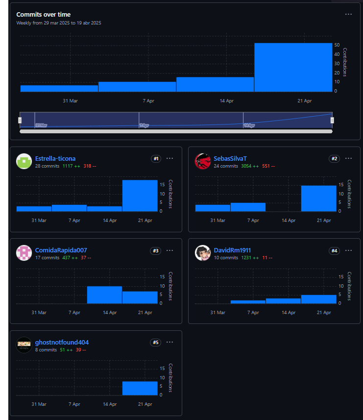
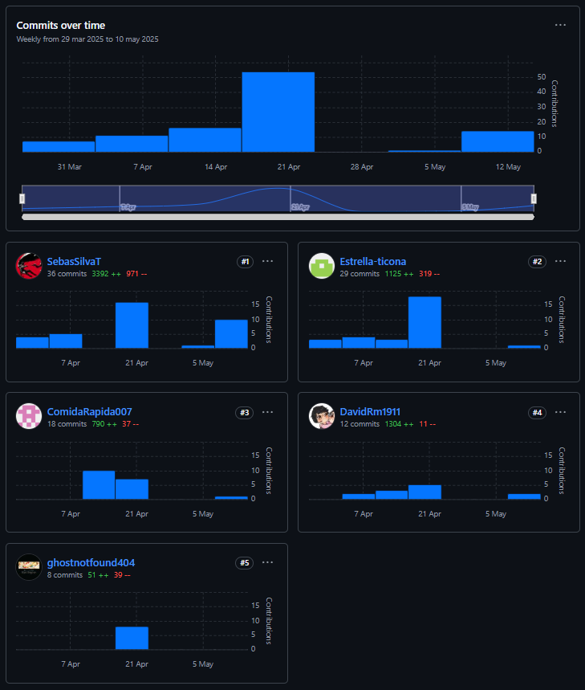
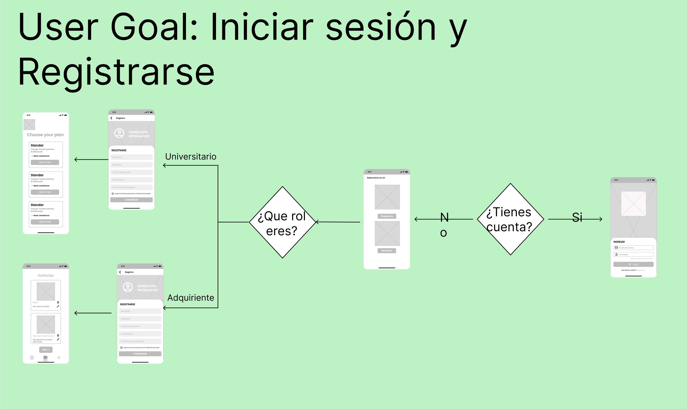

<h1 style="text-align: center;"> Informe del Trabajo Final </h1>
<h3 style="text-align: center;"> Universidad Peruana de Ciencias Aplicadas </h3>


<h5 style="text-align: center"> Área: Ingeniería de Software </h5>

<h5 style="text-align: center"> Curso: Diseño de Experimentos de Ingeniería de Software </h5>
<h5 style="text-align: center"> NRC: 4442 </h5>

<h5 style="text-align: center"> Docente: Lennin Percy Cenas Vasquez </h5>

<h5 style="text-align: center"> Startup: Aceitunas </h5>

<h5 style="text-align: center"> Producto: EcoMovil </h5>

## Team members:

|                Nombre                 |   Código   |
| :-----------------------------------: | :--------: |
| Acuña Tomas, Diego Rolin          |  U202221436 |
| Bastidas Bastidas, Diego Martin       | U20221A301 |
|  Gallo Quintana, David Ivanoff    |  U20201E475 |
|   Silva Tirado, Sebastian Valentino   | U20211G296 |
|  Ticona Panduro, Estrella del Pilar   | U202210659 |


<h5 style="text-align: center"> Ciclo 2025-01 </h5>

# Registro de Versiones del Informe

Esta sección tiene como propósito presentar un resumen de los cambios importantes efectuados al informe a lo largo del desarrollo del proyecto. Comienza en una página independiente e incorpora una tabla con la siguiente estructura:

<table style="border-collapse:collapse;border-spacing:0" class="tg"><thead><tr><th style="border-color:inherit;border-style:solid;border-width:1px;font-family:Arial, sans-serif;font-size:14px;font-weight:normal;overflow:hidden;padding:10px 5px;text-align:left;vertical-align:top;word-break:normal">Versión</th><th style="border-color:inherit;border-style:solid;border-width:1px;font-family:Arial, sans-serif;font-size:14px;font-weight:normal;overflow:hidden;padding:10px 5px;text-align:left;vertical-align:top;word-break:normal">Fecha</th><th style="border-color:inherit;border-style:solid;border-width:1px;font-family:Arial, sans-serif;font-size:14px;font-weight:normal;overflow:hidden;padding:10px 5px;text-align:left;vertical-align:top;word-break:normal">Autor</th><th style="border-color:inherit;border-style:solid;border-width:1px;font-family:Arial, sans-serif;font-size:14px;font-weight:normal;overflow:hidden;padding:10px 5px;text-align:left;vertical-align:top;word-break:normal">Descripción de modificación</th></tr></thead>
<tbody>
<tr><td style="border-color:inherit;border-style:solid;border-width:1px;font-family:Arial, sans-serif;font-size:14px;overflow:hidden;padding:10px 5px;text-align:left;vertical-align:top;word-break:normal">TB1</td><td style="border-color:inherit;border-style:solid;border-width:1px;font-family:Arial, sans-serif;font-size:14px;overflow:hidden;padding:10px 5px;text-align:left;vertical-align:top;word-break:normal">22/04/2025</td><td style="border-color:inherit;border-style:solid;border-width:1px;font-family:Arial, sans-serif;font-size:14px;overflow:hidden;padding:10px 5px;text-align:left;vertical-align:top;word-break:normal">Silva Tirado, Sebastian Valentino</td>
<td style="border-color:inherit;border-style:solid;border-width:1px;font-family:Arial, sans-serif;font-size:14px;overflow:hidden;padding:10px 5px;text-align:left;vertical-align:top;word-break:normal">Capítulo I: Introducción. <br>Capítulo II: Requirements Elicitation &amp; Analysis. <br>Capítulo III: Requirements Specification. <br>Capítulo IV: Product Design. <br>Capítulo V: Product Implementation, Validation &amp; Deployment.</td></tr>
</tbody></table>

<table style="border-collapse:collapse;border-spacing:0" class="tg"><thead><tr><th style="border-color:black;border-style:solid;border-width:1px;font-family:Arial, sans-serif;font-size:14px;font-weight:normal;overflow:hidden;padding:10px 5px;text-align:left;vertical-align:top;word-break:normal">Versión</th><th style="border-color:black;border-style:solid;border-width:1px;font-family:Arial, sans-serif;font-size:14px;font-weight:normal;overflow:hidden;padding:10px 5px;text-align:left;vertical-align:top;word-break:normal">Fecha</th><th style="border-color:black;border-style:solid;border-width:1px;font-family:Arial, sans-serif;font-size:14px;font-weight:normal;overflow:hidden;padding:10px 5px;text-align:left;vertical-align:top;word-break:normal">Autor</th><th style="border-color:black;border-style:solid;border-width:1px;font-family:Arial, sans-serif;font-size:14px;font-weight:normal;overflow:hidden;padding:10px 5px;text-align:left;vertical-align:top;word-break:normal">Descripción de modificación</th></tr></thead>
<tbody><tr><td style="border-color:black;border-style:solid;border-width:1px;font-family:Arial, sans-serif;font-size:14px;overflow:hidden;padding:10px 5px;text-align:left;vertical-align:top;word-break:normal">TP1</td><td style="border-color:black;border-style:solid;border-width:1px;font-family:Arial, sans-serif;font-size:14px;overflow:hidden;padding:10px 5px;text-align:left;vertical-align:top;word-break:normal">13/05/2025</td><td style="border-color:black;border-style:solid;border-width:1px;font-family:Arial, sans-serif;font-size:14px;overflow:hidden;padding:10px 5px;text-align:left;vertical-align:top;word-break:normal">Silva Tirado, Sebastian Valentino</td><td style="border-color:black;border-style:solid;border-width:1px;font-family:Arial, sans-serif;font-size:14px;overflow:hidden;padding:10px 5px;text-align:left;vertical-align:top;word-break:normal">Capítulo VI: Product Verification &amp; Validation. <br>Capítulo VII: DevOps Practices.</td></tr></tbody></table>

<style type="text/css">
.tg  {border-collapse:collapse;border-spacing:0;}
.tg td{border-color:black;border-style:solid;border-width:1px;font-family:Arial, sans-serif;font-size:14px;
  overflow:hidden;padding:10px 5px;word-break:normal;}
.tg th{border-color:black;border-style:solid;border-width:1px;font-family:Arial, sans-serif;font-size:14px;
  font-weight:normal;overflow:hidden;padding:10px 5px;word-break:normal;}
.tg .tg-0lax{text-align:left;vertical-align:top}
</style>
<table class="tg"><thead>
  <tr>
    <th class="tg-0lax"><span style="font-weight:normal">Versión</span></th>
    <th class="tg-0lax"><span style="font-weight:normal">Fecha</span></th>
    <th class="tg-0lax"><span style="font-weight:normal">Autor</span></th>
    <th class="tg-0lax"><span style="font-weight:normal">Descripción de modificación</span></th>
  </tr></thead>
<tbody>
  <tr>
    <td class="tg-0lax">TB2</td>
    <td class="tg-0lax">19/06/2025</td>
    <td class="tg-0lax">Silva Tirado, Sebastian Valentino</td>
    <td class="tg-0lax">Capítulo VI: Product Verification &amp; Validation. <br>Capítulo VII: DevOps Practices.<br>Capítulo VII: Experiment-Driven Development</td>
  </tr>
</tbody>
</table>

## Project Report Collaboration Insights

URL del repositorio para el reporte del proyecto: https://github.com/UPC-PRE-1ASI0732-2501-4442-G1-Aceituna

**TB1**

  

**TP1**

  

**TB2**

  

**TB1**

Con el fin de elaborar el informe correspondiente a la entrega TB1, se asignó la implementación de las distintas secciones a cada miembro del equipo de la siguiente manera:

<table style="border-collapse:collapse;border-spacing:0" class="tg"><thead><tr><th style="border-color:black;border-style:solid;border-width:1px;font-family:Arial, sans-serif;font-size:14px;font-weight:normal;overflow:hidden;padding:10px 5px;text-align:left;vertical-align:top;word-break:normal"><span style="font-weight:normal">Integrante</span></th><th style="border-color:black;border-style:solid;border-width:1px;font-family:Arial, sans-serif;font-size:14px;font-weight:normal;overflow:hidden;padding:10px 5px;text-align:left;vertical-align:top;word-break:normal"><span style="font-weight:normal">Tareas Asignadas</span></th></tr></thead>
<tbody><tr><td style="border-color:black;border-style:solid;border-width:1px;font-family:Arial, sans-serif;font-size:14px;overflow:hidden;padding:10px 5px;text-align:left;vertical-align:top;word-break:normal">Acuña Tomas, Diego Rolin</td><td style="border-color:black;border-style:solid;border-width:1px;font-family:Arial, sans-serif;font-size:14px;overflow:hidden;padding:10px 5px;text-align:left;vertical-align:top;word-break:normal">1.1.1. Descripción del startup<br>1.2.1. Antecedentes y Problemática   <br>1.2.2.1.   Lean UX Problem Statements<br>2.1.1.   Análisis competitivo<br>2.2.1.   Diseño de entrevistas<br>2.3.3. User   Journey Mapping<br>3.1. To-Be   Scenario Mapping<br>4.1.1.   General Style Guidelines<br>4.2.2.   Labeling Systems<br>5.1.1.   Software Development Environment Configuration<br>5.2.7. Team   Collaboration Insights   </td></tr>
<tr><td style="border-color:black;border-style:solid;border-width:1px;font-family:Arial, sans-serif;font-size:14px;overflow:hidden;padding:10px 5px;text-align:left;vertical-align:top;word-break:normal">Bastidas Bastidas, Diego Martin</td><td style="border-color:black;border-style:solid;border-width:1px;font-family:Arial, sans-serif;font-size:14px;overflow:hidden;padding:10px 5px;text-align:left;vertical-align:top;word-break:normal">1.1.1. Descripción del startup<br>1.2.1. Antecedentes y Problemática<br>1.2.2.1.   Lean UX Problem Statements<br>2.1.1.   Análisis competitivo<br>2.2.1.   Diseño de entrevistas<br>2.3.3. User   Journey Mapping<br>3.1. To-Be   Scenario Mapping<br>4.1.1.   General Style Guidelines<br>4.2.2.   Labeling Systems<br>5.1.1.   Software Development Environment Configuration<br>5.2.7. Team   Collaboration Insights   </td></tr>
<tr><td style="border-color:black;border-style:solid;border-width:1px;font-family:Arial, sans-serif;font-size:14px;overflow:hidden;padding:10px 5px;text-align:left;vertical-align:top;word-break:normal">Gallo Quintana, David Ivanoff</td><td style="border-color:black;border-style:solid;border-width:1px;font-family:Arial, sans-serif;font-size:14px;overflow:hidden;padding:10px 5px;text-align:left;vertical-align:top;word-break:normal">1.2. Startup   Profile<br>1.2.2.3.   Lean UX Hypothesis Statements<br>2.2.3. Análisis de entrevistas <br>2.3.1. User Personas<br>3.3. Product Backlog<br>4.2.1.   Organization Systems<br>4.3.1.   Landing Page Wireframe<br>4.6.1. Web   Applications Wireframes<br>4.8.1.   Software Architecture Context Diagram<br>5.1.3.   Source Code Style Guide &amp; Conventions   </td></tr>
<tr><td style="border-color:black;border-style:solid;border-width:1px;font-family:Arial, sans-serif;font-size:14px;overflow:hidden;padding:10px 5px;text-align:left;vertical-align:top;word-break:normal">Silva Tirado, Sebastian Valentino</td><td style="border-color:black;border-style:solid;border-width:1px;font-family:Arial, sans-serif;font-size:14px;overflow:hidden;padding:10px 5px;text-align:left;vertical-align:top;word-break:normal">1.2.2.4.   Lean UX Canvas<br>2.3.2. User   Task Matrix<br>2.3.5. As-is   Scenario Mapping<br>2.4.   Ubiquitous Language<br>3.4. Impact   Mapping<br>4.2.4.   Searching Systems<br>4.3.2.   Landing Page Mock-up<br>4.6.2. Web   Applications Wireflow Diagrams<br>4.8.2.   Software Architecture Container Diagrams<br>5.1.4. Software Deployment Configuration   </td></tr>
<tr><td style="border-color:black;border-style:solid;border-width:1px;font-family:Arial, sans-serif;font-size:14px;overflow:hidden;padding:10px 5px;text-align:left;vertical-align:top;word-break:normal">Ticona Panduro, Estrella del Pilar</td><td style="border-color:black;border-style:solid;border-width:1px;font-family:Arial, sans-serif;font-size:14px;overflow:hidden;padding:10px 5px;text-align:left;vertical-align:top;word-break:normal">1.3. Segmentos objetivo<br>2.3. Needfinding<br>3.1. To-Be Scenario Mapping<br>4.2.5. Navigation Systems<br>4.4. Web Applications UX/UI   Design<br>4.4.3. Web Applications   Mock-ups<br>4.4.4. Web Applications User   Flow Diagrams<br>4.8.3. Software Architecture   Components Diagrams<br>4.9.1. Class Diagrams<br>4.9.2. Class Dictionary   </td></tr></tbody></table>

**TP1**

Para la preparación del informe correspondiente a la entrega TP1, se distribuyó la implementación de las distintas secciones entre los miembros del equipo de la siguiente forma:

<table style="border-collapse:collapse;border-spacing:0" class="tg"><thead><tr><th style="border-color:inherit;border-style:solid;border-width:1px;font-family:Arial, sans-serif;font-size:14px;font-weight:normal;overflow:hidden;padding:10px 5px;text-align:left;vertical-align:top;word-break:normal">Integrante</th><th style="border-color:inherit;border-style:solid;border-width:1px;font-family:Arial, sans-serif;font-size:14px;font-weight:normal;overflow:hidden;padding:10px 5px;text-align:left;vertical-align:top;word-break:normal">Tareas Asignadas</th></tr></thead>
<tbody><tr><td style="border-color:inherit;border-style:solid;border-width:1px;font-family:Arial, sans-serif;font-size:14px;overflow:hidden;padding:10px 5px;text-align:left;vertical-align:top;word-break:normal">Acuña Tomas, Diego Rolin</td><td style="border-color:inherit;border-style:solid;border-width:1px;font-family:Arial, sans-serif;font-size:14px;overflow:hidden;padding:10px 5px;text-align:left;vertical-align:top;word-break:normal">6.1.1. Core Entities Unit Tests.<br>6.1.2. Core Integration Tests.<br>6.1.4. Core System Tests.</td></tr>
<tr><td style="border-color:inherit;border-style:solid;border-width:1px;font-family:Arial, sans-serif;font-size:14px;overflow:hidden;padding:10px 5px;text-align:left;vertical-align:top;word-break:normal">Bastidas Bastidas, Diego Martin</td><td style="border-color:inherit;border-style:solid;border-width:1px;font-family:Arial, sans-serif;font-size:14px;overflow:hidden;padding:10px 5px;text-align:left;vertical-align:top;word-break:normal">7.3.2. Production Deployment Pipeline Components</td></tr>
<tr><td style="border-color:inherit;border-style:solid;border-width:1px;font-family:Arial, sans-serif;font-size:14px;overflow:hidden;padding:10px 5px;text-align:left;vertical-align:top;word-break:normal">Gallo Quintana, David Ivanoff</td><td style="border-color:inherit;border-style:solid;border-width:1px;font-family:Arial, sans-serif;font-size:14px;overflow:hidden;padding:10px 5px;text-align:left;vertical-align:top;word-break:normal">6.1.3. Core Behavior-Driven Development<br>7.3.1. Tools and Practices.</td></tr>
<tr><td style="border-color:inherit;border-style:solid;border-width:1px;font-family:Arial, sans-serif;font-size:14px;overflow:hidden;padding:10px 5px;text-align:left;vertical-align:top;word-break:normal">Silva Tirado, Sebastian Valentino</td><td style="border-color:inherit;border-style:solid;border-width:1px;font-family:Arial, sans-serif;font-size:14px;overflow:hidden;padding:10px 5px;text-align:left;vertical-align:top;word-break:normal">7.1.1. Tools and Practices.<br>7.1.2. Build &amp; Test Suite Pipeline Components.</td></tr>
<tr><td style="border-color:inherit;border-style:solid;border-width:1px;font-family:Arial, sans-serif;font-size:14px;overflow:hidden;padding:10px 5px;text-align:left;vertical-align:top;word-break:normal">Ticona Panduro, Estrella del Pilar</td><td style="border-color:inherit;border-style:solid;border-width:1px;font-family:Arial, sans-serif;font-size:14px;overflow:hidden;padding:10px 5px;text-align:left;vertical-align:top;word-break:normal">7.2.1. Tools and Practices.<br>7.2.2. Stages Deployment Pipeline Components.</td></tr></tbody></table>

**TB2**

Para la preparación del informe correspondiente a la entrega TB2, se distribuyó la implementación de las distintas secciones entre los miembros del equipo de la siguiente forma:

<style type="text/css">
.tg  {border-collapse:collapse;border-spacing:0;}
.tg td{border-color:black;border-style:solid;border-width:1px;font-family:Arial, sans-serif;font-size:14px;
  overflow:hidden;padding:10px 5px;word-break:normal;}
.tg th{border-color:black;border-style:solid;border-width:1px;font-family:Arial, sans-serif;font-size:14px;
  font-weight:normal;overflow:hidden;padding:10px 5px;word-break:normal;}
.tg .tg-0lax{text-align:left;vertical-align:top}
</style>
<table class="tg"><thead>
  <tr>
    <th class="tg-0lax"><span style="font-weight:normal">Integrante</span></th>
    <th class="tg-0lax"><span style="font-weight:normal">Tareas Asignadas</span></th>
  </tr></thead>
<tbody>
  <tr>
    <td class="tg-0lax">Acuña Tomas, Diego Rolin</td>
    <td class="tg-0lax">7.4.3. Alerting Pipeline Components<br>7.4.4. Notification Pipeline Components. <br>8.1.1. As-Is Summary.<br>8.1.2. Raw Material: Assumptions, Knowledge Gaps, Ideas, Claims.<br>9.1. Conclusiones TB2<br></td>
  </tr>
  <tr>
    <td class="tg-0lax">Bastidas Bastidas, Diego Martin</td>
    <td class="tg-0lax">8.2.6. Data Analytics: Goals, KPIs and Metrics Selection.<br>8.2.7. Web and Mobile Tracking Plan.<br>8.3.1. To-Be User Stories.<br>8.3.2. To-Be Product Backlog</td>
  </tr>
  <tr>
    <td class="tg-0lax">Gallo Quintana, David Ivanoff</td>
    <td class="tg-0lax">8.1.3. Experiment-Ready Questions.<br>8.1.4. Question Backlog.<br>8.1.5. Experiment Cards.<br>8.2.1. Hypotheses.<br></td>
  </tr>
  <tr>
    <td class="tg-0lax">Silva Tirado, Sebastian Valentino</td>
    <td class="tg-0lax">6.4.1. Auditoría realizada.<br>6.4.1.1. Información del grupo auditado.<br>6.4.1.2. Cronograma de auditoría realizada.<br>6.4.1.3. Contenido de auditoría realizada.<br></td>
  </tr>
  <tr>
    <td class="tg-0lax">Ticona Panduro, Estrella del Pilar</td>
    <td class="tg-0lax">8.2.2. Measures.<br>8.2.3. Conditions.<br>8.2.4. Scale Calculations and Decisions.<br>8.2.5. Methods Selection.<br></td>
  </tr>
</tbody></table>

## Contenido

1. [**Capítulo I: Introducción.**](#1.) <br>
   1.1. [Startup Profile.](#1.1.) <br>
   1.1.1. [Descripción del startup.](#1.1.1.)<br>
   1.1.2.[Perfiles de los integrantes del equipo.](#1.1.2.)<br>
   1.2. [Solution Profile.](#1.2.)<br>
   1.2.1. [Antecedentes y Problemática.](#1.2.1.)<br>
   1.2.2. [Lean UX Process.](#1.2.2.)<br>
   1.2.2.1. [Lean UX Problem Statements.](#1.2.2.1.)<br>
   1.2.2.2. [Lean UX Assumptions.](#1.2.2.2.)<br>
   1.2.2.3. [Lean UX Hypothesis Statements.](#1.2.2.3.)<br>
   1.2.2.4. [Lean UX Canvas.](#1.2.2.4.)<br>
   1.3. [Segmentos objetivo.](#1.3.)<br>
2. [**Capítulo II: Requirements Elicitation & Analysis.**](#2.)<br>
   2.1. [Competidores.](#2.1.)<br>
   2.1.1. [Análisis competitivo.](#2.1.1.)<br>
   2.1.2. [Estrategias y tácticas frente a competidores.](#2.1.2.)<br>
   2.2. [Entrevistas.](#2.2.)<br>
   2.2.1. [Diseño de entrevistas.](#2.2.1.)<br>
   2.2.2. [Registro de entrevistas.](#2.2.2.)<br>
   2.2.3. [Análisis de entrevistas.](#2.2.3.)<br>
   2.3. [Needfinding.](#2.3.)<br>
   2.3.1. [User Personas.](#2.3.1.)<br>
   2.3.2. [User Task Matrix.](#2.3.2.)<br>
   2.3.3. [User Journey Mapping.](#2.3.3.)<br>
   2.3.4. [Empathy Mapping.](#2.3.4.)<br>
   2.3.5. [As-is Scenario Mapping.](#2.3.5.)<br>
   2.4. [Ubiquitous Language](#2.4.)<br>
3. [**Capítulo III: Requirements Specification.**](#3.)<br>
   3.1. [To-Be Scenario Mapping.](#3.1.)<br>
   3.2. [User Stories.](#3.2.)<br>
   3.3. [Product Backlog.](#3.3.)<br>
   3.4. [Impact Mapping.](#3.4.)<br>
4. [**Capítulo IV: Product Design.**](#4.)<br>
   4.1. [Style Guidelines.](#4.1.)<br>
   4.1.1. [General Style Guidelines.](#4.1.1.)<br>
   4.1.2. [Web Style Guidelines.](#4.1.2.)<br>
   4.1.3. [Mobile Style Guidelines.](#4.1.3.)<br>
   4.1.3.1. [iOS Mobile Style Guidelines.](#4.1.3.1.)<br>
   4.1.3.2. [Android Mobile Style Guidelines](#4.1.3.2.)<br>
   4.2. [Information Architecture.](#4.2.)<br>
   4.2.1. [Organization Systems.](#4.2.1.)<br>
   4.2.2. [Labeling Systems.](#4.2.2.)<br>
   4.2.3. [SEO Tags and Meta Tags](#4.2.3.)<br>
   4.2.4. [Searching Systems.](#4.2.4.)<br>
   4.2.5. [Navigation Systems.](#4.2.5.)<br>
   4.3. [Landing Page UI Design.](#4.3.)<br>
   4.3.1. [Landing Page Wireframe.](#4.3.1.)<br>
   4.3.2. [Landing Page Mock-up.](#4.3.2.)<br>
   4.4. [Mobile Applications UX/UI Design.](#4.4.)<br>
   4.4.1. [Mobile Applications Wireframes.](#4.4.1.)<br>
   4.4.2. [Mobile Applications Wireflow Diagrams.](#4.4.2.)<br>
   4.4.3. [Mobile Applications Mock-ups.](#4.4.3.)<br>
   4.4.4. [Mobile Applications User Flow Diagrams.](#4.4.4.)<br>
   4.5. [Mobile Applications Prototyping.](#4.5.)<br>
   4.5.1. [Android Mobile Applications Prototyping.](#4.5.1.)<br>
   4.5.2. [iOS Mobile Applications Prototyping.](#4.5.2.)<br>
   4.6. [Web Applications UX/UI Design.](#4.6.)<br>
   4.6.1. [Web Applications Wireframes.](#4.6.1.)<br>
   4.6.2. [Web Applications Wireflow Diagrams.](#4.6.2.)<br>
   4.6.3. [Web Applications Mock-ups.](#4.6.3.)<br>
   4.6.4. [Web Applications User Flow Diagrams.](#4.6.4.)<br>
   4.7. [Web Applications Prototyping.](#4.7.)<br>
   4.8. [Domain-Driven Software Architecture.](#4.8.)<br>
   4.8.1. [Software Architecture Context Diagram.](#4.8.1.)<br>
   4.8.2. [Software Architecture Container Diagrams.](#4.8.2.)<br>
   4.8.3. [Software Architecture Components Diagrams.](#4.8.3.)<br>
   4.9. [Software Object-Oriented Design.](#4.9.)<br>
   4.9.1. [Class Diagrams.](#4.9.1.)<br>
   4.9.2. [Class Dictionary.](#4.9.2.)<br>
   4.10. [Database Design.](#4.10.)<br>
   4.10.1. [Relational/Non-Relational Database Diagram.](#4.10.1.)<br>
5. [**Capítulo V: Product Implementation, Validation & Deployment.**](#5.)<br>
   5.1. [Software Configuration Management.](#5.1.)<br>
   5.1.1. [Software Development Environment Configuration.](#5.1.1.)<br>
   5.1.2. [Source Code Management.](#5.1.2.)<br>
   5.1.3. [Source Code Style Guide & Conventions.](#5.1.3.)<br>
   5.1.4. [Software Deployment Configuration.](#5.1.4.)<br>
   5.2. [Product Implementation & Deployment.](#5.2.)<br>
   5.2.1. [Sprint Backlogs.](#5.2.1.)<br>
   5.2.2. [Implemented Landing Page Evidence](#5.2.2.)<br>
   5.2.3. [Implemented Frontend-Web Application Evidence](#5.2.3.)<br>
   5.2.4. [Acuerdo de Servicio - SaaS](#5.2.4.)<br>
   5.2.5. [Implemented Native-Mobile Application Evidence](#5.2.5.)<br>
   5.2.6. [Implemented RESTful API and/or Serverless Backend Evidence](#5.2.6.)<br>
   5.2.7. [RESTful API documentation](#5.2.7.)<br>
   5.2.8. [Team Collaboration Insights](#5.2.8.)<br>
   5.3. [Video About-the-Product.](#5.3.)<br>
6. [**Capítulo VI: Product Verification & Validation.**](#6.)<br>
   6.1. [Testing Suites & Validation.](#6.1.)<br>
   6.1.1. [Core Entities Unit Tests.](#6.1.1.)<br>
   6.1.2. [Core Integration Tests.](#6.1.2.)<br>
   6.1.3. [Core Behavior-Driven Development.](#6.1.3.)<br>
   6.1.4. [Core System Tests.](#6.1.4.)<br>
   6.2. [Static Testing & Verification.](#6.2.)<br>
   6.2.1. [Static Code Analysis.](#6.2.1.)<br>
   6.2.1.1. [Coding Standard & Code Conventions.](#6.2.1.1.)<br>
   6.2.1.2. [Code Quality & Code Security.](#6.2.1.2.)<br>
   6.2.2. [Reviews.](#6.2.2.)<br>
   6.3. [Validation Interviews.](#6.3.)<br>
   6.3.1. [Diseño de Entrevistas.](#6.3.1.)<br>
   6.3.2. [Registro de Entrevistas.](#6.3.2.)<br>
   6.3.3. [Evaluaciones según heurísticas.](#6.3.3.)<br>
   6.4. [Auditoría de Experiencias de Usuario.](#6.4.)<br>
   6.4.1. [Auditoría realizada.](#6.4.1.)<br>
   6.4.1.1. [Información del grupo auditado.](#6.4.1.1.)<br>
   6.4.1.2. [Cronograma de auditoría realizada.](#6.4.1.2.)<br>
   6.4.1.3. [Contenido de auditoría realizada.](#6.4.1.3.)<br>
   6.4.2. [Auditoría recibida.](#6.4.2.)<br>
   6.4.2.1. [Información del grupo auditor.](#6.4.2.1.)<br>
   6.4.2.2. [Cronograma de auditoría recibida.](#6.4.2.2.)<br>
   6.4.2.3. [Contenido de auditoría recibida.](#6.4.2.3.)<br>
   6.4.2.4. [Resumen de modificaciones para subsanar hallazgos.](#6.4.2.4.)<br>
7. [**Capítulo VII: DevOps Practices.**](#7.)<br>
   7.1. [Continuous Integration.](#7.1.)<br>
   7.1.1. [Tools and Practices.](#7.1.1.)<br>
   7.1.2. [Build & Test Suite Pipeline Components.](#7.1.2.)<br>
   7.2. [Continuous Delivery.](#7.2.)<br>
   7.2.1. [Tools and Practices.](#7.2.1.)<br>
   7.2.2. [Stages Deployment Pipeline Components.](#7.2.2.)<br>
   7.3. [Continuous Deployment.](#7.3.)<br>
   7.3.1. [Tools and Practices.](#7.3.1.)<br>
   7.3.2. [Production Deployment Pipeline Components.](#7.3.2.)<br>
   7.4. [Continuous Monitoring.](#7.4.)<br>
   7.4.1. [Tools and Practices.](#7.4.1.)<br>
   7.4.2. [Monitoring Pipeline Components.](#7.4.2.)<br>
   7.4.3. [Alerting Pipeline Components.](#7.4.3.)<br>
   7.4.4. [Notification Pipeline Components.](#7.4.4.)<br>
8. [**Capítulo VIII: Experimentation.**](#8.)<br>
    8.1. [Experiment Planning.](#8.1.)<br>
    8.1.1. [As-Is Summary.](#8.1.1.)<br>
    8.1.2. [Raw Material: Assumptions, Knowledge Gaps, Ideas, Claims.](#8.1.2.)<br>
    8.1.3. [Experiment-Ready Questions.](#8.1.3.)<br>
    8.1.4. [Question Backlog.](#8.1.4.)<br>
    8.1.5. [Experiment Cards.](#8.1.5.)<br>
    8.2. [Experiment Design.](#8.2.)<br>
    8.2.1. [Hypotheses.](#8.2.1.)<br>
    8.2.2. [Measures.](#8.2.2.)<br>
    8.2.3. [Conditions.](#8.2.3.)<br>
    8.2.4. [Scale Calculations and Decisions.](#8.2.4.)<br>
    8.2.5. [Methods Selection.](#8.2.5.)<br>
    8.2.6. [Data Analytics: Goals, KPIs and Metrics Selection.](#8.2.6.)<br>
    8.2.7. [Web and Mobile Tracking Plan.](#8.2.7.)<br>
    8.3. [Experimentation.](#8.3.)<br>
    8.3.1. [To-Be User Stories.](#8.3.1.)<br>
    8.3.2. [To-Be Product Backlog.](#8.3.2.)<br>
9. [**Conclusiones**](#9.)<br>
    9.1. [Conclusiones y recomendaciones.](#9.1.)<br>
    9.2. [Video About-the-Team.](#9.2.)<br>
10. [**Bibliografía**](#10.)<br>
11. [**Anexos**](#11.)<br>

## STUDENT OUTCOME
La capacidad de reconocer responsabilidades éticas y
profesionales en situaciones de ingeniería y hacer juicios informados, que deben
considerar el impacto de las soluciones de ingeniería en contextos globales, económicos,
ambientales y sociales.
<b>ABET – EAC - Student Outcome 4</b>

<style type="text/css">
.tg  {border-collapse:collapse;border-spacing:0;}
.tg td{border-color:black;border-style:solid;border-width:1px;font-family:Arial, sans-serif;font-size:14px;
  overflow:hidden;padding:10px 5px;word-break:normal;}
.tg th{border-color:black;border-style:solid;border-width:1px;font-family:Arial, sans-serif;font-size:14px;
  font-weight:normal;overflow:hidden;padding:10px 5px;word-break:normal;}
.tg .tg-0lax{text-align:left;vertical-align:top}
</style>
<table class="tg"><thead>
  <tr>
    <th class="tg-0lax"><span style="font-weight:normal">Criterio específico</span></th>
    <th class="tg-0lax"><span style="font-weight:normal">Acciones realizadas</span></th>
    <th class="tg-0lax"><span style="font-weight:normal">Conclusiones</span></th>
  </tr></thead>
<tbody>
  <tr>
    <td class="tg-0lax">4.c.1 Reconoce responsabilidad<br>ética y profesional en<br>situaciones de ingeniería de<br>software</td>
    <td class="tg-0lax">       Acuña Tomas, Diego Rolin<br>       TB1: Participó activamente asegurando que las decisiones técnicas cumplieran con estándares éticos y priorizando el respeto a los usuarios y la confidencialidad de sus datos.<br><br>       Bastidas Bastidas, Diego Martin<br>       TB1: Promovió prácticas responsables dentro del equipo, fomentando el uso adecuado de la información y el cumplimiento de principios éticos en el desarrollo del software.<br><br>       Gallo Quintana, David Ivanoff<br>       TB1: Demostró compromiso con los aspectos éticos del proyecto, reflexionando sobre las implicancias de nuestras soluciones y promoviendo una conducta profesional.<br><br>       Silva Tirado, Sebastian Valentino<br>       TB1: Se aseguró de que el código desarrollado siguiera buenas prácticas éticas, evitando malas prácticas como la reutilización de código sin referencia o manejo inadecuado de datos.<br><br>       Ticona Panduro, Estrella del Pilar<br>       TB1: Contribuyó con una visión ética al evaluar funcionalidades, asegurándose de que estas respetaran la privacidad, la inclusión y el bienestar de los usuarios finales.<br><br>       Acuña Tomas, Diego Rolin<br>       TP1: Participó en la implementación de pruebas unitarias, asegurándose de que cada módulo del sistema cumpla con los estándares éticos y no interfiera con la privacidad de los datos del usuario.<br><br>       Bastidas Bastidas, Diego Martin<br>       TP1: Fomentó la creación de pruebas unitarias claras y fáciles de mantener, promoviendo una cobertura de pruebas adecuada que respete la integridad del código.<br><br>       Gallo Quintana, David Ivanoff<br>       TP1: Demostró compromiso con las pruebas de calidad, asegurándose de que todas las funcionalidades del sistema fueran verificadas en cuanto a su rendimiento y ética, sin causar efectos secundarios indeseados.<br><br>       Silva Tirado, Sebastian Valentino<br>       TP1: Garantizó que todas las pruebas unitarias respetaran las mejores prácticas, asegurando la reutilización ética de código y evitando el uso de datos sensibles de forma indebida.<br><br>       Ticona Panduro, Estrella del Pilar<br>       TP1: Colaboró en la creación de pruebas unitarias que evaluaran el comportamiento de la aplicación respetando los derechos de los usuarios y fomentando la inclusividad.<br><br>       Acuña Tomas, Diego Rolin<br>       TB2: Participó activamente en la revisión del código asegurando su cumplimiento con estándares éticos y buenas prácticas, evitando el uso indebido de librerías externas sin licencia.<br><br>       Bastidas Bastidas, Diego Martin<br>       TB2: Se encargó de garantizar que la documentación técnica fuera clara y honesta, reflejando fielmente el trabajo realizado y respetando los derechos de autor.<br><br>       Gallo Quintana, David Ivanoff<br>       TB2: Supervisó la integración de módulos, asegurándose de que se mantuvieran principios éticos como la transparencia en el uso de los datos y la trazabilidad de errores.<br><br>       Silva Tirado, Sebastian Valentino<br>       TB2: Revisó y validó el uso correcto de datos sensibles durante pruebas de integración, velando por la privacidad y confidencialidad de los usuarios.<br><br>       Ticona Panduro, Estrella del Pilar<br>       TB2: Aseguró que las funcionalidades implementadas respetaran los principios de equidad e inclusión, proponiendo mejoras para evitar sesgos en el sistema.     </td>
    <td class="tg-0lax">       TB1:<br>En el primer entregable me encargué de recopilar los antecedentes y problemáticas enfocados a nuestro proyecto y así sustentarlo, entrevistas y lo que depende de ello y la unidad cinco.<br><br>       TP1:<br>En este entregable me encargué de diseñar y ejecutar pruebas unitarias, verificando que cada módulo de la aplicación funcionara correctamente de acuerdo a las especificaciones iniciales y sin comprometer la calidad ética del software.<br><br>       TB2:<br>En esta fase del proyecto colaboré en la validación e integración del sistema, asegurándome de que todas las decisiones técnicas respetaran las normativas éticas y que el software se mantuviera transparente, inclusivo y profesional.     </td>
  </tr>
  <tr>
    <td class="tg-0lax">4.c.2 Emite juicios informados<br>considerando el impacto de las<br>soluciones de ingeniería de<br>software en contextos globales,<br>económicos, ambientales y<br>sociales</td>
    <td class="tg-0lax">       Acuña Tomas, Diego Rolin<br>       TB1: Analizó cómo el uso de la aplicación impacta en distintos contextos sociales, especialmente en relación con la inclusión digital y la formalización de servicios informales.<br><br>       Bastidas Bastidas, Diego Martin<br>       TB1: Evaluó las implicancias del sistema propuesto en el ámbito económico y social, considerando su efecto en pequeñas empresas del rubro de belleza.<br><br>       Gallo Quintana, David Ivanoff<br>       TB1: Contribuyó a la toma de decisiones considerando el impacto de nuestras soluciones a largo plazo en la sociedad y el medio ambiente, incluyendo sostenibilidad tecnológica.<br><br>       Silva Tirado, Sebastian Valentino<br>       TB1: Reflexionó sobre cómo las funcionalidades influirían en usuarios de distintos contextos, procurando decisiones inclusivas y con impacto positivo en la comunidad.<br><br>       Ticona Panduro, Estrella del Pilar<br>       TB1: Consideró el impacto social y cultural de la plataforma, impulsando soluciones que aporten valor en entornos con alta informalidad laboral y desigualdad de acceso.<br><br>       Acuña Tomas, Diego Rolin<br>       TP1: Evaluó cómo las pruebas unitarias afectan el rendimiento de la aplicación, asegurándose de que no generaran lentitud o consumo excesivo de recursos.<br><br>       Bastidas Bastidas, Diego Martin<br>       TP1: Consideró los efectos de las pruebas unitarias en la seguridad del software, realizando pruebas para identificar vulnerabilidades potenciales.<br><br>       Gallo Quintana, David Ivanoff<br>       TP1: Analizó el impacto de las pruebas unitarias en la estabilidad del sistema, asegurándose de que las nuevas actualizaciones no rompieran funcionalidades existentes.<br><br>       Silva Tirado, Sebastian Valentino<br>       TP1: Reflexionó sobre las implicaciones de las pruebas unitarias en el contexto de escalabilidad, asegurándose de que el software pudiera manejar cargas mayores sin perder eficacia.<br><br>       Ticona Panduro, Estrella del Pilar<br>       TP1: Reflexionó sobre el impacto de las pruebas en la usabilidad del sistema, buscando que las pruebas no afectaran la experiencia de usuario ni la accesibilidad.<br><br>       Acuña Tomas, Diego Rolin<br>       TB2: Analizó el posible impacto económico del sistema al integrarlo en entornos de bajos recursos, proponiendo soluciones adaptativas.<br><br>       Bastidas Bastidas, Diego Martin<br>       TB2: Consideró el impacto social del sistema en áreas rurales y propuso funcionalidades que favorezcan su adopción en estos contextos.<br><br>       Gallo Quintana, David Ivanoff<br>       TB2: Evaluó la escalabilidad del sistema considerando escenarios de crecimiento poblacional y tecnológico a largo plazo.<br><br>       Silva Tirado, Sebastian Valentino<br>       TB2: Reflexionó sobre la sostenibilidad del sistema desde el punto de vista ambiental y propuso optimizaciones para reducir el consumo de recursos.<br><br>       Ticona Panduro, Estrella del Pilar<br>       TB2: Incorporó criterios de accesibilidad para asegurar que el sistema pudiera ser usado por personas con distintas capacidades, reduciendo barreras tecnológicas.     </td>
    <td class="tg-0lax">       TB1:<br>En el primer entregable me encargué de recopilar los antecedentes y problemáticas enfocados a nuestro proyecto y así sustentarlo, entrevistas y lo que depende de ello y la unidad cinco.<br><br>       TP1:<br>En este entregable me encargué de revisar y evaluar los impactos de las pruebas unitarias sobre la seguridad y el rendimiento, proporcionando un informe sobre su efectividad y posibles mejoras en el proceso de prueba.<br><br>       TB2:<br>En esta etapa me encargué de analizar el impacto social y ambiental de la solución propuesta, aportando con ideas para hacerla más sostenible, accesible e inclusiva en diversos contextos.     </td>
  </tr>
</tbody></table>

## Part I: As-Is Software Project

<div id='1.'><h2>Capítulo I: Introducción</h2></div>

<div id='1.1.'><h3>1.1 Startup Profile.</h3></div>
En esta sección, presentaremos una descripción de la startup y proporcionaremos detalles sobre los miembros del equipo, mostrando sus perfiles.

<div id='1.1.1.'><h4>1.1.1. Descripción del startup.</h4></div>

La contaminación del aire, causada por la emisión de gases contaminantes como el dióxido de carbono, también acelera el cambio climático. Estos problemas, derivados de conducir autos tradicionales, son cada vez más evidentes para la población, que busca alternativas sostenibles de movilidad urbana. EcoMovil nace como respuesta a esta necesidad, ofreciendo acceso a diversos medios de transporte ecológicos, como bicicletas, scooters, skateboards y motos eléctricas, poniendo en contacto a los usuarios con aquellos que disponen de estos vehículos.

Nos diferenciaremos de otras aplicaciones, ya que no solo ofreceremos una alternativa de transporte ecológico, sino que también brindaremos la oportunidad de generar ingresos a nuestros usuarios, que pueden ser desde estudiantes universitarios hasta jubilados, según sus condiciones y horarios, de acuerdo con su disponibilidad. Esto lo lograremos permitiéndoles publicar ofertas para alquilar o vender sus vehículos. Además, nuestra aplicación incluirá características que garantizarán una experiencia segura, eficiente y agradable para todos los usuarios.

**Misión**: Proveer acceso a un medio de transporte ecológico que promueva una movilidad urbana sostenible, facilitando la conexión de las personas con vehículos ecológicos a través de una aplicación digital eficiente, mientras genera oportunidades de ingresos.

**Visión**: Convertirnos en la aplicación líder en transporte urbano sostenible, brindando acceso a vehículos ecológicos y promoviendo hábitos de vida más saludables y responsables con el entorno.

**Logotipo del Servicio:**<br>


<div id='1.1.2.'><h4>1.1.2. Perfiles de los integrantes del equipo.</h4></div>

| Descripción de los Miembros del Equipo                                                                                                                                                                                                                                                                                                                                                                                                                                                                                                                                                                                                                    | Perfiles de los Miembros del Equipo                                        |   |
|-----------------------------------------------------------------------------------------------------------------------------------------------------------------------------------------------------------------------------------------------------------------------------------------------------------------------------------------------------------------------------------------------------------------------------------------------------------------------------------------------------------------------------------------------------------------------------------------------------------------------------------------------------------|----------------------------------------------------------------------------|---|
| Mi nombre es **Diego Bastidas**, soy estudiante del 7to ciclo de la carrera de Ingeniería de Software. Decidí estudiar esta carrera porque desde pequeño me llamaba la atención el funcionamiento de una computadora y los procesos que conlleva. Me gusta practicar deportes de contacto, salir a pasear y sobre todo me encanta ser Groomer canino y trabajar con mascotas.                                                                                                                                                                                                                                                                             |                                               |   |
| Mi nombre es **Diego Rolin Acuña Tomas** - u202221436, soy estudiante de la carrera de Ingeniería de Software en la UPC. Elegí esta carrera porque me apasionan las matemáticas y la programación. Mi objetivo es aplicar mis conocimientos para desarrollar aplicaciones enfocadas en el área de finanzas, ya que aspiro a trabajar en el sector bancario. En mi tiempo libre, disfruto ver películas con mi familia y caminar por lugares interesantes, como montañas o playas. Considero que mis principales fortalezas son la tenacidad y la curiosidad, cualidades que me ayudarán a superar con éxito el curso y alcanzar el mejor puntaje posible. |         |   |
| Mi nombre es **David Ivanoff Gallo Quintana** - u20201e475, tengo 21 años y actualmente curso Ingeniería de Software. Me considero una persona trabajadora, activa y que le gusta ser responsable con los trabajos asignados. Además, poseo conocimientos en algunos lenguajes de programación como Swift, C++ y Python. También estoy abierto a conocer nuevas tecnologías. Creo que estas cualidades me ayudarán a llevar a cabo el proyecto propuesto.                                                                                                                                                                                                 |                                                 |   |
| Mi nombre es **Sebastian Valentino Silva Tirado** - u20211g296, soy estudiante del séptimo ciclo de la carrera de Ingeniería de Software en UPC. Opté por estudiar esta carrera porque me gusta la idea de programar y crear algo que pueda llegar a funcionar y ser útil en el mundo. Por lo cual, la universidad me da la posibilidad de estudiar y ser un profesional exitoso. Deseo ser buen integrante para mi equipo y me comprometo en hacer el mejor trabajo posible, y poder superarme más que el ciclo anterior.                                                                                                                                |  |   |
| Mi nombre es **Estrella del pilar Ticona Panduro** - u202210659, actualmente estudio la carrera de Ingeniería de Software en UPC. Opté por estudiar esta carrera porque me interesa programar y crear diferentes aplicativos o programas y emplearlo en la salud. En mis tiempos libres me gusta ver series o películas. Mi compromiso es aportar ideas innovadoras a lo largo del curso, en especial en las tareas en equipo. Mis habilidades son tener una actitud positiva, entusiasta y responsable.                                                                                                                                                  |    |   |


<div id='1.2.'><h3>1.2 Solution Profile.</h3></div>

<div id='1.2.1.'><h4>1.2.1. Antecedentes y Problemática.</h4></div>


<h5>Antecedentes</h5>

Al inicio de este nuevo milenio, el mundo ha experimentado una transformación en sus métodos de transporte, impulsada por una mayor conciencia ambiental sobre la sostenibilidad y los avances tecnológicos. El reconocido Acuerdo de París (2015) y los movimientos y protestas climáticas, como Fridays for Future, reflejan el creciente interés por opciones de transporte más responsables con el medio ambiente.

Según el "Estudio de movilidad urbana con BIG DATA" (2019), en Lima Metropolitana y el Callao se registran aproximadamente 26.8 millones de desplazamientos diarios. El transporte público es el principal medio de traslado, utilizado por el 51% de la población. No obstante, existe un alto nivel de insatisfacción entre los ciudadanos, ya que seis de cada diez personas manifestaron su descontento con este servicio, principalmente por su ineficiencia, los frecuentes problemas de seguridad y su carácter muchas veces informal.

Frente a esta situación, resulta urgente facilitar el acceso a opciones de transporte más convenientes, sostenibles y accesibles. En este contexto, medios como las bicicletas, scooters, monopatines y motos eléctricas se presentan como alternativas viables, ya que no solo contribuyen a reducir el impacto ambiental, sino que también promueven un estilo de vida más saludable y activo entre los ciudadanos.

De acuerdo con el sistema de información de la educación superior del Ministerio de Educación (Minedu), la tasa de deserción en las universidades privadas disminuyó en 3.4 %, pasando del 22.3 % en el ciclo 2020-1 al 18.9 % en el ciclo 2020-2. Cabe destacar que, antes de la pandemia, estas instituciones presentaban una tasa de deserción cercana al 15 %. A raíz de la emergencia sanitaria, se adoptaron diversas medidas para apoyar a los estudiantes, como la entrega de becas, descuentos en pensiones y matrículas, fraccionamiento de pagos, ampliación de plazos para cancelar deudas y matrícula sin el pago de la primera cuota. Sin embargo, pese a estos esfuerzos, la deserción aumentó en comparación con los niveles prepandemia, lo que evidencia que muchos estudiantes requieren ingresos económicos adicionales para poder continuar sus estudios superiores.

Podemos concluir que, a medida que crece el interés por alternativas de transporte sostenibles, también surgen oportunidades para abordar la creciente demanda de ingresos flexibles entre los estudiantes universitarios. Ante el aumento del costo de vida y las presiones académicas, muchos jóvenes podrían estar interesados en obtener ingresos de manera flexible. En este sentido, la posibilidad de generar dinero a través de un negocio digital, mediante la venta o alquiler de productos y servicios, se presenta como una opción atractiva.

Nuestra plataforma web tiene como propósito transformar la movilidad en Lima, ofreciendo a los estudiantes universitarios la oportunidad de generar ingresos de manera flexible. Estableceremos un canal de comunicación entre los estudiantes y las personas interesadas en sus vehículos sostenibles, creando un ecosistema que combina sostenibilidad con espíritu emprendedor. Nuestro enfoque busca reducir la huella de carbono y aumentar los ingresos de los estudiantes mediante mecanismos de monetización justos. Cada trayecto facilitado a través de nuestra aplicación representa un avance hacia la armonía entre las necesidades económicas y la protección del medio ambiente.

<h5>Problemática (5Ws y 2Hs)</h5>

<h5>What (Qué)</h5>
<h6>¿Cuál es el problema?</h6>
Actualmente, no existe una plataforma web que fomente la movilidad ecológica y que, al mismo tiempo, permita el comercio y arrendamiento de vehículos sostenibles, ofreciendo a los estudiantes universitarios la posibilidad de generar ingresos con horarios flexibles. Los jóvenes que cursan estudios superiores suelen enfrentar dificultades para encontrar empleos que se adapten a su disponibilidad de tiempo, mientras que las ciudades continúan enfrentando desafíos relacionados con el transporte y la contaminación ambiental.

<h5>When (Cuándo)</h5>
<h6>¿Cuándo se presenta el problema?</h6>
La problemática se ha intensificado en los últimos diez años, impulsada por la expansión urbana y la creciente demanda de alternativas de transporte sostenibles. Paralelamente, la necesidad de acceder a fuentes de ingreso con horarios flexibles se ha vuelto cada vez más relevante, especialmente entre los jóvenes, debido al aumento del costo de vida y a las crecientes exigencias académicas.

<h5>Where (Dónde)</h5>
<h6>¿Dónde surge el problema?</h6>
El problema se manifiesta con mayor fuerza en Lima, una ciudad caracterizada por altos niveles de tráfico y contaminación. No obstante, la necesidad de contar con ingresos flexibles es una realidad que también afecta a estudiantes universitarios en diversas ciudades del país.

<h5>Who (Quién)</h5>
<h6>¿Quiénes están involucrados?</h6>
Los estudiantes universitarios que cuenten con medios de transporte ecológicos, como bicicletas, scooters o patinetas, y deseen obtener ingresos adicionales mediante su alquiler o venta, podrán conectarse a través de la aplicación con usuarios interesados. Estos adquirientes pueden ser cualquier persona en Lima que busque una opción de movilidad más económica, sostenible y flexible.

<h6>¿A quién le afecta el problema?</h6>
La problemática afecta principalmente a estudiantes universitarios que buscan generar ingresos adicionales mediante la venta o alquiler de sus medios de transporte ecológicos, sin descuidar sus responsabilidades académicas. Al mismo tiempo, los usuarios que accedan a nuestra aplicación serán personas que enfrentan a diario los desafíos de la congestión vehicular y la contaminación, y que están en busca de alternativas de movilidad más ecológicas, económicas y prácticas.

<h6>¿Quién lo utilizará?</h6>

- Universitarios: Que ofrecen sus medios de transporte personales mediante la plataforma con el fin de obtener ingresos extra.
- Adquirientes: Dirigido a empleados, visitantes y cualquier persona en Lima que busque alternativas de transporte funcionales, accesibles y respetuosas con el medio ambiente.

<h5>Why (Por qué)</h5>
<h6>¿Cuál es la causa del problema?</h6>
La ausencia de una solución viable que combine el acceso a un transporte sostenible con la posibilidad de generar ingresos flexibles limita tanto el progreso económico de los estudiantes universitarios como el desarrollo de una ciudad con menor contaminación y una movilidad urbana más eficiente.

<h5>¿Cuáles son las 2H?</h5>

<h5>How (Cómo)</h5>
<h6>¿En qué condiciones los usuarios usan nuestro producto?</h6>

Los usuarios pueden acceder a la aplicación desde cualquier dispositivo y lugar, siempre que cuenten con conexión a internet, ya sea mediante una computadora, tablet o smartphone. Su diseño intuitivo garantiza una experiencia de uso accesible y sencilla.

<h6>¿Cómo nos conocieron los usuarios?</h6>

Los usuarios podrán conocer la aplicación a través del boca a boca, publicaciones en redes sociales, campañas de publicidad digital, actividades en espacios universitarios o mediante medios especializados en movilidad y sostenibilidad.

<h6>¿Cómo prefieren los usuarios acceder a nuestro servicio?</h6>

Prefieren una plataforma digital, ya sea móvil o web, que sea intuitiva, fácil de usar y esté optimizada para distintos dispositivos. Es fundamental que la experiencia de usuario sea accesible y amigable, de modo que no genere barreras ni temor al momento de utilizarla por primera vez.

<h5>How much (Cuánto)</h5>
<h6>¿Cuánto impacta el problema?</h6>

Sus efectos se presentan de manera significativa en diversos ámbitos.

Contaminación ambiental: Lima es una de las ciudades más afectadas por la contaminación en América Latina. La gran proliferación de vehículos con motores de combustión interna es responsable de aproximadamente el 40% de las emisiones de CO2 en la capital. Esta situación contribuye al incremento de los problemas de salud pública, especialmente en relación con enfermedades respiratorias y cardiovasculares, afectando a miles de personas cada año.

Congestión vehicular: La capital de Perú enfrenta un tráfico constante, con niveles de congestión entre los más altos del mundo. Los habitantes de la ciudad pasan, en promedio, 3 horas al día atrapados en el tráfico, lo que reduce el tiempo disponible para la productividad y afecta negativamente la calidad de vida de los residentes.

Calidad de vida y situación económica de los universitarios: Los estudiantes universitarios en Lima enfrentan dificultades para acceder a empleos flexibles que les permitan balancear sus estudios con la necesidad de generar ingresos. La falta de opciones laborales adaptadas a sus horarios incrementa el estrés financiero en alrededor del 20% de la población juvenil. Sin una fuente de ingresos estable, muchos universitarios se ven obligados a abandonar sus estudios o aceptar trabajos mal remunerados y precarios.

Costo económico: La falta de alternativas de transporte sostenible y accesible obliga a los universitarios a depender del transporte público, que es ineficiente, o de vehículos privados, que resultan costosos. Aunque el transporte público en Lima es asequible, su cobertura y calidad son limitadas, lo que lleva a los estudiantes a destinar entre el 10% y el 15% de sus ingresos mensuales exclusivamente en transporte, lo cual representa una carga significativa para su economía.

<div id='1.2.2.'><h4>1.2.2. Lean UX Process.</h4></div>

<div id='1.2.2.1.'><h5>1.2.2.1. Lean UX Problem Statements.</h5></div>

<h5>Problem Statement</h5>

Nuestra meta es desarrollar una plataforma digital que facilite la conexión entre estudiantes universitarios que desean poner en circulación sus vehículos ecológicos en desuso y personas que buscan opciones de transporte más sostenibles y económicamente accesibles.

Hemos identificado que muchos estudiantes universitarios cuentan con medios de transporte ecológicos, como bicicletas, scooters o patinetas, que ya no utilizan. Al mismo tiempo, existe una creciente demanda por parte de otros ciudadanos que buscan alternativas de movilidad económicas y sostenibles.

Esta situación pone en evidencia una inquietud cada vez mayor relacionada con los gastos asociados al transporte, las consecuencias ambientales de las opciones actuales y el deseo de adoptar hábitos de vida más saludables. Ante ello, surge la siguiente interrogante:

¿Qué características debemos incorporar en la plataforma para que los universitarios puedan gestionar el intercambio de estos vehículos de manera práctica, promoviendo al mismo tiempo una movilidad accesible, ecológica y saludable?

<div id='1.2.2.2.'><h5>1.2.2.2. Lean UX Assumptions.</h5></div>

#### Business Assumptions

#### Necesidades de los Clientes

**Creemos que nuestros clientes buscan** una propuesta que integre transporte sostenible con oportunidades de ingreso flexibles. Por un lado, los estudiantes universitarios requieren formas de ganar dinero extra sin afectar sus horarios académicos; por otro, los usuarios del servicio buscan opciones de movilidad ecológicas y económicas.

#### Solución Propuesta

**Nuestra aplicación web está** pensada para vincular a estudiantes universitarios que tienen vehículos ligeros (como bicicletas, scooters o skateboards) con personas que desean alquilarlos o comprarlos. Esta iniciativa permitirá a los universitarios generar ingresos a partir de vehículos que no usan frecuentemente, mientras brinda a los usuarios finales opciones de movilidad más sostenibles y accesibles.

#### Valor Principal

- Para los estudiantes universitarios: Una app que les ofrece la posibilidad de alquilar o vender sus vehículos ligeros, obteniendo ingresos extra de forma flexible y compatible con su rutina académica.
- Para los usuarios: Una forma de acceder a medios de transporte ecológicos que mejoran la movilidad urbana, disminuyen la huella de carbono y contribuyen a un sistema de transporte más sostenible.

#### Beneficios Adicionales

- **Compromiso con el medio ambiente**: La app ayuda a disminuir la contaminación en las ciudades al fomentar el uso de medios de transporte sostenibles.  
- **Ingresos adaptables**: Los estudiantes pueden generar dinero extra de forma flexible, ajustándose a sus tiempos y necesidades individuales.  
- **Acceso rápido y sencillo**: Los usuarios podrán encontrar y utilizar opciones de transporte ecológico de manera fácil y eficiente.  
- **Diseño intuitivo y funcional**: La plataforma estará enfocada en la practicidad, optimizando el tiempo de los usuarios y haciendo más ágil el proceso de alquiler o venta de vehículos.

#### Adquisición de Clientes

La difusión de la aplicación se llevará a cabo mediante redes sociales, estrategias de marketing enfocadas en el entorno universitario y la participación en eventos vinculados a la sostenibilidad y la movilidad urbana.

#### Modelo de Ingresos

- **Planes de suscripción para universitarios**: Opciones mensuales que permiten a los estudiantes publicar y resaltar sus vehículos ligeros dentro de la plataforma.  
- **Ingresos por comisión**: La aplicación obtiene una parte de cada transacción realizada, ya sea por concepto de alquiler o venta.

#### Competencia

Competiremos con plataformas existentes de alquiler y venta de vehículos como City Bike Lima, Bee Perú y otras opciones de movilidad urbana. Nuestra propuesta se diferenciará por ofrecer una combinación única de enfoque sostenible, ingresos flexibles para estudiantes y una interfaz amigable pensada especialmente para el público universitario. La aplicación se destacará por su simplicidad y practicidad, optimizando el tiempo y la experiencia de los usuarios.

#### Riesgos Principales

- **Captación de usuarios**: El reto principal será atraer y mantener una comunidad activa de usuarios dispuestos a alquilar o vender sus vehículos.  
- **Experiencia del usuario**: Es fundamental garantizar que la app sea funcional, segura y fácil de usar, cumpliendo con las expectativas y necesidades de los usuarios.

#### Estrategias para Mitigar Riesgos
- **Fomento de una comunidad participativa**: Incentivar la interacción y retroalimentación constante de los usuarios para optimizar y evolucionar la plataforma.  
- **Seguridad y confianza garantizadas**: Establecer mecanismos de protección, incluyendo seguros temporales, que resguarden tanto a los estudiantes como a quienes alquilan o compran los vehículos.

#### User assumptions

#### ¿Quién es el usuario?

- **Estudiantes universitarios**: Se espera que estos usuarios tengan vehículos como bicicletas, scooters o patinetas que no utilizan con frecuencia y estén interesados en obtener ingresos extra alquilándolos o vendiéndolos a través de la app.  
- **Usuarios**: Este grupo abarca a residentes de Lima, incluyendo turistas, trabajadores y otros usuarios, que buscan alternativas de transporte ecológicas, económicas y accesibles, como bicicletas, scooters y motos eléctricas.

#### ¿Dónde encaja nuestro producto en sus trabajos o vidas?

- **Estudiantes universitarios**: La app les permite generar ingresos a partir de vehículos que no están usando, lo que les ayuda a cubrir gastos y aliviar la carga financiera, todo sin afectar su tiempo dedicado al estudio.  
- **Usuarios**: La aplicación les proporciona una opción de transporte más económica y ecológica, mejorando su movilidad diaria y contribuyendo a reducir su huella ambiental en la ciudad.

#### ¿Qué problema resuelve nuestro producto?

- **Para los universitarios**: Soluciona la necesidad de generar ingresos adicionales de manera flexible, sin interferir con sus estudios, al ofrecer una forma fácil de alquilar o vender los vehículos que no utilizan.  
- **Para los usuarios**: Brinda una alternativa de transporte más ecológica y asequible, respondiendo a la falta de opciones accesibles y ayudando a reducir la contaminación y la congestión en la ciudad.

#### ¿Cuándo y cómo es usado nuestro producto?

- **Universitarios**: Utilizan la aplicación cuando tienen un vehículo disponible para alquilar o vender. Pueden acceder en cualquier momento para gestionar sus anuncios y revisar las solicitudes de alquiler o compra.  
- **Usuarios**: Usan la aplicación para alquilar o comprar vehículos cuando requieren una opción de transporte, especialmente en momentos de alta demanda o cuando buscan alternativas más ecológicas y económicas.

#### ¿Qué características son importantes?

- **Valoraciones y reseñas**: Permite a los usuarios calificar la calidad de los vehículos y los servicios de alquiler o compra.  
- **Búsqueda avanzada con filtros**: Facilita la localización de vehículos según tipo, ubicación y otros criterios específicos.  
- **Historial de alquiler o venta de vehículos**: Guarda un registro de todas las transacciones, ayudando a los usuarios a gestionar sus vehículos de manera más eficiente.  
- **Foro de ayuda**: Ofrece soporte y resuelve dudas de los usuarios, mejorando la experiencia general.  
- **Mapa interactivo de puntos de recepción**: Permite a los usuarios ubicar fácilmente los vehículos disponibles en diferentes puntos de la ciudad.  
- **Gamificación**: Incorpora elementos como logros o insignias para fomentar la participación activa y el uso constante de la aplicación.

#### Feature Assumptions

- **Sistema de calificación con estrellas**: Implementar una función para que los usuarios puedan dejar reseñas y calificar su experiencia de alquiler o compra de vehículos mediante un sistema de estrellas.  
- **Búsqueda avanzada con filtros**: Desarrollar una opción de búsqueda avanzada que permita a los usuarios filtrar los vehículos según características como tipo de vehículo, precio y otros criterios.  
- **Panel de usuario para historial de transacciones**: Crear un área personalizada donde los adquirientes puedan ver un registro detallado de todas las transacciones, incluyendo alquileres y compras de vehículos.  
- **Foro de asistencia integrado**: Incorporar un foro de ayuda en la app que facilite la comunicación entre los usuarios y los universitarios, con opciones para contactar a través de WhatsApp.  
- **Mapa interactivo**: Añadir un mapa interactivo que permita a los usuarios localizar fácilmente los vehículos disponibles en su área.  
- **Validación del vehículo**: Implementar un proceso de verificación que asegure que los vehículos publicados en la aplicación cumplen con ciertos estándares de calidad y seguridad, garantizando así la confianza de los usuarios en los vehículos alquilados o comprados.
- **Gamificación**: Incorporar características de gamificación, como logros y badges, para motivar a los usuarios a realizar acciones específicas dentro de la aplicación.

#### Business Outcomes

- **Confirmación de funcionamiento adecuado**: Asegurar que los usuarios verifiquen que la aplicación funciona correctamente, sin interrupciones, proporcionando una experiencia de uso fluida y satisfactoria.  
- **Satisfacción del 70% de los usuarios**: Lograr que al menos el 70% de los usuarios estén contentos con el servicio durante el primer trimestre tras el lanzamiento, asegurando una alta tasa de retención y una fuerte recomendación del producto.  
- **Reducción de la contaminación en un 40%**: Conseguir una disminución del 40% en las emisiones de contaminación generadas por los usuarios de la aplicación, contribuyendo significativamente a la lucha contra el cambio climático mediante soluciones de transporte ecológico.

#### Users

Los usuarios principales de la aplicación son los estudiantes universitarios que tienen vehículos ligeros como bicicletas, scooters o patinetas y desean obtener ingresos extra alquilándolos o vendiéndolos. Además, se encuentran los usuarios que buscan opciones de transporte más económicas y ecológicas, quienes adquieren o alquilan estos vehículos a través de la plataforma, beneficiándose de la conveniencia y sostenibilidad que ofrece el servicio.

#### User Outcomes & Benefits

- **Para los Universitarios:**
  - **Generación de Ingresos Flexibles:** Ofrecen una forma de obtener ingresos adicionales alquilando o vendiendo vehículos que no están usando.
  - **Apoyo a la Sostenibilidad:** Contribuyen a una comunidad más ecológica y responsable mediante el uso compartido de vehículos.

- **Para los Adquirientes:**
  - **Reducción de la Huella de Carbono:** Eligen opciones de transporte ecológicas, reduciendo su impacto ambiental.
  - **Acceso Fácil al Transporte:** Mejoran su movilidad al tener acceso rápido a medios de transporte cuando más los necesitan.

<div id='1.2.2.3.'><h5>1.2.2.3. Lean UX Hypothesis Statements.</h5></div>

- **Hypothesis Statement 01:** <br>
  **Creemos que** al ofrecer una aplicación que permita a los universitarios rentar o vender sus vehículos, ayudaremos al medio ambiente al reducir la necesidad de vehículos personales y promover el uso compartido.<br>
  **Sabremos** que hemos tenido éxito.<br>
  **Cuando** los universitarios generen ingresos adicionales y recomienden la aplicación a más personas, aumentando así la adopción de la aplicación.<br>

- **Hypothesis Statement 02:** <br>
  **Creemos que** al ofrecer distintos medios de transporte más sostenibles, fomentaremos un estilo de vida más ecoamigable entre los universitarios.<br>
  **Sabremos** que hemos tenido éxito.<br>
  **Cuando** en distintos distritos de Lima se incrementen los esfuerzos por mejorar la infraestructura para vehículos sostenibles, como la creación de más carriles para bicicletas y monopatines.<br>

- **Hypothesis Statement 03:** <br>
  **Creemos que** al proporcionar una variedad más amplia de vehículos, atraeremos a más usuarios a nuestra aplicación.<br>
  **Sabremos** que hemos tenido éxito.<br>
  **Cuando** nuestra base de clientes crezca notablemente tras la adición de nuevos tipos de vehículos.<br>

- **Hypothesis Statement 04:** <br>
  **Creemos que** al garantizar la seguridad y el mantenimiento de los vehículos, incrementaremos la confianza y satisfacción de los usuarios.<br>
  **Sabremos** que hemos tenido éxito.<br>
  **Cuando** la tasa de retención de usuarios aumente y recibamos comentarios positivos sobre la seguridad y el mantenimiento.

- **Hypothesis Statement 05:** <br>
  **Creemos que** al mejorar la experiencia de usuario de la aplicación, facilitaremos el acceso y el uso de la aplicación para todos los universitarios.<br>
  **Sabremos** que hemos tenido éxito.<br>
  **Cuando** observemos un aumento en el tiempo de uso de la aplicación y en la satisfacción general del usuario, reflejado en encuestas y valoraciones.<br>

<div id='1.2.2.4.'><h5>1.2.2.4. Lean UX Canvas.</h5></div>

El Lean UX Canvas es un recurso utilizado en el diseño centrado en el usuario (UX) y en metodologías Lean, cuyo objetivo es fomentar un desarrollo de productos más ágil y efectivo. Esta herramienta proporciona una estructura clara que promueve la colaboración entre equipos de distintas disciplinas. A continuación, se muestra el Lean UX Canvas elaborado por el equipo a través de Canva.


*Enlace para acceder al Lean UX Canvas:* <a href="https://www.canva.com/design/DAGOEXan6rE/pJTlXgHJBmfhVfeAe3pFgA/edit?utm_content=DAGOEXan6rE&utm_campaign=designshare&utm_medium=link2&utm_source=sharebutton">Canva</a>

<div id='1.3.'><h3>1.3 Segmentos objetivo.</h3></div>
Según el Ministerio de Transportes y Comunicaciones, el sistema de transporte en Lima Metropolitana enfrenta serios problemas de informalidad, ineficiencia y una alta tasa de accidentes, lo que lo convierte en un medio inseguro y uno de los principales generadores de contaminación ambiental (MTC, 2013; Solís Fonseca, Salazar Bravo, Romero Carrión & Solís Salazar, 2013). Esta situación ha impulsado la búsqueda de alternativas de movilidad más ágiles, sostenibles y accesibles, como bicicletas, scooters y motos eléctricas.

En este contexto, nuestro público objetivo está conformado por jóvenes universitarios de Lima Metropolitana, de entre 18 y 28 años, pertenecientes a niveles socioeconómicos medios, que buscan soluciones de transporte seguras, ecológicas y eficientes. Motivados por una creciente conciencia ambiental y la necesidad de reducir su huella de carbono, estos jóvenes encuentran en nuestra aplicación una herramienta práctica que responde a sus necesidades de movilidad diaria.

Adicionalmente, frente al aumento en la tasa de deserción universitaria, que pasó de 19.3 % en 2019 a 23.2 % en 2021, muchos estudiantes requieren fuentes de ingresos complementarias para continuar sus estudios en instituciones privadas (USIL, s/f). Por ello, nuestra aplicación no solo ofrece una alternativa de transporte sostenible, sino que también abre una vía para generar ingresos de forma flexible mediante el alquiler y la venta de vehículos ecológicos, contribuyendo así a su bienestar económico sin interferir con su desempeño académico.

<div id='2.'><h2>Capítulo II: Requirements Elicitation & Analysis.</h2></div>

<div id='2.1.'><h3>2.1 Competidores.</h3></div>
<div id='2.1.1.'><h4>2.1.1. Análisis competitivo.</h4></div>


El análisis competitivo desempeña un papel fundamental en la formulación de estrategias empresariales, ya que permite identificar posibles riesgos y áreas de oportunidad. Este análisis es esencial para que nuestra empresa pueda desarrollar ventajas competitivas sostenibles y adaptarse con agilidad a los cambios del entorno comercial. A lo largo del desarrollo del proyecto, se ha integrado esta herramienta como un recurso estratégico para comprender mejor el panorama competitivo y evaluar a los principales competidores del mercado.


<table>
    <tr>
      <td colspan="6" align="center"><strong>Competitive Analysis Landscape</strong></td>
    </tr>
    <tr>
      <td align="center"><strong>¿Por qué llevar a cabo este análisis?</strong></td>
      <td colspan="5" align="center">Analizar a nuestros competidores en el mercado nos permite obtener una visión clara del entorno en el que se lanzará nuestra aplicación. Este proceso facilita la identificación de competidores tanto directos como indirectos. Al conocer su presencia y desempeño en el mercado, podremos diseñar estrategias más eficaces y alineadas con la realidad del sector.<br></td>
      </tr>
    <tr>
      <td colspan="2"></td>
      <td align="center">EcoMovil<br>
        </td>
      <td align="center">Tembici<br>
        </td>
      <td align="center">Airbnb<br> 
        </td>
      <td align="center">CityBikeLima 
        </td>
    </tr>
    <tr>
      <td align="center" rowspan="2"><strong>Perfil</strong></td>
      <td align="center"><strong>Overview</strong></td>
      <td align="center">Nuestra plataforma digital está diseñada para facilitar la conexión entre usuarios que buscan medios de transporte sostenibles y quienes los ofrecen, ya sea para alquiler o venta. La aplicación no solo brinda la oportunidad de generar ingresos de manera flexible, sino que también promueve la creación de una comunidad comprometida con el cuidado del medio ambiente en el Perú.</td>
      <td align="center">Es una compañía destacada en el ámbito de la movilidad urbana en América Latina, ampliamente reconocida por sus servicios de bicicletas compartidas. Desde su fundación en 2010 en Brasil, ha expandido sus operaciones a diversas ciudades de Brasil, Argentina y Chile, promoviendo constantemente estilos de vida más sostenibles y saludables.</td>
      <td align="center">Es una plataforma digital que facilita la conexión entre personas que buscan alojamiento y anfitriones que ofrecen una amplia variedad de espacios en todo el mundo. El servicio permite encontrar desde habitaciones privadas y departamentos, hasta viviendas completas y alojamientos únicos como castillos o casas en los árboles.</td>
      <td align="center">Es un servicio de bicicletas públicas en Lima, Perú, que ofrece bicicletas compartidas como una alternativa ecológica y funcional para movilizarse por la ciudad. Su enfoque principal está en las zonas con alta congestión vehicular, donde busca fomentar un estilo de vida más sostenible y consciente del entorno urbano. </td>
    </tr>
    <tr>
      <td align="center"><strong>Ventaja Competitiva<br>¿Qué valor ofrece a los clientes?</strong></td>
      <td align="center">• Facilita el desplazamiento sostenible en entornos urbanos al ofrecer a los estudiantes universitarios diversas opciones de transporte, incorporando herramientas clave como valoraciones y comentarios de usuarios, filtros de búsqueda avanzados, un historial de transacciones y un mapa interactivo para una experiencia más completa.<br>
       <br>• Motiva la participación de los usuarios mediante la integración de dinámicas de juego. </td>
      <td align="center">• Las estaciones de Tembici se encuentran estratégicamente distribuidas en lugares clave de las ciudades, como paradas de metro, centros comerciales y vecindarios residenciales. <br> 
        <br>• El servicio está accesible durante todo el día, los 7 días de la semana.</td>
      <td align="center">• Brinda una amplia variedad de opciones de alojamiento, que van desde apartamentos y casas hasta propuestas únicas como casas en árboles, castillos y casas flotantes.<br>
<br>• Ofrecen experiencias organizadas por personas locales, que van desde recorridos guiados y talleres de cocina hasta actividades al aire libre y de aventura.</td>
      <td align="center">• Brinda a sus usuarios múltiples planes de suscripción, permitiéndoles elegir entre opciones diarias, semanales o mensuales, según sus necesidades, hábitos de uso y presupuesto.<br>
<br>• Ofrece tarifas de alquiler más bajas en comparación con otros medios de transporte, lo que hace de las bicicletas compartidas una opción económica.</td>
    </tr>
    <tr>
      <td align="center" rowspan="2"><strong>Perfil del Marketing</td>
      <td align="center"><strong>Mercado Objetivo</strong></td>
      <td align="center"> Universitarios y adquirientes. </td>
      <td align="center">Habitantes urbanos, visitantes, personas interesadas en la movilidad ecológica, empresas, autoridades locales y comunidades residenciales.</td>
      <td align="center">Visitantes y turistas, ejecutivos, propietarios de propiedades y actividades, así como familias y grupos.</td>
      <td align="center">Habitantes de la ciudad, turistas, promotores de la movilidad ecológica, familias y empleados municipales.</td>
    </tr>
    <tr>
      <td align="center"><strong>Estrategias de Marketing</strong></td>
      <td align="center">Brindar un mes de prueba gratuita a los usuarios.</td>
      <td align="center">• Promociones y descuentos especiales.<br>
<br>• Estrategias publicitarias en plataformas sociales y canales digitales.</td>
      <td align="center">• Publicidad digital y en redes sociales.<br></td>
      <td align="center">• Colaboraciones con universidades y empresas.<br>
<br>• Actividades locales para fomentar el uso de bicicletas.<br></td>
    </tr>
    <tr>
      <td align="center" rowspan="3"><strong>Perfil del Producto</strong></td>
      <td align="center"><strong>Productos & Servicios</strong></td>
      <td align="center">Plataforma en línea que facilita la conexión entre personas interesadas en alquilar o adquirir bicicletas, scooters, patinetas, motos eléctricas y otros vehículos, y aquellos que los tienen disponibles.</td>
      <td align="center">Servicio de alquiler de bicicletas a través de una aplicación móvil, promoviendo una movilidad urbana sostenible y adaptable para los usuarios.</td>
      <td align="center">Aplicación web que ofrece una amplia variedad de opciones de alojamiento, desde habitaciones privadas hasta casas completas, en todo el mundo.</td>
      <td align="center">Brindar una solución de movilidad urbana sostenible y accesible mediante una aplicación móvil que facilita el alquiler y la gestión de bicicletas.</td>
    </tr>
    <tr>
      <td align="center"><strong>Precios & Costos</strong></td>
      <td align="center">• Incluye hasta 2 publicaciones mensuales para alquilar o vender vehículos, con soporte básico. El precio es de $1.99 al mes después del período de prueba.<br>
<br>•  Ofrece hasta 10 publicaciones mensuales, con la opción de destacar tus anuncios y soporte prioritario. El costo es de $5.99 al mes una vez finalizado el período de prueba.<br>
<br>• Ofrece publicaciones ilimitadas para alquilar o vender vehículos, junto con soporte 24/7. El precio es de $19.99 al mes después del período de prueba.                 </td>
      <td align="center">• Plan Diario: Costo aproximado de $0.50 a $1.00 por hora, con un límite máximo diario que oscila entre $5.00 y $10.00.<br>
<br>• Plan Mensual: Tiene un costo que varía entre $25.00 y $40.00.<br>
<br>• Plan Anual: Su precio oscila entre $150.00 y $300.00.<br></td>
      <td align="center"><br>• Alojamientos por Noche: Los costos varían entre $30 y $200 o más por noche, dependiendo de la ciudad, el tipo de alojamiento y la temporada.<br>
<br>• Estancias Largas: Muchos anfitriones brindan descuentos para estancias de una semana o más, lo que puede disminuir el costo por noche.<br>
<br>• Experiencias: Los costos de las experiencias (actividades o tours ofrecidos por locales) suelen variar entre $20 y $100 por persona, aunque pueden fluctuar considerablemente.<br></td>
      <td align="center">• Plan Diario: Alrededor de S/ 8.00 a S/ 15.00 por día.<br>
<br>• Plan Mensual: Aproximadamente de S/ 50.00 a S/ 100.00.<br>
<br>• Plan Anual: Varía entre S/ 300.00 y S/ 600.00, según la suscripción y los beneficios adicionales.<br></td>
    </tr>
    <tr>
      <td align="center"><strong>Canales de distribución (Web y/o Móvil)</strong></td>
      <td align="center">El servicio estará accesible de forma temporal a través de la aplicación.</td>
      <td align="center">Aplicación móvil, página web, estaciones físicas, colaboraciones con empresas y universidades, y plataformas de redes sociales.</td>
      <td align="center">Página web, la aplicación móvil, alianzas con agencias de viajes y plataformas externas, y redes sociales. </td>
      <td align="center">Aplicación móvil, página web, puntos físicos y redes sociales.</td>
    </tr>
    <tr>
      <td align="center" rowspan="4"><strong>Análisis SWOT</strong></td>
      <td align="center"><strong>Fortalezas</strong></td>
      <td align="center">Permite una comunicación adaptable entre el universitario y el comprador a través del foro de contacto.</td>
      <td align="center">• Red de bicicletas extensa y sólidamente establecida.<br>
<br>• Tecnología de vanguardia en la aplicación.<br></td>
      <td align="center">• Gran diversidad de alternativas de hospedaje.<br>
<br>• Plataforma internacional con presencia en varios países.<br></td>
      <td align="center">• Red de estaciones ampliamente distribuida.<br>
<br>• Sistema de bicicletas innovador y de alto rendimiento.<br></td>
    <tr>
      <td align="center"><strong>Debilidades</strong></td>
      <td align="center">Baja visibilidad y promoción.</td>
      <td align="center">Cobertura restringida en ciertas zonas, así como problemas de mantenimiento y disponibilidad de bicicletas.</td>
      <td align="center">Problemas de seguridad y confianza, inconsistencias en la calidad de las propiedades, falta de regulación y cumplimiento de normas, dificultades en la resolución de disputas y dependencia del anfitrión para garantizar una buena experiencia al huésped.</td>
      <td align="center">Infraestructura deficiente, mantenimiento inconsistente de las bicicletas, fallos en la tecnología de la app, poca visibilidad en medios y redes sociales, restricciones en la expansión y baja fidelización de usuarios.</td>
    </tr>
    <tr>
      <td align="center"><strong>Oportunidades</strong></td>
      <td align="center">
   Aprovechar las debilidades en las ofertas de la competencia y responder a la alta demanda de los estudiantes universitarios peruanos que cuentan con vehículos menores sin utilizar.</td>
      <td align="center">Ampliación a nuevas zonas, colaboración con universidades y empresas, fortalecimiento de la infraestructura, mejoras tecnológicas en la aplicación, campañas de sensibilización e integración con otros medios de transporte.</td>
      <td align="center">Extensión a nuevos destinos, promociones para grupos, optimización de la experiencia del huésped, alianzas con negocios locales, recursos para anfitriones y refuerzo de la seguridad con tecnología avanzada.</td>
      <td align="center">Extensión a más zonas dentro de la ciudad, convenios con universidades y compañías, mejora en la infraestructura de las estaciones, modernización tecnológica de la aplicación, iniciativas promocionales e incorporación con otros sistemas de transporte.</td>
    </tr>
    <tr>
      <td align="center"><strong>Amenazas</strong></td>
      <td align="center">Inflación y volatilidad económica. </td>
      <td align="center">Riesgos de seguridad, clima desfavorable y carencia de infraestructura adecuada.</td>
      <td align="center">Modificaciones en las normativas locales y presencia de plataformas de alojamiento competidoras.</td>
      <td align="center">Robo o vandalismo de bicicletas.</td>
     </tr>
  </table>
  </body>
  </html>


<div id='2.1.2.'><h4>2.1.2. Estrategias y tácticas frente a competidores.</h4></div>

A partir del análisis competitivo realizado, se han identificado las fortalezas, oportunidades, debilidades y amenazas de los competidores. Esta información es crucial para desarrollar estrategias y tácticas que permitan superar a la competencia cuando el servicio se introduzca en el mercado de forma rentable. A continuación, se detallan las estrategias y tácticas planificadas para alcanzar este objetivo.

**Afrontando las fortalezas de nuestros competidores:**

- Introducir nuevas características tecnológicas para diferenciarse en el mercado.  
- Proporcionar un servicio de soporte personalizado y proactivo disponible las 24 horas del día, los 7 días de la semana.

**Comprendemos que nuestras fortalezas son:**

- Creación de nuevas funcionalidades tecnológicas.  
- Distinción en mercados desatendidos.

Podemos implementar las siguientes estrategias y tácticas:

**Estrategias**

- Nos centraremos en los estudiantes universitarios, brindando opciones de alquiler o compra a largo plazo para quienes requieran vehículos pequeños para su transporte diario.

**Tácticas**

- Realizaremos eventos de lanzamiento en universidades o áreas estratégicas.

**Afrontando las oportunidades de nuestros competidores:**

- Incorporaremos rápidamente nuevas funcionalidades y mejoras.
- Proporcionaremos un foro de contacto de alta calidad.

**Comprendemos que nuestras debilidades son:**

- Carecemos de la misma presencia en el mercado que los competidores consolidados, lo que podría dificultar la atracción de usuarios.  
- Contamos con recursos limitados, lo que restringe nuestra capacidad para invertir en marketing y tecnología.

**Estrategias**

- Promoveremos EcoMovil como una opción ecológica y sostenible. Pondremos en marcha programas de reforestación o compensación de carbono por cada alquiler o compra, y destacaremos el uso de vehículos eléctricos y de bajo impacto ambiental.

**Tácticas**

- Identificaremos zonas de alto flujo estudiantil donde la competencia es reducida. Estableceremos operaciones en estos lugares antes que nuestros competidores, logrando captar una parte significativa del mercado local.

**Afrontando las oportunidades de nuestros competidores:**

- Destacaremos nuestro compromiso con la sostenibilidad.  
- Nos centraremos en zonas con baja competencia y alta demanda.

**Comprendemos que nuestras debilidades son:**

- Reconocimiento de marca reducido.  
- Presupuesto limitado.  
- Presencia inicial restringida.

**Estrategias**

- Proporcionaremos tarifas con un mes gratuito para los universitarios, lo que nos ayudará a crear una base de usuarios sólida y constante.

**Tácticas**

- Brindaremos un foro de contacto, especialmente durante las horas de mayor actividad, como las mañanas antes de clases. Esto nos diferenciará de los competidores que ofrecen soporte limitado.

**Afrontando las oportunidades de nuestros competidores:**

- Incorporaremos filtros que permitan destacar la reputación y confiabilidad del cliente.

**Comprendemos que nuestras debilidades son:**

- Visibilidad de marca aún limitada.  
- Recursos más restringidos para marketing y operaciones.  
- Cobertura geográfica en proceso de crecimiento.

<div id='2.2.'><h3>2.2 Entrevistas.</h3></div>
<div id='2.2.1.'><h4>2.2.1. Diseño de entrevistas.</h4></div>


Preguntas dirigidas a Universitarios.

----

- Preguntas principales:

1. ¿Podrías decirme tu nombre completo y edad?
2. ¿En qué distrito resides actualmente?
3. ¿Cuál es tu estado civil?
4. ¿Dónde naciste?
5. ¿Que dispositivos tecnológicos?
6. ¿Que navegadores utilizas?
7. ¿Qué tipo de vehículo(s) menor(es) posees?
8. ¿Qué habilidades consideras que tienes en relación con el manejo o mantenimiento de tu(s) vehículo(s)?
9. ¿Qué factores consideras al elegir un vehículo menor? (Ej. economía, estilo, funcionalidad)
10. ¿Qué influencias (familia, amigos, medios, etc.) han afectado tus decisiones al comprar un vehículo?
11. ¿Qué tipos de vehículos tienes disponibles para rentar o vender?
12. ¿Cómo determinar el precio de tus vehículos?
13. ¿Qué medidas de seguridad implementadas para asegurarte de que tus vehículos estén siempre en buen estado antes de rentarlos o venderlos?
14. ¿Cómo manejas la limpieza y desinfección de los vehículos?
15. ¿Cuáles son los requisitos o condiciones para rentar o vender uno de tus vehículos?

- Preguntas complementarias:

1. ¿Sigues algún protocolo específico para la limpieza y desinfección, y con qué frecuencia realizas estas tareas?
2. ¿Qué proceso sigues para verificar la identidad y credibilidad de los posibles adquirientes?
3. ¿Cómo organizas la entrega y recogida de los vehículos? ¿Tienes puntos de recogida específicos o cómo coordinas estos procesos?
4. ¿Cómo manejas las valoraciones y reseñas que dejan los adquirientes?
5. Durante el periodo de renta o venta, ¿qué tipo de soporte proporcionas a los adquirientes?
6. ¿Estás abierto a considerar descuentos o promociones especiales para atraer más adquirientes?
7. ¿Hay alguna mejora o característica que te gustaría ver en la aplicación que utilizas para gestionar tus vehículos?<br>
   <br>
   Preguntas dirigidas a Adquirientes.

----

- **Preguntas Principales:**

1. ¿Podrías decirme tu nombre completo y edad?
2. ¿En qué distrito resides actualmente?
3. ¿Dónde naciste y en qué lugar vives actualmente?
4. ¿Cuál es tu estado civil?
5. ¿Podrías describir tu nivel socioeconómico? ¿Te consideras en un nivel alto, intermedio o bajo?
6. ¿Podrías contarnos un poco acerca de ti y tu experiencia con el alquiler y la compra de vehículos?
7. ¿Qué te impulsó a buscar una aplicación para alquilar o comprar vehículos?
8. ¿Qué esperas lograr al utilizar una aplicación para alquilar o comprar vehículos?
9. ¿Qué dificultades o problemas has enfrentado en tus experiencias previas con el alquiler y la compra de vehículos?
10. ¿Qué características consideras esenciales en una aplicación para alquilar o comprar vehículos?
11. ¿Qué métodos de pago prefieres para realizar transacciones en línea?
12. ¿Cómo te gustaría recibir notificaciones sobre tus reservas y el estado de los vehículos?
13. ¿Cuál ha sido tu experiencia con la seguridad y protección en el alquiler y la compra de vehículos?
14. ¿Qué mejoras o características adicionales crees que podrían mejorar tu experiencia al usar una aplicación de renta o compra de vehículos?

- **Preguntas Complementarias:**

1. ¿Cómo has gestionado el alquiler o la compra de vehículos en el pasado?
2. ¿Qué tipo de soporte o asistencia esperas recibir durante el proceso de alquiler o compra?
3. ¿Tienes alguna preferencia particular en cuanto a la aplicación o tecnología que se utiliza para acceder a la aplicación?
4. ¿Cómo prefieres gestionar la búsqueda de vehículos en una aplicación?
5. ¿Qué tipo de información te gustaría ver en las descripciones de los vehículos?

---


<div id='2.2.2.'><h4>2.2.2. Registro de entrevistas.</h4></div>


## Segmento #1: Universitarios 

**Entrevista 1** 

*Entrevistado:* Ramiro Alexander Guzman <br>
*Sexo:* Masculino  <br>
*Edad:* 20 años <br>
*Domicilio:* Lima, Perú<br>

*Inicio de la Entrevista: 0:00 min* <br> 
*Duración de la Entrevista: 6:14 min* <br> 


*Enlace:* <a href="https://upcedupe-my.sharepoint.com/:v:/g/personal/u20221a301_upc_edu_pe/EWXl0ia61BBCs3JLo1Ms1QoBg0fytY1FiORDwWXH8zl7ew?nav=eyJyZWZlcnJhbEluZm8iOnsicmVmZXJyYWxBcHAiOiJPbmVEcml2ZUZvckJ1c2luZXNzIiwicmVmZXJyYWxBcHBQbGF0Zm9ybSI6IldlYiIsInJlZmVycmFsTW9kZSI6InZpZXciLCJyZWZlcnJhbFZpZXciOiJNeUZpbGVzTGlua0NvcHkifX0&e=W6ifNf">video</a>

*Resumen de la Entrevista*:
En esta entrevista, conocemos a Ramiro, un estudiante con conocimientos en tecnología y acceso a varios dispositivos. Es dueño de una bicicleta que cuida con responsabilidad y, para ganar dinero extra, ocasionalmente la alquila, siempre pactando en lugares públicos. Al conocer una aplicación que facilitaría este proceso, se mostró interesado, aunque recalcó que solo le gustaría alquilar a otros universitarios. También está abierto a una comunidad donde se dejen reseñas y se colabore entre usuarios. Para él, lo más importante es que la app permita identificar de manera confiable a las personas con quienes se hacen los acuerdos 

---

**Entrevista 2:** 

*Entrevistado:* Gian Franco Durand  <br>
*Sexo:* Masclino <br>
*Edad:*  23<br>
*Domicilio:*  San Juan de Miraflores <br>

*Inicio de la Entrevista: 6:14 min* <br> 
*Duración de la Entrevista: 12:38 min* <br>


*Enlace:* <a href="https://upcedupe-my.sharepoint.com/:v:/g/personal/u20221a301_upc_edu_pe/EWXl0ia61BBCs3JLo1Ms1QoBg0fytY1FiORDwWXH8zl7ew?nav=eyJyZWZlcnJhbEluZm8iOnsicmVmZXJyYWxBcHAiOiJPbmVEcml2ZUZvckJ1c2luZXNzIiwicmVmZXJyYWxBcHBQbGF0Zm9ybSI6IldlYiIsInJlZmVycmFsTW9kZSI6InZpZXciLCJyZWZlcnJhbFZpZXciOiJNeUZpbGVzTGlua0NvcHkifX0&e=W6ifNf">video</a>

*Resumen de la Entrevista*:
Franco Durán, residente de San Juan de Miraflores, es un usuario de bicicletas y skate con conocimientos básicos de mantenimiento. Utiliza principalmente dispositivos móviles y computadora con Google Chrome para navegar. Al elegir vehículos menores prioriza funcionalidad y precio, influenciado significativamente por recomendaciones personales. Posee bicicletas que podría alquilar o vender, determinando su precio según estado, materiales y tipo de uso.
En cuanto a su operación, Franco lleva las bicicletas a talleres para mantenimiento antes de ofrecerlas y realiza limpiezas básicas periódicas. Para seguridad, evalúa a los clientes por su nombre y foto de perfil, coordinando entregas en lugares públicos seguros. Aunque no brinda soporte técnico durante alquileres, valora los comentarios para mejorar su servicio. Sugiere que una aplicación ideal debería incluir filtros por zona y precio, así como mapas de demanda, lo que indica necesidades específicas de funcionalidad para plataformas como EcoMóvil.

---

**Entrevista 3** 

*Entrevistado:* Lucerito Guzmán <br>
*Sexo:* Femenino <br>
*Edad:* 23 años <br>
*Domicilio:* Magdalena, Lima, Perú<br>
*Inicio de la Entrevista: 12:38 min* <br>
*Duración de la Entrevista: 25:42 min* <br> 


*Enlace:* <a href="https://upcedupe-my.sharepoint.com/:v:/g/personal/u20221a301_upc_edu_pe/EWXl0ia61BBCs3JLo1Ms1QoBg0fytY1FiORDwWXH8zl7ew?nav=eyJyZWZlcnJhbEluZm8iOnsicmVmZXJyYWxBcHAiOiJPbmVEcml2ZUZvckJ1c2luZXNzIiwicmVmZXJyYWxBcHBQbGF0Zm9ybSI6IldlYiIsInJlZmVycmFsTW9kZSI6InZpZXciLCJyZWZlcnJhbFZpZXciOiJNeUZpbGVzTGlua0NvcHkifX0&e=W6ifNf">video</a>

*Resumen de la Entrevista*: Lucerito  Guzmán, reside en Magdalena. Actualmente ella tiene una bicliceta electrica que le usa para movilizarse hacia la universidad y su trabajo. Ella desea comprarse otra para lo cual el proyecto de ECOMovil le parece genial puesto que ya no tendria la necesidad de buscar a quien alquilar o vender. Sino que ya todo lo haria el aplicativo

## Segmento #2: Adquirientes

**Entrevista 1** 

*Entrevistada:* Miguel Angel Gómez Hurtado <br>
*Sexo:* Masculino <br>
*Edad:* 23 años<br>
*Domicilio:*  Lima, Perú<br>

*Inicio de la Entrevista: 25:42 min* <br>
*Duración de la Entrevista: 32:33 min* <br>


*Enlace:* <a href="https://upcedupe-my.sharepoint.com/:v:/g/personal/u20221a301_upc_edu_pe/EWXl0ia61BBCs3JLo1Ms1QoBg0fytY1FiORDwWXH8zl7ew?nav=eyJyZWZlcnJhbEluZm8iOnsicmVmZXJyYWxBcHAiOiJPbmVEcml2ZUZvckJ1c2luZXNzIiwicmVmZXJyYWxBcHBQbGF0Zm9ybSI6IldlYiIsInJlZmVycmFsTW9kZSI6InZpZXciLCJyZWZlcnJhbFZpZXciOiJNeUZpbGVzTGlua0NvcHkifX0&e=W6ifNf">video</a>

*Resumen de la Entrevista*:
En esta entrevista hablamos con Miguel, una persona con múltiples medios de comunicación, conocimientos en tecnología y experiencia en la venta y alquiler de vehículos. Actualmente busca un medio de transporte personal para recorrer distancias cortas de forma rápida. Se mostró interesado en una aplicación como la que proponemos y destacó la importancia de contar con una plataforma confiable, que permita concretar tratos en cualquier momento y garantice su seguridad. Está familiarizado con aplicaciones de pago como Yape, por lo que le gustaría poder usarlas dentro del sistema. También le interesa una función para ubicar comerciantes cercanos, un sistema de reseñas entre usuarios y una opción de seguro que le permita recuperar su dinero en caso de estafa, lo que aumentaría su confianza en la app.

---

**Entrevista 2** 

*Entrevistada:* Camila Pérez Novoa <br>
*Sexo:* Femenino <br>
*Edad:* 23 años<br>
*Domicilio:*  Barcelona, España<br>

*Inicio de la Entrevista: 32:33 min* <br>
*Duración de la Entrevista: 37:41 min* <br>


*Enlace:* <a href="https://upcedupe-my.sharepoint.com/:v:/g/personal/u20221a301_upc_edu_pe/EWXl0ia61BBCs3JLo1Ms1QoBg0fytY1FiORDwWXH8zl7ew?nav=eyJyZWZlcnJhbEluZm8iOnsicmVmZXJyYWxBcHAiOiJPbmVEcml2ZUZvckJ1c2luZXNzIiwicmVmZXJyYWxBcHBQbGF0Zm9ybSI6IldlYiIsInJlZmVycmFsTW9kZSI6InZpZXciLCJyZWZlcnJhbFZpZXciOiJNeUZpbGVzTGlua0NvcHkifX0&e=W6ifNf">video</a>

*Resumen de la Entrevista*:
Se entrevistó a Camila, una joven de 21 años de Cuba que actualmente reside en España. Camila está estudiando Medicina y trabaja durante sus vacaciones. Aprovechando su tiempo libre, ha decidido viajar a Perú con una amiga y ha considerado realizar paseos en bicicleta por Miraflores. Camila compartió las características que le gustaría ver en una aplicación para alquilar o comprar bicicletas, basándose en sus experiencias con sus padres. Mencionó que encontró interesante la propuesta y destacó que una de las características más importantes para ella sería un mapa interactivo.

---

**Entrevista 3** 

*Entrevistada:* Marcia Rea Gamboa <br>
*Sexo:* Femenino <br>
*Edad:* 20 años<br>
*Domicilio:*  San Martín, Lima, Perú<br>

*Inicio de la Entrevista: 37:41 min* <br>
*Duración de la Entrevista: 48.58 min* <br>


*Enlace:* <a href="https://upcedupe-my.sharepoint.com/:v:/g/personal/u20221a301_upc_edu_pe/EWXl0ia61BBCs3JLo1Ms1QoBg0fytY1FiORDwWXH8zl7ew?nav=eyJyZWZlcnJhbEluZm8iOnsicmVmZXJyYWxBcHAiOiJPbmVEcml2ZUZvckJ1c2luZXNzIiwicmVmZXJyYWxBcHBQbGF0Zm9ybSI6IldlYiIsInJlZmVycmFsTW9kZSI6InZpZXciLCJyZWZlcnJhbFZpZXciOiJNeUZpbGVzTGlua0NvcHkifX0&e=W6ifNf">video</a>

*Resumen de la Entrevista*: Dada la extensión de la ciudad y la falta de movilidad propia, expresa interés en aplicaciones que faciliten el acceso a vehículos ecológicos. Sus principales expectativas son: seguridad del vehículo, precios accesibles, disponibilidad inmediata y experiencia sin complicaciones. Ha enfrentado dificultades con el tráfico, la logística de devolución y la escasa cobertura de servicios en zonas periféricas. Espera que una solución como EcoMovil ofrezca soporte claro, experiencia intuitiva y transparencia en los procesos, mejorando así su movilidad diaria y brindando confianza en el uso del servicio.

<div id='2.2.3.'><h4>2.2.3. Análisis de entrevistas.</h4></div>

**Análisis del segmento universitario**

Los entrevistados valoran altamente la aplicación EcoMovil por su capacidad para facilitar la renta y la venta de vehículos menores inactivos, permitiéndoles generar ingresos adicionales y contribuir a la movilidad sostenible. El 100% de los usuarios aprecian cómo la aplicación optimiza el proceso de rentar o vender estos vehículos, destacando su utilidad para maximizar el valor de los recursos no utilizados. La facilidad de uso y la funcionalidad para registrar y gestionar los vehículos son aspectos especialmente valorados.

Sin embargo, se identificaron áreas de mejora. Un 67% de los usuarios, como Rodrigo, sugiere incorporar promociones u ofertas para atraer a más adquirientes y mejorar la visibilidad del vehículo. Además, un 33% menciona la necesidad de optimizar la comunicación entre universitario y adquiriente, como se indicó en la tercera entrevista, para hacer el proceso de alquiler y venta más eficiente. También se destacó la importancia de incluir herramientas que permitan una gestión más eficiente de las reservas y el seguimiento de alquileres y ventas. En general, aunque EcoMovil es percibida como una herramienta beneficiosa, mejorar la interacción, las ofertas y las herramientas de gestión podría potenciar aún más la experiencia del usuario.

**Análisis del segmento de adquiriente**

El 100% de los entrevistados valoran la presencia de un mapa interactivo y las opciones de edición de vehículos. Un 67% prefiere usar el servicio para disfrutar del paisaje y recorrer distancias medias, indicando una inclinación hacia experiencias agradables y prácticas de movilidad urbana. No obstante, un 33% ha tenido experiencias desfavorables debido a cobros imprevistos, subrayando la importancia de mantener la claridad en los precios y evitar cargos inesperados.

Además, el 67% valora positivamente la atención al cliente y la posibilidad de comunicarse directamente con el universitario, sugiriendo que una comunicación efectiva es esencial para una experiencia de alquiler y compra satisfactoria. Todos los entrevistados consideran importantes las ventajas ambientales del servicio, lo que refleja una alta conciencia y aprecio por el impacto positivo en el medio ambiente.

Algunos usuarios también sugirieron incluir características adicionales, como opciones de seguro más flexibles y mejoras en el proceso de devolución del vehículo, para aumentar la satisfacción general y la confianza en el servicio.


<div id='2.3.'><h3>2.3 Needfinding.</h3></div>


<div id='2.3.1.'><h4>2.3.1. User Personas.</h4></div>

- Segmento Universitarios:


- Segmento Adquirientes:


<div id='2.3.2.'><h4>2.3.2. User Task Matrix.</h4></div>

A continuación, se muestra el Task Matrix, una tabla que detalla las actividades llevadas a cabo por los User Personas, junto con su nivel de importancia y frecuencia. Seguidamente, se presenta un resumen basado en los datos recopilados.

<table style="border-collapse:collapse;border-spacing:0" class="tg"><thead><tr><th style="border-color:black;border-style:solid;border-width:1px;font-family:Arial, sans-serif;font-size:14px;font-weight:normal;overflow:hidden;padding:10px 5px;text-align:left;vertical-align:top;word-break:normal"></th><th style="border-color:black;border-style:solid;border-width:1px;font-family:Arial, sans-serif;font-size:14px;font-weight:normal;overflow:hidden;padding:10px 5px;text-align:left;vertical-align:top;word-break:normal" colspan="2">             Universitarios         </th><th style="border-color:black;border-style:solid;border-width:1px;font-family:Arial, sans-serif;font-size:14px;font-weight:normal;overflow:hidden;padding:10px 5px;text-align:left;vertical-align:top;word-break:normal" colspan="2">             Adquirientes         </th></tr></thead>
<tbody>
<tr><td style="border-color:black;border-style:solid;border-width:1px;font-family:Arial, sans-serif;font-size:14px;overflow:hidden;padding:10px 5px;text-align:left;vertical-align:top;word-break:normal">             Task         </td><td style="border-color:black;border-style:solid;border-width:1px;font-family:Arial, sans-serif;font-size:14px;overflow:hidden;padding:10px 5px;text-align:left;vertical-align:top;word-break:normal">             Frequency         </td><td style="border-color:black;border-style:solid;border-width:1px;font-family:Arial, sans-serif;font-size:14px;overflow:hidden;padding:10px 5px;text-align:left;vertical-align:top;word-break:normal">             Importance         </td><td style="border-color:black;border-style:solid;border-width:1px;font-family:Arial, sans-serif;font-size:14px;overflow:hidden;padding:10px 5px;text-align:left;vertical-align:top;word-break:normal">         Frequency         </td>
<td style="border-color:black;border-style:solid;border-width:1px;font-family:Arial, sans-serif;font-size:14px;overflow:hidden;padding:10px 5px;text-align:left;vertical-align:top;word-break:normal">         Importance         </td></tr>
<tr><td style="border-color:black;border-style:solid;border-width:1px;font-family:Arial, sans-serif;font-size:14px;overflow:hidden;padding:10px 5px;text-align:left;vertical-align:top;word-break:normal">             Montar bicicleta         </td><td style="border-color:black;border-style:solid;border-width:1px;font-family:Arial, sans-serif;font-size:14px;overflow:hidden;padding:10px 5px;text-align:left;vertical-align:top;word-break:normal">         Rarely         </td><td style="border-color:black;border-style:solid;border-width:1px;font-family:Arial, sans-serif;font-size:14px;overflow:hidden;padding:10px 5px;text-align:left;vertical-align:top;word-break:normal">             High         </td><td style="border-color:black;border-style:solid;border-width:1px;font-family:Arial, sans-serif;font-size:14px;overflow:hidden;padding:10px 5px;text-align:left;vertical-align:top;word-break:normal">         Sometimes         </td>
<td style="border-color:black;border-style:solid;border-width:1px;font-family:Arial, sans-serif;font-size:14px;overflow:hidden;padding:10px 5px;text-align:left;vertical-align:top;word-break:normal">         Medium         </td></tr>
<tr><td style="border-color:black;border-style:solid;border-width:1px;font-family:Arial, sans-serif;font-size:14px;overflow:hidden;padding:10px 5px;text-align:left;vertical-align:top;word-break:normal">             Generar ingresos         </td><td style="border-color:black;border-style:solid;border-width:1px;font-family:Arial, sans-serif;font-size:14px;overflow:hidden;padding:10px 5px;text-align:left;vertical-align:top;word-break:normal">             Rarely         </td><td style="border-color:black;border-style:solid;border-width:1px;font-family:Arial, sans-serif;font-size:14px;overflow:hidden;padding:10px 5px;text-align:left;vertical-align:top;word-break:normal">             High         </td><td style="border-color:black;border-style:solid;border-width:1px;font-family:Arial, sans-serif;font-size:14px;overflow:hidden;padding:10px 5px;text-align:left;vertical-align:top;word-break:normal">         Always         </td>
<td style="border-color:black;border-style:solid;border-width:1px;font-family:Arial, sans-serif;font-size:14px;overflow:hidden;padding:10px 5px;text-align:left;vertical-align:top;word-break:normal">         High         </td></tr>
<tr><td style="border-color:black;border-style:solid;border-width:1px;font-family:Arial, sans-serif;font-size:14px;overflow:hidden;padding:10px 5px;text-align:left;vertical-align:top;word-break:normal">             Viajar         </td><td style="border-color:black;border-style:solid;border-width:1px;font-family:Arial, sans-serif;font-size:14px;overflow:hidden;padding:10px 5px;text-align:left;vertical-align:top;word-break:normal">             Rarely         </td><td style="border-color:black;border-style:solid;border-width:1px;font-family:Arial, sans-serif;font-size:14px;overflow:hidden;padding:10px 5px;text-align:left;vertical-align:top;word-break:normal">             Low         </td><td style="border-color:black;border-style:solid;border-width:1px;font-family:Arial, sans-serif;font-size:14px;overflow:hidden;padding:10px 5px;text-align:left;vertical-align:top;word-break:normal">         Rarely         </td>
<td style="border-color:black;border-style:solid;border-width:1px;font-family:Arial, sans-serif;font-size:14px;overflow:hidden;padding:10px 5px;text-align:left;vertical-align:top;word-break:normal">         Medium         </td></tr>
<tr><td style="border-color:black;border-style:solid;border-width:1px;font-family:Arial, sans-serif;font-size:14px;overflow:hidden;padding:10px 5px;text-align:left;vertical-align:top;word-break:normal">             Comprar y rentar vehículos         </td><td style="border-color:black;border-style:solid;border-width:1px;font-family:Arial, sans-serif;font-size:14px;overflow:hidden;padding:10px 5px;text-align:left;vertical-align:top;word-break:normal">             Never         </td><td style="border-color:black;border-style:solid;border-width:1px;font-family:Arial, sans-serif;font-size:14px;overflow:hidden;padding:10px 5px;text-align:left;vertical-align:top;word-break:normal">         Low         </td><td style="border-color:black;border-style:solid;border-width:1px;font-family:Arial, sans-serif;font-size:14px;overflow:hidden;padding:10px 5px;text-align:left;vertical-align:top;word-break:normal">             Rarely         </td>
<td style="border-color:black;border-style:solid;border-width:1px;font-family:Arial, sans-serif;font-size:14px;overflow:hidden;padding:10px 5px;text-align:left;vertical-align:top;word-break:normal">         Medium         </td></tr>
<tr><td style="border-color:black;border-style:solid;border-width:1px;font-family:Arial, sans-serif;font-size:14px;overflow:hidden;padding:10px 5px;text-align:left;vertical-align:top;word-break:normal">             Explorar nuevos lugares         </td><td style="border-color:black;border-style:solid;border-width:1px;font-family:Arial, sans-serif;font-size:14px;overflow:hidden;padding:10px 5px;text-align:left;vertical-align:top;word-break:normal">             Rarely         </td><td style="border-color:black;border-style:solid;border-width:1px;font-family:Arial, sans-serif;font-size:14px;overflow:hidden;padding:10px 5px;text-align:left;vertical-align:top;word-break:normal">             Low         </td><td style="border-color:black;border-style:solid;border-width:1px;font-family:Arial, sans-serif;font-size:14px;overflow:hidden;padding:10px 5px;text-align:left;vertical-align:top;word-break:normal">             Sometimes         </td>
<td style="border-color:black;border-style:solid;border-width:1px;font-family:Arial, sans-serif;font-size:14px;overflow:hidden;padding:10px 5px;text-align:left;vertical-align:top;word-break:normal">         Medium         </td></tr>
<tr><td style="border-color:black;border-style:solid;border-width:1px;font-family:Arial, sans-serif;font-size:14px;overflow:hidden;padding:10px 5px;text-align:left;vertical-align:top;word-break:normal">             Conocer gente         </td><td style="border-color:black;border-style:solid;border-width:1px;font-family:Arial, sans-serif;font-size:14px;overflow:hidden;padding:10px 5px;text-align:left;vertical-align:top;word-break:normal">             Sometimes         </td><td style="border-color:black;border-style:solid;border-width:1px;font-family:Arial, sans-serif;font-size:14px;overflow:hidden;padding:10px 5px;text-align:left;vertical-align:top;word-break:normal">             Medium         </td><td style="border-color:black;border-style:solid;border-width:1px;font-family:Arial, sans-serif;font-size:14px;overflow:hidden;padding:10px 5px;text-align:left;vertical-align:top;word-break:normal">             Sometimes         </td>
<td style="border-color:black;border-style:solid;border-width:1px;font-family:Arial, sans-serif;font-size:14px;overflow:hidden;padding:10px 5px;text-align:left;vertical-align:top;word-break:normal">         High         </td></tr>
<tr><td style="border-color:black;border-style:solid;border-width:1px;font-family:Arial, sans-serif;font-size:14px;overflow:hidden;padding:10px 5px;text-align:left;vertical-align:top;word-break:normal">             Gestionamiento de huella de carbono         </td><td style="border-color:black;border-style:solid;border-width:1px;font-family:Arial, sans-serif;font-size:14px;overflow:hidden;padding:10px 5px;text-align:left;vertical-align:top;word-break:normal">             Never         </td><td style="border-color:black;border-style:solid;border-width:1px;font-family:Arial, sans-serif;font-size:14px;overflow:hidden;padding:10px 5px;text-align:left;vertical-align:top;word-break:normal">             Low         </td><td style="border-color:black;border-style:solid;border-width:1px;font-family:Arial, sans-serif;font-size:14px;overflow:hidden;padding:10px 5px;text-align:left;vertical-align:top;word-break:normal">             Always         </td>
<td style="border-color:black;border-style:solid;border-width:1px;font-family:Arial, sans-serif;font-size:14px;overflow:hidden;padding:10px 5px;text-align:left;vertical-align:top;word-break:normal">         High         </td></tr>
<tr><td style="border-color:black;border-style:solid;border-width:1px;font-family:Arial, sans-serif;font-size:14px;overflow:hidden;padding:10px 5px;text-align:left;vertical-align:top;word-break:normal">             Informarse a través del foro de contacto         </td><td style="border-color:black;border-style:solid;border-width:1px;font-family:Arial, sans-serif;font-size:14px;overflow:hidden;padding:10px 5px;text-align:left;vertical-align:top;word-break:normal">             Sometimes         </td><td style="border-color:black;border-style:solid;border-width:1px;font-family:Arial, sans-serif;font-size:14px;overflow:hidden;padding:10px 5px;text-align:left;vertical-align:top;word-break:normal">             Medium         </td><td style="border-color:black;border-style:solid;border-width:1px;font-family:Arial, sans-serif;font-size:14px;overflow:hidden;padding:10px 5px;text-align:left;vertical-align:top;word-break:normal">             Sometimes         </td>
<td style="border-color:black;border-style:solid;border-width:1px;font-family:Arial, sans-serif;font-size:14px;overflow:hidden;padding:10px 5px;text-align:left;vertical-align:top;word-break:normal">         High         </td></tr>
<tr><td style="border-color:black;border-style:solid;border-width:1px;font-family:Arial, sans-serif;font-size:14px;overflow:hidden;padding:10px 5px;text-align:left;vertical-align:top;word-break:normal">             Buscar descuentos         </td><td style="border-color:black;border-style:solid;border-width:1px;font-family:Arial, sans-serif;font-size:14px;overflow:hidden;padding:10px 5px;text-align:left;vertical-align:top;word-break:normal">             Sometimes         </td><td style="border-color:black;border-style:solid;border-width:1px;font-family:Arial, sans-serif;font-size:14px;overflow:hidden;padding:10px 5px;text-align:left;vertical-align:top;word-break:normal">             Medium         </td><td style="border-color:black;border-style:solid;border-width:1px;font-family:Arial, sans-serif;font-size:14px;overflow:hidden;padding:10px 5px;text-align:left;vertical-align:top;word-break:normal">             Sometimes         </td>
<td style="border-color:black;border-style:solid;border-width:1px;font-family:Arial, sans-serif;font-size:14px;overflow:hidden;padding:10px 5px;text-align:left;vertical-align:top;word-break:normal">         High         </td></tr>
<tr><td style="border-color:black;border-style:solid;border-width:1px;font-family:Arial, sans-serif;font-size:14px;overflow:hidden;padding:10px 5px;text-align:left;vertical-align:top;word-break:normal">             Compartir su experiencia por redes sociales         </td><td style="border-color:black;border-style:solid;border-width:1px;font-family:Arial, sans-serif;font-size:14px;overflow:hidden;padding:10px 5px;text-align:left;vertical-align:top;word-break:normal">             Sometimes         </td><td style="border-color:black;border-style:solid;border-width:1px;font-family:Arial, sans-serif;font-size:14px;overflow:hidden;padding:10px 5px;text-align:left;vertical-align:top;word-break:normal">             Low         </td><td style="border-color:black;border-style:solid;border-width:1px;font-family:Arial, sans-serif;font-size:14px;overflow:hidden;padding:10px 5px;text-align:left;vertical-align:top;word-break:normal">             Always         </td>
<td style="border-color:black;border-style:solid;border-width:1px;font-family:Arial, sans-serif;font-size:14px;overflow:hidden;padding:10px 5px;text-align:left;vertical-align:top;word-break:normal">         High         </td></tr>
<tr><td style="border-color:black;border-style:solid;border-width:1px;font-family:Arial, sans-serif;font-size:14px;overflow:hidden;padding:10px 5px;text-align:left;vertical-align:top;word-break:normal">             Contactar a través de WhatsApp         </td><td style="border-color:black;border-style:solid;border-width:1px;font-family:Arial, sans-serif;font-size:14px;overflow:hidden;padding:10px 5px;text-align:left;vertical-align:top;word-break:normal">             Sometimes         </td><td style="border-color:black;border-style:solid;border-width:1px;font-family:Arial, sans-serif;font-size:14px;overflow:hidden;padding:10px 5px;text-align:left;vertical-align:top;word-break:normal">             High         </td><td style="border-color:black;border-style:solid;border-width:1px;font-family:Arial, sans-serif;font-size:14px;overflow:hidden;padding:10px 5px;text-align:left;vertical-align:top;word-break:normal">             Rarely         </td>
<td style="border-color:black;border-style:solid;border-width:1px;font-family:Arial, sans-serif;font-size:14px;overflow:hidden;padding:10px 5px;text-align:left;vertical-align:top;word-break:normal">         Medium         </td></tr>
<tr><td style="border-color:black;border-style:solid;border-width:1px;font-family:Arial, sans-serif;font-size:14px;overflow:hidden;padding:10px 5px;text-align:left;vertical-align:top;word-break:normal">             Renovar la suscripción         </td><td style="border-color:black;border-style:solid;border-width:1px;font-family:Arial, sans-serif;font-size:14px;overflow:hidden;padding:10px 5px;text-align:left;vertical-align:top;word-break:normal">             Sometimes         </td><td style="border-color:black;border-style:solid;border-width:1px;font-family:Arial, sans-serif;font-size:14px;overflow:hidden;padding:10px 5px;text-align:left;vertical-align:top;word-break:normal">             Medium         </td><td style="border-color:black;border-style:solid;border-width:1px;font-family:Arial, sans-serif;font-size:14px;overflow:hidden;padding:10px 5px;text-align:left;vertical-align:top;word-break:normal">             Sometimes         </td>
<td style="border-color:black;border-style:solid;border-width:1px;font-family:Arial, sans-serif;font-size:14px;overflow:hidden;padding:10px 5px;text-align:left;vertical-align:top;word-break:normal">         Medium         </td></tr>
</tbody></table>

En este caso, se identifica que para Camila, las actividades vinculadas a la gestión de la huella de carbono tienen alta prioridad e importancia, lo cual evidencia su compromiso con el cuidado del medio ambiente. Además, muestra interés por descubrir nuevos lugares y compartir sus vivencias con amigos y en redes sociales.

En contraste, Alex Hidalgo prioriza la generación de ingresos, impulsado por su deseo de adquirir artículos personales y brindar apoyo económico a su familia. Su atención se centra especialmente en cumplir con sus deberes académicos.

A pesar de sus distintas motivaciones, ambos coinciden en valorar la seguridad como un aspecto esencial ante posibles riesgos.

<div id='2.3.3.'><h4>2.3.3. User Journey Mapping.</h4></div>

En esta sección se presenta el recorrido completo del usuario (User Journey Mapping) de la aplicación EcoMovil para los segmentos objetivo: estudiantes universitarios y compradores. El proceso comienza desde que el cliente se entera de la aplicación, sigue con la toma de decisión para utilizarla, el registro, el uso continuo de la misma y, finalmente, la opción de dejar de usarla.

- Segmento Universitarios:


- Segmento Adquirientes:


<div id='2.3.4.'><h4>2.3.4. Empathy Mapping.</h4></div>


- Segmento Adquirientes:


<div id='2.3.5.'><h4>2.3.5. As-is Scenario Mapping.</h4></div>

- Segmento Universitarios:


- Segmento Adquirientes:


<div id='2.4.'><h3>2.4 Ubiquitous Language</h3></div>

- **Vehicle (Vehículo)**: Entidad central en la plataforma que representa cualquier medio de transporte ecológico disponible para alquiler o compra, como bicicletas, scooters, skateboards, o motos eléctricas.
- **University Student (Universitario)**: Persona que posee un vehículo y lo publica en la plataforma con el objetivo de generar ingresos al rentarlo o venderlo.
- **Acquirer (Adquiriente)**: Usuario que busca alquilar o comprar un vehículo para su transporte personal o recreativo, ya sea a corto o largo plazo.
- **Renting (Alquiler)**: Proceso mediante el cual un Universitario otorga el uso temporal de su vehículo a un Adquiriente a cambio de un pago.
- **Vehicle Listing (Publicación de Vehículo)**: Acción realizada por el Universitario para colocar su vehículo en la plataforma, especificando detalles relevantes como precio, disponibilidad y condiciones de uso.
- **Vehicle Sale (Venta de Vehículo)**: Proceso en el cual un Universitario ofrece un vehículo para su venta definitiva a un Adquiriente.
- **Transaction (Transacción)**: Proceso financiero que ocurre al completar una acción de alquiler o venta, involucrando el pago y la entrega del vehículo.
- **Transaction History (Historial de Transacciones)**: Registro de todas las acciones de alquiler o venta realizadas por un Universitario o Adquiriente en la plataforma.
- **WhatsApp Coordination (Coordinación por WhatsApp)**: Comunicación directa entre un Universitario y un Adquiriente para acordar detalles logísticos como la entrega o recolección del vehículo.
- **Forum (Foro)**: Espacio colaborativo donde los usuarios pueden publicar preguntas, compartir experiencias y resolver dudas relacionadas con vehículos, alquileres, ventas o la plataforma en general.
- **Review and Rating (Calificación y Reseña)**: Sistema donde los Adquirientes pueden calificar su experiencia con un vehículo o Universitario, aportando información relevante para otros usuarios.
- **Temporary Insurance (Seguro Temporal)**: Servicio adicional opcional que brinda cobertura contra accidentes o daños durante el alquiler de un vehículo.
- **Subscription Plan (Plan de Suscripción)**: Niveles de membresía que los Universitarios pueden adquirir para acceder a funcionalidades y beneficios específicos de la plataforma.
- **Flexible Income (Ingreso Flexible)**: Beneficio monetario obtenido por los Universitarios mediante la renta o venta de sus vehículos.
- **Marketplace (Mercado)**: Espacio de la plataforma donde los usuarios pueden buscar, alquilar o comprar vehículos disponibles.
- **Pick-up/Drop-off Point (Punto de Entrega y Recolección)**: Ubicación designada donde los Adquirientes pueden recoger o entregar los vehículos alquilados o comprados.
- **Gamification (Gamificación)**: Estrategia que implementa retos, logros y recompensas para motivar a los usuarios a interactuar más activamente en la plataforma.
- **Cachimbo Plan (Plan Cachimbo)**: Plan básico de suscripción para Universitarios, con un límite de publicaciones y soporte limitado.
- **University Plan (Plan Universitario)**: Plan intermedio de suscripción que ofrece más publicaciones mensuales y soporte prioritario.
- **Graduate Plan (Plan Graduado)**: Plan de suscripción avanzado que brinda a los Universitarios publicaciones ilimitadas y soporte completo.
- **Plan Payment (Pago de Plan)**: Evento en el cual un Universitario realiza una transacción para adquirir o renovar un Plan de Suscripción en la plataforma.
- **Reminder Notification (Notificación de Recordatorio)**: Mensaje automático que se envía a los Universitarios y Adquirientes para recordar eventos importantes como la renovación de un plan, la recolección de un vehículo o la finalización de un período de alquiler.
- **Vehicle Verification (Validación de Vehículo)**: Proceso por el cual la plataforma verifica los detalles y la condición de los vehículos publicados por los Universitarios para garantizar la calidad y seguridad del servicio.
- **Achievement (Logro)**: Recompensas o insignias virtuales que los usuarios pueden obtener al cumplir ciertos objetivos, como alcanzar un número específico de alquileres o recibir calificaciones positivas.

<div id='3.'><h2>Capítulo III: Requirements Specification.</h2></div>

<div id='3.1.'><h3>3.1 To-Be Scenario Mapping.</h3></div>
Para elaborar el To-be Scenario Mapping, el equipo definió cómo sería el flujo de trabajo después de la implementación de nuestra solución, EcoMovil, para ambos segmentos objetivos. El propósito de este artefacto es comparar y abordar los aspectos negativos identificados en el As-is Scenario.

- Segmento Universitarios:


- Segmento Adquiriente:


<div id='3.2.'><h3>3.2 User Stories.</h3></div>

| User Story ID | Título                                                              | Descripción                                                                                                                                                                                          | Criterios de Aceptación                                                                                                                                                                                                                                                     | Relacionado con (Epic ID) |
|---------------|---------------------------------------------------------------------|------------------------------------------------------------------------------------------------------------------------------------------------------------------------------------------------------|-----------------------------------------------------------------------------------------------------------------------------------------------------------------------------------------------------------------------------------------------------------------------------|---------------------------|
| US01          | Barra de navegación en la Landing Page                              | Como estudiante o comprador quiero ver una página de inicio para explorar las características de la plataforma.                                                                                      | Dado que el usuario accede al sitio web principal, cuando aparece el menú superior, entonces debe mostrar todas las opciones disponibles. Dado que el usuario está en la página, cuando selecciona un enlace del menú, entonces debe llevarlo a la sección correspondiente. | 1                         |
| US02          | Sección Hero en la Landing Page                                     | Como visitante quiero una presentación visual impactante para comprender rápidamente el propósito del servicio.                                                                                      | Dado que se carga la página principal, cuando el usuario llega al sitio, entonces la zona destacada debe mostrar contenido llamativo que explique el valor del producto.                                                                                                    | 1                         |
| US03          | Sección Footer en la Landing Page                                   | Como cliente potencial quiero encontrar datos legales y de contacto para resolver dudas o consultas.                                                                                                 | Dado que el usuario navega hasta el final de la página, cuando visualiza el pie, entonces debe incluir enlaces a políticas y formas de comunicación.                                                                                                                        | 1                         |
| US04          | Sección de Beneficios en la Landing Page                            | Como interesado quiero entender las ventajas del sistema para evaluar si satisface mis requerimientos.                                                                                               | Dado que el usuario explora la plataforma, cuando llega al área explicativa, entonces debe describir claramente cómo funciona y qué beneficios ofrece.                                                                                                                      | 1                         |
| US05          | Sección de Contacto en la Landing Page                              | Como posible usuario quiero canales de comunicación accesibles para iniciar mi experiencia con el servicio.                                                                                          | Dado que el usuario necesita asistencia, cuando visita la zona de contacto, entonces debe ofrecer métodos claros para establecer comunicación.                                                                                                                              | 1                         |
| US06          | Landing Page Responsive con diferentes dispositivos                 | Como usuario móvil quiero una adaptación automática del diseño para navegar cómodamente desde cualquier dispositivo.                                                                                 | Dado que se accede desde distintos tamaños de pantalla, cuando se carga la interfaz, entonces debe reorganizarse correctamente sin afectar la usabilidad.                                                                                                                   | 1                         |
| US07          | Sección de planes en la Landing Page                                | Como cliente interesado quiero comparar opciones de suscripción para seleccionar la que mejor se ajuste a mis necesidades.                                                                           | Dado que el usuario revisa las membresías disponibles, cuando examina características y precios, entonces debe poder elegir y comenzar el proceso de adhesión.                                                                                                              | 1                         |
| US08          | Sección de acerca de en la Landing Page                             | Como usuario curioso quiero conocer los antecedentes del proyecto para entender su filosofía y valores.                                                                                              | Dado que se busca información institucional, cuando se visita la sección sobre nosotros, entonces debe presentar la historia y objetivos de manera clara y motivadora.                                                                                                      | 1                         |
| US09          | Sección de unirse en la Landing Page                                | Como nuevo miembro quiero un formulario de registro sencillo para comenzar a utilizar los servicios.                                                                                                 | Dado que el usuario decide registrarse, cuando completa sus datos básicos, entonces debe recibir confirmación y acceso inicial al sistema.                                                                                                                                  | 1                         |
| US10          | Sección de inscribirse en la Landing Page                           | Como usuario no registrado quiero una opción de ingreso directo para acceder rápidamente a la plataforma.                                                                                            | Dado que existe una cuenta previa, cuando se introducen credenciales válidas, entonces debe permitirse el acceso al área privada.                                                                                                                                           | 1                         |
| US11          | Sección de universitario en la Landing Page                         | Como estudiante universitario quiero contenidos específicos para mi perfil para aprovechar beneficios académicos.                                                                                    | Dado que el usuario pertenece al ámbito educativo, cuando accede a su zona especial, entonces debe encontrar ofertas y condiciones adaptadas.                                                                                                                               | 1                         |
| US12          | Sección de "conozca más sobre nosotros" en la Landing Page          | Como usuario detallista quiero información ampliada sobre la empresa para tomar decisiones informadas.                                                                                               | Dado que se requiere mayor profundidad informativa, cuando se explora esta sección, entonces debe ofrecer datos completos sobre la organización.                                                                                                                            | 1                         |
| US13          | Botón de empieza tu viaje en la Landing Page                        | Como usuario motivado quiero un llamado a la acción claro para iniciar mi experiencia sin demora.                                                                                                    | Dado que el usuario está listo para comenzar, cuando encuentra el botón destacado, entonces debe guiarlo directamente al proceso de registro o ingreso.                                                                                                                     | 1                         |
| US14          | Sección de todos los derechos reservados en la Landing Page         | Como usuario legalmente consciente quiero ver los derechos de propiedad para sentirme seguro usando el servicio.                                                                                     | Dado que se requiere transparencia legal, cuando se revisa el pie de página, entonces debe mostrar claramente los derechos reservados y términos legales.                                                                                                                   | 1                         |
| US15          | Sección de adquiriente en la Landing Page                           | Como comprador frecuente quiero ver información relevante para mi perfil para optimizar mis transacciones.                                                                                           | Dado que el usuario tiene intención de compra, cuando accede a su sección específica, entonces debe encontrar herramientas y ofertas para compradores.                                                                                                                      | 1                         |
| US16          | Crear una cuenta en EcoMovil                                        | Como nuevo usuario quiero registrarme fácilmente para acceder a todas las funcionalidades.                                                                                                           | Dado que se completa el formulario correctamente, cuando se envía la información, entonces debe crearse la cuenta y redirigir al dashboard principal.                                                                                                                       | 2                         |
| US17          | Inicio de sesión en EcoMovil                                        | Como usuario registrado quiero acceder a mi cuenta para gestionar mis actividades.                                                                                                                   | Dado que se ingresan credenciales válidas, cuando se solicita autenticación, entonces debe verificarse la identidad y permitir el ingreso al sistema.                                                                                                                       | 2                         |
| US18          | Botón "Elija un plan"                                               | Como usuario decidido quiero seleccionar un paquete de servicios para acceder a vehículos.                                                                                                           | Dado que se muestran las opciones disponibles, cuando se elige un plan, entonces debe dirigir al proceso de pago correspondiente.                                                                                                                                           | 3                         |
| US19          | Mensaje de "Pago exitoso"                                           | Como usuario que completa una transacción quiero confirmación inmediata para tener seguridad del proceso.                                                                                            | Dado que el pago se procesa correctamente, cuando finaliza la transacción, entonces debe mostrarse un mensaje claro de confirmación.                                                                                                                                        | 3                         |
| US20          | Botón de agregar vehículos en el menú                               | Como proveedor quiero incluir nuevos vehículos para ofrecerlos en alquiler o venta.                                                                                                                  | Dado que se accede al formulario de registro, cuando se completan los datos requeridos, entonces debe agregarse el vehículo al inventario disponible.                                                                                                                       | 4                         |
| US21          | Visualizar mi Perfil                                                | Como usuario registrado quiero ver mi información personal para verificar o actualizar mis datos.                                                                                                    | Dado que se accede al área personal, cuando se visualiza el perfil, entonces debe mostrar toda la información registrada de manera organizada.                                                                                                                              | 5                         |
| US22          | Historial de Vehículos                                              | Como usuario activo quiero revisar mis transacciones pasadas para llevar un control de mis operaciones.                                                                                              | Dado que existen transacciones previas, cuando se consulta el historial, entonces debe listarse cronológicamente todas las actividades realizadas.                                                                                                                          | 4                         |
| US23          | Foro de Contacto                                                    | Como usuario sociable quiero interactuar con otros miembros para resolver dudas o hacer contactos.                                                                                                   | Dado que existe el espacio de discusión, cuando se accede al foro, entonces debe mostrar los hilos de conversación y opciones para participar.                                                                                                                              | 6                         |
| US24          | Configuración Personalizada de Tailwind CSS para Identidad de Marca | Como desarrollador quiero personalizar el diseño visual para mantener coherencia con la imagen corporativa.                                                                                          | Dado que se modifican los archivos de configuración, cuando se implementan los cambios, entonces debe reflejarse la paleta de colores y tipografía corporativa.                                                                                                             | 7                         |
| US25          | Implementación de API para Búsqueda Geolocalizada de Vehículos      | Como técnico quiero desarrollar un servicio de ubicación para ofrecer resultados precisos por proximidad.                                                                                            | Dado que se solicita búsqueda por ubicación, cuando se envía la posición actual, entonces debe devolver vehículos disponibles ordenados por distancia.                                                                                                                      | 7                         |
| US26          | Buscar vehículos                                                    | Como usuario práctico quiero filtrar opciones de vehículos para encontrar lo que necesito rápidamente.                                                                                               | Dado que existen múltiples opciones, cuando se aplican filtros específicos, entonces debe mostrar sólo los vehículos que cumplan los criterios.                                                                                                                             | 4                         |
| US27          | Crear discusión                                                     | Como usuario participativo quiero iniciar nuevos temas para compartir información o preguntas.                                                                                                       | Dado que se redacta un nuevo hilo, cuando se publica correctamente, entonces debe aparecer visible para otros usuarios del foro.                                                                                                                                            | 6                         |
| US28          | Actualizar perfil                                                   | Como usuario cuidadoso quiero modificar mis datos personales para mantener mi información actualizada.                                                                                               | Dado que se editan campos del perfil, cuando se guardan los cambios, entonces debe almacenarse la nueva información y mostrar confirmación.                                                                                                                                 | 5                         |
| US29          | Notificación de pago                                                | Como usuario que realiza pagos quiero recibir confirmación para tener certeza de la transacción.                                                                                                     | Dado que se completa un pago, cuando es exitoso, entonces debe enviarse notificación por la plataforma y correo electrónico.                                                                                                                                                | 3                         |
| US30          | Implementar una sección de video para "About the Product"           | Como usuario visual quiero contenido multimedia explicativo para entender mejor el producto.                                                                                                         | Dado que se carga la página descriptiva, cuando se reproduce el video, entonces debe mostrarse correctamente con controles funcionales.                                                                                                                                     | 4                         |
| US31          | Implementar una sección de video para "About the Team"              | Como usuario interesado quiero conocer al equipo creador para generar confianza en el servicio.                                                                                                      | Dado que se accede a la sección del equipo, cuando se visualiza el material, entonces debe presentar información relevante en formato audiovisual.                                                                                                                          | 4                         |
| US32          | Implementar la internacionalización de la Aplicación                | Como usuario multilingüe quiero cambiar el idioma de la interfaz para usarla en mi lengua preferida.                                                                                                 | Dado que se selecciona un idioma alternativo, cuando se aplica el cambio, entonces debe traducirse toda la interfaz consistentemente.                                                                                                                                       | 4                         |
| US33          | API RESTful para Gestión de Usuarios                                | Como desarrollador backend Quiero una API segura para manejar registros, autenticación y perfiles Para centralizar la lógica del negocio y facilitar la integración con el front-end y la app móvil. | La API debe seguir estándares RESTful (GET, POST, PUT, DELETE). Las rutas deben estar protegidas con autenticación JWT. Debe incluir validaciones y manejo de errores.                                                                                                      | 5                         |
| US34          | Base de Datos Relacional Optimizada                                 | Como administrador de sistemas Quiero un modelo de base de datos normalizado Para asegurar integridad de datos y rendimiento eficiente.                                                              | La base debe contener relaciones bien definidas (usuarios, vehículos, transacciones, etc.). Deben existir claves foráneas y restricciones apropiadas. El diseño debe facilitar consultas rápidas para el dashboard y el historial.                                          | 5                         |
| US35          | Integración con Pasarela de Pago                                    | Como usuario que paga Quiero que las transacciones se procesen por una pasarela confiable Para tener seguridad y rapidez en los pagos.                                                               | La API debe integrarse con una pasarela como Stripe o PayU. Se debe generar un token de transacción único por cada pago. El backend debe confirmar y registrar el estado de la transacción.                                                                                 | 5                         |
| US36          | Servicio de Notificaciones Automatizadas                            | Como sistema Quiero enviar notificaciones automáticas por correo y push Para mantener informado al usuario de cambios y pagos.                                                                       | Al crear una cuenta o completar una acción importante, se envía una notificación. Las notificaciones deben almacenarse en base de datos y marcarse como leídas/no leídas. Se debe permitir configuraciones personalizadas por el usuario.                                   | 5                         |
| US37          | Sistema de Logs y Auditoría                                         | Como administrador Quiero registrar las acciones importantes del sistema Para mantener un control y facilitar la depuración.                                                                         | El backend debe almacenar logs de inicio de sesión, cambios de perfil, pagos, etc. Los logs deben tener timestamps y IDs de usuario asociados. Debe haber una interfaz administrativa para revisar logs.                                                                    | 5                         |
| US38          | Registro e Inicio de Sesión en App Móvil                            | Como nuevo usuario móvil Quiero poder registrarme e iniciar sesión desde la app Para usar EcoMovil desde cualquier lugar.                                                                            | Los logs deben tener timestamps y IDs de usuario asociados.                                                                                                                                                                                                                 | 6                         |
| US39          | Geolocalización y Mapa Interactivo                                  | Como usuario móvil Quiero ver en un mapa los vehículos cercanos a mi ubicación Para tomar decisiones rápidas y prácticas.                                                                            | Debe haber una interfaz administrativa para revisar logs.                                                                                                                                                                                                                   | 6                         |
| US40          | Panel de Usuario Mobile                                             | Como usuario Quiero ver mi perfil, historial y vehículos agregados desde la app Para gestionar fácilmente mi experiencia desde el celular.                                                           | El panel debe tener acceso al perfil, historial de transacciones y vehículos publicados. Debe poder editar información o eliminar registros.                                                                                                                                | 6                         |
| US41          | Integración con Push Notifications                                  | Como usuario móvil Quiero recibir alertas push Para estar informado sobre pagos, respuestas en el foro o cambios en mis vehículos.                                                                   | Las notificaciones deben recibirse incluso con la app cerrada. Deben agruparse por tipo (pagos, mensajes, alertas de sistema). El usuario debe poder desactivarlas desde configuración.                                                                                     | 6                         |

<div id='3.3.'><h3>3.3 Product Backlog.</h3></div>
<table>
    <thead>
        <tr>
            <th># Orden</th>
            <th>User Story ID</th>
            <th>Título</th>
            <th>Descripción</th>
            <th>Story Points</th>
        </tr>
    </thead>
    <tbody>
        <tr>
            <td>1</td>
            <td>US01</td>
            <td>Barra de navegación en la Landing Page</td>
            <td><b>Como</b> universitario o adquiriente <b>quiero</b> visualizar una landing page<b>para</b> conocer las funciones de la aplicación.</td>
            <td>3</td>
        </tr>
        <tr>
            <td>2</td>
            <td>US02</td>
            <td>Sección Hero en la Landing Page</td>
            <td><b>Como</b> universitario o adquiriente, <b>quiero</b> ver una sección hero atractiva y clara al acceder a la Landing Page <b>para</b> entender el valor de la aplicación y decidir si deseo saber más sobre ella.</td>
            <td>5</td>
        </tr>
        <tr>
            <td>3</td>
            <td>US03</td>
            <td>Sección Footer en la Landing Page</td>
            <td><b>Como</b> universitario o adquiriente, <b>quiero</b> visualizar un footer en la landing page <b>para</b> acceder rápidamente a información adicional.</td>
            <td>2</td>
        </tr>
        <tr>
            <td>4</td>
            <td>US04</td>
            <td>Sección de Beneficios en la Landing Page</td>
            <td><b>Como</b> universitario o adquiriente, <b>quiero</b> ver una sección de cómo funciona EcoMovil, <b>para</b> entender cómo la aplicación puede mejorar mi experiencia ecológica y mi interacción con la aplicación.</td>
            <td>5</td>
        </tr>
        <tr>
            <td>5</td>
            <td>US05</td>
            <td>Sección de Contacto en la Landing Page</td>
            <td><b>Como</b> universitario o adquiriente, <b>quiero</b> tener acceso a una sección de contacto clara y funcional <b>para</b> poder unirme a EcoMovil para comenzar la experiencia.</td>
            <td>3</td>
        </tr>
        <tr>
            <td>6</td>
            <td>US06</td>
            <td>Landing Page Responsive con diferentes dispositivos</td>
            <td><b>Como</b> universitario o adquiriente, <b>quiero</b> que la landing page sea responsive <b>para</b> que pueda visualizar y navegar por ella fácilmente desde cualquier dispositivo (móvil, tablet, o escritorio) sin pérdida de funcionalidad o legibilidad.</td>
            <td>7</td>
        </tr>
        <tr>
            <td>7</td>
            <td>US07</td>
            <td>Sección de planes en la Landing Page</td>
            <td><b>Como</b> universitario o adquiriente, <b>quiero</b> acceder a una sección de planes <b>para</b> poder elegir un plan y unirme a EcoMovil para comenzar la experiencia.</td>
            <td>5</td>
        </tr>
        <tr>
            <td>8</td>
            <td>US08</td>
            <td>Sección de acerca de en la Landing Page</td>
            <td><b>Como</b> universitario o adquiriente, <b>quiero</b> tener acceso a una sección de "Acerca de" clara y funcional <b>para</b> conocer la historia y misión de EcoMovil.</td>
            <td>4</td>
        </tr>
        <tr>
            <td>9</td>
            <td>US09</td>
            <td>Sección de unirse en la Landing Page</td>
            <td><b>Como</b> universitario o adquiriente, <b>quiero</b> acceder a una sección para unirme a EcoMovil <b>para</b> poder registrar mi correo electrónico e inscribirme en EcoMovil.</td>
            <td>4</td>
        </tr>
        <tr>
            <td>10</td>
            <td>US10</td>
            <td>Sección de inscribirse en la Landing Page</td>
            <td><b>Como</b> universitario o adquiriente, <b>quiero</b> tener acceso a una sección de inscripción <b>para</b> poder ingresar a la aplicación de EcoMovil.</td>
            <td>5</td>
        </tr>
        <tr>
            <td>11</td>
            <td>US11</td>
            <td>Sección de universitario en la Landing Page</td>
            <td><b>Como</b> universitario, <b>quiero</b> acceder a una sección dedicada a universitarios <b>para</b> unirme como universitario a EcoMovil.</td>
            <td>4</td>
        </tr>
        <tr>
            <td>12</td>
            <td>US12</td>
            <td>Sección de "conozca más sobre nosotros" en la Landing Page</td>
            <td><b>Como</b> universitario o adquiriente, <b>quiero</b> acceder a una sección de "Conozca más sobre nosotros" <b>para</b> ingresar a EcoMovil.</td>
            <td>4</td>
        </tr>
        <tr>
            <td>13</td>
            <td>US13</td>
            <td>Botón de empieza tu viaje en la Landing Page</td>
            <td><b>Como</b> universitario o adquiriente, <b>quiero</b> encontrar un botón <b>para</b> empezar mi viaje en EcoMovil. </td>
            <td>3</td>
        </tr>
        <tr>
            <td>14</td>
            <td>US14</td>
            <td>Sección de todos los derechos reservados en la Landing Page</td>
             <td><b>Como</b> universitario o adquiriente, <b>quiero</b> ver una sección de derechos reservados <b>para</b> estar seguro de que EcoMovil protege mis derechos.</td>
            <td>3</td>
        </tr>
        <tr>
            <td>15</td>
            <td>US15</td>
            <td>Sección de adquiriente en la Landing Page</td>
            <td><b>Como</b> adquiriente, <b>quiero</b> acceder a una sección dedicada a adquirientes <b>para</b> comprar, vender, alquilar o rentar en EcoMovil.</td>
            <td>5</td>
        </tr>
        <tr>  
            <td>16</td>
            <td>US16</td>
            <td>Implementación de API para Búsqueda Geolocalizada de Vehículos</td>
            <td><b>Como</b> equipo de desarrollo, <b>quiero</b> implementar una API que permita la búsqueda geolocalizada de vehículos, <b>para</b> facilitar la consulta de disponibilidad en tiempo real.</td>
            <td>5</td>
        </tr>
         <tr>  
            <td>17</td>
            <td>US17</td> 
            <td>Configuración Personalizada de Tailwind CSS para Identidad de Marca</td>
            <td><b>Como</b> equipo de desarrollo, <b>quiero</b> configurar los archivos de configuración de Tailwind CSS (tailwind.config.js) <b>para</b> personalizar la paleta de colores y las fuentes, para que el diseño de la aplicación se alinee con nuestra identidad de marca y estilo.</td>
            <td>5</td>
        </tr>
    </tbody>
</table>
<br>


*Enlace:* <a href="https://trello.com/invite/b/67f3e291ac6549f2f2be7bf2/ATTI88f041995a02ce23d7baf8e49a2ee15bD9901B21/ruedarent">Trello</a>

<div id='3.4.'><h3>3.4 Impact Mapping.</h3></div>

En esta sección se expone el Impact Mapping correspondiente al proyecto EcoMovil, cuyo propósito es diseñar e implementar un mapa interactivo que facilite la ubicación de vehículos. Esta herramienta resulta clave para mejorar la experiencia de los usuarios y apoyar el cumplimiento de los objetivos comerciales.

El Impact Mapping proporciona una perspectiva estructurada que muestra cómo se relacionan los objetivos del negocio, las necesidades de los usuarios y las funcionalidades planificadas. Esta alineación garantiza que cada componente del desarrollo contribuya directamente al logro de las metas de EcoMovil, beneficiando tanto a los universitarios como a los adquirientes.


<div id='4.'><h2>Capítulo IV: Product Design.</h2></div>

<div id='4.1.'><h3>4.1 Style Guidelines.</h3></div>
<div id='4.1.1.'><h4>4.1.1. General Style Guidelines.</h4></div>


Se trata de un conjunto de reglas y directrices que definen la manera adecuada de redactar, estructurar, diseñar o presentar diversos tipos de materiales, como documentos, contenido digital, software u otras creaciones. A continuación, se detallan los criterios que se aplicarán en la organización del proyecto.

**Branding:**

**Brand Overview:**

**EcoMovil** es una aplicación que ofrece una solución práctica y ecológica para la movilidad en zonas urbanas, facilitando la comunicación entre personas interesadas en alquilar o adquirir vehículos sostenibles —como bicicletas, scooters, patinetas y motos eléctricas— y quienes los tienen disponibles. La plataforma agiliza el proceso de compra o alquiler, brindando además a los estudiantes la oportunidad de generar ingresos de manera flexible. Entre sus funciones más destacadas se encuentran un sistema de calificaciones con estrellas y reseñas, filtros de búsqueda avanzados, historial de transacciones, mapa interactivo con puntos de entrega y recogida, y elementos de gamificación que otorgan logros y recompensas. EcoMovil promueve un estilo de vida activo, responsable y en armonía con el medio ambiente.

- **Misión:** Promover el acceso a una movilidad urbana sostenible mediante una aplicación digital eficiente que conecte a las personas con vehículos ecológicos, ayudando a disminuir la contaminación y ofreciendo a los universitarios la posibilidad de generar ingresos.

- **Visión:** Ser una aplicación referente en movilidad urbana sostenible, facilitando el acceso a vehículos ecológicos y apoyando a quienes buscan un estilo de vida más saludable y respetuoso con el medio ambiente.


**Brand Name:**
EcoMovil es un nombre que proviene de la combinación de "Eco", que simboliza la sostenibilidad y el respeto por el medio ambiente, y "Movil", en referencia a la movilidad urbana. Este nombre refleja nuestro objetivo de reducir la contaminación y fomentar estilos de vida más activos y responsables, ofreciendo una manera de generar ingresos a través del alquiler o la venta de vehículos ecológicos. A su vez, busca promover el espíritu emprendedor entre los estudiantes universitarios en Perú.


**Colores:**
Los colores juegan un papel clave en la impresión inicial que los usuarios tienen de la aplicación. Siguiendo los principios de la psicología del color, se eligió el verde como tono principal de la paleta, ya que representa crecimiento y creatividad, valores fundamentales de la startup. Además, el verde está estrechamente relacionado con la ecología —el eje central de la app— y con la armonía, un aspecto que se busca transmitir en la experiencia del usuario. La gama secundaria incluye diferentes tonalidades de verde, como verde claro, verde oscuro y verde pálido. También se incorporan como colores complementarios matices de verde fosforescente, crema claro y amarillo anaranjado. 


**Tipografia:**

La tipografía cumple un rol esencial en definir la jerarquía entre los distintos grupos de contenido dentro de la aplicación, además de orientar al usuario a lo largo de la interfaz. Para este proyecto, se seleccionó la fuente "Alata" en sus versiones Medium y Normal, con el objetivo de garantizar una lectura clara y fluida. La organización tipográfica se distribuye en cuatro niveles jerárquicos tanto para los encabezados como para el cuerpo del texto, lo que permite mantener una presentación visual ordenada y coherente.

La estructura tipográfica se divide en cuatro niveles de jerarquía para los títulos principales:

- Heading 01: Tamaño de 34px.
- Heading 02: Tamaño de 22px.
- Heading 03: Tamaño de 17px.
- Heading 04: Tamaño de 15px.


<div id='4.1.2.'><h4>4.1.2. Web Style Guidelines.</h4></div>
La aplicación web "EcoMovil" se centra en la eficiencia, la educación y el compromiso ecológico en cada uno de sus procesos. Su estructura está dividida en secciones principales —Inicio, Sobre nosotros, Registro, Vehículos, Beneficios y Contacto— que ocupan un lugar destacado en la interfaz, permitiendo una navegación intuitiva y una experiencia de usuario clara y uniforme.

- **Imágenes:**<br>
En el diseño web de "EcoMovil", se emplearán imágenes descriptivas de forma estratégica. La página de inicio mostrará fotografías de vehículos menores y de la empresa, con el logotipo ubicado en la esquina superior izquierda para facilitar su reconocimiento. Cada sección principal incluirá imágenes representativas de los vehículos menores, reforzando el enfoque ecológico de la plataforma. Para mejorar la experiencia en dispositivos de escritorio, se prescindirá de imágenes de fondo, utilizando en su lugar imágenes laterales que orienten al usuario de forma funcional a lo largo de la interfaz.

- **Botones:**<br>
Los botones de la aplicación web "EcoMovil" están diseñados conforme a las pautas generales de estilo. Por lo general, se ubican en la parte inferior de la sección principal de la pantalla, permitiendo que las acciones del usuario se reflejen en la parte superior. Para operaciones que inicien nuevos procesos o afecten el funcionamiento global de la plataforma, se incorporan botones de confirmación. Todos los botones cuentan con un diseño visualmente destacado y con alto contraste frente al resto de la interfaz, garantizando su fácil identificación. Además, se aplica la teoría del color para indicar el propósito de cada botón, utilizando colores específicos para acciones como finalizar o eliminar procesos.

- **Pantallas Emergentes:**<br>
Las ventanas emergentes en "EcoMovil" están pensadas para validar acciones importantes que afectan directamente el funcionamiento del negocio. Estas ventanas destacan la relevancia de atender la situación presentada antes de seguir utilizando la aplicación, reforzando la toma de decisiones conscientes en momentos clave del proceso.

<div id='4.1.3.'><h4>4.1.3. Mobile Style Guidelines.</h4></div>

<div id='4.1.3.1.'><h5>4.1.3.1. iOS Mobile Style Guidelines.</h5></div>

El diseño de la aplicación EcoMovil en dispositivos iOS sigue las convenciones del sistema operativo de Apple, priorizando una interfaz limpia, funcional y coherente con la experiencia nativa de iOS.

- **Diseño y Navegación:**

Se implementa un diseño centrado en el usuario, con navegación tipo tab bar en la parte inferior para facilitar el acceso rápido a las secciones principales.

Las transiciones entre pantallas son suaves y con animaciones fluidas, respetando las guías de movimiento de Apple para ofrecer una experiencia natural.

- **Tipografía y Espaciado:**

Se utiliza el sistema tipográfico de Apple (San Francisco) para garantizar legibilidad y consistencia visual.

Los espacios entre elementos se ajustan automáticamente para respetar la jerarquía visual y evitar saturación en pantalla.

- **Iconografía y Controles:**

Se emplean íconos del sistema de iOS y personalizados que siguen la línea visual de "EcoMovil", con enfoque minimalista.

Los controles como toggles, sliders, y pickers siguen la apariencia nativa, adaptándose al diseño ecológico y funcional.

- **Botones e Interacciones:**

Los botones están ubicados en la parte inferior de la pantalla y utilizan colores con alto contraste, siguiendo la teoría del color para indicar funciones críticas (confirmar, cancelar, continuar).

Se usa Haptic Feedback para confirmar interacciones clave, mejorando la respuesta sensorial del usuario.

- **Accesibilidad:**

Se respeta el contraste recomendado por Apple y se integra VoiceOver para navegación mediante lector de pantalla.

<div id='4.1.3.2.'><h5>4.1.3.2. Android Mobile Style Guidelines.</h5></div>

La versión Android de EcoMovil adopta las guías de diseño Material Design de Google, integrando los principios de ecología y eficiencia en la estructura visual y de interacción.

- **Diseño y Navegación:**

Se emplea una arquitectura basada en Material 3, con navegación por íconos en la parte inferior (Bottom Navigation Bar) o menú tipo hamburguesa para secciones secundarias.

Las transiciones se diseñan con animaciones de entrada y salida suaves, con énfasis en la continuidad de la experiencia.

- **Tipografía y Espaciado:**

Se utiliza la fuente Roboto o Google Sans según la compatibilidad del dispositivo, con tamaños variables para asegurar legibilidad.

Los márgenes y paddings están diseñados para evitar saturación visual y fomentar una experiencia limpia.

- **Iconografía y Controles:**

Se prioriza el uso de componentes estándar de Material Design, como botones flotantes (FAB) para acciones destacadas, Chips para filtros, y Bottom Sheets para formularios extensos.

Los íconos son vectoriales (Material Icons), acompañados por texto en casos necesarios para mayor claridad.

- **Botones e Interacciones:**

Botones con estilo Elevated Button y colores representativos de la acción (verde para confirmar, rojo para cancelar, azul para continuar).

Los botones principales están situados en la parte inferior de la pantalla, accesibles con una sola mano.

- **Accesibilidad:**

La app es compatible con TalkBack, soporta navegación por gestos y asegura contraste adecuado en todos los elementos interactivos.

Se garantiza la escalabilidad del contenido con el ajuste de tamaño de fuente del sistema.

<div id='4.2.'><h3>4.2 Information Architecture.</h3></div>
<div id='4.2.1.'><h4>4.2.1. Organization Systems.</h4></div>

El sistema de organización de la aplicación de "EcoMovil" está diseñado para estructurar visualmente el contenido y facilitar la navegación.

La organización visual del contenido se distribuye en diversas vistas dentro de la aplicación, utilizando una estructura jerárquica que resalta los elementos más importantes en la pantalla. Este enfoque se aplica a las pantallas de inicio de sesión, donde los títulos e imágenes de los vehículos ocupan una mayor parte del espacio visual. Las opciones para modificar información sobre los vehículos se integran de manera armoniosa con el fondo blanco de la aplicación, lo que permite que los usuarios se enfoquen primero en los vehículos antes de notar las opciones de edición.

El proceso principal de las fases de compra y alquiler sigue una organización secuencial, facilitando que los usuarios puedan visualizar sus planes y completar un pago de manera fluida. En varias etapas, como la publicación de vehículos, el uso de filtros y el historial, el contenido es esencial para que los usuarios realicen un seguimiento eficiente dentro de la aplicación.

En la vista principal (home), se ofrece una secuencia de vehículos diseñada para que los usuarios exploren las opciones disponibles para compra o alquiler. Además, en otras secciones, como el filtro y el foro de contacto, se proporcionan herramientas para que los usuarios publiquen vehículos, y se incluye una opción de comunicación directa mediante WhatsApp. El propósito de esta categorización es ofrecer una experiencia visual clara y organizada, tanto en la visualización de los vehículos en el mapa como en el historial de vehículos, que también contará con imágenes relacionadas.

<div id='4.2.2.'><h4>4.2.2. Labeling Systems.</h4></div>

En EcoMovil, la estructura de navegación por etiquetas dentro de la aplicación ha sido cuidadosamente diseñada para ofrecer una experiencia de usuario clara e intuitiva. El logotipo funciona como un botón oculto que también actúa como un acceso directo a la página principal, permitiendo a los usuarios regresar rápidamente al inicio. La sección "How it Works" ofrece una guía detallada sobre el funcionamiento de la plataforma, resaltando sus principales beneficios y facilitando la comprensión del servicio. La categoría "Who can use" describe los perfiles de usuarios que pueden aprovechar las ventajas de la aplicación. La pestaña "Plans" presenta las diferentes opciones de suscripción, junto con sus respectivos costos. Finalmente, el botón "Sign up" redirige al formulario de registro para nuevos usuarios.

<div id='4.2.3.'><h4>4.2.3. SEO Tags and Meta Tags.</h4></div>

Las metaetiquetas ofrecen información codificada que define los metadatos de una página web. Aunque no son visibles para el usuario final, los navegadores y rastreadores web las interpretan para facilitar el análisis de los archivos HTML y simplificar la gestión del contenido. Asimismo, desempeñan un papel clave en la optimización del posicionamiento de la página en los motores de búsqueda.

Las metas etiquetas que utilizaremos son:

### Landing Page

| **Attribute** | **Value** |
|---------------|-----------|
| Charset       | UTF-8     |
| Viewport      | width=device-width, initial-scale=1.0 |
| CSS Link      | . /src/css/styles.css |
| Title         | EcoMovil - Urban Mobility Solution Landing Page |
| Description   | Explore our Landing page to redirect you to rent or buy eco-friendly vehicles like bicycles, scooters, and more. Start your journey towards a green city today. |
| Keywords      | urban mobility, eco-friendly vehicles, bike rental, scooter rental, sustainable transportation |
| Author        | EcoMovil Team |

### Aplicación

| **Attribute** | **Value** |
|---------------|-----------|
| Charset       | UTF-8     |
| Viewport      | width=device-width, initial-scale=1.0 |
| CSS Link      | ./src/css/styles.css |
| Title         | EcoMovil - Your Eco-Friendly Vehicle Rental Platform with interesting features to rent or buy eco-friendly vehicles |
| Description   | EcoMobility provides a user-friendly platform for renting or buying bicycles, scooters, and other eco-friendly vehicles. Explore, book, and manage your rentals with ease. |
| Keywords      | vehicle rental, bike rental, scooter rental, eco-friendly vehicles, urban mobility, sustainable travel, temporary insurance, badges, flexible income options |
| Author        | EcoMovil Team |
<div id='4.2.4.'><h4>4.2.4. Searching Systems.</h4></div>

En EcoMovil, el sistema de búsqueda está diseñado para ayudar a los usuarios a localizar de forma ágil los vehículos que desean rentar o adquirir, según sus preferencias. Entre sus funciones destacadas se encuentran la búsqueda por palabras clave para identificar vehículos concretos, el uso de filtros avanzados que permiten ajustar los resultados según distintos parámetros, y un historial de búsquedas recientes que facilita el acceso a consultas previas.

<div id='4.2.5.'><h4>4.2.5. Navigation Systems.</h4></div>

El sistema de navegación es un componente clave para garantizar que los usuarios puedan desplazarse de manera intuitiva por la aplicación, contribuyendo a una experiencia de usuario fluida y satisfactoria. La aplicación web contará con una barra de navegación principal que ofrecerá acceso directo a las secciones más relevantes, facilitando el acceso a la información y funcionalidades disponibles. Además, incluirá un footer que brindará enlaces complementarios a secciones como “Sobre Nosotros”, donde los usuarios podrán conocer nuestra visión, misión y al equipo que impulsa el desarrollo de la plataforma. 

<div id='4.3.'><h3>4.3 Landing Page UI Design.</h3></div>
<div id='4.3.1.'><h4>4.3.1. Landing Page Wireframe.</h4></div>

Primero, se muestra la landing page vista desde un navegador web en escritorio. Esta página incluye secciones importantes para el usuario, que ofrecen información sobre los beneficios que obtendrá al usar el producto, los planes de pago disponibles, así como la misión, visión y valores de la startup.


<div id='4.3.2.'><h4>4.3.2. Landing Page Mock-up.</h4></div>

El mock-up de la landing page en la vista móvil incluye los mismos elementos previamente mencionados. Se destaca que la tipografía seleccionada y el contraste de colores entre el texto y el fondo facilitan la legibilidad de la información en ambos dispositivos.


<div id='4.4.'><h3>4.4 Web Applications UX/UI Design.</h3></div>

<div id='4.4.1.'><h4>4.4.1. Mobile Applications Wireframes.</h4></div>

**Segmento Universitario**

**Logo**

Aquí, el universitario podrá ver el logo de EcoMovil con un mensaje de "Cargando" en la parte inferior.


**Registro**

Los universitarios podrán registrarse en EcoMovil ingresando su RUC, correo electrónico, nombre completo y contraseña. También deberán aceptar los términos y condiciones antes de hacer clic en el botón de "Registrarse".


**Iniciar sesión**

Los universitarios podrán iniciar sesión ingresando su correo electrónico y contraseña. También habrá una opción de "Recuérdame" para facilitar el acceso en caso de que olviden el usuario o la contraseña. Finalmente, deberán hacer clic en el botón de "Iniciar sesión".


**Planes**

Aquí, el usuario podrá seleccionar uno de los tres planes disponibles para comenzar a usar la aplicación y ofrecer sus vehículos al público objetivo. Deberá hacer clic en el botón de "Escoger Plan".


**Proceder al pago**

En esta sección, el usuario podrá acceder al plan realizando el pago con su tarjeta e ingresando los datos correspondientes. Después de hacer clic en el botón de "Confirmar", recibirá un mensaje de pago exitoso.


**Vehículos**

Aquí, el universitario podrá visualizar las publicaciones de otros universitarios y sus vehículos para inspirarse. Luego, podrá acceder a la sección "Mi Vehículo" para agregar uno o dos vehículos, dependiendo de su plan, haciendo clic en el botón "Agregar".


**Historial**

Aquí, podremos ver el historial de los vehículos publicados por el universitario.


**Foro de Contacto**

El universitario podrá subir un mensaje en el post indicando que está vendiendo o rentando un vehículo, incluyendo su número de celular para que el arrendatario pueda comunicarse con él a través de WhatsApp.


**Mi Perfil**

En esta sección, podrás ver tu perfil, incluyendo tu foto, nombre completo, correo electrónico, número de teléfono y RUC. Finalmente, podrás guardar tus datos.


**Segmento Adquiriente**

**Logo**

Aquí, el adquiriente podrá ver el logo de EcoMovil con un mensaje de "Cargando" en la parte inferior.


**Registro**

Los adquirientes podrán registrarse en EcoMovil ingresando su correo electrónico, nombre completo y contraseña. También deberán aceptar los términos y condiciones antes de hacer clic en el botón de "Registrarse".


**Iniciar sesión**

Los adquirientes podrán iniciar sesión ingresando su correo electrónico y contraseña. También habrá una opción de "Recuérdame" para facilitar el acceso en caso de que olviden el usuario o la contraseña. Finalmente, deberán hacer clic en el botón de "Iniciar sesión".


**Alquilar o comprar vehículos menores**

Aquí podrás explorar diferentes vehículos y utilizar el botón "Rentar" o "Comprar" según tu interés.


**Mi Perfil**

El adquiriente podrá ver su perfil, agregar o corregir su foto, nombre, correo electrónico y teléfono. También deberá confirmar que los detalles son correctos y, finalmente, hacer clic en el botón "Guardar".


**Vehículo y Filtros**

Aquí podrás ver el mapa interactivo y el filtro, que incluye secciones para tipos de vehículos y precios.


**Detalles del Vehículo**

Aquí podrás visualizar los detalles del vehículo que seleccionaste, incluyendo sus descripciones, y tendrás los botones de "Alquilar" o "Comprar".


**Historial de Vehículo y Foro de Contacto**

El adquiriente tendrá la opción de ver los vehículos en su historial y acceder al foro de contacto, donde podrá visualizar los posts de los universitarios que incluyen su número de WhatsApp, facilitando el contacto directo si desean el vehículo.


<div id='4.4.2.'><h4>4.4.2. Mobile Applications Wireflow Diagrams.</h4></div>


**User Goal: Iniciar sesión y Registrarse**
**Perfil del Usuario: Universitario y Adquiriente**
**Descripción del Flujo:**

El usuario inicia su experiencia accediendo a la aplicación desplegada. En la pantalla principal, se le presentará un formulario para ingresar sus credenciales de inicio de sesión.
Si el usuario es universitario, después de iniciar sesión deberá seleccionar su plan de suscripción.
En cambio, si el usuario es un adquiriente, será redirigido directamente a la pantalla de inicio, donde podrá visualizar los vehículos disponibles para adquirir. 



**User Goal: Cambio de Perfil**
**Perfil del Usuario: Universitario y Adquiriente**

**Descripción del Flujo:**

El usuario, ya sea universitario o adquiriente, puede ingresar a la opción "Perfil" y hacer clic en el botón "Actualizar Perfil". Esto lo redirigirá a la sección "Cambiar Perfil", donde podrá modificar sus datos. Una vez realizados los cambios, debe hacer clic en "Confirmar" para guardarlos.


**User Goal: Cambio de Perfil**
**Perfil del Usuario: Adquiriente**

**Descripción del Flujo:**

Cuando el usuario adquiriente visualiza un vehículo de su interés, puede hacer clic en el botón "Agregar". El vehículo se añadirá al apartado "Mis Órdenes", donde se muestran los vehículos seleccionados junto con el total a pagar.

Al hacer clic en "Confirmar Orden", se mostrará el apartado de "Direcciones", donde el usuario podrá seleccionar una dirección previamente registrada o agregar una nueva. Luego, deberá hacer clic en "Confirmar".

A continuación, se mostrará la sección de "Detalles de Pago". Una vez que el adquiriente complete la información requerida, deberá hacer clic nuevamente en "Confirmar", tras lo cual aparecerá un mensaje indicando "Pago Confirmado".


<div id='4.4.3.'><h4>4.4.3. Mobile Applications Mock-ups.</h4></div>

**Segmento Universitario**

**Logo**

Aquí, el universitario podrá ver el logo de EcoMovil con un mensaje de "Cargando" en la parte inferior.


**Registro**

Los universitarios podrán registrarse en EcoMovil ingresando su RUC, correo electrónico, nombre completo y contraseña. También deberán aceptar los términos y condiciones antes de hacer clic en el botón de "Registrarse".


**Iniciar sesión**

Los universitarios podrán iniciar sesión ingresando su correo electrónico y contraseña. También habrá una opción de "Recuérdame" para facilitar el acceso en caso de que olviden el usuario o la contraseña. Finalmente, deberán hacer clic en el botón de "Iniciar sesión".


**Planes**

Aquí, el usuario podrá seleccionar uno de los tres planes disponibles para comenzar a usar la aplicación y ofrecer sus vehículos al público objetivo. Deberá hacer clic en el botón de "Escoger Plan".


**Proceder al pago**

En esta sección, el usuario podrá acceder al plan realizando el pago con su tarjeta e ingresando los datos correspondientes. Después de hacer clic en el botón de "Confirmar", recibirá un mensaje de pago exitoso.


**Vehículos**

Aquí, el universitario podrá visualizar las publicaciones de otros universitarios y sus vehículos para inspirarse. Luego, podrá acceder a la sección "Mi Vehículo" para agregar uno o dos vehículos, dependiendo de su plan, haciendo clic en el botón "Agregar".


**Historial**

Aquí, podremos ver el historial de los vehículos publicados por el universitario.


**Foro de Contacto**

El universitario podrá subir un mensaje en el post indicando que está vendiendo o rentando un vehículo, incluyendo su número de celular para que el arrendatario pueda comunicarse con él a través de WhatsApp.


**Mi Perfil**

En esta sección, podrás ver tu perfil, incluyendo tu foto, nombre completo, correo electrónico, número de teléfono y RUC. Finalmente, podrás guardar tus datos.


**Segmento Adquiriente**

**Logo**

Aquí, el adquiriente podrá ver el logo de EcoMovil con un mensaje de "Cargando" en la parte inferior.


**Registro**

Los adquirientes podrán registrarse en EcoMovil ingresando su correo electrónico, nombre completo y contraseña. También deberán aceptar los términos y condiciones antes de hacer clic en el botón de "Registrarse".


**Iniciar sesión**

Los adquirientes podrán iniciar sesión ingresando su correo electrónico y contraseña. También habrá una opción de "Recuérdame" para facilitar el acceso en caso de que olviden el usuario o la contraseña. Finalmente, deberán hacer clic en el botón de "Iniciar sesión".


**Alquilar o comprar vehículos menores**

Aquí podrás explorar diferentes vehículos y utilizar el botón "Rentar" o "Comprar" según tu interés.


**Mi Perfil**

El adquiriente podrá ver su perfil, agregar o corregir su foto, nombre, correo electrónico y teléfono. También deberá confirmar que los detalles son correctos y, finalmente, hacer clic en el botón "Guardar".


**Vehículo y Filtros**

Aquí podrás ver el mapa interactivo y el filtro, que incluye secciones para tipos de vehículos y precios.


**Detalles del Vehículo**

Aquí podrás visualizar los detalles del vehículo que seleccionaste, incluyendo sus descripciones, y tendrás los botones de "Alquilar" o "Comprar".


**Historial de Vehículo y Foro de Contacto**

El adquiriente tendrá la opción de ver los vehículos en su historial y acceder al foro de contacto, donde podrá visualizar los posts de los universitarios que incluyen su número de WhatsApp, facilitando el contacto directo si desean el vehículo.


<div id='4.4.4.'><h4>4.4.4. Mobile Applications User Flow Diagrams.</h4></div>

**User Goal: Iniciar sesión y Registrarse**
**Perfil del Usuario: Universitario y Adquiriente**
**Descripción del Flujo:**

El usuario inicia su experiencia accediendo a la aplicación desplegada. En la pantalla principal, se le presentará un formulario para ingresar sus credenciales de inicio de sesión.
Si el usuario es universitario, después de iniciar sesión deberá seleccionar su plan de suscripción.
En cambio, si el usuario es un adquiriente, será redirigido directamente a la pantalla de inicio, donde podrá visualizar los vehículos disponibles para adquirir. 


**User Goal: Cambio de Perfil**
**Perfil del Usuario: Universitario y Adquiriente**

**Descripción del Flujo:**

El usuario, ya sea universitario o adquiriente, puede ingresar a la opción "Perfil" y hacer clic en el botón "Actualizar Perfil". Esto lo redirigirá a la sección "Cambiar Perfil", donde podrá modificar sus datos. Una vez realizados los cambios, debe hacer clic en "Confirmar" para guardarlos.


**User Goal: Cambio de Perfil**
**Perfil del Usuario: Adquiriente**

**Descripción del Flujo:**

Cuando el usuario adquiriente visualiza un vehículo de su interés, puede hacer clic en el botón "Agregar". El vehículo se añadirá al apartado "Mis Órdenes", donde se muestran los vehículos seleccionados junto con el total a pagar.

Al hacer clic en "Confirmar Orden", se mostrará el apartado de "Direcciones", donde el usuario podrá seleccionar una dirección previamente registrada o agregar una nueva. Luego, deberá hacer clic en "Confirmar".

A continuación, se mostrará la sección de "Detalles de Pago". Una vez que el adquiriente complete la información requerida, deberá hacer clic nuevamente en "Confirmar", tras lo cual aparecerá un mensaje indicando "Pago Confirmado".


<div id='4.5.'><h3>4.5 Mobile Applications Prototyping.</h3></div>

<div id='4.5.1.'><h4>4.5.1. Android Mobile Applications Prototyping.</h4></div>

* Segmento Universitario:


* Segmento Adquiriente:


<div id='4.5.2.'><h4>4.5.2. iOS Mobile Applications Prototyping.</h4></div>

* Segmento Universitario:


* Segmento Adquiriente:


<div id='4.6.'><h3>4.6 Web Applications UX/UI Design.</h3></div>
<div id='4.6.1.'><h4>4.6.1. Web Applications Wireframes.</h4></div>

**Web Application para Dekstop Web Browser**

**Segmento Universitario**

**Crear Cuenta**

La siguiente imagen presenta la sección de "registro de empresa", donde los universitarios podrán proporcionar la información requerida para crear una cuenta en la aplicación y empezar a disfrutar de los beneficios que ofrece EcoMovil.


**Inicio de sesión**

La siguiente imagen muestra el wireframe de la sección de "inicio de sesión" vista desde una aplicación web en escritorio. En esta sección, los usuarios deberán ingresar sus credenciales para acceder a la aplicación, siempre y cuando ya hayan creado una cuenta previamente.


**Elegir Planes**

La siguiente imagen muestra la sección de "Selección de pago", donde se presentan las diferentes categorías de planes disponibles en la aplicación. Cada uno de los tres planes ha sido diseñado cuidadosamente para atender las necesidades particulares de las empresas.


**Pago**

La siguiente imagen corresponde a la sección de "Pasarela de pagos", donde los universitarios son redirigidos a un formulario para seleccionar y registrar su método de pago. En esta sección también se muestra el monto del plan elegido. Tras completar el proceso de pago con éxito, el usuario recibe una notificación con la confirmación de su suscripción y la fecha de registro.


**Proceder el Pago**

En la siguiente imagen se puede ver el mensaje de pago exitoso, donde el universitario confirma que ha realizado el pago de manera satisfactoria y que ahora puede utilizar la aplicación sin inconvenientes.


**Home**

En esta sección, se puede ver el home con varias secciones que se explorarán más adelante. En particular, nos enfocamos en la parte de "Mis vehículos", donde podrás observar a otros universitarios siguiendo la iniciativa y subiendo sus propios vehículos.


**Detalles del Vehículo**

En esta sección, podrás ver los detalles de cada vehículo mostrado en la sección del home.


**Mis vehículos**

En esta parte, el universitario podrá subir sus vehículos añadiendo una imagen representativa y detalles del vehículo. Finalmente, deberá hacer clic en el botón "Agregar" para completar el proceso.


**Mi Perfil**

En esta sección, podrás ver tu perfil y agregar más datos, como tu RUC, correo electrónico y otros detalles, además de tu foto representativa. Finalmente, deberás hacer clic en el botón "Save changes" para guardar los cambios.


**Historial del Vehículo**

En esta sección, puedes ver el historial de los vehículos publicados y los detalles correspondientes.


**Foro de Contacto**

En esta sección, podrás publicar tu número de contacto y el vehículo que estás dispuesto a vender o alquilar, permitiendo que otros usuarios se contacten contigo o le den "like" a tu publicación.


**Segmento Adquiriente**

**Crear cuenta**

En esta sección, el adquiriente podrá registrarse proporcionando datos específicos como su nombre, correo electrónico y contraseña. Además, deberá marcar la casilla "Acepto los términos y condiciones."


**Iniciar Sesión**

En esta sección, el adquiriente podrá iniciar sesión ingresando su correo electrónico y contraseña.


**Home**

En esta sección, el adquiriente podrá visualizar el "Home", donde tendrá acceso a diversos vehículos menores con información como nombre, descripción y precio. También encontrará botones para "Rentar" o "Comprar" cada vehículo.


**Mi perfil**

En esta sección, podrás visualizar el perfil del adquiriente, incluyendo detalles como el nombre, correo y teléfono. También habrá un botón para confirmar si los detalles son correctos y, finalmente, un botón de "Guardar".


**Mapa Interactivo**

En esta sección, el adquiriente podrá visualizar un mapa interactivo.


**Filtro**

En esta sección, podrás visualizar los filtros con vehículos y sus imágenes descriptivas, así como los botones de "Comprar" o "Rentar".


**Detalles del Vehículo**

Al hacer clic en un vehículo, el adquiriente podrá ver las descripciones del mismo, incluidos sus "Badges", tipo de vehículo, año, precio y una descripción detallada. Además, tendrá la opción de comunicarse por WhatsApp con el propietario del vehículo y podrá seleccionar entre los botones "Rentar Vehículo" o "Comprar Vehículo".


**Historial**

En esta sección, el adquiriente podrá visualizar el historial de los vehículos.


**Foro de Contacto**
En esta sección, el adquiriente podrá visualizar los mensajes de los diferentes universitarios que incluyeron su número de teléfono, con la opción de conectarse directamente a través de WhatsApp.


<div id='4.6.2.'><h4>4.6.2. Web Applications Wireflow Diagrams.</h4></div>

**User Goal: Iniciar sesión y Registrarse**

**Perfil del Usuario: Universitario**

**Descripción del Flujo:**

Primero, el usuario ingresará a la aplicación desplegada. En la pantalla inicial, se le presentará un formulario para ingresar sus datos de inicio de sesión. Para los universitarios, el formulario requerirá el RUC, nombre, correo electrónico y contraseña.


**User Goal: Pagos de los Planes**

El universitario podrá elegir entre 3 planes y seleccionar uno haciendo clic en el botón "Elegir Plan". Al hacerlo, será redirigido al proceso de pago, donde deberá ingresar los datos de su tarjeta y confirmar que la información es correcta. Una vez confirmado, el sistema mostrará un mensaje de pago exitoso. Al hacer clic en el botón "Comenzar", el usuario accederá al menú de vehículos.


**User Goal: Navegar por el dashboard**

Descripción del Flujo: Una vez que el universitario haya iniciado sesión, será dirigido al panel de control, donde podrá ver varias opciones. La primera opción es "Detalles del Vehículo", donde podrá consultar la información de cada vehículo. Luego, encontrará la sección de "Perfil", donde podrá actualizar sus datos y foto. También habrá una sección llamada "Historial de Vehículos", donde podrá revisar los vehículos que ha subido. Finalmente, estará disponible el "Foro de Contacto", donde podrá publicar un anuncio para vender o alquilar, permitiendo que los interesados se comuniquen directamente por WhatsApp.


**User Goal: Iniciar sesión y Registrarse**

**Perfil del Usuario: Adquiriente**

**Descripción del Flujo:**

Primero, el usuario ingresará a la aplicación desplegada. En la pantalla inicial, se le presentará un formulario para ingresar sus datos de inicio de sesión. Para los adquirientes, el formulario requerirá el nombre, correo electrónico y contraseña.


**User Goal: Visualizar los Vehículos**

El adquiriente, al estar en la página de inicio, podrá ver los vehículos disponibles junto con sus descripciones. Al hacer clic en el botón "Alquilar" o "Comprar", será redirigido a la página de detalles del vehículo, donde podrá consultar el tipo, precio, descripción y distintivos del vehículo. Luego, al presionar el botón "Guardar", el vehículo se añadirá a su historial de vehículos guardados.


**User Goal: Navegar por el dashboard**

Descripción del Flujo: Una vez que el adquiriente haya iniciado sesión, será dirigido al panel de control, donde encontrará varias opciones. La primera opción es "Mapa Interactivo", que le permitirá ver la ubicación de cada vehículo. Luego, encontrará la sección de "Filtro", donde podrá buscar y visualizar vehículos según su tipo y precio. También tendrá acceso a la sección de "Foro de Contacto", donde podrá ponerse en contacto con el universitario para adquirir el vehículo. Finalmente, estará disponible la opción "Mi Perfil", donde podrá revisar y actualizar sus datos personales.


<div id='4.6.3.'><h4>4.6.3. Web Applications Mock-ups.</h4></div>

**Segmento Universitario**

**Crear Cuenta**

La siguiente imagen presenta la sección de "registro de empresa", donde los universitarios podrán proporcionar la información requerida para crear una cuenta en la aplicación y empezar a disfrutar de los beneficios que ofrece EcoMovil.


**Inicio de sesión**

La siguiente imagen muestra el wireframe de la sección de "inicio de sesión" vista desde una aplicación web en escritorio. En esta sección, los usuarios deberán ingresar sus credenciales para acceder a la aplicación, siempre y cuando ya hayan creado una cuenta previamente.


**Elegir Planes**

La siguiente imagen muestra la sección de "Selección de pago", donde se presentan las diferentes categorías de planes disponibles en la aplicación. Cada uno de los tres planes ha sido diseñado cuidadosamente para atender las necesidades particulares de las empresas.


**Pago**

La siguiente imagen corresponde a la sección de "Pasarela de pagos", donde los universitarios son redirigidos a un formulario para seleccionar y registrar su método de pago. En esta sección también se muestra el monto del plan elegido. Tras completar el proceso de pago con éxito, el usuario recibe una notificación con la confirmación de su suscripción y la fecha de registro.


**Proceder el Pago**

En la siguiente imagen se puede ver el mensaje de pago exitoso, donde el universitario confirma que ha realizado el pago de manera satisfactoria y que ahora puede utilizar la aplicación sin inconvenientes.


**Home**

En esta sección, se puede ver el home con varias secciones que se explorarán más adelante. En particular, nos enfocamos en la parte de "Mis vehículos", donde podrás observar a otros universitarios siguiendo la iniciativa y subiendo sus propios vehículos.
 


**Detalles del Vehículo**

En esta sección, podrás ver los detalles de cada vehículo mostrado en la sección del home.


**Mis vehículos**

En esta parte, el universitario podrá subir sus vehículos añadiendo una imagen representativa y detalles del vehículo. Finalmente, deberá hacer clic en el botón "Agregar" para completar el proceso.


**Mi Perfil**

En esta sección, podrás ver tu perfil y agregar más datos, como tu RUC, correo electrónico y otros detalles, además de tu foto representativa. Finalmente, deberás hacer clic en el botón "Save changes" para guardar los cambios.


**Historial del Vehículo**

En esta sección, puedes ver el historial de los vehículos publicados y los detalles correspondientes.


**Foro de Contacto**

En esta sección, podrás publicar tu número de contacto y el vehículo que estás dispuesto a vender o alquilar, permitiendo que otros usuarios se contacten contigo o le den "like" a tu publicación.


**Segmento Adquiriente**

**Crear cuenta**

En esta sección, el adquiriente podrá registrarse proporcionando datos específicos como su nombre, correo electrónico y contraseña. Además, deberá marcar la casilla "Acepto los términos y condiciones."


**Iniciar Sesión**

En esta sección, el adquiriente podrá iniciar sesión ingresando su correo electrónico y contraseña.


**Home**

En esta sección, el adquiriente podrá visualizar el "Home", donde tendrá acceso a diversos vehículos menores con información como nombre, descripción y precio. También encontrará botones para "Rentar" o "Comprar" cada vehículo.


**Mi perfil**

En esta sección, podrás visualizar el perfil del adquiriente, incluyendo detalles como el nombre, correo y teléfono. También habrá un botón para confirmar si los detalles son correctos y, finalmente, un botón de "Guardar".


**Mapa Interactivo**

En esta sección, el adquiriente podrá visualizar un mapa interactivo.


**Filtro**

En esta sección, podrás visualizar los filtros con vehículos y sus imágenes descriptivas, así como los botones de "Comprar" o "Rentar".


**Detalles del Vehículo**

Al hacer clic en un vehículo, el adquiriente podrá ver las descripciones del mismo, incluidos sus "Badges", tipo de vehículo, año, precio y una descripción detallada. Además, tendrá la opción de comunicarse por WhatsApp con el propietario del vehículo y podrá seleccionar entre los botones "Rentar Vehículo" o "Comprar Vehículo".


**Historial**

En esta sección, el adquiriente podrá visualizar el historial de los vehículos.


**Foro de Contacto**

En esta sección, el adquiriente podrá visualizar los mensajes de los diferentes universitarios que incluyeron su número de teléfono, con la opción de conectarse directamente a través de WhatsApp.


<div id='4.6.4.'><h4>4.6.4. Web Applications User Flow Diagrams.</h4></div>

**User Goal: Iniciar sesión y Registrarse**

**Perfil del Usuario: Universitario**

**Descripción del Flujo:**

Primero, el usuario ingresará a la aplicación desplegada. En la pantalla inicial, se le presentará un formulario para ingresar sus datos de inicio de sesión. Para los universitarios, el formulario requerirá el RUC, nombre, correo electrónico y contraseña.


**User Goal: Pagos de los Planes**

El universitario podrá elegir entre 3 planes y seleccionar uno haciendo clic en el botón "Elegir Plan". Al hacerlo, será redirigido al proceso de pago, donde deberá ingresar los datos de su tarjeta y confirmar que la información es correcta. Una vez confirmado, el sistema mostrará un mensaje de pago exitoso. Al hacer clic en el botón "Comenzar", el usuario accederá al menú de vehículos.


**User Goal: Navegar por el dashboard**

Descripción del Flujo: Una vez que el universitario haya iniciado sesión, será dirigido al panel de control, donde podrá ver varias opciones. La primera opción es "Detalles del Vehículo", donde podrá consultar la información de cada vehículo. Luego, encontrará la sección de "Perfil", donde podrá actualizar sus datos y foto. También habrá una sección llamada "Historial de Vehículos", donde podrá revisar los vehículos que ha subido. Finalmente, estará disponible el "Foro de Contacto", donde podrá publicar un anuncio para vender o alquilar, permitiendo que los interesados se comuniquen directamente por WhatsApp.


**User Goal: Iniciar sesión y Registrarse**

**Perfil del Usuario: Adquiriente**

**Descripción del Flujo:**

Primero, el usuario ingresará a la aplicación desplegada. En la pantalla inicial, se le presentará un formulario para ingresar sus datos de inicio de sesión. Para los adquirientes, el formulario requerirá el nombre, correo electrónico y contraseña.


**User Goal: Visualizar los Vehículos**

El adquiriente, al estar en la página de inicio, podrá ver los vehículos disponibles junto con sus descripciones. Al hacer clic en el botón "Alquilar" o "Comprar", será redirigido a la página de detalles del vehículo, donde podrá consultar el tipo, precio, descripción y distintivos del vehículo. Luego, al presionar el botón "Guardar", el vehículo se añadirá a su historial de vehículos guardados.


**User Goal: Navegar por el dashboard**

Descripción del Flujo: Una vez que el adquiriente haya iniciado sesión, será dirigido al panel de control, donde encontrará varias opciones. La primera opción es "Mapa Interactivo", que le permitirá ver la ubicación de cada vehículo. Luego, encontrará la sección de "Filtro", donde podrá buscar y visualizar vehículos según su tipo y precio. También tendrá acceso a la sección de "Foro de Contacto", donde podrá ponerse en contacto con el universitario para adquirir el vehículo. Finalmente, estará disponible la opción "Mi Perfil", donde podrá revisar y actualizar sus datos personales.

 
<div id='4.7.'><h3>4.7 Web Applications Prototyping.</h3></div>

Para la creación de los prototipos de la interfaz de usuario, tanto en versión de escritorio como para navegadores móviles, se consideraron varios principios fundamentales:

1. **Claridad y Facilidad de Uso:** Se priorizó una navegación clara e intuitiva, que permita a los usuarios comprender fácilmente las funcionalidades principales de la aplicación, como el uso del mapa interactivo y las opciones de filtrado.

2. **Diseño Responsivo:** Se aseguró que el diseño se adapte adecuadamente a distintos tamaños de pantalla, garantizando una experiencia fluida sin importar el dispositivo utilizado.

3. **Prioridad en la Información Relevante:** El diseño se centró en mostrar únicamente los datos esenciales para el público objetivo, evitando sobrecargar la interfaz con información innecesaria.


<div id='4.8.'><h3>4.8 Domain-Driven Software Architecture.</h3></div>
<div id='4.8.1.'><h4>4.8.1. Software Architecture Context Diagram.</h4></div>

El diagrama de contexto ofrece una visión general de alto nivel de las interacciones entre el sistema de software EcoMovil, los usuarios y, en su caso, otros sistemas externos.


<div id='4.8.2.'><h4>4.8.2. Software Architecture Container Diagrams.</h4></div>

El diagrama de contenedores ofrece una perspectiva general a nivel macro sobre cómo interactúan las aplicaciones y las fuentes de datos dentro del funcionamiento del sistema EcoMovil.


<div id='4.8.3.'><h4>4.8.3. Software Architecture Components Diagrams.</h4></div>
Los diagramas de componentes representan las relaciones entre los principales módulos del sistema de software, detallando cómo se implementan en el programa. Esta representación permite comprender la estructura interna de la aplicación y cómo interactúan sus partes.

A continuación, se presentan los distintos conjuntos de componentes agrupados por funcionalidad:

**Requisitos no funcionales**

En esta sección inicial, se describen los requisitos no funcionales de la aplicación, como el rendimiento, la seguridad, la escalabilidad y la mantenibilidad.


**Perfil de usuario**

Este diagrama ilustra los componentes encargados de gestionar la información del perfil de usuario, incluyendo la visualización, edición y almacenamiento de los datos personales.


**Gestión de vehículos**

Aquí se detallan los componentes responsables del manejo de la información de los vehículos, permitiendo su registro, actualización y asociación con los usuarios correspondientes.


**Autenticación de usuarios**

Este diagrama muestra los componentes dedicados a la autenticación, incluyendo el inicio de sesión, la validación de credenciales y la gestión de tokens de seguridad.


<div id='4.9.'><h3>4.9 Software Object-Oriented Design.</h3></div>
<div id='4.9.1.'><h4>4.9.1. Class Diagrams.</h4></div>
Profile Bounded Context


Plan Bounded Context


Post Bounded Context


Vehicle Bounded Context


Reservation Bounded Context


<div id='4.9.2.'><h4>4.9.2. Class Dictionary.</h4></div>
table border="0" width="50%">
  <tr>
    <td colspan="2" valign="top">Observer</td>
  </tr>
  <tr>
    <td colspan="1" valign="top" width="40%">Attribute</td>
    <td colspan="2" valign="top">Description</td>
  </tr>
  <tr>
    <td colspan="1" valign="top">id</td>
    <td colspan="2" valign="top">Unique identifier of the observer</td>
  </tr>
  <tr>
    <td colspan="1" valign="top">observerId</td>
    <td colspan="2" valign="top">Additional identifier for the subscriber</td>
  </tr>
  <tr>
    <td colspan="1" valign="top" width="40%">Method</td>
    <td colspan="2" valign="top">Description</td>
  </tr>
  <tr>
    <td colspan="1" valign="top">update()</td>
    <td colspan="2" valign="top">Method called when there is an update in the observed subject.</td>
  </tr>
</table>

<table border="0" width="50%">
  <tr>
    <td colspan="2" valign="top">AcquirersObserver</td>
  </tr>
  <tr>
    <td colspan="1" valign="top" width="40%">Method</td>
    <td colspan="2" valign="top">Description</td>
  </tr>
  <tr>
    <td colspan="1" valign="top">update()</td>
    <td colspan="2" valign="top">Implementation of the update method specific to handling updates related to rentals or purchases.</td>
  </tr>
</table>

<table border="0" width="50%">
  <tr>
    <td colspan="2" valign="top">Rental or Buy</td>
  </tr>
  <tr>
    <td colspan="1" valign="top" width="40%">Attribute</td>
    <td colspan="2" valign="top">Description</td>
  </tr>
  <tr>
    <td colspan="1" valign="top">Id</td>
    <td colspan="2" valign="top">Unique identifier of the rental or purchase</td>
  </tr>
  <tr>
    <td colspan="1" valign="top">startDate</td>
    <td colspan="2" valign="top">Start date of the rental or purchase</td>
  </tr>
  <tr>
    <td colspan="1" valign="top">endDate</td>
    <td colspan="2" valign="top">End date of the rental</td>
  </tr>
  <tr>
    <td colspan="1" valign="top">status</td>
    <td colspan="2" valign="top">Status of the rental or purchase (active, completed, pending)</td>
  </tr>
  <tr>
    <td colspan="1" valign="top">totalCost</td>
    <td colspan="2" valign="top">Total cost of the rental or purchase</td>
  </tr>
  <tr>
    <td colspan="1" valign="top" width="40%">Method</td>
    <td colspan="2" valign="top">Description</td>
  </tr>
  <tr>
    <td colspan="1" valign="top">startRental()</td>
    <td colspan="2" valign="top">Method to create a new rental or purchase.</td>
  </tr>
  <tr>
    <td colspan="1" valign="top">endRental()</td>
    <td colspan="2" valign="top">Method to end a rental or purchase.</td>
  </tr>
  <tr>
    <td colspan="1" valign="top">cancelRent()</td>
    <td colspan="2" valign="top">Method to cancel a rental or purchase.</td>
  </tr>
  <tr>
    <td colspan="1" valign="top">calculateCost()</td>
    <td colspan="2" valign="top">Method to calculate the final cost.</td>
  </tr>
</table>

<table border="0" width="50%">
  <tr>
    <td colspan="2" valign="top">Vehicle</td>
  </tr>
  <tr>
    <td colspan="1" valign="top" width="40%">Attribute</td>
    <td colspan="2" valign="top">Description</td>
  </tr>
  <tr>
    <td colspan="1" valign="top">Id</td>
    <td colspan="2" valign="top">Unique identifier of the vehicle</td>
  </tr>
  <tr>
    <td colspan="1" valign="top">status</td>
    <td colspan="2" valign="top">Availability of the vehicle</td>
  </tr>
  <tr>
    <td colspan="1" valign="top">priceperHour</td>
    <td colspan="2" valign="top">Price of the vehicle</td>
  </tr>
  <tr>
    <td colspan="1" valign="top" width="40%">Method</td>
    <td colspan="2" valign="top">Description</td>
  </tr>
  <tr>
    <td colspan="1" valign="top">isitAvailability()</td>
    <td colspan="2" valign="top">Method to check the availability of the vehicle.</td>
  </tr>
  <tr>
    <td colspan="1" valign="top">changeStatus(status:String)</td>
    <td colspan="2" valign="top">Method to change the status of the vehicle</td>
  </tr>
  <tr>
    <td colspan="1" valign="top">updatePrice()</td>
    <td colspan="2" valign="top">Method to update the price of the vehicle</td>
  </tr>
</table>

<table border="0" width="50%">
  <tr>
    <td colspan="2" valign="top">UniversityStudent</td>
  </tr>
  <tr>
    <td colspan="1" valign="top" width="40%">Attribute</td>
    <td colspan="2" valign="top">Description</td>
  </tr>
  <tr>
    <td colspan="1" valign="top">Id</td>
    <td colspan="2" valign="top">Unique identifier of the university student</td>
  </tr>
  <tr>
    <td colspan="1" valign="top">name</td>
    <td colspan="2" valign="top">Name of the university student</td>
  </tr>
  <tr>
    <td colspan="1" valign="top">email</td>
    <td colspan="2" valign="top">Email contact information of the university student</td>
  </tr>
  <tr>
    <td colspan="1" valign="top" width="40%">Method</td>
    <td colspan="2" valign="top">Description</td>
  </tr>
  <tr>
    <td colspan="1" valign="top">updateOwnerInfo()</td>
    <td colspan="2" valign="top">Method to update the student's information.</td>
  </tr>
</table>


<div id='4.10.'><h3>4.10 Database Design.</h3></div>
<div id='4.10.1.'><h4>4.10.1. Relational/Non-Relational Database Diagram.</h4></div>


<div id='5.'><h2>Capítulo V: Product Implementation, Validation & Deployment.</h2></div>

<div id='5.1.'><h3>5.1 Software Configuration Management.</h3></div>
<div id='5.1.1.'><h4>5.1.1. Software Development Environment Configuration.</h4></div>


**Requirements Management**

1. Trello: Es una herramienta diseñada para la gestión de proyectos, particularmente aquellos que siguen metodologías ágiles. Permite visualizar y actualizar de manera eficiente el avance de tareas e historias de usuario durante un sprint en curso.

Ruta de referencia: https://trello.com/es

**User Experience Design (UX/UI)**

1. Figma: Plataforma de diseño y prototipado gráfico, utilizada principalmente en el entorno digital. En este proyecto, se usará para crear los prototipos de la aplicación, tanto para su versión de escritorio como para su versión móvil.

Ruta de referencia: https://www.figma.com/login

2. Lucidchart: Herramienta para crear diagramas de flujo, ideal para diseñar wireflows, user-flows y diagramas de clases relacionados con la aplicación.

Ruta de referencia: https://www.lucidchart.com

**Software Testing**

1. Gherkin: Lenguaje utilizado para establecer los criterios de aceptación de una historia de usuario de manera organizada. Ofrece una manera estandarizada de redactar escenarios en un formato comprensible para equipos tanto técnicos como no técnicos.

Ruta de referencia: https://cucumber.io/docs/gherkin/

**Software Development**

1. Visual Studio Code: Entorno de desarrollo integrado elegido para escribir y compilar el código, debido a la experiencia del equipo con esta herramienta. Este IDE agrega valor al proyecto gracias a su capacidad para integrar extensiones útiles, su soporte para múltiples lenguajes de programación y su disponibilidad en distintos sistemas operativos, entre otras ventajas.

Ruta de referencia: https://code.visualstudio.com/

2. HTML5: Es un lenguaje de marcado utilizado para definir la estructura de las páginas web. En este proyecto, se empleará para organizar y mostrar el contenido de la aplicación de manera clara y ordenada.

Ruta de referencia: https://www.w3schools.com/html/html5_syntax.asp

3. CSS: Hojas de Estilo en Cascada, es un lenguaje utilizado para definir el estilo visual y el diseño de las páginas web, funcionando como complemento de HTML para mejorar su presentación.

Ruta de referencia: https://google.github.io/styleguide/htmlcssguide.html

4. Angular: Framework de desarrollo web basado en TypeScript, creado por Google, que permite construir aplicaciones de una sola página (SPA). Está diseñado para facilitar la creación de interfaces dinámicas y eficientes en entornos web.

Ruta de referencia: https://angular.io/

5. TypeScript: Lenguaje de programación que amplía las capacidades de JavaScript al incorporar tipado estático y funciones avanzadas, lo que facilita el desarrollo de aplicaciones complejas y de gran escala.

Ruta de referencia: https://www.typescriptlang.org/

**Software Deployment**

1. Git: Herramienta de control de versiones que permite llevar un seguimiento detallado y organizado de los cambios realizados en el código. Será utilizada para conservar un historial de modificaciones y facilitar la identificación y corrección de errores. El equipo trabajará con Git mediante la línea de comandos en sus dispositivos locales.

Ruta de referencia: https://git-scm.com/

**Software Documentation and Project Management**

1. GitHub: Plataforma en la nube que se utilizará para alojar los repositorios del proyecto, facilitando la colaboración entre los integrantes del equipo en tiempo real y permitiendo revisar las contribuciones de cada miembro. El acceso se realizará mediante navegadores web.

Ruta de referencia: https://github.com/

<div id='5.1.2.'><h4>5.1.2. Source Code Management.</h4></div>

El proyecto adoptará el modelo **GitFlow** como estándar para el control de versiones, con **GitHub** como plataforma central. Esta metodología asegurará una organización clara y sistemática de las ramas, lo que favorecerá un desarrollo colaborativo eficiente. A continuación, se detalla cómo se aplicará GitFlow en el flujo de trabajo, junto con los enlaces a los repositorios relevantes en GitHub:

**GitFlow Workflow:**
- Ramas principales: `main` para producción y desarrollo.
- Ramas de características (features) para el desarrollo de nuevas funcionalidades.

**Repositorios de GitHub:**
- Enlace a la organización en GitHub: https://github.com/orgs/UPC-PRE-1ASI0732-2501-4442-G1-Aceituna/repositories
- Enlace al repositorio de la **Landing Page**: 
  <br>

*Landing Page EcoMovil:* <a href="https://upc-pre-1asi0732-2501-4442-g1-aceituna.github.io/Landing-Page-EcoMovil/">Landing Page</a> 

**Estructura de Ramas (Branches) en GitFlow:**

1. **Rama Master (Principal):** Es la rama principal del proyecto, donde se mantendrán versiones estables y finales de la aplicación. Solo se permitirán cambios que hayan sido previamente probados y verificados en otras ramas.


2. **Ramas de Funcionalidad (Feature branches):** Cada nueva característica del proyecto se desarrollará en su propia rama. Una vez completada y probada, se fusionará en la rama principal. Las ramas seguirán un patrón de los nombres o apellidos de cada integrante por ejemplo, `Nombre-integrante-1`.

3. **Ramas de Lanzamiento (Release branches):** Estas ramas se crearán cuando una versión esté lista para ser lanzada. Se utilizará el **versionamiento semántico** para asignar un número de versión a cada release.


<div id='5.1.3.'><h4>5.1.3. Source Code Style Guide & Conventions.</h4></div>

En EcoMovil se han implementado diversas convenciones de estilo para el desarrollo en varios lenguajes.

#### Tecnologías utilizadas:

**HTML y CSS (Guía de Estilo de Google HTML/CSS):**
- El documento comienza con `!DOCTYPE html`.
- Se incluyen meta etiquetas necesarias y el elemento `title` dentro de `head`.
- Se usa una indentación de dos espacios y minúsculas para elementos, atributos y selectores.
- Los atributos se escriben entre comillas y todos los elementos tienen su etiqueta de cierre.
- Se evita el uso de líneas demasiado largas y las imágenes incluyen especificaciones de tamaño y texto alternativo (`alt`).
- Los atributos de las imágenes incluyen dimensiones `width` y `height` para mejorar la accesibilidad (ej: ``).

**TypeScript:**
- Se emplean clases e interfaces, se agregan comentarios y se controlan flujos lógicos.
- Se usan nombres descriptivos para las variables y funciones.

**Gherkin (Convenciones de Gherkin para especificaciones legibles):**
- Se utilizan las palabras clave "Given", "When", "Then" y "And" para describir los pasos de los escenarios.
- Se indentan los pasos con "And", añadiendo líneas en blanco entre pasos y escenarios.
- Los parámetros se rodean con comillas simples.

**Java:**
- Se usan clases, métodos y variables, siguiendo convenciones funcionales.

**Angular:**
- Los nombres siguen la convención PascalCase.
- Los componentes, servicios y clases están en archivos separados.
- Las plantillas y hojas de estilo se manejan en archivos distintos, con el uso de decoradores como `@Component`, `@Injectable` y `@Input`.
- Se emplea inyección de dependencias para gestionar servicios y las convenciones de código se centran en nombres claros.
**Gherkin**:
- Busca mejorar la comunicación entre negocio y técnico con BDD, organizando los escenarios mediante saltos de línea y palabras clave ("Given", "When", "Then", "And") para estructurar escenarios. Los saltos de línea ayudan a distinguir entre los distintos tipos de escenarios, mejorando la legibilidad y organización.

<div id='5.1.4.'><h4>5.1.4. Software Deployment Configuration.</h4></div>

**Despliegue de la Landing Page**

Para publicar la landing page, es necesario cumplir con ciertos pasos previos: contar con una cuenta personal en GitHub, una organización (si aplica) y un repositorio donde se almacenarán los archivos del proyecto. Una vez listo, se puede proceder con el despliegue siguiendo estos pasos:

1. Crear una carpeta llamada "docs" que contendrá todos los archivos de la landing page.
2. Asegurarse de que los archivos estén correctamente nombrados: "index.html" para la página principal, "style.css" para los estilos, y una carpeta "img" para las imágenes.
3. Subir estos archivos al repositorio mediante un commit.
4. Ir a la sección Settings > Pages del repositorio y seleccionar la rama que se utilizará, generalmente "main" o "master".
5. Establecer la carpeta "docs" como la fuente para publicar la página.
6. Esperar a que GitHub realice las verificaciones necesarias. Una vez completadas, se generará un enlace que permitirá acceder a la landing page publicada.

Este procedimiento permite desplegar de forma automática la landing page utilizando GitHub Pages.

Cuando los archivos se han publicado en la rama correspondiente, accedemos a "Settings" y, en la sección "Pages", seleccionamos la rama "gh-pages" y la opción / (root). Después de guardar los cambios y esperar un momento, podremos ver la página publicada.


Así es cómo se verá la página final.


Enlace del Landing Page EcoMovil: https://upc-pre-1asi0732-2501-4442-g1-aceituna.github.io/Landing-Page-EcoMovil/

<div id='5.2.'><h3>5.2 Product Implementation & Deployment.</h3></div>
<div id='5.2.1.'><h4>5.2.1. Sprint Backlogs.</h4></div>

Durante el primer sprint backlog, el equipo se planteó como meta iniciar y completar la landing page. Para coordinar y administrar el trabajo entre los integrantes, se empleó la herramienta Trello, la cual facilitó la descomposición de las user stories en tareas específicas y su asignación según las competencias de cada miembro. El propósito central de este sprint fue lograr una landing page completamente desarrollada, que combinara atractivo visual con funcionalidad.


Link: https://trello.com/invite/b/6806daa065b98f240692560a/ATTIf68bcd60d7d51f86a858cc89fb96145607955103/sprint-backlog-1-ecomovil

<table style="border-collapse:collapse;border-spacing:0" class="tg"><thead><tr><th style="border-color:inherit;border-style:solid;border-width:1px;font-family:Arial, sans-serif;font-size:14px;font-weight:normal;overflow:hidden;padding:10px 5px;text-align:left;vertical-align:top;word-break:normal" colspan="4"> Sprint # </th><th style="border-color:inherit;border-style:solid;border-width:1px;font-family:Arial, sans-serif;font-size:14px;font-weight:normal;overflow:hidden;padding:10px 5px;text-align:left;vertical-align:top;word-break:normal" colspan="6"> Sprint 1 </th></tr></thead><tbody><tr><td style="border-color:inherit;border-style:solid;border-width:1px;font-family:Arial, sans-serif;font-size:14px;overflow:hidden;padding:10px 5px;text-align:left;vertical-align:top;word-break:normal" colspan="4"> User Story </td><td style="border-color:inherit;border-style:solid;border-width:1px;font-family:Arial, sans-serif;font-size:14px;overflow:hidden;padding:10px 5px;text-align:left;vertical-align:top;word-break:normal" colspan="6"> Work-Item / Task </td></tr>
<tr><td style="border-color:inherit;border-style:solid;border-width:1px;font-family:Arial, sans-serif;font-size:14px;overflow:hidden;padding:10px 5px;text-align:left;vertical-align:top;word-break:normal"> Id </td><td style="border-color:inherit;border-style:solid;border-width:1px;font-family:Arial, sans-serif;font-size:14px;overflow:hidden;padding:10px 5px;text-align:left;vertical-align:top;word-break:normal" colspan="3"> Title </td><td style="border-color:inherit;border-style:solid;border-width:1px;font-family:Arial, sans-serif;font-size:14px;overflow:hidden;padding:10px 5px;text-align:left;vertical-align:top;word-break:normal"> Id </td><td style="border-color:inherit;border-style:solid;border-width:1px;font-family:Arial, sans-serif;font-size:14px;overflow:hidden;padding:10px 5px;text-align:left;vertical-align:top;word-break:normal"> Title </td>
<td style="border-color:inherit;border-style:solid;border-width:1px;font-family:Arial, sans-serif;font-size:14px;overflow:hidden;padding:10px 5px;text-align:left;vertical-align:top;word-break:normal"> Description </td><td style="border-color:inherit;border-style:solid;border-width:1px;font-family:Arial, sans-serif;font-size:14px;overflow:hidden;padding:10px 5px;text-align:left;vertical-align:top;word-break:normal"> Estimation (Hours) </td><td style="border-color:inherit;border-style:solid;border-width:1px;font-family:Arial, sans-serif;font-size:14px;overflow:hidden;padding:10px 5px;text-align:left;vertical-align:top;word-break:normal"> Assigned To </td><td style="border-color:inherit;border-style:solid;border-width:1px;font-family:Arial, sans-serif;font-size:14px;overflow:hidden;padding:10px 5px;text-align:left;vertical-align:top;word-break:normal"> Status (To-do / In-Process / To-Review / Done) </td></tr>
<tr><td style="border-color:inherit;border-style:solid;border-width:1px;font-family:Arial, sans-serif;font-size:14px;overflow:hidden;padding:10px 5px;text-align:left;vertical-align:top;word-break:normal"> US01 </td><td style="border-color:inherit;border-style:solid;border-width:1px;font-family:Arial, sans-serif;font-size:14px;overflow:hidden;padding:10px 5px;text-align:left;vertical-align:top;word-break:normal" colspan="3">Barra de navegación en la Landing Page</td><td style="border-color:inherit;border-style:solid;border-width:1px;font-family:Arial, sans-serif;font-size:14px;overflow:hidden;padding:10px 5px;text-align:left;vertical-align:top;word-break:normal"> UT01 </td><td style="border-color:inherit;border-style:solid;border-width:1px;font-family:Arial, sans-serif;font-size:14px;overflow:hidden;padding:10px 5px;text-align:left;vertical-align:top;word-break:normal">Barra de navegación principal en la página de inicio</td>
<td style="border-color:inherit;border-style:solid;border-width:1px;font-family:Arial, sans-serif;font-size:14px;overflow:hidden;padding:10px 5px;text-align:left;vertical-align:top;word-break:normal">Como estudiante o comprador quiero ver una página de inicio para explorar las características de la plataforma.</td><td style="border-color:inherit;border-style:solid;border-width:1px;font-family:Arial, sans-serif;font-size:14px;overflow:hidden;padding:10px 5px;text-align:left;vertical-align:top;word-break:normal"> 1 </td><td style="border-color:inherit;border-style:solid;border-width:1px;font-family:Arial, sans-serif;font-size:14px;overflow:hidden;padding:10px 5px;text-align:left;vertical-align:top;word-break:normal">Diego Bastidas</td><td style="border-color:inherit;border-style:solid;border-width:1px;font-family:Arial, sans-serif;font-size:14px;overflow:hidden;padding:10px 5px;text-align:left;vertical-align:top;word-break:normal"> Done </td></tr>
<tr><td style="border-color:inherit;border-style:solid;border-width:1px;font-family:Arial, sans-serif;font-size:14px;overflow:hidden;padding:10px 5px;text-align:left;vertical-align:top;word-break:normal">US02</td><td style="border-color:inherit;border-style:solid;border-width:1px;font-family:Arial, sans-serif;font-size:14px;overflow:hidden;padding:10px 5px;text-align:left;vertical-align:top;word-break:normal" colspan="3">Sección Hero en la Landing Page</td><td style="border-color:inherit;border-style:solid;border-width:1px;font-family:Arial, sans-serif;font-size:14px;overflow:hidden;padding:10px 5px;text-align:left;vertical-align:top;word-break:normal"> UT02</td><td style="border-color:inherit;border-style:solid;border-width:1px;font-family:Arial, sans-serif;font-size:14px;overflow:hidden;padding:10px 5px;text-align:left;vertical-align:top;word-break:normal">Sección principal (Hero) destacada en la landing page</td>
<td style="border-color:inherit;border-style:solid;border-width:1px;font-family:Arial, sans-serif;font-size:14px;overflow:hidden;padding:10px 5px;text-align:left;vertical-align:top;word-break:normal">Como visitante quiero una presentación visual impactante para comprender rápidamente el propósito del servicio.</td><td style="border-color:inherit;border-style:solid;border-width:1px;font-family:Arial, sans-serif;font-size:14px;overflow:hidden;padding:10px 5px;text-align:left;vertical-align:top;word-break:normal"> 5 </td><td style="border-color:inherit;border-style:solid;border-width:1px;font-family:Arial, sans-serif;font-size:14px;overflow:hidden;padding:10px 5px;text-align:left;vertical-align:top;word-break:normal">Diego Bastidas</td><td style="border-color:inherit;border-style:solid;border-width:1px;font-family:Arial, sans-serif;font-size:14px;overflow:hidden;padding:10px 5px;text-align:left;vertical-align:top;word-break:normal"> Done </td></tr>
<tr><td style="border-color:inherit;border-style:solid;border-width:1px;font-family:Arial, sans-serif;font-size:14px;overflow:hidden;padding:10px 5px;text-align:left;vertical-align:top;word-break:normal"> US03</td><td style="border-color:inherit;border-style:solid;border-width:1px;font-family:Arial, sans-serif;font-size:14px;overflow:hidden;padding:10px 5px;text-align:left;vertical-align:top;word-break:normal" colspan="3">Sección Footer en la Landing Page</td><td style="border-color:inherit;border-style:solid;border-width:1px;font-family:Arial, sans-serif;font-size:14px;overflow:hidden;padding:10px 5px;text-align:left;vertical-align:top;word-break:normal"> UT03</td><td style="border-color:inherit;border-style:solid;border-width:1px;font-family:Arial, sans-serif;font-size:14px;overflow:hidden;padding:10px 5px;text-align:left;vertical-align:top;word-break:normal">Pie de página (Footer) en la landing page</td>
<td style="border-color:inherit;border-style:solid;border-width:1px;font-family:Arial, sans-serif;font-size:14px;overflow:hidden;padding:10px 5px;text-align:left;vertical-align:top;word-break:normal">Como cliente potencial quiero encontrar datos legales y de contacto para resolver dudas o consultas.</td><td style="border-color:inherit;border-style:solid;border-width:1px;font-family:Arial, sans-serif;font-size:14px;overflow:hidden;padding:10px 5px;text-align:left;vertical-align:top;word-break:normal"> 8 </td><td style="border-color:inherit;border-style:solid;border-width:1px;font-family:Arial, sans-serif;font-size:14px;overflow:hidden;padding:10px 5px;text-align:left;vertical-align:top;word-break:normal"> David Gallo </td><td style="border-color:inherit;border-style:solid;border-width:1px;font-family:Arial, sans-serif;font-size:14px;overflow:hidden;padding:10px 5px;text-align:left;vertical-align:top;word-break:normal"> Done </td></tr>
<tr><td style="border-color:inherit;border-style:solid;border-width:1px;font-family:Arial, sans-serif;font-size:14px;overflow:hidden;padding:10px 5px;text-align:left;vertical-align:top;word-break:normal"> US04 </td><td style="border-color:inherit;border-style:solid;border-width:1px;font-family:Arial, sans-serif;font-size:14px;overflow:hidden;padding:10px 5px;text-align:left;vertical-align:top;word-break:normal" colspan="3">Sección de Beneficios en la Landing Page</td><td style="border-color:inherit;border-style:solid;border-width:1px;font-family:Arial, sans-serif;font-size:14px;overflow:hidden;padding:10px 5px;text-align:left;vertical-align:top;word-break:normal"> UT04 </td><td style="border-color:inherit;border-style:solid;border-width:1px;font-family:Arial, sans-serif;font-size:14px;overflow:hidden;padding:10px 5px;text-align:left;vertical-align:top;word-break:normal">Área de beneficios o ventajas del servicio en la landing page</td>
<td style="border-color:inherit;border-style:solid;border-width:1px;font-family:Arial, sans-serif;font-size:14px;overflow:hidden;padding:10px 5px;text-align:left;vertical-align:top;word-break:normal">Como interesado quiero entender las ventajas del sistema para evaluar si satisface mis requerimientos.</td><td style="border-color:inherit;border-style:solid;border-width:1px;font-family:Arial, sans-serif;font-size:14px;overflow:hidden;padding:10px 5px;text-align:left;vertical-align:top;word-break:normal"> 4 </td><td style="border-color:inherit;border-style:solid;border-width:1px;font-family:Arial, sans-serif;font-size:14px;overflow:hidden;padding:10px 5px;text-align:left;vertical-align:top;word-break:normal"> David Gallo </td><td style="border-color:inherit;border-style:solid;border-width:1px;font-family:Arial, sans-serif;font-size:14px;overflow:hidden;padding:10px 5px;text-align:left;vertical-align:top;word-break:normal"> Done </td></tr>
<tr><td style="border-color:inherit;border-style:solid;border-width:1px;font-family:Arial, sans-serif;font-size:14px;overflow:hidden;padding:10px 5px;text-align:left;vertical-align:top;word-break:normal"> US05</td><td style="border-color:inherit;border-style:solid;border-width:1px;font-family:Arial, sans-serif;font-size:14px;overflow:hidden;padding:10px 5px;text-align:left;vertical-align:top;word-break:normal" colspan="3">Sección de Contacto en la Landing Page</td><td style="border-color:inherit;border-style:solid;border-width:1px;font-family:Arial, sans-serif;font-size:14px;overflow:hidden;padding:10px 5px;text-align:left;vertical-align:top;word-break:normal"> UT05 </td><td style="border-color:inherit;border-style:solid;border-width:1px;font-family:Arial, sans-serif;font-size:14px;overflow:hidden;padding:10px 5px;text-align:left;vertical-align:top;word-break:normal">Sección de contacto dentro de la landing page</td>
<td style="border-color:inherit;border-style:solid;border-width:1px;font-family:Arial, sans-serif;font-size:14px;overflow:hidden;padding:10px 5px;text-align:left;vertical-align:top;word-break:normal">Como posible usuario quiero canales de comunicación accesibles para iniciar mi experiencia con el servicio.</td><td style="border-color:inherit;border-style:solid;border-width:1px;font-family:Arial, sans-serif;font-size:14px;overflow:hidden;padding:10px 5px;text-align:left;vertical-align:top;word-break:normal"> 2 </td><td style="border-color:inherit;border-style:solid;border-width:1px;font-family:Arial, sans-serif;font-size:14px;overflow:hidden;padding:10px 5px;text-align:left;vertical-align:top;word-break:normal">Diego Acuña</td><td style="border-color:inherit;border-style:solid;border-width:1px;font-family:Arial, sans-serif;font-size:14px;overflow:hidden;padding:10px 5px;text-align:left;vertical-align:top;word-break:normal"> Done </td></tr>
<tr><td style="border-color:inherit;border-style:solid;border-width:1px;font-family:Arial, sans-serif;font-size:14px;overflow:hidden;padding:10px 5px;text-align:left;vertical-align:top;word-break:normal"> US06</td><td style="border-color:inherit;border-style:solid;border-width:1px;font-family:Arial, sans-serif;font-size:14px;overflow:hidden;padding:10px 5px;text-align:left;vertical-align:top;word-break:normal" colspan="3">Landing Page Responsive con diferentes dispositivos</td><td style="border-color:inherit;border-style:solid;border-width:1px;font-family:Arial, sans-serif;font-size:14px;overflow:hidden;padding:10px 5px;text-align:left;vertical-align:top;word-break:normal"> UT06 </td><td style="border-color:inherit;border-style:solid;border-width:1px;font-family:Arial, sans-serif;font-size:14px;overflow:hidden;padding:10px 5px;text-align:left;vertical-align:top;word-break:normal">Diseño responsive de la landing page para múltiples dispositivos</td>
<td style="border-color:inherit;border-style:solid;border-width:1px;font-family:Arial, sans-serif;font-size:14px;overflow:hidden;padding:10px 5px;text-align:left;vertical-align:top;word-break:normal">Como usuario móvil quiero una adaptación automática del diseño para navegar cómodamente desde cualquier dispositivo.</td><td style="border-color:inherit;border-style:solid;border-width:1px;font-family:Arial, sans-serif;font-size:14px;overflow:hidden;padding:10px 5px;text-align:left;vertical-align:top;word-break:normal"> 5 </td><td style="border-color:inherit;border-style:solid;border-width:1px;font-family:Arial, sans-serif;font-size:14px;overflow:hidden;padding:10px 5px;text-align:left;vertical-align:top;word-break:normal"> David Gallo </td><td style="border-color:inherit;border-style:solid;border-width:1px;font-family:Arial, sans-serif;font-size:14px;overflow:hidden;padding:10px 5px;text-align:left;vertical-align:top;word-break:normal"> Done </td></tr>
<tr><td style="border-color:inherit;border-style:solid;border-width:1px;font-family:Arial, sans-serif;font-size:14px;overflow:hidden;padding:10px 5px;text-align:left;vertical-align:top;word-break:normal"> US07</td><td style="border-color:inherit;border-style:solid;border-width:1px;font-family:Arial, sans-serif;font-size:14px;overflow:hidden;padding:10px 5px;text-align:left;vertical-align:top;word-break:normal" colspan="3">Sección de planes en la Landing Page</td><td style="border-color:inherit;border-style:solid;border-width:1px;font-family:Arial, sans-serif;font-size:14px;overflow:hidden;padding:10px 5px;text-align:left;vertical-align:top;word-break:normal"> UT07 </td><td style="border-color:inherit;border-style:solid;border-width:1px;font-family:Arial, sans-serif;font-size:14px;overflow:hidden;padding:10px 5px;text-align:left;vertical-align:top;word-break:normal">Sección de planes o suscripciones disponibles</td>
<td style="border-color:inherit;border-style:solid;border-width:1px;font-family:Arial, sans-serif;font-size:14px;overflow:hidden;padding:10px 5px;text-align:left;vertical-align:top;word-break:normal">Como cliente interesado quiero comparar opciones de suscripción para seleccionar la que mejor se ajuste a mis necesidades.</td><td style="border-color:inherit;border-style:solid;border-width:1px;font-family:Arial, sans-serif;font-size:14px;overflow:hidden;padding:10px 5px;text-align:left;vertical-align:top;word-break:normal"> 8 </td><td style="border-color:inherit;border-style:solid;border-width:1px;font-family:Arial, sans-serif;font-size:14px;overflow:hidden;padding:10px 5px;text-align:left;vertical-align:top;word-break:normal"> David Gallo </td><td style="border-color:inherit;border-style:solid;border-width:1px;font-family:Arial, sans-serif;font-size:14px;overflow:hidden;padding:10px 5px;text-align:left;vertical-align:top;word-break:normal"> Done </td></tr>
<tr><td style="border-color:inherit;border-style:solid;border-width:1px;font-family:Arial, sans-serif;font-size:14px;overflow:hidden;padding:10px 5px;text-align:left;vertical-align:top;word-break:normal"> US08</td><td style="border-color:inherit;border-style:solid;border-width:1px;font-family:Arial, sans-serif;font-size:14px;overflow:hidden;padding:10px 5px;text-align:left;vertical-align:top;word-break:normal" colspan="3">Sección de acerca de en la Landing Page</td><td style="border-color:inherit;border-style:solid;border-width:1px;font-family:Arial, sans-serif;font-size:14px;overflow:hidden;padding:10px 5px;text-align:left;vertical-align:top;word-break:normal"> UT08 </td><td style="border-color:inherit;border-style:solid;border-width:1px;font-family:Arial, sans-serif;font-size:14px;overflow:hidden;padding:10px 5px;text-align:left;vertical-align:top;word-break:normal">Área informativa “Sobre nosotros”</td>
<td style="border-color:inherit;border-style:solid;border-width:1px;font-family:Arial, sans-serif;font-size:14px;overflow:hidden;padding:10px 5px;text-align:left;vertical-align:top;word-break:normal">Como usuario curioso quiero conocer los antecedentes del proyecto para entender su filosofía y valores.</td><td style="border-color:inherit;border-style:solid;border-width:1px;font-family:Arial, sans-serif;font-size:14px;overflow:hidden;padding:10px 5px;text-align:left;vertical-align:top;word-break:normal"> 7 </td><td style="border-color:inherit;border-style:solid;border-width:1px;font-family:Arial, sans-serif;font-size:14px;overflow:hidden;padding:10px 5px;text-align:left;vertical-align:top;word-break:normal">Estrella Ticona<br></td><td style="border-color:inherit;border-style:solid;border-width:1px;font-family:Arial, sans-serif;font-size:14px;overflow:hidden;padding:10px 5px;text-align:left;vertical-align:top;word-break:normal"> Done </td></tr>
<tr><td style="border-color:inherit;border-style:solid;border-width:1px;font-family:Arial, sans-serif;font-size:14px;overflow:hidden;padding:10px 5px;text-align:left;vertical-align:top;word-break:normal"> US09</td><td style="border-color:inherit;border-style:solid;border-width:1px;font-family:Arial, sans-serif;font-size:14px;overflow:hidden;padding:10px 5px;text-align:left;vertical-align:top;word-break:normal" colspan="3">Sección de unirse en la Landing Page</td><td style="border-color:inherit;border-style:solid;border-width:1px;font-family:Arial, sans-serif;font-size:14px;overflow:hidden;padding:10px 5px;text-align:left;vertical-align:top;word-break:normal"> UT09</td><td style="border-color:inherit;border-style:solid;border-width:1px;font-family:Arial, sans-serif;font-size:14px;overflow:hidden;padding:10px 5px;text-align:left;vertical-align:top;word-break:normal">Sección de registro para nuevos usuarios</td>
<td style="border-color:inherit;border-style:solid;border-width:1px;font-family:Arial, sans-serif;font-size:14px;overflow:hidden;padding:10px 5px;text-align:left;vertical-align:top;word-break:normal">Como nuevo miembro quiero un formulario de registro sencillo para comenzar a utilizar los servicios.</td><td style="border-color:inherit;border-style:solid;border-width:1px;font-family:Arial, sans-serif;font-size:14px;overflow:hidden;padding:10px 5px;text-align:left;vertical-align:top;word-break:normal"> 7 </td><td style="border-color:inherit;border-style:solid;border-width:1px;font-family:Arial, sans-serif;font-size:14px;overflow:hidden;padding:10px 5px;text-align:left;vertical-align:top;word-break:normal">Estrella Ticona<br></td><td style="border-color:inherit;border-style:solid;border-width:1px;font-family:Arial, sans-serif;font-size:14px;overflow:hidden;padding:10px 5px;text-align:left;vertical-align:top;word-break:normal"> Done </td></tr>
<tr><td style="border-color:inherit;border-style:solid;border-width:1px;font-family:Arial, sans-serif;font-size:14px;overflow:hidden;padding:10px 5px;text-align:left;vertical-align:top;word-break:normal"> US10</td><td style="border-color:inherit;border-style:solid;border-width:1px;font-family:Arial, sans-serif;font-size:14px;overflow:hidden;padding:10px 5px;text-align:left;vertical-align:top;word-break:normal" colspan="3">Sección de inscribirse en la Landing Page</td><td style="border-color:inherit;border-style:solid;border-width:1px;font-family:Arial, sans-serif;font-size:14px;overflow:hidden;padding:10px 5px;text-align:left;vertical-align:top;word-break:normal"> UT10 </td><td style="border-color:inherit;border-style:solid;border-width:1px;font-family:Arial, sans-serif;font-size:14px;overflow:hidden;padding:10px 5px;text-align:left;vertical-align:top;word-break:normal">Área de inscripción a la plataforma o al servicio</td>
<td style="border-color:inherit;border-style:solid;border-width:1px;font-family:Arial, sans-serif;font-size:14px;overflow:hidden;padding:10px 5px;text-align:left;vertical-align:top;word-break:normal">Como usuario no registrado quiero una opción de ingreso directo para acceder rápidamente a la plataforma.</td><td style="border-color:inherit;border-style:solid;border-width:1px;font-family:Arial, sans-serif;font-size:14px;overflow:hidden;padding:10px 5px;text-align:left;vertical-align:top;word-break:normal"> 6 </td><td style="border-color:inherit;border-style:solid;border-width:1px;font-family:Arial, sans-serif;font-size:14px;overflow:hidden;padding:10px 5px;text-align:left;vertical-align:top;word-break:normal">Sebastian Silva</td><td style="border-color:inherit;border-style:solid;border-width:1px;font-family:Arial, sans-serif;font-size:14px;overflow:hidden;padding:10px 5px;text-align:left;vertical-align:top;word-break:normal"> Done </td></tr>
<tr><td style="border-color:inherit;border-style:solid;border-width:1px;font-family:Arial, sans-serif;font-size:14px;overflow:hidden;padding:10px 5px;text-align:left;vertical-align:top;word-break:normal"> US17</td><td style="border-color:inherit;border-style:solid;border-width:1px;font-family:Arial, sans-serif;font-size:14px;overflow:hidden;padding:10px 5px;text-align:left;vertical-align:top;word-break:normal" colspan="3">Inicio de sesión en EcoMovil</td><td style="border-color:inherit;border-style:solid;border-width:1px;font-family:Arial, sans-serif;font-size:14px;overflow:hidden;padding:10px 5px;text-align:left;vertical-align:top;word-break:normal"> UT11 </td><td style="border-color:inherit;border-style:solid;border-width:1px;font-family:Arial, sans-serif;font-size:14px;overflow:hidden;padding:10px 5px;text-align:left;vertical-align:top;word-break:normal">Funcionalidad de inicio de sesión para usuarios de EcoMovil</td>
<td style="border-color:inherit;border-style:solid;border-width:1px;font-family:Arial, sans-serif;font-size:14px;overflow:hidden;padding:10px 5px;text-align:left;vertical-align:top;word-break:normal">Como usuario registrado quiero acceder a mi cuenta para gestionar mis actividades.</td><td style="border-color:inherit;border-style:solid;border-width:1px;font-family:Arial, sans-serif;font-size:14px;overflow:hidden;padding:10px 5px;text-align:left;vertical-align:top;word-break:normal"> 5 </td><td style="border-color:inherit;border-style:solid;border-width:1px;font-family:Arial, sans-serif;font-size:14px;overflow:hidden;padding:10px 5px;text-align:left;vertical-align:top;word-break:normal">Diego Acuña</td><td style="border-color:inherit;border-style:solid;border-width:1px;font-family:Arial, sans-serif;font-size:14px;overflow:hidden;padding:10px 5px;text-align:left;vertical-align:top;word-break:normal"> Done </td></tr>
<tr><td style="border-color:inherit;border-style:solid;border-width:1px;font-family:Arial, sans-serif;font-size:14px;overflow:hidden;padding:10px 5px;text-align:left;vertical-align:top;word-break:normal"> US21</td><td style="border-color:inherit;border-style:solid;border-width:1px;font-family:Arial, sans-serif;font-size:14px;overflow:hidden;padding:10px 5px;text-align:left;vertical-align:top;word-break:normal" colspan="3">Visualizar mi Perfil</td><td style="border-color:inherit;border-style:solid;border-width:1px;font-family:Arial, sans-serif;font-size:14px;overflow:hidden;padding:10px 5px;text-align:left;vertical-align:top;word-break:normal"> UT12 </td><td style="border-color:inherit;border-style:solid;border-width:1px;font-family:Arial, sans-serif;font-size:14px;overflow:hidden;padding:10px 5px;text-align:left;vertical-align:top;word-break:normal">Vista y acceso al perfil de usuario</td>
<td style="border-color:inherit;border-style:solid;border-width:1px;font-family:Arial, sans-serif;font-size:14px;overflow:hidden;padding:10px 5px;text-align:left;vertical-align:top;word-break:normal">Como usuario registrado quiero ver mi información personal para verificar o actualizar mis datos.</td><td style="border-color:inherit;border-style:solid;border-width:1px;font-family:Arial, sans-serif;font-size:14px;overflow:hidden;padding:10px 5px;text-align:left;vertical-align:top;word-break:normal"> 5 </td><td style="border-color:inherit;border-style:solid;border-width:1px;font-family:Arial, sans-serif;font-size:14px;overflow:hidden;padding:10px 5px;text-align:left;vertical-align:top;word-break:normal">Diego Acuña</td><td style="border-color:inherit;border-style:solid;border-width:1px;font-family:Arial, sans-serif;font-size:14px;overflow:hidden;padding:10px 5px;text-align:left;vertical-align:top;word-break:normal"> Done </td></tr>
<tr><td style="border-color:inherit;border-style:solid;border-width:1px;font-family:Arial, sans-serif;font-size:14px;overflow:hidden;padding:10px 5px;text-align:left;vertical-align:top;word-break:normal"> US25</td><td style="border-color:inherit;border-style:solid;border-width:1px;font-family:Arial, sans-serif;font-size:14px;overflow:hidden;padding:10px 5px;text-align:left;vertical-align:top;word-break:normal" colspan="3">Implementación de API para Búsqueda Geolocalizada de Vehículos</td><td style="border-color:inherit;border-style:solid;border-width:1px;font-family:Arial, sans-serif;font-size:14px;overflow:hidden;padding:10px 5px;text-align:left;vertical-align:top;word-break:normal"> UT13 </td><td style="border-color:inherit;border-style:solid;border-width:1px;font-family:Arial, sans-serif;font-size:14px;overflow:hidden;padding:10px 5px;text-align:left;vertical-align:top;word-break:normal">Implementación de una API para búsqueda de vehículos con geolocalización</td>
<td style="border-color:inherit;border-style:solid;border-width:1px;font-family:Arial, sans-serif;font-size:14px;overflow:hidden;padding:10px 5px;text-align:left;vertical-align:top;word-break:normal">Como técnico quiero desarrollar un servicio de ubicación para ofrecer resultados precisos por proximidad.</td><td style="border-color:inherit;border-style:solid;border-width:1px;font-family:Arial, sans-serif;font-size:14px;overflow:hidden;padding:10px 5px;text-align:left;vertical-align:top;word-break:normal"> 6 </td><td style="border-color:inherit;border-style:solid;border-width:1px;font-family:Arial, sans-serif;font-size:14px;overflow:hidden;padding:10px 5px;text-align:left;vertical-align:top;word-break:normal">Sebastian Silva</td><td style="border-color:inherit;border-style:solid;border-width:1px;font-family:Arial, sans-serif;font-size:14px;overflow:hidden;padding:10px 5px;text-align:left;vertical-align:top;word-break:normal"> Done </td></tr>
<tr><td style="border-color:inherit;border-style:solid;border-width:1px;font-family:Arial, sans-serif;font-size:14px;overflow:hidden;padding:10px 5px;text-align:left;vertical-align:top;word-break:normal"> US33</td><td style="border-color:inherit;border-style:solid;border-width:1px;font-family:Arial, sans-serif;font-size:14px;overflow:hidden;padding:10px 5px;text-align:left;vertical-align:top;word-break:normal" colspan="3">API RESTful para Gestión de Usuarios</td><td style="border-color:inherit;border-style:solid;border-width:1px;font-family:Arial, sans-serif;font-size:14px;overflow:hidden;padding:10px 5px;text-align:left;vertical-align:top;word-break:normal"> UT14 </td><td style="border-color:inherit;border-style:solid;border-width:1px;font-family:Arial, sans-serif;font-size:14px;overflow:hidden;padding:10px 5px;text-align:left;vertical-align:top;word-break:normal">API RESTful para la administración de usuarios</td>
<td style="border-color:inherit;border-style:solid;border-width:1px;font-family:Arial, sans-serif;font-size:14px;overflow:hidden;padding:10px 5px;text-align:left;vertical-align:top;word-break:normal">Como desarrollador backend Quiero una API segura para manejar registros, autenticación y perfiles Para centralizar la lógica del negocio y facilitar la integración con el front-end y la app móvil.</td><td style="border-color:inherit;border-style:solid;border-width:1px;font-family:Arial, sans-serif;font-size:14px;overflow:hidden;padding:10px 5px;text-align:left;vertical-align:top;word-break:normal"> 4 </td><td style="border-color:inherit;border-style:solid;border-width:1px;font-family:Arial, sans-serif;font-size:14px;overflow:hidden;padding:10px 5px;text-align:left;vertical-align:top;word-break:normal">Diego Bastidas</td>
<td style="border-color:inherit;border-style:solid;border-width:1px;font-family:Arial, sans-serif;font-size:14px;overflow:hidden;padding:10px 5px;text-align:left;vertical-align:top;word-break:normal"> Done </td></tr>
<tr><td style="border-color:inherit;border-style:solid;border-width:1px;font-family:Arial, sans-serif;font-size:14px;overflow:hidden;padding:10px 5px;text-align:left;vertical-align:top;word-break:normal"> US34</td><td style="border-color:inherit;border-style:solid;border-width:1px;font-family:Arial, sans-serif;font-size:14px;overflow:hidden;padding:10px 5px;text-align:left;vertical-align:top;word-break:normal" colspan="3">Base de Datos Relacional Optimizada</td><td style="border-color:inherit;border-style:solid;border-width:1px;font-family:Arial, sans-serif;font-size:14px;overflow:hidden;padding:10px 5px;text-align:left;vertical-align:top;word-break:normal"> UT14 </td><td style="border-color:inherit;border-style:solid;border-width:1px;font-family:Arial, sans-serif;font-size:14px;overflow:hidden;padding:10px 5px;text-align:left;vertical-align:top;word-break:normal">Base de datos relacional optimizada para alto rendimiento</td>
<td style="border-color:inherit;border-style:solid;border-width:1px;font-family:Arial, sans-serif;font-size:14px;overflow:hidden;padding:10px 5px;text-align:left;vertical-align:top;word-break:normal">Como administrador de sistemas Quiero un modelo de base de datos normalizado Para asegurar integridad de datos y rendimiento eficiente.</td><td style="border-color:inherit;border-style:solid;border-width:1px;font-family:Arial, sans-serif;font-size:14px;overflow:hidden;padding:10px 5px;text-align:left;vertical-align:top;word-break:normal">3</td><td style="border-color:inherit;border-style:solid;border-width:1px;font-family:Arial, sans-serif;font-size:14px;overflow:hidden;padding:10px 5px;text-align:left;vertical-align:top;word-break:normal">Estrella Ticona<br></td><td style="border-color:inherit;border-style:solid;border-width:1px;font-family:Arial, sans-serif;font-size:14px;overflow:hidden;padding:10px 5px;text-align:left;vertical-align:top;word-break:normal"> Done </td></tr>
<tr><td style="border-color:inherit;border-style:solid;border-width:1px;font-family:Arial, sans-serif;font-size:14px;overflow:hidden;padding:10px 5px;text-align:left;vertical-align:top;word-break:normal"> US35</td><td style="border-color:inherit;border-style:solid;border-width:1px;font-family:Arial, sans-serif;font-size:14px;overflow:hidden;padding:10px 5px;text-align:left;vertical-align:top;word-break:normal" colspan="3">Integración con Pasarela de Pago</td><td style="border-color:inherit;border-style:solid;border-width:1px;font-family:Arial, sans-serif;font-size:14px;overflow:hidden;padding:10px 5px;text-align:left;vertical-align:top;word-break:normal"> UT15 </td><td style="border-color:inherit;border-style:solid;border-width:1px;font-family:Arial, sans-serif;font-size:14px;overflow:hidden;padding:10px 5px;text-align:left;vertical-align:top;word-break:normal">Integración con sistemas de pago en línea</td>
<td style="border-color:inherit;border-style:solid;border-width:1px;font-family:Arial, sans-serif;font-size:14px;overflow:hidden;padding:10px 5px;text-align:left;vertical-align:top;word-break:normal">Como usuario que paga Quiero que las transacciones se procesen por una pasarela confiable Para tener seguridad y rapidez en los pagos.</td><td style="border-color:inherit;border-style:solid;border-width:1px;font-family:Arial, sans-serif;font-size:14px;overflow:hidden;padding:10px 5px;text-align:left;vertical-align:top;word-break:normal">3</td><td style="border-color:inherit;border-style:solid;border-width:1px;font-family:Arial, sans-serif;font-size:14px;overflow:hidden;padding:10px 5px;text-align:left;vertical-align:top;word-break:normal">Sebastian Silva</td><td style="border-color:inherit;border-style:solid;border-width:1px;font-family:Arial, sans-serif;font-size:14px;overflow:hidden;padding:10px 5px;text-align:left;vertical-align:top;word-break:normal"> Done </td></tr>
<tr><td style="border-color:inherit;border-style:solid;border-width:1px;font-family:Arial, sans-serif;font-size:14px;overflow:hidden;padding:10px 5px;text-align:left;vertical-align:top;word-break:normal"> US36</td><td style="border-color:inherit;border-style:solid;border-width:1px;font-family:Arial, sans-serif;font-size:14px;overflow:hidden;padding:10px 5px;text-align:left;vertical-align:top;word-break:normal" colspan="3">Servicio de Notificaciones Automatizadas</td><td style="border-color:inherit;border-style:solid;border-width:1px;font-family:Arial, sans-serif;font-size:14px;overflow:hidden;padding:10px 5px;text-align:left;vertical-align:top;word-break:normal"> UT16 </td><td style="border-color:inherit;border-style:solid;border-width:1px;font-family:Arial, sans-serif;font-size:14px;overflow:hidden;padding:10px 5px;text-align:left;vertical-align:top;word-break:normal">Sistema automatizado para envío de notificaciones</td>
<td style="border-color:inherit;border-style:solid;border-width:1px;font-family:Arial, sans-serif;font-size:14px;overflow:hidden;padding:10px 5px;text-align:left;vertical-align:top;word-break:normal">Como sistema Quiero enviar notificaciones automáticas por correo y push Para mantener informado al usuario de cambios y pagos.</td><td style="border-color:inherit;border-style:solid;border-width:1px;font-family:Arial, sans-serif;font-size:14px;overflow:hidden;padding:10px 5px;text-align:left;vertical-align:top;word-break:normal">4</td><td style="border-color:inherit;border-style:solid;border-width:1px;font-family:Arial, sans-serif;font-size:14px;overflow:hidden;padding:10px 5px;text-align:left;vertical-align:top;word-break:normal">Diego Bastidas</td><td style="border-color:inherit;border-style:solid;border-width:1px;font-family:Arial, sans-serif;font-size:14px;overflow:hidden;padding:10px 5px;text-align:left;vertical-align:top;word-break:normal"> Done </td></tr>
<tr><td style="border-color:inherit;border-style:solid;border-width:1px;font-family:Arial, sans-serif;font-size:14px;overflow:hidden;padding:10px 5px;text-align:left;vertical-align:top;word-break:normal"> US37</td><td style="border-color:inherit;border-style:solid;border-width:1px;font-family:Arial, sans-serif;font-size:14px;overflow:hidden;padding:10px 5px;text-align:left;vertical-align:top;word-break:normal" colspan="3">Sistema de Logs y Auditoría</td><td style="border-color:inherit;border-style:solid;border-width:1px;font-family:Arial, sans-serif;font-size:14px;overflow:hidden;padding:10px 5px;text-align:left;vertical-align:top;word-break:normal"> UT17 </td><td style="border-color:inherit;border-style:solid;border-width:1px;font-family:Arial, sans-serif;font-size:14px;overflow:hidden;padding:10px 5px;text-align:left;vertical-align:top;word-break:normal">Módulo de registro e inicio de sesión en la aplicación móvil</td>
<td style="border-color:inherit;border-style:solid;border-width:1px;font-family:Arial, sans-serif;font-size:14px;overflow:hidden;padding:10px 5px;text-align:left;vertical-align:top;word-break:normal">Como administrador Quiero registrar las acciones importantes del sistema Para mantener un control y facilitar la depuración.</td><td style="border-color:inherit;border-style:solid;border-width:1px;font-family:Arial, sans-serif;font-size:14px;overflow:hidden;padding:10px 5px;text-align:left;vertical-align:top;word-break:normal">4</td><td style="border-color:inherit;border-style:solid;border-width:1px;font-family:Arial, sans-serif;font-size:14px;overflow:hidden;padding:10px 5px;text-align:left;vertical-align:top;word-break:normal">Sebastian Silva</td><td style="border-color:inherit;border-style:solid;border-width:1px;font-family:Arial, sans-serif;font-size:14px;overflow:hidden;padding:10px 5px;text-align:left;vertical-align:top;word-break:normal"> Done </td></tr>
<tr><td style="border-color:inherit;border-style:solid;border-width:1px;font-family:Arial, sans-serif;font-size:14px;overflow:hidden;padding:10px 5px;text-align:left;vertical-align:top;word-break:normal"> US38</td><td style="border-color:inherit;border-style:solid;border-width:1px;font-family:Arial, sans-serif;font-size:14px;overflow:hidden;padding:10px 5px;text-align:left;vertical-align:top;word-break:normal" colspan="3">Registro e Inicio de Sesión en App Móvil</td><td style="border-color:inherit;border-style:solid;border-width:1px;font-family:Arial, sans-serif;font-size:14px;overflow:hidden;padding:10px 5px;text-align:left;vertical-align:top;word-break:normal"> UT18 </td><td style="border-color:inherit;border-style:solid;border-width:1px;font-family:Arial, sans-serif;font-size:14px;overflow:hidden;padding:10px 5px;text-align:left;vertical-align:top;word-break:normal">Funcionalidad de mapa interactivo con geolocalización</td>
<td style="border-color:inherit;border-style:solid;border-width:1px;font-family:Arial, sans-serif;font-size:14px;overflow:hidden;padding:10px 5px;text-align:left;vertical-align:top;word-break:normal">Como nuevo usuario móvil Quiero poder registrarme e iniciar sesión desde la app Para usar EcoMovil desde cualquier lugar.</td><td style="border-color:inherit;border-style:solid;border-width:1px;font-family:Arial, sans-serif;font-size:14px;overflow:hidden;padding:10px 5px;text-align:left;vertical-align:top;word-break:normal">2</td><td style="border-color:inherit;border-style:solid;border-width:1px;font-family:Arial, sans-serif;font-size:14px;overflow:hidden;padding:10px 5px;text-align:left;vertical-align:top;word-break:normal">Estrella Ticona<br></td><td style="border-color:inherit;border-style:solid;border-width:1px;font-family:Arial, sans-serif;font-size:14px;overflow:hidden;padding:10px 5px;text-align:left;vertical-align:top;word-break:normal"> Done </td></tr>
<tr><td style="border-color:inherit;border-style:solid;border-width:1px;font-family:Arial, sans-serif;font-size:14px;overflow:hidden;padding:10px 5px;text-align:left;vertical-align:top;word-break:normal"> US39</td><td style="border-color:inherit;border-style:solid;border-width:1px;font-family:Arial, sans-serif;font-size:14px;overflow:hidden;padding:10px 5px;text-align:left;vertical-align:top;word-break:normal" colspan="3">Geolocalización y Mapa Interactivo</td><td style="border-color:inherit;border-style:solid;border-width:1px;font-family:Arial, sans-serif;font-size:14px;overflow:hidden;padding:10px 5px;text-align:left;vertical-align:top;word-break:normal"> UT19 </td><td style="border-color:inherit;border-style:solid;border-width:1px;font-family:Arial, sans-serif;font-size:14px;overflow:hidden;padding:10px 5px;text-align:left;vertical-align:top;word-break:normal">Funcionalidad de mapa interactivo con geolocalización</td>
<td style="border-color:inherit;border-style:solid;border-width:1px;font-family:Arial, sans-serif;font-size:14px;overflow:hidden;padding:10px 5px;text-align:left;vertical-align:top;word-break:normal">Como usuario móvil Quiero ver en un mapa los vehículos cercanos a mi ubicación Para tomar decisiones rápidas y prácticas.</td><td style="border-color:inherit;border-style:solid;border-width:1px;font-family:Arial, sans-serif;font-size:14px;overflow:hidden;padding:10px 5px;text-align:left;vertical-align:top;word-break:normal">3</td><td style="border-color:inherit;border-style:solid;border-width:1px;font-family:Arial, sans-serif;font-size:14px;overflow:hidden;padding:10px 5px;text-align:left;vertical-align:top;word-break:normal">Diego Bastidas</td><td style="border-color:inherit;border-style:solid;border-width:1px;font-family:Arial, sans-serif;font-size:14px;overflow:hidden;padding:10px 5px;text-align:left;vertical-align:top;word-break:normal"> Done </td></tr>
<tr><td style="border-color:inherit;border-style:solid;border-width:1px;font-family:Arial, sans-serif;font-size:14px;overflow:hidden;padding:10px 5px;text-align:left;vertical-align:top;word-break:normal"> US40</td><td style="border-color:inherit;border-style:solid;border-width:1px;font-family:Arial, sans-serif;font-size:14px;overflow:hidden;padding:10px 5px;text-align:left;vertical-align:top;word-break:normal" colspan="3">Panel de Usuario Mobile</td><td style="border-color:inherit;border-style:solid;border-width:1px;font-family:Arial, sans-serif;font-size:14px;overflow:hidden;padding:10px 5px;text-align:left;vertical-align:top;word-break:normal"> UT20 </td><td style="border-color:inherit;border-style:solid;border-width:1px;font-family:Arial, sans-serif;font-size:14px;overflow:hidden;padding:10px 5px;text-align:left;vertical-align:top;word-break:normal">Panel de usuario optimizado para versión móvil</td>
<td style="border-color:inherit;border-style:solid;border-width:1px;font-family:Arial, sans-serif;font-size:14px;overflow:hidden;padding:10px 5px;text-align:left;vertical-align:top;word-break:normal">Como usuario Quiero ver mi perfil, historial y vehículos agregados desde la app Para gestionar fácilmente mi experiencia desde el celular.</td><td style="border-color:inherit;border-style:solid;border-width:1px;font-family:Arial, sans-serif;font-size:14px;overflow:hidden;padding:10px 5px;text-align:left;vertical-align:top;word-break:normal">4</td><td style="border-color:inherit;border-style:solid;border-width:1px;font-family:Arial, sans-serif;font-size:14px;overflow:hidden;padding:10px 5px;text-align:left;vertical-align:top;word-break:normal">Estrella Ticona<br></td><td style="border-color:inherit;border-style:solid;border-width:1px;font-family:Arial, sans-serif;font-size:14px;overflow:hidden;padding:10px 5px;text-align:left;vertical-align:top;word-break:normal"> Done </td></tr>
<tr><td style="border-color:inherit;border-style:solid;border-width:1px;font-family:Arial, sans-serif;font-size:14px;overflow:hidden;padding:10px 5px;text-align:left;vertical-align:top;word-break:normal"> US41</td><td style="border-color:inherit;border-style:solid;border-width:1px;font-family:Arial, sans-serif;font-size:14px;overflow:hidden;padding:10px 5px;text-align:left;vertical-align:top;word-break:normal" colspan="3">Integración con Push Notifications</td><td style="border-color:inherit;border-style:solid;border-width:1px;font-family:Arial, sans-serif;font-size:14px;overflow:hidden;padding:10px 5px;text-align:left;vertical-align:top;word-break:normal"> UT21 </td><td style="border-color:inherit;border-style:solid;border-width:1px;font-family:Arial, sans-serif;font-size:14px;overflow:hidden;padding:10px 5px;text-align:left;vertical-align:top;word-break:normal">Integración con notificaciones push en dispositivos móviles</td>
<td style="border-color:inherit;border-style:solid;border-width:1px;font-family:Arial, sans-serif;font-size:14px;overflow:hidden;padding:10px 5px;text-align:left;vertical-align:top;word-break:normal">Como usuario móvil Quiero recibir alertas push Para estar informado sobre pagos, respuestas en el foro o cambios en mis vehículos.</td><td style="border-color:inherit;border-style:solid;border-width:1px;font-family:Arial, sans-serif;font-size:14px;overflow:hidden;padding:10px 5px;text-align:left;vertical-align:top;word-break:normal">3</td><td style="border-color:inherit;border-style:solid;border-width:1px;font-family:Arial, sans-serif;font-size:14px;overflow:hidden;padding:10px 5px;text-align:left;vertical-align:top;word-break:normal">Sebastian Silva</td><td style="border-color:inherit;border-style:solid;border-width:1px;font-family:Arial, sans-serif;font-size:14px;overflow:hidden;padding:10px 5px;text-align:left;vertical-align:top;word-break:normal"> Done </td></tr>
</tbody></table>

<div id='5.2.2.'><h4>5.2.2. Implemented Landing Page Evidence.</h4></div>

* Imágenes de la pantalla del Landing Page:


<div id='5.2.3.'><h4>5.2.3. Implemented Frontend-Web Application Evidence.</h4></div>

  <p>
    El frontend de la aplicación web fue implementado utilizando <strong>Angular</strong> como framework principal, con <strong>Tailwind CSS</strong> y <strong>Angular Material</strong> para el estilo y la estructura de los componentes. La aplicación es completamente responsiva y se integra de forma fluida con el backend a través de servicios HTTP seguros utilizando <strong>autenticación basada en JWT</strong>.
  </p>

  <p>
    A continuación, se presenta evidencia visual y funcional de los módulos implementados:
  </p>

  <ul>
    <li><strong>Autenticación de Usuarios:</strong> Módulos de inicio de sesión y registro con almacenamiento de tokens JWT y protección de rutas.</li>
    
    
    

  <li><strong>Gestión de Perfil:</strong> Los usuarios pueden visualizar y actualizar su información personal (nombre, correo, teléfono, etc.).</li>

  
  
  


  <li><strong>Listado de Vehículos:</strong> Catálogo filtrable y ordenable de vehículos disponibles para renta o compra.</li>

  
  


  <li><strong>Vista Detallada del Vehículo:</strong> Los usuarios pueden ver información detallada del vehículo seleccionado e iniciar acciones de renta o compra.</li>
  


  <li><strong>Módulo de Publicación de Vehículos:</strong> Los usuarios autenticados pueden agregar nuevos vehículos mediante un formulario con imagen, tipo, precios y ubicación.</li>
  

  

  <p>
    Las siguientes capturas de pantalla y el video demostrativo evidencian los módulos implementados en el frontend:
  </p>

  <p> El video de la implementación se puede ver a continuacion: https://youtu.be/KwrFzsvntJI  </p>  

</div>
  
<div id='5.2.4.'><h4>5.2.4. Acuerdo de Servicio - SaaS.</h4></div>  
A continuación se presenttará el acuerdo de servicio que regula el uso de la plataforma EcoMovil, en su modalidad SaaS, 
Esto se hace con el objetivo de garantizar una experiencia segura.

<h2>Términos y Condiciones de Uso</h2>
<h3>1. Aceptación de los Términos</h3>
El uso de la plataforma EcoMovil implica la aceptación plena y sin reservas de estos Términos y Condiciones. Si no estás de acuerdo con alguno de ellos, por favor no utilices nuestros servicios.

<h3>2. Registro de usuario</h3>
Para acceder a ciertas funcionalidades, deberás registrarte proporcionando información veraz y actualizada. Te comprometes a mantener la confidencialidad de tus credenciales y a notificar cualquier uso no autorizado.

<h3>3. Uso de la Plataforma</h3>
EcoMovil proporciona un entorno para el registro, búsqueda y solicitud de vehículos no contaminantes. Está prohibido:
	•	Usar la app para fines ilegales o fraudulentos.
	•	Compartir cuentas entre múltiples usuarios.
	•	Manipular el sistema con información falsa.

<h3>4. Propiedad Intelectual</h3>
Todos los contenidos, diseños, marcas y funcionalidades de EcoMovil son propiedad de la empresa desarrolladora. Queda prohibida su reproducción o distribución sin autorización expresa.

<h3>5. Protección de Datos</h3>
Tus datos personales serán tratados conforme a nuestra Política de Privacidad, respetando las leyes vigentes en materia de protección de datos.

<h3>6. Responsabilidades</h3>
EcoMovil no se hace responsable por:
	•	Daños o perjuicios derivados del uso incorrecto de la app.
	•	Errores técnicos, interrupciones del servicio o pérdida de información.
	•	Conducta de terceros (usuarios o proveedores).


<div id='5.2.5.'><h4>5.2.5. Implemented Native-Mobile Application Evidence.</h4></div>

  A continuación se muestra evidencia de la implementación Mobile de la aplicación, solo contando con iniciar sesión y elección de plan:

  

  

  


<div id='5.2.6.'><h4>5.2.6. Implemented RESTful API and/or Serverless Backend Evidence.</h4></div>

<p>
  El backend fue implementado con <strong>Spring Boot</strong> siguiendo el patrón <strong>RESTful API</strong>, permitiendo a los clientes web comunicarse mediante peticiones HTTP seguras. Todas las rutas están protegidas mediante autenticación <strong>JWT</strong>, y el sistema accede a una base de datos relacional a través de JPA/Hibernate.
</p>
<p>
  A continuación se muestra evidencia de rutas REST implementadas como parte del sistema:
</p>

<ul>
  <li><strong>AuthenticationController</strong>: Maneja el registro e inicio de sesión de usuarios mediante JWT.</li>
  

  <li><strong>RolesController</strong>: Gestión de roles del sistema.</li>
  

  <li><strong>UsersController</strong>: Consulta de usuarios.</li>
  

  <li><strong>Plan2Controller</strong>: Registro y consulta de planes.</li>
  

  <li><strong>ReservationController</strong>: Lógica de reservas y actualización de estado.</li>
  

  <li><strong>ProfilesController</strong>: Creación y modificación de perfiles asociados al usuario autenticado.</li>
  

  <li><strong>VehicleController</strong>: Registro, consulta y filtrado de vehículos. Incluye lógica para asociar cada vehículo con el perfil del usuario autenticado.</li>
  

</ul>

<div id='5.2.7.'><h4>5.2.7. RESTful API documentation.</h4></div>

<p>
  La aplicación cuenta con documentación generada automáticamente mediante <strong>Swagger UI</strong> (OpenAPI), la cual permite explorar, probar y visualizar todos los endpoints disponibles en el backend de forma clara y estructurada.
</p>


<p>
  Esta documentación está disponible en la ruta: <code>/swagger-ui/index.html</code> y facilita tanto la comprensión del API como la integración por parte de otros desarrolladores o sistemas externos.
</p>

<p>
  A continuación, se presentan capturas de la documentación Swagger para algunos de los módulos clave del sistema:
</p>

<ul>
  <li><strong>Authentication:</strong>
    <ul>
      <li><code>POST /api/v1/authentication/sign-up</code> – Registro de usuario</li>
      <li><code>POST /api/v1/authentication/sign-in</code> – Inicio de sesión</li>
    </ul>
  </li>
  <li><strong>Vehicles:</strong>
    <ul>
      <li><code>GET /api/v1/vehicles</code> – Listar todos los vehículos</li>
      <li><code>POST /api/v1/vehicles</code> – Crear un vehículo</li>
      <li><code>GET /api/v1/vehicles/{vehicleId}</code> – Consultar vehículo por ID</li>
      <li><code>GET /api/v1/vehicles/type/{type}</code> – Filtrar por tipo</li>
      <li><code>GET /api/v1/vehicles/my-vehicles</code> – Mis vehículos publicados</li>
    </ul>
  </li>
  <li><strong>Profiles:</strong>
    <ul>
      <li><code>GET /api/v1/profiles</code> – Obtener todos los perfiles</li>
      <li><code>POST /api/v1/profiles</code> – Crear un perfil</li>
      <li><code>PUT /api/v1/profiles</code> – Actualizar perfil</li>
      <li><code>GET /api/v1/profiles/me</code> – Obtener perfil autenticado</li>
    </ul>
  </li>
    <li><strong>Plan2:</strong>
    <ul>
      <li><code>GET /api/v1/plan2</code> – Listar todos los planes</li>
      <li><code>POST /api/v1/plan2</code> – Crear nuevo plan</li>
      <li><code>GET /api/v1/plan2/id/{id}</code> – Obtener plan por ID</li>
      <li><code>DELETE /api/v1/plan2/id/{id}</code> – Eliminar plan</li>
    </ul>
  </li>
  <li><strong>Roles:</strong>
    <ul>
      <li><code>GET /api/v1/roles</code> – Listar roles del sistema</li>
    </ul>
  </li>
  <li><strong>Reservations:</strong>
    <ul>
      <li><code>POST /api/v1/reservations</code> – Crear una reserva</li>
      <li><code>PUT /api/v1/reservations/{reservationId}</code> – Actualizar una reserva</li>
      <li><code>PUT /api/v1/reservations/{reservationId}/status</code> – Cambiar estado de reserva</li>
      <li><code>DELETE /api/v1/reservations/{reservationId}</code> – Eliminar reserva</li>
      <li><code>GET /api/v1/reservations/profile/{profileId}</code> – Obtener reservas por perfil</li>
      <li><code>GET /api/v1/reservations/id/{reservationId}</code> – Obtener reserva por ID</li>
      <li><code>GET /api/v1/reservations/all</code> – Listar todas las reservas</li>
    </ul>
  </li>
  <li><strong>Users:</strong>
    <ul>
      <li><code>GET /api/v1/users</code> – Obtener todos los usuarios</li>
      <li><code>GET /api/v1/users/{userId}</code> – Obtener usuario por ID</li>
    </ul>
  </li>
  <li><strong>Posts:</strong>
    <ul>
      <li><code>GET /api/posts</code> – Listar publicaciones</li>
      <li><code>POST /api/posts</code> – Crear publicación</li>
      <li><code>GET /api/posts/{id}</code> – Obtener publicación por ID</li>
      <li><code>DELETE /api/posts/{id}</code> – Eliminar publicación</li>
    </ul>
  </li>
</ul>

<p>
  En conjunto, esta documentación proporciona una guía completa y accesible para el consumo e integración con el backend de la plataforma.
</p>

<p> En este caso, el back-end esta desplegado en https://app-250421124000.azurewebsites.net/swagger-ui/index.html#/ </p>

<div id='5.2.8.'><h4>5.2.8. Team Collaboration Insights.</h4></div>

En esta sección, presentaremos los hallazgos de nuestro equipo para evaluar los resultados del trabajo realizado y la actividad generada.

|               Alumno               |                                           Actividad                                          |
|:----------------------------------:|:--------------------------------------------------------------------------------------------:|
| Acuña Tomas, Diego Rolin           | Apoyo en la redacción estructural del documento markdown y revisión final del contenido.     |
| Bastidas Bastidas, Diego Martin    | Contribución a la elaboración del documento markdown y organización del contenido técnico.   |
| Gallo Quintana, David Ivanoff      | Actualización del front-end y back-end, mantenimiento de la landing page.                    |
| Silva Tirado, Sebastian Valentino  | Desarrollo de la aplicación móvil y pruebas iniciales de funcionalidad.                      |
| Ticona Panduro, Estrella del Pilar | Participación en la edición del documento markdown y validación de coherencia del contenido. |

<div id='5.3.'><h3>5.3 Video About-the-Product.</h3></div>

A continuación, se muestra el video "Video About-the-Product", que destaca el propósito, las ventajas y las características clave del landing-page.


*Enlace del video publicado en Stream:* <a href="https://upcedupe-my.sharepoint.com/:v:/g/personal/u20221a301_upc_edu_pe/EQt9PjGFOjdDuKon6UGDYlEBtxLkXrHvYdOq6SwKMTe17Q?nav=eyJyZWZlcnJhbEluZm8iOnsicmVmZXJyYWxBcHAiOiJPbmVEcml2ZUZvckJ1c2luZXNzIiwicmVmZXJyYWxBcHBQbGF0Zm9ybSI6IldlYiIsInJlZmVycmFsTW9kZSI6InZpZXciLCJyZWZlcnJhbFZpZXciOiJNeUZpbGVzTGlua0NvcHkifX0&e=qmEqmw">video</a>

## Part II: Verification, Validation & Pipeline

<!-- Parte II -->
<div id='6.'><h2>Capítulo VI: Product Verification & Validation</h2></div>

<div id='6.1.'><h3>6.1. Testing Suites & Validation</h3></div> 
<div id='6.1.1.'><h4>6.1.1. Core Entities Unit Tests.</h4></div> <!-- Acuña -->

<h5>Las pruebas unitarias no tienen Mockito</h5>


<h5>Entidad Plan2 (plan2Test):</h5>
<p>El test testPlan2UpdateDetails verifica que la función updateDetails actualice correctamente los atributos de la clase Plan2.</p>

```java
import static org.junit.Assert.assertEquals;

import org.junit.Assert;
import org.junit.Test;

import upc.edu.ecomovil.api.plan2.domain.model.aggregates.Plan2;

public class plan2Test {
    @Test
    public void testPlan2UpdateDetails() {
        // Arrange
        Plan2 plan = new Plan2("Plan Básico", "Acceso limitado a funciones", 29.99);

        // Act
        plan.updateDetails("Plan Premium", "Acceso completo a todas las funciones", 49.99);

        // Assert
        Assert.assertEquals("El plan se actualizó correctamente", "Plan Premium", plan.getName());
        Assert.assertEquals("La descripcion del plan se actualizó correctamente",
                "Acceso completo a todas las funciones", plan.getDescription());
        Assert.assertEquals("El precio del plan se actualizó correctamente", 49.99, plan.getPrice(), 0.01);

    }
}

```

<h5>Entidad Profile (profileTest):</h5>
<p>Resumen de cada test</p>

1. testProfileUpdateEmail: Verifica que el método updateEmail de la clase Profile actualice correctamente el atributo email.
  
2. testProfileUpdateFullName: Verifica que el método updateName de la clase Profile actualice correctamente el nombre completo del perfil.

<br/>

```java
import static org.junit.Assert.assertEquals;
import org.junit.Test;

import upc.edu.ecomovil.api.iam.domain.model.aggregates.User;
import upc.edu.ecomovil.api.user.domain.model.aggregates.Profile;

public class profileTest {
    @Test
    public void testProfileUpdateEmail() {
        // Arrange
        User user = new User("juanito1234", "password123", "juan_asdasd@hotmail.com");
        Profile profile = new Profile(user, "Juan", "Pérez", "juan_asdasd@hotmail.com", "987654321", "12345678901");

        // Act
        profile.updateEmail("juan_perez1998@hotmail.com");

        // Assert
        assertEquals("El correo electronico se actualizó correctamente", "juan_perez1998@hotmail.com",
                profile.getEmail());

    }

    @Test
    public void testProfileUpdateFullName() {
        // Arrange
        User user = new User("juanito1234", "password123", "juan_asdasd@hotmail.com");
        Profile profile = new Profile(user, "Juan", "Pérez", "juan_asdasd@hotmail.com", "987654321", "12345678901");

        // Act
        profile.updateName("Oscar", "Gonzales");

        // Assert
        assertEquals("El nombre se actualizó correctamente", "Oscar Gonzales", profile.getFullName());

    }
}

```

<h5>Entidad Reservation (reservationTest):</h5>
<p>El test testReservationUpdateStatus verifica que el método updateStatus de la clase Reservation actualiza correctamente el estado de una reserva.</p>

```java
import org.junit.Assert;
import org.junit.Test;

import upc.edu.ecomovil.api.iam.domain.model.aggregates.User;
import upc.edu.ecomovil.api.reservations.domain.model.aggregates.Reservation;
import upc.edu.ecomovil.api.user.domain.model.aggregates.Profile;
import upc.edu.ecomovil.api.vehicles.domain.model.aggregates.Vehicle;

public class reservationTest {

    @Test
    public void testReservationUpdateStatus() {
        // Arrange
        Vehicle vehicle = new Vehicle(
                "Sedan", // type
                "Toyota Corolla", // name
                2022, // year
                4, // review
                150.0, // pricerent
                25000.0, // pricesell
                true, // isAvailable
                "https://autoland.com.pe/wp-content/uploads/2023/10/tipo-auto-coupe-autoland.png", // imageUrl
                -12.0464f, // lat
                -77.0428f, // lng
                "Auto en excelente estado, poco uso" // description
        );

        User user = new User("juanito1234", "password123", "juan_asdasd@hotmail.com");

        Profile profile = new Profile(user, "Juan", "Pérez", "juan_asdasd@hotmail.com", "987654321", "12345678901");

        Reservation reservation = new Reservation("Disponible", vehicle, profile);

        // Act
        reservation.updateStatus("Reservado");

        // Assert
        Assert.assertEquals("El estado de la reserva se actualizó correctamente", "Reservado",
                reservation.getStatus());

    }

}

```


<h5>Entidad User (userTest):</h5>
<p>El test testUserUpdateUsername verifica que el método setUsername de la clase User actualiza correctamente el nombre de usuario.</p>

```java

import static org.junit.Assert.assertEquals;

import org.junit.Assert;
import org.junit.Test;

import upc.edu.ecomovil.api.iam.domain.model.aggregates.User;

public class userTest {
    @Test
    public void testUserUpdateUsername() {
        // Arrange
        User user = new User("juanito1234", "password123", "juan_asdasd@hotmail.com");

        // Act
        user.setUsername("juan1234");

        // Assert
        assertEquals("El nombre de usuario se actualizó correctamente", "juan1234", user.getUsername());
    }

}

```

<h5>Entidad Vehicle (vehicleTest):</h5>
<p>Los tests en el archivo vehicleTest.java verifican dos funcionalidades de la clase Vehicle</p>

1. testVehicleUpdateDetails: Comprueba que el método updateDetails actualiza correctamente el tipo, nombre y año del vehículo.
  
2. testVehicleUpdatePrices: Comprueba que el método updatePrices actualiza correctamente los precios de renta y venta del vehículo.

```java

import org.junit.Assert;
import org.junit.Test;

import upc.edu.ecomovil.api.vehicles.domain.model.aggregates.Vehicle;

public class vehicleTest {
        @Test
        public void testVehicleUpdateDetails() {
                // Arrange
                Vehicle vehicle = new Vehicle(
                                "Sedan", // type
                                "Toyota Corolla", // name
                                2022, // year
                                4, // review
                                150.0, // pricerent
                                25000.0, // pricesell
                                true, // isAvailable
                                "https://autoland.com.pe/wp-content/uploads/2023/10/tipo-auto-coupe-autoland.png", // imageUrl
                                -12.0464f, // lat
                                -77.0428f, // lng
                                "Auto en excelente estado, poco uso" // description
                );

                // Act
                vehicle.updateDetails("Honda", "Civic", 2021);

                // Assert
                Assert.assertEquals("El fabricante se actualizó correctamente", "Honda", vehicle.getType());
                Assert.assertEquals("El nombre se actualizó correctamente", "Civic", vehicle.getName());
                Assert.assertEquals("El año se actualizó correctamente", Integer.valueOf(2021), vehicle.getYear());

        }

        @Test
        public void testVehicleUpdatePrices() {
                // Arrange
                Vehicle vehicle = new Vehicle(
                                "Sedan", // type
                                "Toyota Corolla", // name
                                2022, // year
                                4, // review
                                150.0, // pricerent
                                25000.0, // pricesell
                                true, // isAvailable
                                "https://autoland.com.pe/wp-content/uploads/2023/10/tipo-auto-coupe-autoland.png", // imageUrl
                                -12.0464f, // lat
                                -77.0428f, // lng
                                "Auto en excelente estado, poco uso" // description
                );

                // Act
                vehicle.updatePrices(200.0, 30000.0);

                // Assert
                Assert.assertEquals("El precio de renta se actualizó correctamente", Double.valueOf(200.0),
                                vehicle.getPriceRent());
                Assert.assertEquals("El precio de venta se actualizó correctamente", Double.valueOf(30000.0),
                                vehicle.getPriceSell());
        }

}

```

<br/>

<div id='6.1.2.'><h4>6.1.2. Core Integration Tests.</h4></div> <!-- Acuña -->


<h5>Las pruebas integrales tienen Mockito</h5>


<h5>Entidad User (userTestMock):</h5>
<p>El test testAddRoles verifica que el método addRoles de la clase User agrega correctamente una lista de roles al usuario.</p>

```java
import org.junit.Before;
import org.junit.Test;
import org.mockito.Mockito;
import upc.edu.ecomovil.api.iam.domain.model.aggregates.User;
import upc.edu.ecomovil.api.iam.domain.model.entities.Role;

import java.util.Arrays;
import java.util.Collections;
import java.util.List;

import static org.junit.Assert.*;
import static org.mockito.Mockito.*;

public class userTestMock {
    private Role mockRole1;
    private Role mockRole2;

    @Before
    public void setUp() {
        mockRole1 = mock(Role.class);
        mockRole2 = mock(Role.class);
    }

    @Test
    public void testAddRoles() {
        User user = new User("usuario", "pass", "correo@mail.com");
        List<Role> roles = Arrays.asList(mockRole1, mockRole2);

        // Simula la validación de roles
        Mockito.mockStatic(Role.class).when(() -> Role.validateRoleSet(roles)).thenReturn(roles);

        user.addRoles(roles);
        assertEquals(2, user.getRoles().size());
        assertTrue(user.getRoles().contains(mockRole1));
        assertTrue(user.getRoles().contains(mockRole2));
    }

}

```

<h5>Entidad Reservation (reservationTestMock):</h5>
<p>El test testConstructorWithCreateReservationCommand verifica que el constructor de la clase Reservation, que recibe un comando CreateReservationCommand, un vehículo y un perfil, inicializa correctamente los atributos del objeto.</p>

```java
import org.junit.Test;
import static org.junit.Assert.*;
import static org.mockito.Mockito.*;

import upc.edu.ecomovil.api.reservations.domain.model.aggregates.Reservation;
import upc.edu.ecomovil.api.reservations.domain.model.commands.CreateReservationCommand;
import upc.edu.ecomovil.api.user.domain.model.aggregates.Profile;
import upc.edu.ecomovil.api.vehicles.domain.model.aggregates.Vehicle;

public class reservationTestMock {
    @Test
    public void testConstructorWithCreateReservationCommand() {
        // Arrange
        CreateReservationCommand mockCommand = mock(CreateReservationCommand.class);
        Vehicle mockVehicle = mock(Vehicle.class);
        Profile mockProfile = mock(Profile.class);

        when(mockCommand.status()).thenReturn("pending");

        // Act
        Reservation reservation = new Reservation(mockCommand, mockVehicle, mockProfile);

        // Assert
        assertEquals("pending", reservation.getStatus());
        assertEquals(mockVehicle, reservation.getVehicle());
        assertEquals(mockProfile, reservation.getProfile());
    }
}

```

**Core Functional Test**

Prueba Web

  

  


<div id='6.1.3.'><h4>6.1.3. Core Behavior-Driven Development</h4></div> <!-- David -->


<div id='6.1.4.'><h4>6.1.4. Core System Tests.</h4></div> <!-- Acuña -->

<h5>Verificacion de todas las pruebas</h5>


<h5>Pruebas unitarias</h5>


<h5>Pruebas integrales</h5>


<div id='6.2.'><h3>6.2. Static testing & Verification</h3></div>
<div id='6.2.1.'><h4>6.2.1. Static Code Analysis</h4></div>

<div id='6.2.1.1.'><h5>6.2.1.1. Coding standard & Code conventions.</h5></div>

En la sección actual, se destacarán los estándares que se aplicarán para las aplicaciones tanto en Front-end, Back-end y Landing Page.

<h3>Naming Conventions</h3>

- Nombres de proyectos, clases: Se usarán nombres cortos.
- Proyectos: Se usarán mayúsculas
- Formato: Se usará CamelCase para nombrar los distintos proyectos. Así como el uso de snake_case para las tablas en el back-end.

<h3>Identación y Espaciado</h3>

Se uso tabulación para separar las distintas partes del codigo con el fin de obtener un resultado más comprensible.

<h3>Comentarios</h3>

Se hizo uso de JavaDocs para nombrar distintas partes del codigo. Con el fin de tener cada funcionalidad en el backend clara.

<h3>Organización de archivos</h3>

- Backend: Se organizo en distintas carpetas según bounded context y además siguiendo Domain Driven Design.
- Frontend: A semejanza del backend se dividio segun bounded context y dentro de ellas según funcionalidad, siguiendo Domain Driven Design.
- Landing Page: No se hizo una distinción entre carpetas.


<div id='6.2.1.2.'><h5>6.2.1.2. Code Quality & Code Security.</h5></div>

En el caso de trabajo actual, hemos usado Jenkins para el control de pipelines, además de pruebas en backend y lightouse para el Frontend. Se determinó que estas herramientas nos ayudarán a realizar un análisis en distintos aspectos de la aplicación, nos podrán ayudar a prevenir vulnerabilidades, y posibles errores.

<div id='6.2.2.'><h4>6.2.2. Reviews</h4></div>

El objetivo del proceso de revisión de código es asegurar que el software sea de alta calidad, consistente y seguro antes de su despliegue. Este proceso se llevará a cabo tanto de forma colaborativa como automatizada, y consta de las siguientes etapas:

1. **Revisión entre pares**: Un desarrollador examina el código de otro miembro del equipo para identificar posibles errores y asegurar el uso adecuado de las convenciones de codificación.

2. **Análisis automatizado del código**: Herramientas como Jenkins e IntelliJ se encargarán de detectar problemas relacionados con la calidad y la seguridad, verificando el cumplimiento de los estándares establecidos.

3. **Verificación final de calidad**: Antes de su implementación, se validará que el código esté bien estructurado, correctamente documentado y libre de errores graves.

4. **Evaluación de seguridad**: Se analizarán posibles vulnerabilidades en las partes críticas del código utilizando Jenkins y Lighthouse, con el fin de proteger el entorno de producción.

Registro de revisiones: Todas las revisiones serán documentadas, detallando los errores encontrados y las soluciones aplicadas, para promover una mejora continua en el proceso de desarrollo.

<div id='6.3.'><h3>6.3. Validation Interviews.</h3></div>
<div id='6.3.1.'><h4>6.3.1. Diseño de Entrevistas.</h4></div>

**Segmento 1**: Universitarios (usuarios y/o proveedores de vehículos)

*Objetivo*: Validar si estarían dispuestos a ofrecer vehículos para alquiler/venta, su interés en transporte ecológico, y las funcionalidades que valoran.

1. ¿Actualmente utilizas algún medio de transporte ecológico (bicicleta, scooter, etc.)? ¿Con qué frecuencia?
2. ¿Has considerado alguna vez alquilar o vender un vehículo ecológico que posees? ¿Por qué sí o por qué no?
3. ¿Qué tan importante es para ti encontrar una fuente de ingreso flexible que se adapte a tu rutina universitaria?
4. ¿Qué problemas enfrentas actualmente con el transporte urbano en tu ciudad?
5. ¿Qué tanto te interesa reducir tu huella ecológica al movilizarte?
6. ¿Qué tipo de incentivos te motivarían a ofrecer tu vehículo ecológico a otras personas mediante una app?
7. ¿Qué características consideras esenciales en una app que conecta personas para alquilar o vender vehículos?
8. ¿Qué tan seguro te sentirías al prestar tu vehículo a desconocidos mediante una app? ¿Qué garantías esperarías?
9. ¿Has utilizado plataformas tipo marketplace (como OLX, Marketplace de Facebook, etc.)? ¿Qué te gusta o disgusta de ellas?
10. ¿Qué haría que prefirieras usar EcoMovil sobre una plataforma más generalista?
11. ¿Cuánto estarías dispuesto a pagar o recibir por una transacción (alquiler o venta) en la app?

**Segmento 2**: Adquirientes (usuarios que desean alquilar o comprar vehículos)

*Objetivo*: Validar la demanda por acceso a transporte ecológico, frecuencia de uso y qué tan valoran la sostenibilidad.

1. ¿Qué medios de transporte utilizas regularmente para movilizarte en la ciudad?
2. ¿Has considerado usar vehículos ecológicos como alternativa a tu transporte habitual? ¿Por qué sí o por qué no?
3. ¿Con qué frecuencia te gustaría alquilar un vehículo ecológico si estuviera disponible cerca de ti?
4. ¿Preferirías alquilar o comprar un vehículo ecológico? ¿Por qué?
5. ¿Qué problemas has tenido al intentar acceder a este tipo de transporte (costos, disponibilidad, apps, etc.)?
6. ¿Qué aspectos valoras más en una aplicación que te ofrezca vehículos ecológicos (precio, ubicación, seguridad, etc.)?
7. ¿Qué tan cómodo te sentirías usando una app que conecte personas para alquilar vehículos personales?
8. ¿Qué funciones o garantías te harían sentir más seguro al hacer una transacción en la app?
9. ¿Cómo buscarías normalmente un vehículo ecológico para usar? ¿Qué criterios usas para elegirlo?
10. ¿Qué esperas de la experiencia de usuario en una app como EcoMovil?
11. ¿Qué haría que recomiendes EcoMovil a tus amigos o conocidos?

<div id='6.3.2.'><h4>6.3.2. Registro de Entrevistas.</h4></div>

## Segmento #1: Universitarios 

**Entrevista 1** 

*Entrevistada:* <br>
*Edad:*  <br>
*Domicilio:* Lima, Perú<br>
*Enlace:* <a href="URL">Video</a>

*Resumen de la Entrevista*:
...!

---

**Entrevista 2:** 

*Entrevistada:* <br>
*Edad:*  <br>
*Domicilio:* Lima, Perú<br>
*Enlace:* <a href="URL">Video</a>

*Resumen de la Entrevista*:
...!

---

## Segmento #2: Adquirientes

**Entrevista 1** 

*Entrevistada:* <br>
*Edad:*  <br>
*Domicilio:* Lima, Perú<br>
*Enlace:* <a href="URL">Video</a>

*Resumen de la Entrevista*:
...!

---

**Entrevista 2** 

*Entrevistada:* <br>
*Edad:*  <br>
*Domicilio:* Lima, Perú<br>
*Enlace:* <a href="URL">Video</a>

*Resumen de la Entrevista*:
...!

<div id='6.3.3.'><h4>6.3.3. Evaluaciones según heurísticas.</h4></div>

Segmento 1

| Entrevistado   	| Heurística 	| Evaluación 	|
|----------------	|------------	|------------	|
| Entrevistado 1 	| 1          	| 1          	|
|                	| 2          	| 2          	|
|                	| 3          	| 3          	|
| Entrevistado 2 	| 1          	| 1          	|
|                	| 2          	| 2          	|
|                	| 3          	| 3          	|

Segmento 2

| Entrevistado   	| Heurística 	| Evaluación 	|
|----------------	|------------	|------------	|
| Entrevistado 1 	| 1          	| 1          	|
|                	| 2          	| 2          	|
|                	| 3          	| 3          	|
| Entrevistado 2 	| 1          	| 1          	|
|                	| 2          	| 2          	|
|                	| 3          	| 3          	|

<div id='6.4.'><h3>6.4. Auditoría de Experiencias de Usuario</h3></div>
<div id='6.4.1.'><h4>6.4.1. Auditoría realizada.</h4></div>
<div id='6.4.1.1.'><h5>6.4.1.1. Información del grupo auditado.</h5></div>
<div id='6.4.1.2.'><h5>6.4.1.2. Cronograma de auditoría realizada.</h5></div>
<div id='6.4.1.3.'><h5>6.4.1.3. Contenido de auditoría realizada.</h5></div>
<div id='6.4.2.'><h4>6.4.2. Auditoría recibida.</h4></div>
<div id='6.4.2.1.'><h5>6.4.2.1. Información del grupo auditor.</h5></div>

El equipo que nos auditó fue “XXX”. Los integrantes del grupo son Daniel Del Castillo, Brayan Morales, Marcelo Ramirez, Carlos Sánchez y Gonzalo Zavala.

<div id='6.4.2.2.'><h5>6.4.2.2. Cronograma de auditoría recibida.</h5></div>

<style type="text/css">
.tg  {border-collapse:collapse;border-spacing:0;}
.tg td{border-color:black;border-style:solid;border-width:1px;font-family:Arial, sans-serif;font-size:14px;
  overflow:hidden;padding:10px 5px;word-break:normal;}
.tg th{border-color:black;border-style:solid;border-width:1px;font-family:Arial, sans-serif;font-size:14px;
  font-weight:normal;overflow:hidden;padding:10px 5px;word-break:normal;}
.tg .tg-0pky{border-color:inherit;text-align:left;vertical-align:top}
</style>
<table class="tg"><thead>
  <tr>
    <th class="tg-0pky"><span style="font-weight:normal">Actividad de auditoría </span></th>
    <th class="tg-0pky"><span style="font-weight:normal">Fecha</span></th>
    <th class="tg-0pky"><span style="font-weight:normal">Hora</span></th>
    <th class="tg-0pky"><span style="font-weight:normal">Realizado por</span></th>
  </tr></thead>
<tbody>
  <tr>
    <td class="tg-0pky">Solicitud de información</td>
    <td class="tg-0pky">01/06/2025</td>
    <td class="tg-0pky">12:00 p.m.</td>
    <td class="tg-0pky">Daniel Mateo Del Castillo Bueno</td>
  </tr>
  <tr>
    <td class="tg-0pky">Recepción de información</td>
    <td class="tg-0pky">01/06/2025</td>
    <td class="tg-0pky">12:00 p.m.</td>
    <td class="tg-0pky">Daniel Mateo Del Castillo Bueno</td>
  </tr>
  <tr>
    <td class="tg-0pky">Lectura de la información</td>
    <td class="tg-0pky">04/06/2025</td>
    <td class="tg-0pky">2:00 p.m.</td>
    <td class="tg-0pky">Brayan Smith Morales Quispe</td>
  </tr>
  <tr>
    <td class="tg-0pky">Ejecución de auditoria</td>
    <td class="tg-0pky">05/06/2025</td>
    <td class="tg-0pky">3:00 p.m.</td>
    <td class="tg-0pky">Marcelo Sebastian Ramirez Ramirez</td>
  </tr>
  <tr>
    <td class="tg-0pky">Elaboración del informe</td>
    <td class="tg-0pky">06/06/2025</td>
    <td class="tg-0pky">3:00 p.m.</td>
    <td class="tg-0pky">Carlos Zósimo Sánchez Montero</td>
  </tr>
  <tr>
    <td class="tg-0pky">Envió del informe de auditoría</td>
    <td class="tg-0pky">07/06/2025</td>
    <td class="tg-0pky">5:00 p.m.</td>
    <td class="tg-0pky">Gonzalo Andre Zavala Quedena</td>
  </tr>
</tbody></table>

<style type="text/css">
.tg  {border-collapse:collapse;border-spacing:0;}
.tg td{border-color:black;border-style:solid;border-width:1px;font-family:Arial, sans-serif;font-size:14px;
  overflow:hidden;padding:10px 5px;word-break:normal;}
.tg th{border-color:black;border-style:solid;border-width:1px;font-family:Arial, sans-serif;font-size:14px;
  font-weight:normal;overflow:hidden;padding:10px 5px;word-break:normal;}
.tg .tg-0lax{text-align:left;vertical-align:top}
</style>
<table class="tg"><thead>
  <tr>
    <th class="tg-0lax"><span style="font-weight:normal">Nombres y Apellidos</span></th>
    <th class="tg-0lax"><span style="font-weight:normal">Código de alumno</span></th>
  </tr></thead>
<tbody>
  <tr>
    <td class="tg-0lax">Daniel Mateo Del Castillo Bueno</td>
    <td class="tg-0lax">u202211212</td>
  </tr>
  <tr>
    <td class="tg-0lax">Brayan Smith Morales Quispe</td>
    <td class="tg-0lax">u20211f984</td>
  </tr>
  <tr>
    <td class="tg-0lax">Marcelo Sebastian Ramirez Ramirez</td>
    <td class="tg-0lax">u202210582</td>
  </tr>
  <tr>
    <td class="tg-0lax">Carlos Zósimo Sánchez Montero</td>
    <td class="tg-0lax">u202015274</td>
  </tr>
  <tr>
    <td class="tg-0lax">Gonzalo Andre Zavala Quedena</td>
    <td class="tg-0lax">u202113656</td>
  </tr>
</tbody>
</table>

<div id='6.4.2.3.'><h5>6.4.2.3. Contenido de auditoría recibida.</h5></div>

<table style="border-collapse:collapse;border-spacing:0" class="tg">
<thead>
<tr>
  <th style="border-color:inherit;border-style:solid;border-width:1px;font-family:Arial, sans-serif;font-size:14px;font-weight:normal;overflow:hidden;padding:10px 5px;text-align:left;vertical-align:top;word-break:normal">#</th>
  <th style="border-color:inherit;border-style:solid;border-width:1px;font-family:Arial, sans-serif;font-size:14px;font-weight:normal;overflow:hidden;padding:10px 5px;text-align:left;vertical-align:top;word-break:normal">Problema</th>
  <th style="border-color:inherit;border-style:solid;border-width:1px;font-family:Arial, sans-serif;font-size:14px;font-weight:normal;overflow:hidden;padding:10px 5px;text-align:left;vertical-align:top;word-break:normal">Escala de severidad</th>
  <th style="border-color:inherit;border-style:solid;border-width:1px;font-family:Arial, sans-serif;font-size:14px;font-weight:normal;overflow:hidden;padding:10px 5px;text-align:left;vertical-align:top;word-break:normal">Heurística/Principio violada(o)</th>
</tr>
</thead>
<tbody>
<tr>
  <td style="border-color:inherit;border-style:solid;border-width:1px;font-family:Arial, sans-serif;font-size:14px;overflow:hidden;padding:10px 5px;text-align:left;vertical-align:top;word-break:normal">1</td>
  <td style="border-color:inherit;border-style:solid;border-width:1px;font-family:Arial, sans-serif;font-size:14px;overflow:hidden;padding:10px 5px;text-align:left;vertical-align:top;word-break:normal">
    Fondo borroso con elementos visuales complejos que distraen o dificultan la lectura de los campos de ingreso.
  </td>
  <td style="border-color:inherit;border-style:solid;border-width:1px;font-family:Arial, sans-serif;font-size:14px;overflow:hidden;padding:10px 5px;text-align:left;vertical-align:top;word-break:normal">3</td>
  <td style="border-color:inherit;border-style:solid;border-width:1px;font-family:Arial, sans-serif;font-size:14px;overflow:hidden;padding:10px 5px;text-align:left;vertical-align:top;word-break:normal">
    Usabilidad: Visibilidad del estado del sistema / Estética y diseño minimalista.
  </td>
</tr>
<tr>
  <td style="border-color:inherit;border-style:solid;border-width:1px;font-family:Arial, sans-serif;font-size:14px;overflow:hidden;padding:10px 5px;text-align:left;vertical-align:top;word-break:normal">2</td>
  <td style="border-color:inherit;border-style:solid;border-width:1px;font-family:Arial, sans-serif;font-size:14px;overflow:hidden;padding:10px 5px;text-align:left;vertical-align:top;word-break:normal">
    Información de contacto visible, pero sin botón claro para llamar o copiar número; ícono teléfono no indica interacción.
  </td>
  <td style="border-color:inherit;border-style:solid;border-width:1px;font-family:Arial, sans-serif;font-size:14px;overflow:hidden;padding:10px 5px;text-align:left;vertical-align:top;word-break:normal">3</td>
  <td style="border-color:inherit;border-style:solid;border-width:1px;font-family:Arial, sans-serif;font-size:14px;overflow:hidden;padding:10px 5px;text-align:left;vertical-align:top;word-break:normal">
    Visibilidad del estado del sistema / Control del usuario.
  </td>
</tr>
<tr>
  <td style="border-color:inherit;border-style:solid;border-width:1px;font-family:Arial, sans-serif;font-size:14px;overflow:hidden;padding:10px 5px;text-align:left;vertical-align:top;word-break:normal">3</td>
  <td style="border-color:inherit;border-style:solid;border-width:1px;font-family:Arial, sans-serif;font-size:14px;overflow:hidden;padding:10px 5px;text-align:left;vertical-align:top;word-break:normal">
    Repetición exacta de información en múltiples pedidos sin diferenciación clara, causando confusión sobre validez y distinción.
  </td>
  <td style="border-color:inherit;border-style:solid;border-width:1px;font-family:Arial, sans-serif;font-size:14px;overflow:hidden;padding:10px 5px;text-align:left;vertical-align:top;word-break:normal">3</td>
  <td style="border-color:inherit;border-style:solid;border-width:1px;font-family:Arial, sans-serif;font-size:14px;overflow:hidden;padding:10px 5px;text-align:left;vertical-align:top;word-break:normal">
    Visibilidad del estado del sistema / Consistencia y estándares.
  </td>
</tr>
<tr>
  <td style="border-color:inherit;border-style:solid;border-width:1px;font-family:Arial, sans-serif;font-size:14px;overflow:hidden;padding:10px 5px;text-align:left;vertical-align:top;word-break:normal">4</td>
  <td style="border-color:inherit;border-style:solid;border-width:1px;font-family:Arial, sans-serif;font-size:14px;overflow:hidden;padding:10px 5px;text-align:left;vertical-align:top;word-break:normal">
    Falta de etiquetas claras y visibles para los campos, dificultando la comprensión rápida del formulario.
  </td>
  <td style="border-color:inherit;border-style:solid;border-width:1px;font-family:Arial, sans-serif;font-size:14px;overflow:hidden;padding:10px 5px;text-align:left;vertical-align:top;word-break:normal">3</td>
  <td style="border-color:inherit;border-style:solid;border-width:1px;font-family:Arial, sans-serif;font-size:14px;overflow:hidden;padding:10px 5px;text-align:left;vertical-align:top;word-break:normal">
    Visibilidad del estado del sistema / Claridad.
  </td>
</tr>
<tr>
  <td style="border-color:inherit;border-style:solid;border-width:1px;font-family:Arial, sans-serif;font-size:14px;overflow:hidden;padding:10px 5px;text-align:left;vertical-align:top;word-break:normal">5</td>
  <td style="border-color:inherit;border-style:solid;border-width:1px;font-family:Arial, sans-serif;font-size:14px;overflow:hidden;padding:10px 5px;text-align:left;vertical-align:top;word-break:normal">
    Formato de fecha y hora poco claro y confuso ("2024-08-06 T2:50:00"), dificultando la comprensión rápida.
  </td>
  <td style="border-color:inherit;border-style:solid;border-width:1px;font-family:Arial, sans-serif;font-size:14px;overflow:hidden;padding:10px 5px;text-align:left;vertical-align:top;word-break:normal">3</td>
  <td style="border-color:inherit;border-style:solid;border-width:1px;font-family:Arial, sans-serif;font-size:14px;overflow:hidden;padding:10px 5px;text-align:left;vertical-align:top;word-break:normal">
    Correspondencia entre sistema y mundo real.
  </td>
</tr>
</tbody>
</table>

**DESCRIPCIÓN DE PROBLEMAS:**

*Problema #1*: Fondo borroso con elementos visuales complejos que distraen o dificultan la lectura de los campos de ingreso.

*Severidad*: 3

*Heurística violada*: Usabilidad

*Problema*:

En este caso, el fondo con la imagen borrosa y colores variados detrás del formulario podría hacer que los usuarios tengan dificultad para enfocar la atención en los campos para ingresar datos, especialmente para usuarios con baja visión o en ambientes con luz intensa. Mejorar el contraste o hacer el fondo más neutro o uniformemente borroso puede ayudar.


*Recomendación*: Para mejorar la legibilidad, se recomienda usar un filtro semitransparente oscuro o claro sobre la imagen de fondo para aumentar el contraste con el formulario, o bien usar un fondo uniformemente borroso sin elementos distractores. También es útil aumentar el contraste del texto y los campos de ingreso para facilitar la lectura.

---

*Problema #2*: La información de contacto “Celular” está visible, pero no hay un botón claro para llamar o copiar el número. El ícono del teléfono puede indicar una acción, pero no es obvio si es interactivo.

*Severidad*: 3

*Heurística violada*: Visibilidad del estado del sistema / Control del usuario

*Problema*:

La falta de un botón o acción clara para interactuar con el número de teléfono (como llamar o copiar) puede frustrar al usuario, ya que el ícono solo sugiere una acción sin confirmarla, lo que reduce la facilidad de uso y la eficiencia en la interacción.


*Recomendación*: Incluir un botón visible para llamar directamente al número o para copiarlo al portapapeles. El ícono del teléfono debería ser interactivo y mostrar retroalimentación visual al tocarlo para que el usuario entienda la acción realizada.

---

*Problema #3*: Repetición exacta de la misma información para todos los pedidos, sin diferenciación clara (misma dirección, cliente, fecha). Esto puede causar confusión sobre si son pedidos distintos o un error.

*Severidad*: 3

*Heurística violada*: Visibilidad del estado del sistema / Consistencia y estándares.

*Problema*:

La repetición de la misma información en múltiples pedidos sin diferenciación hace que el usuario dude sobre la validez y distinción de cada pedido, afectando la claridad y confianza en el sistema.


*Recomendación*: Mostrar datos específicos y únicos para cada pedido (como número de pedido, fecha y hora real, estado diferenciado). Usar también elementos visuales como separadores o destacados para distinguir claramente cada pedido.

---

*Problema #4*: Falta de etiquetas claras y visibles para los campos (solo hay íconos y texto en placeholder), lo que puede dificultar la comprensión rápida del formulario.

*Severidad*: 3

*Heurística violada*: Visibilidad del estado del sistema / Claridad.

*Problema*:

La ausencia de etiquetas claras y visibles para los campos hace que el usuario dependa únicamente de los placeholders, que desaparecen al escribir, dificultando la comprensión y aumentando la posibilidad de error al completar el formulario.


*Recomendación*: Añadir etiquetas fijas por encima de cada campo, que permanezcan visibles mientras el usuario completa el formulario. Usar íconos solo como complemento, no como reemplazo de etiquetas de texto claras.

---

*Problema #5*: El formato de fecha y hora "2024-08-06 T2:50:00" sigue siendo confuso y poco claro para el usuario (el "T2" no es estándar).

*Severidad*: 3

*Heurística violada*: Correspondencia entre sistema y mundo real.

*Problema*:

El formato "2024-08-06 T2:50:00" es técnico y poco legible para usuarios comunes, lo que dificulta la comprensión rápida de la fecha y hora del pedido.


*Recomendación*: Mostrar la fecha y hora en un formato legible y familiar para los usuarios, por ejemplo: "6 de agosto de 2024, 2:50 PM". Además, evitar caracteres técnicos como la "T" y corregir errores (por ejemplo, “T2” parece un error).

<div id='6.4.2.4.'><h5>6.4.2.4. Resumen de modificaciones para subsanar hallazgos.</h5></div> <ul> 

<li><strong>Mejora del fondo de pantalla en la pantalla de ingreso:</strong> Se aplicó un filtro semitransparente uniforme para reducir distracciones visuales y mejorar el contraste, facilitando la legibilidad de los campos.</li>

<li><strong>Implementación de botones interactivos para contacto:</strong> Se añadieron botones visibles para llamar y copiar el número de celular, asegurando que los usuarios puedan realizar estas acciones con facilidad y claridad.</li>

<li><strong>Corrección y diferenciación de información en listado de pedidos:</strong> Se actualizaron los datos para reflejar información única y precisa en cada pedido, eliminando confusiones por datos repetidos.</li> 

<li><strong>Incorporación de etiquetas visibles en formularios:</strong> Se añadieron etiquetas fijas sobre los campos de entrada para mejorar la claridad y evitar dependencia exclusiva de los placeholders.</li> 

<li><strong>Estándarización y mejora del formato de fecha y hora:</strong> Se ajustó el formato para mostrar fechas y horas en formato amigable para el usuario, eliminando elementos técnicos confusos como la letra “T” y errores de formato.</li> </ul>

<!-- Capítulo VII -->
<div id='7.'><h2>Capítulo VII: DevOps Practices</h2></div>

<div id='7.1.'><h3>7.1. Continuous Integration</h3></div>
<div id='7.1.1.'><h4>7.1.1. Tools and Practices.</h4></div>

Con el fin de asegurar que el software desarrollado cumpla con los requisitos establecidos y que las pruebas puedan ejecutarse fácilmente dentro de la aplicación, se emplearán las siguientes herramientas:

- **Jenkins**: Servidor de código abierto que facilita la integración y prueba continua de aplicaciones.
- **JUnit**: Biblioteca utilizada para llevar a cabo pruebas unitarias en proyectos desarrollados en Java.
- **Mockito**: Framework open source diseñado para realizar pruebas unitarias automatizadas.
- **Maven**: Gestor de proyectos que permite automatizar diversas tareas del desarrollo de software.

El uso de estas herramientas permitirá al equipo realizar pruebas efectivas y verificar que se satisfacen los requerimientos del proyecto.

<div id='7.1.2.'><h4>7.1.2. Build & Test Suite Pipeline Components.</h4></div>

  
<br><br>
  

<div id='7.2.'><h3>7.2. Continuous Delivery</h3></div>
<div id='7.2.1.'><h4>7.2.1. Tools and Practices.</h4></div>
En el contexto del despliegue continuo (CD), Jenkins Pipeline se utiliza como una herramienta clave para automatizar el proceso de entrega de software. Esta solución permite definir, mediante código, cada etapa del flujo de construcción, pruebas y despliegue, lo que facilita la gestión eficiente de procesos complejos.

Por otro lado, NPM (Node Package Manager) actúa como el administrador de paquetes para proyectos en JavaScript, especialmente aquellos desarrollados con Node.js. Entre sus funciones se incluyen la gestión de dependencias, la ejecución de scripts y la automatización de tareas relacionadas con la construcción y el despliegue de las aplicaciones.

Dentro de Jenkins Pipeline, NPM se integra como parte fundamental del flujo de trabajo. Esto implica la instalación de dependencias con npm install, la ejecución de scripts definidos en el archivo package.json, así como el despliegue de la aplicación mediante comandos como npm run deploy 

<div id='7.2.2.'><h4>7.2.2. Stages Deployment Pipeline Components.</h4></div><!-- Star -->


<div id='7.3.'><h3>7.3. Continuous deployment</h3></div>

<div id='7.3.1.'><h4>7.3.1. Tools and Practices.</h4></div> <!-- David -->

En el proceso de Continuous Deployment, el objetivo es automatizar por completo el despliegue de las aplicaciones hacia entornos de producción, de manera continua, segura y sin necesidad de intervención manual. Esta práctica nos permite entregar valor al usuario final de forma más rápida.

Una de las herramientas más usadas es Jenkins, que nos permite definir un pipeline en el que se especifican todas las etapas del flujo de trabajo que hagamos: desde la integración de código, pruebas unitarias y de integración hasta el despliegue final.

Gracias a esta automatización, los desarrolladores podrán enfocarse en agregar nuevas funcionalidades, mientras que el sistema garantiza que solo el código validado, probado avance hacia producción. 

<div id='7.3.2.'><h4>7.3.2. Production Deployment Pipeline Components.</h4></div> <!-- Diego -->

  

<div id='7.4.'><h3>7.4. Continuous Monitoring</h3></div>
<div id='7.4.1.'><h4>7.4.1. Tools and Practices</h4></div>

Con el fin de asegurar un monitoreo eficiente de la aplicación y sus entornos, se adoptan diversas herramientas y prácticas especializadas:

- **Prometheus**: Es una herramienta de monitoreo y generación de alertas que recolecta métricas en tiempo real desde múltiples servicios. Se emplea para registrar datos clave como tiempos de respuesta y carga del sistema, permitiendo evaluar el rendimiento de la aplicación.

- **Grafana**: Plataforma de visualización de datos que permite construir paneles personalizados basados en las métricas obtenidas por Prometheus. Facilita la interpretación visual de indicadores clave y la detección temprana de posibles fallos.

- **ELK Stack (Elasticsearch, Logstash, Kibana)**: Conjunto de herramientas para el procesamiento y análisis de registros. Elasticsearch permite realizar búsquedas avanzadas, Logstash transforma y organiza los logs, y Kibana proporciona una interfaz gráfica para su análisis visual.

- **New Relic**: Herramienta de monitoreo del rendimiento de aplicaciones (APM) que brinda información en tiempo real sobre el comportamiento de la aplicación y la experiencia del usuario.

- **PagerDuty**: Plataforma especializada en la gestión de incidentes que se encarga de emitir alertas ante fallos críticos en los servicios o en la infraestructura, permitiendo una respuesta rápida.

<div id='7.4.2.'><h4>7.4.2. Monitoring Pipeline Components</h4></div>

El monitoreo de los componentes del pipeline es fundamental para garantizar que cada etapa del proceso de integración y despliegue funcione de forma eficiente y sin interrupciones. A través de la supervisión continua, es posible detectar fallos o cuellos de botella de manera temprana, minimizando riesgos en la entrega del software.

Se aplican las siguientes prácticas y herramientas para llevar a cabo este monitoreo:

- **Jenkins Pipeline**: Se instrumenta para recopilar métricas sobre cada fase del pipeline, como el tiempo que tarda en completarse, las tasas de éxito o fallo de builds y pruebas automatizadas, y la estabilidad general del flujo de integración continua.

- **Registros de NPM**: Durante la instalación de paquetes (*npm install*) y la ejecución de scripts de construcción (*npm run build*), se registran eventos y errores para identificar conflictos con dependencias, versiones incompatibles o fallos en scripts personalizados.

- **Métricas del Servidor**: Se supervisan los recursos del sistema (uso de CPU, memoria RAM, almacenamiento y red) mientras se ejecutan tareas críticas como la construcción, pruebas o despliegue, con el fin de anticipar posibles saturaciones o fallos por sobrecarga.

- **Estado de la Aplicación (Health Checks)**: Se implementan endpoints que permiten verificar en tiempo real el estado de servicios clave, como la conexión a la base de datos o la disponibilidad de APIs externas, permitiendo actuar rápidamente ante fallos en componentes dependientes.

Esta estrategia integral de monitoreo proporciona visibilidad total sobre la salud del pipeline y facilita la toma de decisiones proactivas para mantener la estabilidad del ciclo DevOps.

<div id='7.4.3.'><h4>7.4.3. Alerting Pipeline Components</h4></div>

El sistema de alertas se configuró con el objetivo de notificar al equipo de desarrollo cuando se detectan eventos anómalos en tiempo real. Recordemos que estos eventos podrían afectar la estabilidad del sistema o el correcto funcionamiento del pipeline. Los componentes más importantes son:

- **Threshold-Based Alerts (Prometheus):** Son alertas que se disparan cuando una métrica monitoreada cumple una condición durante un período determinado, como alertar sobre picos de latencia, alto uso de CPU o incremento en errores 500, entre otros.

- **Pipeline Failures (Jenkins):** Alertas generadas cuando ocurre una falla durante la ejecución de un pipeline en Jenkins. Estas etapas pueden ser pruebas unitarias, integración continua o despliegue.

- **Service Availability (ELK Stack / New Relic):** Herramientas para identificar caídas o inconvenientes de disponibilidad en servicios críticos, tanto en el backend como en el frontend.


<div id='7.4.4.'><h4>7.4.4. Notification Pipeline Components</h4></div>

Estas notificaciones ayudan a que el equipo de desarrollo esté informado de manera rápida y anticipada sobre el estado del sistema y los pipelines. Para ello, se utilizan los siguientes canales:


- **Slack:** Mensajes automáticos en canales específicos cuando se termina una etapa del pipeline, ocurre un error o hay un incidente importante.
  
- **Correo electrónico:** Avisos enviados a los encargados técnicos cuando hay errores frecuentes o graves.
  
- **PagerDuty:** Alertas urgentes en el celular si hay un problema que necesita atención inmediata.
  
- **Grafana:** Avisos que se mandan por Slack o correo cuando algún valor en los dashboards pasa un límite, para que el equipo lo vea en tiempo real.


<div id='8.'><h2>Capítulo VIII: Experiment-Driven Development</h2></div>

<div id='8.1.'><h3>8.1. Experiment Planning</h3></div>
<div id='8.1.1.'><h4>8.1.1. As-Is Summary.</h4></div>

EcoMovil es una plataforma que ayuda a personas interesadas en moverse de forma sostenible a encontrar dueños de bicicletas, scooters y motos eléctricas que quieran alquilar o vender sus vehículos. Actualmente, la aplicación funciona como un marketplace donde estudiantes y ciudadanos pueden buscar, comparar y contactar fácilmente con quienes ofrecen estos medios de transporte. Ya cuenta con funciones básicas como filtros de búsqueda, perfiles de usuario y un diseño pensado para usarse desde el celular.

<div id='8.1.2.'><h4>8.1.2. Raw Material: Assumptions, Knowledge Gaps, Ideas, Claims.</h4></div>

##### Assumptions:
- Se piensa que los usuarios valoran poder acceder rápido a medios de transporte ecológicos desde una app en el celular.
- Se espera que los dueños de vehículos estén interesados en alquilar sus unidades para ganar dinero extra de forma flexible.
- Se cree que las funciones de seguridad y reputación dentro de la app ayudarán a que más personas quieran usarla.

##### Knowledge Gaps:
- No está claro cuánto interés real tienen los estudiantes universitarios en usar vehículos ecológicos.
- Hace falta saber qué filtros (como precio, tipo de vehículo o ubicación) son los más importantes para los usuarios.

##### Ideas:

- Hacer encuestas en la app para conocer mejor cómo la usan las personas y así mejorarla.
- Sugerir opciones a los usuarios basándose en lo que han buscado o alquilado antes.
- Hacer el proceso de alquiler más divertido, por ejemplo, con logros o premios.

##### Claims:

- EcoMovil ayudará a que los estudiantes tengan un ingreso extra, lo que podría evitar que dejen sus estudios por problemas económicos.
- La app va a tener un impacto positivo en el medio ambiente al fomentar el uso de vehículos que no contaminan.
- Se mejorará el acceso al transporte en zonas donde hay pocas opciones de movilidad tradicional.

<div id='8.1.3.'><h4>8.1.3. Experiment-Ready Questions.</h4></div>
Este conjunto de preguntas estan diseñadas para guiar la experimentación orientadas a nuestro producto. Cada una de estas busca validar hipótesis y específicas sobre el comportamiento de nuestros usuarios.
<h3>Preguntas sobre Filtros y Búsqueda de Vehículos</h3>

- **Cuáles son los filtros más utilizados por los usuariso al buscar vehículos?**
Hipótesis: Los usuarios priorizan filtros como tipo de vehiculo, precio diario y ubicación.

- **Qué impacto tiene la posibilidad de guardar búsquedas o vehículos favoritos en la retención de usuarios?**
Hipótesis: Los usuarios que guardan búsquedas regresan con mayor frecuencia.

<h3>Preguntas sobre Incentivos y Recompensas para Propietarios</h3>

- **Los incentivos basado en desempeño aumentan la frecuenta de publicación?**
Hipótesis: Los propietarios publicarán más vehículos si tienen beneficios directos por hacerlo.

- **Cómo reaccionan los propietarios ante un sistema de clasificación pública que resalte su desempeño**
Hipótesis: La reputación influye positivamente en la calidad del servicio.

<h3>Pregunas sobre Planes Premium y modelo de monetización</h3>

- **Los beneficios adicionales en los planes premium incrementan las suscripciones?**
Hipótesis: Un valor tangible y visible motiva la conversión.


<div id='8.1.4.'><h4>8.1.4. Question Backlog.</h4></div>

### Preguntas sobre Filtros y Búsqueda de Vehículos

| Pregunta | Hipótesis | Prioridad | Objetivo |
|---------|-----------|-----------|----------|
| ¿Cuáles son los filtros más utilizados por los usuarios al buscar vehículos? | Los usuarios priorizan filtros como tipo de vehículo, precio diario y ubicación. | Alta | Identificación clara de filtros preferidos para mejorar la experiencia de búsqueda. |
| ¿Qué impacto tiene la posibilidad de guardar búsquedas o vehículos favoritos en la retención de usuarios? | Los usuarios que guardan búsquedas regresan con mayor frecuencia. | Media | Incremento en la tasa de usuarios recurrentes. |

### Preguntas sobre Incentivos y Recompensas para Propietarios

| Pregunta | Hipótesis | Prioridad | Objetivo |
|---------|-----------|-----------|----------|
| ¿Los incentivos basados en desempeño aumentan la frecuencia de publicación? | Los propietarios publicarán más vehículos si tienen beneficios directos por hacerlo. | Media | Incremento del 40% en publicaciones mensuales. |
| ¿Cómo reaccionan los propietarios ante un sistema de clasificación pública que resalte su desempeño? | La reputación influye positivamente en la calidad del servicio. | Media | Mejora en la reputación e interacción de los propietarios. |

### Preguntas sobre Planes Premium y Modelo de Monetización

| Pregunta | Hipótesis | Prioridad | Objetivo |
|---------|-----------|-----------|----------|
| ¿Los beneficios adicionales en los planes premium incrementan las suscripciones? | Un valor tangible y visible motiva la conversión. | Alta | Incremento del 15% en suscripciones premium. |

<div id='8.1.5.'><h4>8.1.5. Experiment Cards.</h4></div>

### Experiment Card 1 – Filtros más utilizados por los usuarios

- **Question:** ¿Cuáles son los filtros más utilizados por los usuarios al buscar vehículos?
- **Why:** Entender qué filtros prefieren los usuarios permitirá priorizarlos y mejorar la experiencia de búsqueda.
- **What:** Analizar los filtros más seleccionados en un periodo de 3 meses para determinar los más relevantes.
- **Hipótesis:** Los filtros de tipo de vehículo, precio diario y ubicación serán usados en el 70% de las búsquedas.

---

### Experiment Card 2 – Guardar búsquedas y retención de usuarios

- **Question:** ¿Qué impacto tiene la posibilidad de guardar búsquedas o vehículos favoritos en la retención de usuarios?
- **Why:** Identificar si esta función incrementa la frecuencia de retorno de los usuarios.
- **What:** Permitir guardar vehículos favoritos y analizar el retorno de usuarios en un plazo de 6 meses.
- **Hipótesis:** La tasa de usuarios recurrentes aumentará en un 20% en los 6 meses posteriores a la implementación.

---

### Experiment Card 3 – Incentivos basados en desempeño para propietarios

- **Question:** ¿Los incentivos basados en desempeño aumentan la frecuencia de publicación de vehículos?
- **Why:** Medir si los incentivos motivan a los propietarios a participar más activamente.
- **What:** Ofrecer mayor visibilidad como incentivo y medir el aumento de publicaciones en 3 meses.
- **Hipótesis:** La frecuencia de publicaciones aumentará en un 35% en el periodo de 3 meses.

---

### Experiment Card 4 – Clasificación pública de propietarios y su impacto

- **Question:** ¿Cómo reaccionan los propietarios ante un sistema de clasificación que resalte su desempeño?
- **Why:** Evaluar si un sistema de reputación mejora la calidad y cantidad de publicaciones.
- **What:** Implementar un sistema de ranking y medir su impacto durante 6 meses.
- **Hipótesis:** La calidad de las publicaciones mejorará en un 30% y la frecuencia aumentará en un 20%.

---

### Experiment Card 5 – Beneficios premium y suscripciones

- **Question:** ¿Los beneficios adicionales en los planes premium incrementan las suscripciones?
- **Why:** Validar si ofrecer ventajas exclusivas atrae más suscriptores.
- **What:** Añadir beneficios como prioridad en búsquedas y estadísticas avanzadas; medir suscripciones durante 3 meses.
- **Hipótesis:** Las suscripciones premium aumentarán en un 15% tras implementar los beneficios.

---

### Experiment Card 6 – Disposición de pago por beneficios exclusivos

- **Question:** ¿Qué tan dispuestos están los usuarios a pagar por beneficios exclusivos dentro de la plataforma?
- **Why:** Conocer la disposición de pago permitirá diseñar planes más atractivos.
- **What:** Realizar encuestas y pruebas piloto durante 2 meses para evaluar el interés por funciones exclusivas (ej. reserva instantánea, seguros).
- **Hipótesis:** Al menos el 50% de los usuarios encuestados estarán dispuestos a pagar hasta S/50 mensuales por beneficios adicionales.

<div id='8.2.'><h3>8.2. Experiment Design</h3></div>

El diseño de los experimentos para Ecomovil está pensado para validar hipótesis
específicas que puedan tener un impacto directo en la plataforma. La idea es aplicar
cambios graduales en distintas funcionalidades.

<div id='8.2.1.'><h4>8.2.1. Hypotheses.</h4></div>

### Hypothesis 1 – Filtros más utilizados por los usuarios

- **Hipótesis:** Los filtros de tipo de vehículo, precio diario y ubicación serán utilizados en el 60% de las búsquedas realizadas durante los primeros tres meses.
- **Aspecto técnico de la hipótesis:** Se desplegarán estos filtros de forma destacada en la interfaz de búsqueda y se agregará un sistema de tracking en backend para registrar la frecuencia de aplicación. Los datos se almacenarán en tiempo real usando logs estructurados y métricas personalizadas (ej. CloudWatch o Firebase Analytics).
- **Posible prueba A/B:** Se comparará el comportamiento entre una versión estándar y otra con filtros destacados para determinar si mejora la experiencia de búsqueda.

---

### Hypothesis 2 – Guardar búsquedas y retención de usuarios

- **Hipótesis:** La posibilidad de guardar búsquedas aumentará la retención de usuarios en un 10% en los primeros seis meses.
- **Aspecto técnico de la hipótesis:** Se integrará una opción para guardar búsquedas o vehículos favoritos desde el frontend. Esto se sincronizará con la base de datos del perfil del usuario (con fallback en cookies locales) y se permitirá la recuperación desde múltiples dispositivos.
- **Posible prueba técnica:** Se evaluará la carga de la base de datos y el rendimiento de la API de recuperación. Además, se monitoreará la frecuencia de retorno de usuarios con esta funcionalidad habilitada.

---

### Hypothesis 3 – Incentivos basados en desempeño para propietarios

- **Hipótesis:** Los incentivos basados en mayor visibilidad incrementarán la frecuencia de publicaciones en un 15% en 6 meses.
- **Aspecto técnico de la hipótesis:** Se implementará un sistema automático que posicione vehículos de propietarios destacados en los primeros resultados de búsqueda. El sistema analizará la frecuencia de publicación, tasas de éxito y calificaciones para aplicar los beneficios dinámicamente.
- **Posible prueba técnica:** Se medirá el impacto en la carga del backend, la velocidad de actualización de los listados y se verificará que no se generen cuellos de botella al priorizar los resultados.

---

### Hypothesis 4 – Clasificación pública de propietarios y su desempeño

- **Hipótesis:** La introducción de un sistema de clasificación mejorará la calidad de las publicaciones en un 30% en seis meses.
- **Aspecto técnico de la hipótesis:** Se desarrollará un ranking visible basado en métricas como tiempo de respuesta, calificaciones recibidas, frecuencia de publicación y cumplimiento de reservas. El ranking se mostrará en los perfiles y listados, con actualización en tiempo real.
- **Posibles métricas técnicas:** Variación en cantidad y calidad de publicaciones, tasa de cancelación y cambios en calificaciones post-implementación.

---

### Hypothesis 5 – Beneficios premium y suscripciones

- **Hipótesis:** La inclusión de beneficios adicionales en los planes premium incrementará las suscripciones en un 15% durante los primeros tres meses.
- **Aspecto técnico de la hipótesis:** Se creará un módulo de administración de beneficios, con opciones como prioridad en resultados de búsqueda, alertas tempranas para vehículos populares y analíticas personalizadas. Se integrará tracking en el dashboard de marketing.
- **Posible prueba técnica:** Se monitoreará la correcta asignación de beneficios premium, tiempos de respuesta de API relacionados y se medirá la conversión de usuarios free → premium.

---

### Hypothesis 6 – Disposición de los usuarios a pagar por beneficios exclusivos

- **Hipótesis:** Al menos el 50% de los usuarios encuestados estarán dispuestos a pagar hasta S/5 mensuales por beneficios exclusivos.
- **Aspecto técnico de la hipótesis:** Se implementará una encuesta interactiva en el frontend, conectada a una base analítica donde se recolectarán preferencias. En base a los resultados, se activarán pruebas piloto de paquetes premium para un grupo reducido de usuarios.
- **Posible métrica técnica:** Tasa de participación en la encuesta, comportamiento de compra en la prueba piloto, y tasa de retención durante el experimento de 2 meses.

<div id='8.2.2.'><h4>8.2.2. Measures.</h4></div>

Las medidas adoptadas en el proyecto **EcoMovil** responden tanto a la validación funcional del producto como a su impacto social y ambiental. Se identifican las siguientes:

- **Medidas de verificación funcional**: Pruebas unitarias, de integración, de comportamiento (BDD) y de sistema para asegurar la conformidad con los requisitos.
- **Medidas de validación de usuario**: Entrevistas a estudiantes universitarios y adquirientes para evaluar usabilidad, funcionalidad y satisfacción.
- **Medidas de impacto ambiental**: Reducción del 40% en emisiones de CO₂ por el uso de medios de transporte sostenibles.
- **Medidas de experiencia de usuario**: Indicadores como tiempo de uso, tasa de retención y nivel de participación en gamificación.
- **Medidas de adopción**: Objetivo de lograr al menos un 70% de satisfacción del usuario durante el primer trimestre postlanzamiento.

<div id='8.2.3.'><h4>8.2.3. Conditions.</h4></div>

Las medidas anteriores se aplican bajo las siguientes condiciones:

- **Limitaciones técnicas**: Requiere compatibilidad en múltiples dispositivos, con conectividad variable y recursos limitados.
- **Contexto social**: Los estudiantes tienen horarios restringidos y presupuestos ajustados; la solución debe ser intuitiva y de bajo costo.
- **Condiciones urbanas**: Alta congestión vehicular, infraestructura limitada para movilidad alternativa y contaminación elevada en Lima.
- **Hipótesis operativas**: Las hipótesis Lean UX condicionan las funcionalidades y validaciones del producto.
- **Supuestos de validación**: Se asume la buena fe de los usuarios, la veracidad de los vehículos publicados y la existencia de condiciones mínimas de seguridad y mantenimiento.

<div id='8.2.4.'><h4>8.2.4. Scale Calculations and Decisions.</h4></div>
En el documento se establecen criterios de decisión e indicadores clave para evaluar el éxito del producto. Aunque no se incluyen fórmulas explícitas, se pueden inferir escalas y cálculos como los siguientes:

1. **Índice de satisfacción del usuario**:

   ISU=(usuarios satisfechos / Total de usuarios encuestados)∙100

- Meta: ≥ 70%
1. **Reducción estimada de emisiones**:\
   Supuesto: un viaje promedio en auto = 1.2 kg de CO₂\
   Reemplazo por vehículo ecológico:

   Reducción CO2=Viajes con EcoMovil∙1.2Kg

- Meta: reducción del 40% de las emisiones relacionadas con los viajes reemplazados.
1. **Retención de usuarios**:

   RU= (Usuarios activos en el mes 2 / Usuarios que se registraron en el mes 1) ∙100

- Indicador para evaluar engagement postlanzamiento.
1. **Tasa de adopción**:

   TA=(Nuevos usuarios por semana/ Usuarios meta) ∙100

1. **Escalabilidad por zonas geográficas**:\
   Se sugiere priorizar zonas con:
- Alta densidad universitaria.
- Baja oferta de servicios similares.
- Alta contaminación y congestión vehicular.


<div id='8.2.5.'><h4>8.2.5. Methods Selection.</h4></div>

Los métodos seleccionados en el documento son apropiados porque responden directamente a los objetivos funcionales, técnicos y sociales del proyecto. Se destacan los siguientes:

- **Lean UX:** Elegido por su enfoque iterativo y centrado en el usuario, permite validar hipótesis rápidamente y ajustar el producto con base en evidencia real. Es ideal para entornos ágiles y startups como EcoMovil.

- **Entrevistas cualitativas:** Permiten comprender profundamente las necesidades y comportamientos de los segmentos objetivo, esencial para una solución que pretende ser práctica y contextualizada.

- **Pruebas unitarias e integración:** Son fundamentales para asegurar la calidad técnica del software y mitigar errores en etapas tempranas del desarrollo.

- **Análisis competitivo (SWOT):** Justificado por la necesidad de posicionar EcoMovil en un mercado con servicios parcialmente similares, pero con oportunidades claras de diferenciación.

- **Gamificación:** Incorporada como método para incentivar el uso continuo de la app, aumentar la retención y generar comunidad en torno al servicio.

- **Modelo de ingresos basado en suscripción y comisión:** Adecuado para estudiantes, ya que ofrece flexibilidad y bajos costos iniciales, fomentando así la adopción temprana.

<div id='8.2.6.'><h4>8.2.6. Data Analytics: Goals, KPIs and Metrics Selection.</h4></div>
El análisis de los datos se centrará en evaluar la efectividad de la aplicación EcoMovil y la satisfacción de los usuarios. Los indicadores clave de rendimiento (KPIs) que se medirán son los siguientes:

- **Tasa de adopción** de la funcionalidad para la planificación de rutas ecológicas.
- **Tiempo promedio** de uso por sesión, para medir la interacción de los usuarios con los medios de transporte ecológicos.
- **Precisión** en la estimación de los tiempos de llegada de los vehículos ecológicos.

<div id='8.2.7.'><h4>8.2.7. Web and Mobile Tracking Plan.</h4></div>

Se implementará un plan de seguimiento detallado tanto para la versión web como móvil de **EcoMovil**. A través de este plan, se rastrearán los siguientes eventos clave para evaluar el uso de la aplicación y la experiencia del usuario:

- **Inicio de sesión** y **frecuencia de uso** de la aplicación por parte de los usuarios, para medir la adopción y el compromiso con la plataforma.
- **Acceso a funcionalidades clave**, como la **planificación de rutas ecológicas** y la **visualización de vehículos disponibles**, para entender cómo los usuarios interactúan con las herramientas esenciales de la aplicación.
- **Duración de las sesiones** y eventos de **interacción específicos**, como el alquiler o la compra de vehículos ecológicos, para analizar la participación activa y el comportamiento de los usuarios.

Estas métricas se rastrearán mediante herramientas como **Google Analytics** y **Firebase**, con el objetivo de mejorar la experiencia del usuario y optimizar la funcionalidad de la aplicación de manera continua.


<div id='8.3.'><h3>8.3. Experimentation</h3></div>
<div id='8.3.1.'><h4>8.3.1. To-Be User Stories.</h4></div>

| ID   | User Story | Criterios de Aceptación |
|------|------------|-------------------------|
| US01 | Como estudiante o comprador, quiero ver una página de inicio para explorar las características de la plataforma. | - **Given** que el usuario accede al sitio web principal, **when** aparece el menú superior, **then** debe mostrar todas las opciones disponibles. <br> - **Given** que el usuario está en la página, **when** selecciona un enlace del menú, **then** debe llevarlo a la sección correspondiente. |
| US02 | Como visitante, quiero una presentación visual impactante para comprender rápidamente el propósito del servicio. | - **Given** que se carga la página principal, **when** el usuario llega al sitio, **then** la zona destacada debe mostrar contenido llamativo que explique el valor del producto. |
| US03 | Como cliente potencial, quiero encontrar datos legales y de contacto para resolver dudas o consultas. | - **Given** que el usuario navega hasta el final de la página, **when** visualiza el pie, **then** debe incluir enlaces a políticas y formas de comunicación. |
| US04 | Como interesado, quiero entender las ventajas del sistema para evaluar si satisface mis requerimientos. | - **Given** que el usuario explora la plataforma, **when** llega al área explicativa, **then** debe describir claramente cómo funciona y qué beneficios ofrece. |
| US05 | Como posible usuario, quiero canales de comunicación accesibles para iniciar mi experiencia con el servicio. | - **Given** que el usuario necesita asistencia, **when** visita la zona de contacto, **then** debe ofrecer métodos claros para establecer comunicación. |
| US06 | Como usuario móvil, quiero una adaptación automática del diseño para navegar cómodamente desde cualquier dispositivo. | - **Given** que se accede desde distintos tamaños de pantalla, **when** se carga la interfaz, **then** debe reorganizarse correctamente sin afectar la usabilidad. |
| US07 | Como cliente interesado, quiero comparar opciones de suscripción para seleccionar la que mejor se ajuste a mis necesidades. | - **Given** que el usuario revisa las membresías disponibles, **when** examina características y precios, **then** debe poder elegir y comenzar el proceso de adhesión. |
| US08 | Como usuario curioso, quiero conocer los antecedentes del proyecto para entender su filosofía y valores. | - **Given** que se busca información institucional, **when** se visita la sección sobre nosotros, **then** debe presentar la historia y objetivos de manera clara y motivadora. |
| US09 | Como nuevo miembro, quiero un formulario de registro sencillo para comenzar a utilizar los servicios. | - **Given** que el usuario decide registrarse, **when** completa sus datos básicos, **then** debe recibir confirmación y acceso inicial al sistema. |
| US10 | Como usuario no registrado, quiero una opción de ingreso directo para acceder rápidamente a la plataforma. | - **Given** que existe una cuenta previa, **when** se introducen credenciales válidas, **then** debe permitirse el acceso al área privada. |

<div id='8.3.2.'><h4>8.3.2. To-Be Product Backlog.</h4></div>

| Prioridad | Historia de Usuario | Descripción | Estimación (Horas) |
|-----------|----------------------|-------------|---------------------|
| Alta      | US01 | Como estudiante o comprador, quiero ver una página de inicio para explorar las características de la plataforma. | 8 |
| Alta      | US02 | Como visitante, quiero una presentación visual impactante para comprender rápidamente el propósito del servicio. | 6 |
| Media     | US03 | Como cliente potencial, quiero encontrar datos legales y de contacto para resolver dudas o consultas. | 4 |
| Media     | US04 | Como interesado, quiero entender las ventajas del sistema para evaluar si satisface mis requerimientos. | 5 |
| Baja      | US05 | Como posible usuario, quiero canales de comunicación accesibles para iniciar mi experiencia con el servicio. | 3 |
| Alta      | US06 | Como usuario móvil, quiero una adaptación automática del diseño para navegar cómodamente desde cualquier dispositivo. | 10 |
| Alta      | US07 | Como cliente interesado, quiero comparar opciones de suscripción para seleccionar la que mejor se ajuste a mis necesidades. | 7 |
| Baja      | US08 | Como usuario curioso, quiero conocer los antecedentes del proyecto para entender su filosofía y valores. | 4 |
| Alta      | US09 | Como nuevo miembro, quiero un formulario de registro sencillo para comenzar a utilizar los servicios. | 6 |
| Media     | US10 | Como usuario no registrado, quiero una opción de ingreso directo para acceder rápidamente a la plataforma. | 5 |

<div id='9.'><h2>9. Conclusiones</h2></div>

<div id='9.1.'><h3>9.1. Conclusiones y recomendaciones.</h3></div>

- **TB1:**

Identificación clara del problema: A partir del análisis realizado, se ha reconocido la contaminación del aire y el cambio climático como problemas urgentes, especialmente en zonas urbanas. La necesidad de alternativas de transporte sostenibles es evidente en la actualidad.

Propuesta de valor definida: EcoMovil se establece como una solución innovadora, al combinar el acceso a medios de transporte ecológicos con un modelo colaborativo que permite a los usuarios generar ingresos.

Fundamentos para el desarrollo: Se definieron los principios éticos, sociales y funcionales que guiarán el diseño e implementación de la aplicación, orientados a brindar una experiencia segura, eficiente e inclusiva.

- **TP:**

Identificación clara del problema: El análisis realizado ha identificado que el proceso de desarrollo de software a menudo presenta errores que se pasan por alto durante las fases iniciales, lo que puede afectar la calidad y fiabilidad del producto final. La falta de pruebas adecuadas es un desafío común en equipos de desarrollo.

Propuesta de valor definida: Las pruebas unitarias se presentan como una solución fundamental para garantizar la calidad del software, permitiendo verificar que cada componente del sistema funcione de manera independiente y según lo esperado, lo que reduce el riesgo de errores en etapas posteriores del desarrollo.

Fundamentos para el desarrollo: Se establecieron las mejores prácticas y principios para la implementación de pruebas unitarias, que incluyen la automatización, la cobertura adecuada del código y la integración continua. Estos enfoques están orientados a mejorar la eficiencia del equipo de desarrollo, asegurando que el software sea más robusto, fácil de mantener y menos propenso a fallos.

- **TB2:**

Durante el hito TB2, adoptamos un enfoque basado en pruebas y experimentos. Definimos hipótesis, condiciones y métricas para validar cada decisión sobre el producto. Esto nos ayudó a enfocarnos en lo más importante y avanzar en el desarrollo de una forma más guiada por resultados reales.

También mejoramos la calidad del software incorporando pruebas unitarias, de integración, pruebas BDD y de sistema, además de revisar el código y evaluar la experiencia de usuario.

El pipeline de DevOps alcanzó un buen nivel de madurez, ya que automatizamos la integración y entrega continua (CI/CD), sumando alertas y notificaciones para detectar errores rápidamente. Además, implementamos buenas prácticas de control de versiones usando GitFlow y commits semánticos.

Por último, las entrevistas y pruebas con usuarios reales nos dieron información clave que usamos para ajustar el backlog y planificar los siguientes sprints. En resumen, TB2 nos permitió fortalecer tanto la parte técnica como la forma de experimentar y mejorar EcoMovil continuamente.


<div id='10.'><h2>10. Bibliografía</h2></div>

Organización Mundial de la Salud (OMS). (2023). Contaminación del aire y salud. https://www.who.int/

ONU Medio Ambiente. (2022). Movilidad sostenible: el futuro del transporte urbano. https://www.unep.org/

Ministerio del Ambiente (2023). Informe sobre la calidad del aire en zonas urbanas del Perú.

Nielsen Norman Group. (2022). Usabilidad y diseño centrado en el usuario. https://www.nngroup.com/

<div id='11.'><h2>11. Anexos</h2></div>

*URL del repositorio para el reporte del proyecto:* <a href="https://github.com/UPC-PRE-1ASI0732-2501-4442-G1-Aceituna">Repositorio</a> 

*Enlace para acceder al Lean UX Canvas:* <a href="https://www.canva.com/design/DAGOEXan6rE/pJTlXgHJBmfhVfeAe3pFgA/edit?utm_content=DAGOEXan6rE&utm_campaign=designshare&utm_medium=link2&utm_source=sharebutton">Canvas</a>

*Product Backlog:* <a href="https://trello.com/invite/b/67f3e291ac6549f2f2be7bf2/ATTI88f041995a02ce23d7baf8e49a2ee15bD9901B21/ruedarent">Trello</a>

*Landing Page EcoMovil:* <a href="https://upc-pre-1asi0732-2501-4442-g1-aceituna.github.io/Landing-Page-EcoMovil/">Landing Page</a> 

*Front-end EcoMovil:* <a href="https://proud-smoke-05081781e.6.azurestaticapps.net/login">Front end</a> 

*Sprint Backlog:* <a href="https://trello.com/invite/b/6806daa065b98f240692560a/ATTIf68bcd60d7d51f86a858cc89fb96145607955103/sprint-backlog-1-ecomovil">Sprint</a>  

*Para acceder al Figma:* <a href="https://www.figma.com/design/iw1TPK5MD4ZDPQYKNHI62H/Mock-Up-s?node-id=92-3106&t=qGzKq1Cpd80u5D7B-1">Figma</a>   